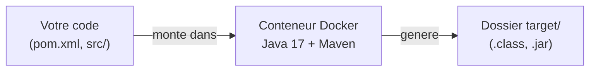
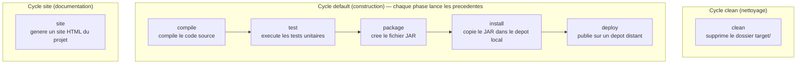

<a id="top"></a>

# Projet 1 — Introduction à Maven (Calculatrice) avec Docker

> **Pratique guidée** · Module [03 — Projets Java et Maven](../README.md)
>
> Objectif : découvrir **Maven** (compiler, tester, packager un projet Java) **sans rien installer** sur votre machine. Tout passe par **Docker**.
>
> Pressé ? Voir l'**[aide-mémoire des commandes](COMMANDES.md)**.

---

## Pourquoi Docker ?

Normalement, pour utiliser Maven il faut installer un **JDK** (Java) **et** **Maven**, puis configurer les variables d'environnement. C'est long et source d'erreurs.

Ici, on utilise une **image Docker** qui contient déjà Java 17 + Maven. Vous n'installez **que Docker Desktop**, et la même commande fonctionne à l'identique sur **Windows, macOS et Linux**.



---

## Prérequis

- **Docker Desktop** installé et démarré : [https://www.docker.com/products/docker-desktop/](https://www.docker.com/products/docker-desktop/)
- Vérifiez que Docker fonctionne :

```bash
docker --version
docker compose version
```

> Aucune installation de Java ni de Maven n'est nécessaire.

---

## Structure du projet

```text
projet1-introduction-a-maven/
├── docker-compose.yml          <- lance Maven dans un conteneur
├── pom.xml                     <- configuration Maven (dependances, version Java)
├── .gitignore
├── README.md                   <- ce fichier
└── src/
    ├── main/
    │   └── java/
    │       └── com/
    │           └── example/
    │               └── Calculator.java       <- le code de la calculatrice
    └── test/
        └── java/
            └── com/
                └── example/
                    └── CalculatorTest.java   <- les tests unitaires (JUnit)
```

> C'est la **structure standard** de Maven : le code dans `src/main/java`, les tests dans `src/test/java`. Maven applique le principe « **convention plutôt que configuration** ».

---

## Démarrage rapide

Ouvrez un terminal **dans ce dossier** (`projet1-introduction-a-maven`), puis lancez les tests :

```bash
docker compose run --rm maven test
```

La **première exécution** télécharge l'image Docker et les dépendances (quelques minutes). Les fois suivantes sont rapides grâce au cache.

Vous devriez voir à la fin :

```text
BUILD SUCCESS
Tests run: 5, Failures: 0, Errors: 0, Skipped: 0
```

---

## Les commandes Maven (via Docker Compose)

Toutes les commandes ont la même forme : `docker compose run --rm maven <commande>`.

| But | Commande à taper | Ce que ça fait |
|---|---|---|
| **Compiler** | `docker compose run --rm maven compile` | Compile `src/main/java` → fichiers `.class` dans `target/classes`. |
| **Tester** | `docker compose run --rm maven test` | Exécute les tests de `src/test/java` (JUnit). |
| **Packager** | `docker compose run --rm maven package` | Compile + teste + crée le **JAR** dans `target/`. |
| **Nettoyer** | `docker compose run --rm maven clean` | Supprime le dossier `target/` (fichiers générés). |
| **Installer** | `docker compose run --rm maven install` | Package + copie le JAR dans le dépôt local Maven (réutilisable ailleurs). |
| **Générer le site** | `docker compose run --rm maven site` | Génère un mini site web de documentation du projet. |

> Vous pouvez **enchaîner** des phases : `docker compose run --rm maven clean package` nettoie puis reconstruit tout.
>
> Astuce : `docker compose run --rm maven` (sans rien d'autre) lance `mvn test` par défaut.

### Travailler en mode interactif (optionnel)

Pour ouvrir un terminal dans le conteneur et taper plusieurs commandes `mvn` à la suite :

```bash
docker compose run --rm --entrypoint bash maven
# puis, dans le conteneur :
mvn compile
mvn test
exit
```

---

## Qu'est-ce que Maven ?

**Maven** est un outil d'**automatisation de build** pour les projets Java. Il gère, de façon standardisée :

- les **dépendances** (bibliothèques externes, ex. JUnit) ;
- la **compilation** du code ;
- l'exécution des **tests** ;
- le **packaging** (création du `.jar`) ;
- le **déploiement**.

Tout est décrit dans le fichier **`pom.xml`** (Project Object Model), au cœur du projet.

---

## Le cycle de vie Maven (diagramme)

Maven possède **trois cycles de vie** indépendants : `clean` (nettoyer), `default` (construire) et `site` (documenter). Le plus important est le cycle **default**, où chaque phase **déclenche automatiquement toutes les phases précédentes**.



> **Idée clé (le « cumul ») :** quand vous lancez une phase du cycle default, **toutes celles d'avant s'exécutent d'abord**. Exemple : `mvn package` lance `compile` puis `test` puis `package`. Inutile donc de tout taper à la main.

| Quand vous lancez... | Maven exécute en réalité... |
|---|---|
| `compile` | compile |
| `test` | compile → test |
| `package` | compile → test → package |
| `install` | compile → test → package → install |
| `clean` | clean (cycle séparé, ne construit rien) |
| `site` | site (cycle séparé) |

---

## Chaque verbe Maven expliqué en détail

### `mvn clean` — nettoyer

Supprime entièrement le dossier **`target/`** (qui contient tout ce que Maven a généré : `.class`, `.jar`, rapports…). On l'utilise pour **repartir de zéro**, par exemple quand un build se comporte bizarrement ou avant une construction « propre ».

```bash
docker compose run --rm maven clean
```

> Ne touche **jamais** à votre code source (`src/`), seulement aux fichiers générés. Souvent combiné : `clean package`.

### `mvn compile` — compiler

Transforme votre code source Java de **`src/main/java`** en **bytecode** (`.class`) déposé dans **`target/classes`**. C'est la vérification de base : « est-ce que mon code se compile sans erreur ? ». **Ne lance pas** les tests.

```bash
docker compose run --rm maven compile
```

### `mvn test` — tester

Lance d'abord `compile`, **puis** compile et exécute les tests de **`src/test/java`** avec **JUnit** (via le plugin Surefire). Les résultats s'affichent dans la console, et le build **échoue** (`BUILD FAILURE`) si **au moins un test** échoue.

```bash
docker compose run --rm maven test
```

> Résultat attendu ici : `Tests run: 5, Failures: 0, Errors: 0, Skipped: 0`.

### `mvn package` — empaqueter

Enchaîne `compile` → `test`, puis **emballe** le code compilé dans un format distribuable (ici un **`.jar`**) placé dans **`target/`** (ex. `target/calculator-1.0-SNAPSHOT.jar`). Si un test échoue, le JAR **n'est pas** créé.

```bash
docker compose run --rm maven package
```

### `mvn install` — installer localement

Fait tout `package`, **puis copie** le `.jar` dans votre **dépôt local Maven** (`~/.m2/repository`). Ainsi, **d'autres projets** sur la même machine peuvent réutiliser cette calculatrice comme **dépendance**.

```bash
docker compose run --rm maven install
```

> Dans notre `docker-compose.yml`, ce dépôt local est conservé dans un **volume Docker** (`maven-repo`), donc il persiste entre les exécutions.

### `mvn site` — documenter

Génère un **mini site web** (dans `target/site/`) avec des informations sur le projet : rapports, configuration, et — si configuré — JavaDoc et couverture de tests. Utile pour **documenter** un projet, sans rien construire d'exécutable.

```bash
docker compose run --rm maven site
```

### `mvn deploy` — publier (pour info)

Dernière phase du cycle default : publie le `.jar` sur un **dépôt distant** partagé (ex. Nexus, Artifactory) pour toute une équipe. **Non utilisé dans ce TP** (nécessite un serveur de dépôt), mais c'est la suite logique d'`install`.

---

## Le code

`Calculator.java` propose 4 opérations (`add`, `subtract`, `multiply`, `divide`) ; `divide` lève une exception si on divise par zéro. `CalculatorTest.java` contient **5 tests** JUnit qui vérifient ces opérations, dont un test qui s'assure que la division par zéro lève bien une erreur.

> Essayez de **casser** un test : changez `add(2, 3)` attendu à `5` en `6` dans `CalculatorTest.java`, relancez `docker compose run --rm maven test`, et observez le `BUILD FAILURE`. Remettez ensuite la bonne valeur.

---

## Et si je préfère sans Docker ?

Si Java et Maven sont déjà installés sur votre machine, vous pouvez lancer directement les commandes à la racine du projet (là où se trouve `pom.xml`) :

```bash
mvn compile
mvn test
mvn package
```

Mais pour ce cours, **la méthode Docker ci-dessus est recommandée** : elle évite tout problème d'installation.

---

<p align="center">
  <strong>Cours créé par Dr. Haythem REHOUMA — Développement et déploiement de solutions de données</strong>
</p>
