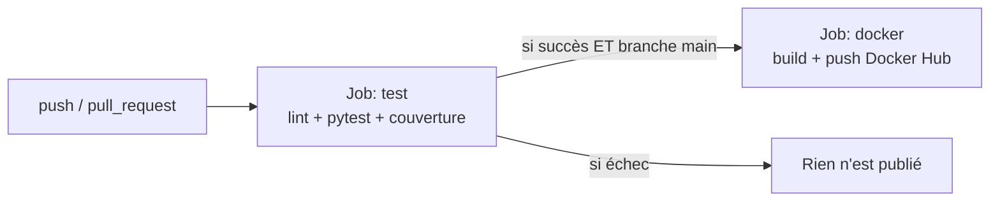

# Démo CI/CD : pytest + GitHub Actions + Docker Hub


Démo pédagogique et minimaliste d'une chaîne **CI/CD** complète :

- **CI** (Intégration Continue) : à chaque `push` / `pull request`, on lance le lint et les tests `pytest` avec un rapport de couverture.
- **CD** (Déploiement Continu) : si les tests passent sur `main`, on construit une image Docker et on la publie automatiquement sur **Docker Hub**.

> Remplace `USER/REPO` dans le badge ci-dessus par ton `utilisateur/nom-du-repo` GitHub.

> Débutant ? Un guide pas à pas complet, de A à Z, se trouve dans le dossier [`docs/`](docs/README.md).

## L'application de démo

Une petite API **FastAPI** : un mini gestionnaire de tâches en mémoire.

| Méthode | Route | Description |
|---------|-------|-------------|
| GET | `/health` | État du service |
| GET | `/tasks` | Liste des tâches (triées par priorité) |
| POST | `/tasks` | Crée une tâche (`title`, `priority` optionnelle) |
| GET | `/tasks/{id}` | Détail d'une tâche |
| DELETE | `/tasks/{id}` | Supprime une tâche |

La logique métier pure est isolée dans [`app/logic.py`](app/logic.py) pour être facilement testable unitairement, tandis que [`app/main.py`](app/main.py) expose l'API.

## Comment fonctionne le pipeline

Le fichier [`.github/workflows/ci-cd.yml`](.github/workflows/ci-cd.yml) suit le modèle officiel de GitHub Actions : un **événement** (`on:`) déclenche des **jobs**, chacun composé de **steps** ([doc](https://docs.github.com/fr/actions/concepts/workflows-and-actions/workflows)).



Point clé : le job `docker` a `needs: test`, donc **aucune image n'est publiée si un test échoue**.

## Utilisation en local (avant même GitHub)

```bash
# 1. Créer un environnement virtuel et installer les dépendances
python -m venv .venv
# Windows : .venv\Scripts\activate   |   macOS/Linux : source .venv/bin/activate
pip install -r requirements.txt

# 2. Lancer les tests
pytest

# 3. Démarrer l'API
uvicorn app.main:app --reload
# -> http://127.0.0.1:8000/health  et  http://127.0.0.1:8000/docs
```

### Avec Docker

```bash
docker build -t taskapi .
docker run -p 8000:8000 taskapi
# -> http://127.0.0.1:8000/docs
```

## Configurer le CD vers Docker Hub

Pour que l'étape de publication fonctionne, ajoute 2 secrets dans ton dépôt GitHub :

**`Settings` > `Secrets and variables` > `Actions` > `New repository secret`**

| Nom du secret | Valeur |
|---------------|--------|
| `DOCKERHUB_USERNAME` | Ton nom d'utilisateur Docker Hub |
| `DOCKERHUB_TOKEN` | Un *Access Token* Docker Hub (`Account Settings` > `Security` > `New Access Token`) |

> Utilise un **Access Token**, jamais ton mot de passe.

## Étapes pour lancer la démo

1. Crée un dépôt GitHub et pousse ce code dessus.
2. Crée un compte Docker Hub et génère un Access Token.
3. Ajoute les 2 secrets ci-dessus dans le dépôt GitHub.
4. Fais un `push` sur `main`.
5. Observe le pipeline dans l'onglet **Actions**, puis retrouve ton image sur Docker Hub : `TON_USER/taskapi:latest`.

## Structure du projet

```
.
├── app/                 # Code de l'application
│   ├── logic.py         # Logique métier pure (tests unitaires)
│   └── main.py          # API FastAPI
├── tests/               # Tests pytest (unitaires + API)
├── docs/                # Guide pas à pas de A à Z (débutants)
├── .github/workflows/
│   └── ci-cd.yml        # Le pipeline CI/CD
├── Dockerfile           # Image de l'application
├── requirements.txt
└── pytest.ini
```
