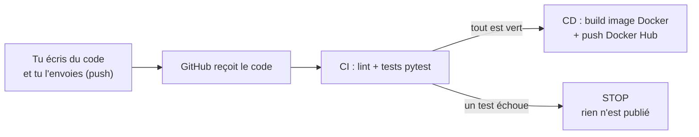

# Chapitre 1 - C'est quoi le CI/CD ?

## L'idée en une phrase

Le **CI/CD**, c'est **automatiser** les étapes ennuyeuses et répétitives entre
« j'ai fini d'écrire mon code » et « mon code tourne pour de vrai ».

## Une analogie simple : le restaurant

Imagine un restaurant :

- **CI (Intégration Continue)** = la **cuisine avec contrôle qualité**. Chaque fois qu'un
  cuisinier prépare un plat (= tu écris du code), un inspecteur goûte automatiquement pour
  vérifier que tout est bon (= les tests). Si le plat est raté, il ne sort pas de la cuisine.

- **CD (Déploiement Continu)** = le **serveur qui apporte le plat au client**. Si le plat a
  passé le contrôle qualité, il est automatiquement servi (= ton application est publiée et
  disponible).

Sans CI/CD, tu ferais tout ça **à la main** : goûter chaque plat, l'emballer, le livrer...
à chaque fois. Avec CI/CD, une machine le fait pour toi, **à chaque changement**.

## Les deux lettres, en détail

### CI = Continuous Integration (Intégration Continue)

À chaque modification du code, on vérifie **automatiquement** que :

- le code respecte les règles de style (le **lint**) ;
- le code fonctionne correctement (les **tests**).

But : détecter les bugs **le plus tôt possible**, avant qu'ils n'arrivent chez les utilisateurs.

### CD = Continuous Delivery / Deployment (Livraison / Déploiement Continu)

Si la CI est verte (tout va bien), on **livre** automatiquement l'application :

- on l'**emballe** dans une image Docker (une sorte de boîte qui contient l'app + tout ce
  qu'il lui faut pour tourner) ;
- on **publie** cette boîte sur Docker Hub (une sorte de bibliothèque publique d'images).

## Le schéma de notre démo

## Les outils qu'on utilise

| Outil | Rôle | Analogie |
|-------|------|----------|
| **Python** | Le langage de notre application | La langue dans laquelle on écrit |
| **pytest** | L'outil qui lance les tests | L'inspecteur qui goûte les plats |
| **Git / GitHub** | Stocke le code et son historique | Le carnet de recettes partagé |
| **GitHub Actions** | Le robot qui exécute la CI/CD | Le chef de cuisine automatique |
| **Docker** | Emballe l'app dans une « boîte » | La barquette de livraison |
| **Docker Hub** | Stocke et partage les images Docker | Le dépôt / entrepôt des barquettes |

## Prochaine étape

Passons à l'installation des outils : [Chapitre 2 - Installer les outils](02-installer-les-outils.md).
