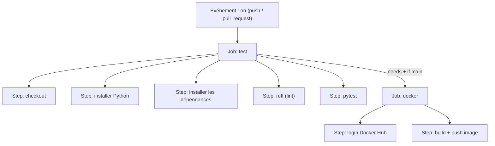

# Chapitre 6 - Comprendre le pipeline (ci-cd.yml)

Voici le cœur de la démo. On va lire le fichier
[`.github/workflows/ci-cd.yml`](../.github/workflows/ci-cd.yml) **morceau par morceau**.

> Ce fichier est écrit en **YAML** : un format texte où **l'indentation (les espaces) est
> très importante**. Deux espaces = un niveau. Ne jamais utiliser de tabulations.

## Le vocabulaire de GitHub Actions

D'après la [doc officielle](https://docs.github.com/fr/actions/concepts/workflows-and-actions/workflows),
un pipeline (appelé **workflow**) est composé de :

- **Événement** (`on`) : ce qui **déclenche** le pipeline (ex : un `push`).
- **Job** : un groupe de tâches qui tourne sur une machine. On en a deux : `test` et `docker`.
- **Step** (étape) : une action précise dans un job (ex : installer Python, lancer pytest).



## Le fichier expliqué

### 1. Le nom et le déclencheur

```yaml
name: CI/CD

on:
  push:
    branches: [ main ]
  pull_request:
```

- `name` : le nom affiché dans l'onglet Actions.
- `on` : **quand** lancer le pipeline.
  - `push` sur `main` : à chaque envoi de code sur la branche principale.
  - `pull_request` : à chaque proposition de modification (voir [Chapitre 9](09-experiences-pedagogiques.md)).

### 2. Le job `test` (la partie CI)

```yaml
jobs:
  test:
    name: Tests (pytest)
    runs-on: ubuntu-latest
    steps:
```

- `runs-on: ubuntu-latest` : GitHub nous prête une machine Linux neuve, gratuitement.
- `steps` : la liste des étapes, exécutées dans l'ordre.

Les étapes :

```yaml
      - name: Récupérer le code
        uses: actions/checkout@v4
```
Télécharge ton code sur la machine. `uses:` veut dire « utilise une action toute prête ».

```yaml
      - name: Installer Python
        uses: actions/setup-python@v5
        with:
          python-version: "3.12"
          cache: pip
```
Installe Python 3.12. `cache: pip` accélère les prochaines exécutions.

```yaml
      - name: Installer les dépendances
        run: pip install -r requirements.txt
```
`run:` exécute une commande, exactement comme tu le ferais dans ton terminal.

```yaml
      - name: Lint (ruff)
        run: ruff check .

      - name: Lancer les tests
        run: pytest --cov=app --cov-report=term-missing --junitxml=report.xml
```
On vérifie le style, puis on lance les tests avec la couverture. `--junitxml=report.xml`
crée un fichier de rapport.

```yaml
      - name: Publier le rapport de tests
        if: always()
        uses: actions/upload-artifact@v4
        with:
          name: rapport-tests
          path: report.xml
```
On sauvegarde le rapport pour pouvoir le télécharger depuis l'interface GitHub.
`if: always()` veut dire « fais-le même si une étape précédente a échoué ».

### 3. Le job `docker` (la partie CD)

```yaml
  docker:
    name: Build & Push Docker Hub
    needs: test
    if: github.ref == 'refs/heads/main'
    runs-on: ubuntu-latest
```

Deux lignes **essentielles** :

- **`needs: test`** : ce job ne démarre **que si** le job `test` a réussi. C'est la garantie
  que **rien n'est publié si un test échoue**. C'est le point le plus important de la démo.
- **`if: github.ref == 'refs/heads/main'`** : on ne publie que depuis la branche `main`
  (pas depuis une pull request, par exemple).

Les étapes :

```yaml
      - name: Connexion à Docker Hub
        uses: docker/login-action@v3
        with:
          username: ${{ secrets.DOCKERHUB_USERNAME }}
          password: ${{ secrets.DOCKERHUB_TOKEN }}
```
On se connecte à Docker Hub. `${{ secrets.XXX }}` va chercher les **secrets** qu'on
configurera au chapitre suivant (jamais écrits en clair dans le code !).

```yaml
      - name: Build et push de l'image
        uses: docker/build-push-action@v6
        with:
          context: .
          push: true
          tags: |
            ${{ secrets.DOCKERHUB_USERNAME }}/taskapi:latest
            ${{ secrets.DOCKERHUB_USERNAME }}/taskapi:${{ github.sha }}
```
On construit l'image (grâce au `Dockerfile`) et on la publie avec deux étiquettes (**tags**) :
- `latest` : toujours la dernière version.
- `${{ github.sha }}` : un identifiant unique du commit, pour retrouver une version précise.

## Prochaine étape

Configurons les secrets Docker Hub : [Chapitre 7 - Configurer Docker Hub](07-configurer-docker-hub.md).
