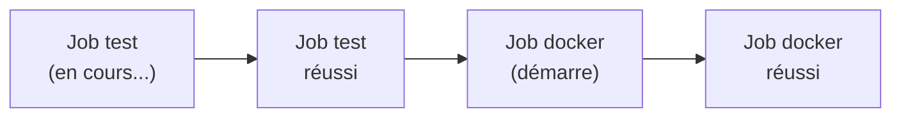
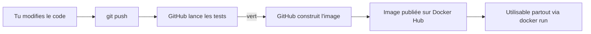

# Chapitre 8 - Lancer et observer la démo

Tout est en place. On va déclencher le pipeline complet et regarder la magie opérer.

## Étape 1 : déclencher le pipeline

Le pipeline se lance à chaque `push` sur `main`. Fais une petite modification (par exemple,
ajoute une ligne dans le README), puis :

```powershell
git add .
git commit -m "Test du pipeline complet"
git push
```

> Si tu n'as rien à modifier, tu peux forcer un lancement à vide :
> ```powershell
> git commit --allow-empty -m "Relancer le pipeline"
> git push
> ```

## Étape 2 : regarder la CI/CD s'exécuter

1. Va sur ton dépôt GitHub, onglet **« Actions »**.
2. Clique sur l'exécution la plus récente (tout en haut).
3. Tu vois les **deux jobs** : `test` puis `docker`.



4. Clique sur un job pour voir le détail de chaque **step**, avec les logs en direct.
   Un rond qui tourne = en cours. Un ✓ vert = réussi. Une ✗ rouge = échec.

C'est extrêmement instructif : tu vois exactement, ligne par ligne, ce que fait la machine.

## Étape 3 : vérifier l'image sur Docker Hub

Une fois le job `docker` en vert :

1. Va sur https://hub.docker.com/
2. Tu dois voir un nouveau dépôt : **`taskapi`**.
3. Dans l'onglet « Tags », tu verras `latest` et un tag avec un long code (le SHA du commit).

**Félicitations** : ton application a été testée, construite et publiée **automatiquement** !

## Étape 4 : utiliser ton image publiée (le CD en action)

N'importe qui (ou n'importe quel serveur) peut maintenant lancer ton application avec une
seule commande, sans avoir ton code :

```powershell
docker run -p 8000:8000 TON_USER/taskapi:latest
```

(Remplace `TON_USER` par ton Docker ID.) Puis va sur http://127.0.0.1:8000/docs.

C'est exactement ce qu'un serveur de production ferait pour déployer ton application.

## Le cycle complet, résumé



## Prochaine étape

Amusons-nous à casser des choses (exprès) pour bien comprendre :
[Chapitre 9 - Expériences pédagogiques](09-experiences-pedagogiques.md).
