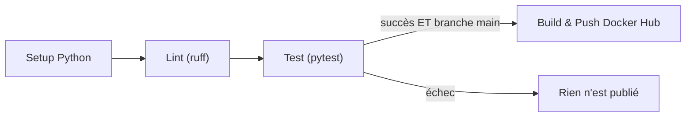

# Démo CI/CD : pytest + Jenkins + Docker Hub

Démo pédagogique et minimaliste d'une chaîne **CI/CD** orchestrée par **Jenkins** :

- **CI** (Intégration Continue) : Jenkins lance le lint et les tests `pytest` avec un rapport
  de couverture et un rapport JUnit.
- **CD** (Déploiement Continu) : si les tests passent sur `main`, Jenkins construit une image
  Docker et la publie automatiquement sur **Docker Hub**.

> C'est le projet jumeau de la démo **GitHub Actions** (`jenkins-python-pytest-demo-1`).
> Même application, mêmes tests, mais ici c'est **Jenkins** qui orchestre.

> Débutant ? Un guide pas à pas complet, de A à Z, se trouve dans le dossier [`docs/`](docs/README.md).

## L'application de démo

Une petite API **FastAPI** : un mini gestionnaire de tâches en mémoire.

| Méthode | Route | Description |
|---------|-------|-------------|
| GET | `/health` | État du service |
| GET | `/tasks` | Liste des tâches (triées par priorité) |
| POST | `/tasks` | Crée une tâche (`title`, `priority` optionnelle) |
| GET | `/tasks/{id}` | Détail d'une tâche |
| DELETE | `/tasks/{id}` | Supprime une tâche |

## Comment fonctionne le pipeline

Le fichier [`Jenkinsfile`](Jenkinsfile) décrit un pipeline déclaratif : `pipeline` -> `stages` -> `steps`.



Point clé : les stages s'exécutent dans l'ordre, donc **aucune image n'est publiée si un test échoue**.

## Démarrage rapide

### 1. Tester en local (sans Jenkins)

```bash
python -m venv .venv
# Windows : .venv\Scripts\activate  |  macOS/Linux : source .venv/bin/activate
pip install -r requirements.txt
pytest
uvicorn app.main:app --reload   # -> http://127.0.0.1:8000/docs
```

### 2. Lancer Jenkins (dans Docker)

```bash
docker compose up -d --build
# Mot de passe initial :
docker exec jenkins-demo cat /var/jenkins_home/secrets/initialAdminPassword
# Interface : http://localhost:8080
```

Voir [docs/05-demarrer-jenkins.md](docs/05-demarrer-jenkins.md) pour la suite.

## Configurer le CD vers Docker Hub

1. Crée un **Access Token** Docker Hub (droits Read & Write).
2. Dans Jenkins : `Manage Jenkins` > `Credentials` > `Global` > `Add Credentials`
   - Kind : `Username with password`
   - Username : ton Docker ID
   - Password : ton token
   - **ID : `dockerhub`** (exactement)

Détails : [docs/07-configurer-docker-hub.md](docs/07-configurer-docker-hub.md).

## Structure du projet

```
.
├── app/                 # Code de l'application
│   ├── logic.py         # Logique métier pure (tests unitaires)
│   └── main.py          # API FastAPI
├── tests/               # Tests pytest (unitaires + API)
├── docs/                # Guide pas à pas de A à Z (débutants)
├── jenkins/
│   └── Dockerfile       # Image Jenkins (Jenkins + Python + docker CLI)
├── Jenkinsfile          # Le pipeline CI/CD
├── docker-compose.yml   # Lance Jenkins dans Docker
├── Dockerfile           # Image de l'application
├── requirements.txt
└── pytest.ini
```

## GitHub Actions vs Jenkins (résumé)

| Concept | GitHub Actions | Jenkins |
|---------|----------------|---------|
| Fichier | `.github/workflows/ci-cd.yml` | `Jenkinsfile` |
| Étapes | `jobs` / `steps` | `stages` / `steps` |
| Ne pas publier si test rouge | `needs: test` | ordre des `stages` |
| Condition de branche | `if: github.ref == ...` | `when { branch 'main' }` |
| Secrets | `secrets.DOCKERHUB_TOKEN` | `credentialsId: 'dockerhub'` |
| Où ça tourne | Cloud GitHub | Ta machine (Docker) |
