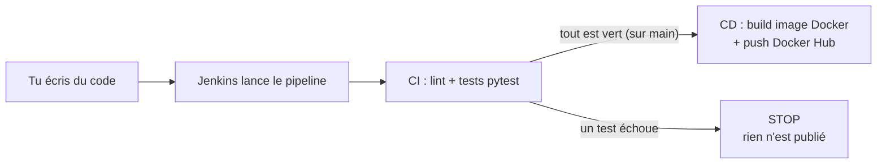

# Chapitre 1 - C'est quoi le CI/CD (et Jenkins) ?

## L'idée en une phrase

Le **CI/CD**, c'est **automatiser** les étapes ennuyeuses et répétitives entre
« j'ai fini d'écrire mon code » et « mon code tourne pour de vrai ».

## Une analogie simple : le restaurant

- **CI (Intégration Continue)** = la **cuisine avec contrôle qualité**. Chaque fois qu'un
  cuisinier prépare un plat (= tu écris du code), un inspecteur goûte automatiquement (= les
  tests). Si le plat est raté, il ne sort pas de la cuisine.

- **CD (Déploiement Continu)** = le **serveur** qui apporte le plat au client si le contrôle
  qualité est passé (= ton application est publiée et disponible).

## Et Jenkins dans tout ça ?

**Jenkins** est un **chef d'orchestre** (un « serveur d'automatisation »). C'est un logiciel
que tu installes et qui exécute ton pipeline : il récupère le code, lance les tests,
construit l'image Docker, la publie... selon les instructions que tu lui donnes.

La différence avec GitHub Actions :

| | GitHub Actions | Jenkins |
|--|----------------|---------|
| Où ça tourne ? | Sur les serveurs de GitHub (cloud) | Sur **ta** machine / **ton** serveur |
| Configuration | Fichier `.github/workflows/*.yml` | Fichier `Jenkinsfile` |
| Installation | Rien à installer | Tu installes Jenkins (ici dans Docker) |
| Interface | Onglet « Actions » sur GitHub | Une interface web (http://localhost:8080) |

Jenkins est un grand classique en entreprise : le comprendre est très utile.

## Le schéma de notre démo

## Les outils qu'on utilise

| Outil | Rôle |
|-------|------|
| **Python** | Le langage de notre application |
| **pytest** | L'outil qui lance les tests |
| **Git / GitHub** | Stocke le code (Jenkins ira le chercher) |
| **Jenkins** | Le chef d'orchestre qui exécute le pipeline |
| **Docker** | Emballe l'app dans une « boîte » (image) |
| **Docker Hub** | Stocke et partage les images Docker |

## Prochaine étape

[Chapitre 2 - Installer les outils](02-installer-les-outils.md).
