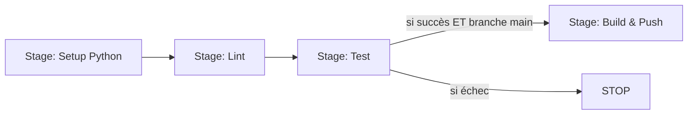

# Chapitre 6 - Comprendre le Jenkinsfile

Voici le cœur de la démo. On lit le fichier [`Jenkinsfile`](../Jenkinsfile) **morceau par
morceau**.

> Le `Jenkinsfile` est écrit en syntaxe **Declarative Pipeline** de Jenkins.
> Modèle : `pipeline` -> `stages` -> `steps`.
> Doc : https://www.jenkins.io/doc/book/pipeline/syntax/

## Le vocabulaire de Jenkins

- **pipeline** : le bloc qui contient tout.
- **agent** : où le pipeline s'exécute (`agent any` = sur le contrôleur Jenkins).
- **stage** : une grande étape (Setup, Lint, Test, Build...). C'est ce qu'on voit dans
  l'interface, sous forme de colonnes.
- **step** : une commande à l'intérieur d'un stage (souvent `sh '...'` = exécuter du shell).



## Le fichier expliqué

### 1. En-tête

```groovy
pipeline {
    agent any

    environment {
        IMAGE_NAME = 'taskapi'
        IMAGE_TAG = "build-${env.BUILD_NUMBER}"
    }
```

- `agent any` : exécute sur le contrôleur (qui a Python + docker CLI grâce à notre image).
- `environment` : des variables réutilisables. `BUILD_NUMBER` est fourni par Jenkins
  (1, 2, 3...), pratique pour taguer les images.

### 2. Setup Python

```groovy
stage('Setup Python') {
    steps {
        sh '''
            python3 -m venv .venv
            . .venv/bin/activate
            pip install --upgrade pip
            pip install -r requirements.txt
        '''
    }
}
```

On crée un environnement virtuel et on installe les dépendances.
(Jenkins tourne sous Linux, donc on utilise `python3` et `. .venv/bin/activate`.)

### 3. Lint

```groovy
stage('Lint') {
    steps {
        sh '. .venv/bin/activate && ruff check .'
    }
}
```

Chaque `sh` démarre un shell neuf : on réactive donc le venv à chaque fois.

### 4. Test (avec rapport)

```groovy
stage('Test') {
    steps {
        sh '''
            . .venv/bin/activate
            pytest --cov=app --cov-report=term-missing --junitxml=report.xml
        '''
    }
    post {
        always {
            junit allowEmptyResults: true, testResults: 'report.xml'
        }
    }
}
```

- On lance pytest avec la couverture et un rapport `report.xml`.
- `junit ...` publie ce rapport dans Jenkins : tu obtiens de jolis graphiques de tests.
- `always` = on publie le rapport même si des tests échouent.

### 5. Build & Push (la partie CD)

```groovy
stage('Build & Push Docker Hub') {
    when { branch 'main' }
    steps {
        withCredentials([usernamePassword(
            credentialsId: 'dockerhub',
            usernameVariable: 'DOCKER_USER',
            passwordVariable: 'DOCKER_PASS'
        )]) {
            sh '''
                echo "$DOCKER_PASS" | docker login -u "$DOCKER_USER" --password-stdin
                docker build -t "$DOCKER_USER/${IMAGE_NAME}:latest" -t "$DOCKER_USER/${IMAGE_NAME}:${IMAGE_TAG}" .
                docker push "$DOCKER_USER/${IMAGE_NAME}:latest"
                docker push "$DOCKER_USER/${IMAGE_NAME}:${IMAGE_TAG}"
                docker logout
            '''
        }
    }
}
```

Deux points **essentiels** :

- **`when { branch 'main' }`** : on ne construit/publie que sur la branche `main`.
- Les stages s'exécutent **dans l'ordre** : si `Test` échoue, le pipeline **s'arrête** et ce
  stage n'est **jamais** atteint. C'est la garantie que **rien n'est publié si un test
  échoue** (équivalent du `needs: test` de GitHub Actions).
- **`withCredentials`** récupère les identifiants Docker Hub (créés au chapitre 7) sans
  jamais les écrire en clair. `--password-stdin` évite que le token apparaisse dans les logs.

### 6. Post (résumé final)

```groovy
post {
    success { echo 'Pipeline terminé avec succès.' }
    failure { echo 'Le pipeline a échoué : rien n\\'a été publié.' }
}
```

Un petit message selon le résultat.

## Prochaine étape

[Chapitre 7 - Configurer les accès Docker Hub](07-configurer-docker-hub.md).
