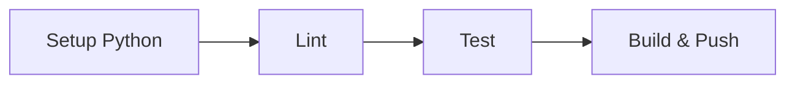

# Chapitre 8 - Créer le job et lancer le pipeline

Jenkins tourne, les credentials Docker Hub sont prêts. On va créer le job qui lit le
`Jenkinsfile` depuis ton dépôt GitHub, puis l'exécuter.

## Étape 0 : mettre le code sur GitHub

Jenkins récupère le code depuis un dépôt Git. Si ce n'est pas déjà fait :

```powershell
cd c:\00-dream\jenkins-python-pytest-demo-2
git init
git add .
git commit -m "Premier commit : démo CI/CD Jenkins"
git branch -M main
git remote add origin https://github.com/TON_USER/TON_REPO.git
git push -u origin main
```

(Crée d'abord un dépôt vide sur https://github.com, sans README.)

## Étape 1 : créer un job « Pipeline »

1. Sur le tableau de bord Jenkins, clique sur **« New Item »** (Nouveau).
2. Nom : `taskapi-cicd`.
3. Choisis le type **« Pipeline »**, puis « OK ».

## Étape 2 : configurer le job

Dans la page de configuration :

1. (Optionnel) coche **« GitHub project »** et mets l'URL de ton dépôt.
2. Descends jusqu'à la section **« Pipeline »**.
3. **Definition** : choisis **« Pipeline script from SCM »**.
4. **SCM** : choisis **« Git »**.
5. **Repository URL** : l'URL de ton dépôt (ex : `https://github.com/TON_USER/TON_REPO.git`).
   - Si le dépôt est privé, ajoute des credentials Git ici.
6. **Branch Specifier** : `*/main`
7. **Script Path** : `Jenkinsfile` (déjà rempli par défaut).
8. Clique sur **« Save »**.

## Étape 3 : lancer le pipeline

1. Sur la page du job, clique sur **« Build Now »** (Lancer un build).
2. Un build apparaît à gauche dans **« Build History »**.
3. Clique dessus, puis sur **« Console Output »** pour voir les logs en direct.

Tu peux aussi ouvrir la vue **« Stage View »** ou **« Pipeline Overview »** : tu verras les
stages (Setup, Lint, Test, Build & Push) se colorer en vert au fur et à mesure.



## Étape 4 : voir les résultats de tests

Une fois le build terminé, la page du build affiche **« Test Result »** : le nombre de
tests, ceux qui passent, ceux qui échouent. C'est le rapport JUnit publié par le pipeline.

## Étape 5 : vérifier l'image sur Docker Hub

Si le stage « Build & Push » est vert :

1. Va sur https://hub.docker.com/
2. Tu vois un dépôt **`taskapi`** avec les tags `latest` et `build-N`.

## Étape 6 : utiliser l'image publiée (le CD en action)

```powershell
docker run -p 8000:8000 TON_USER/taskapi:latest
```

Puis va sur http://127.0.0.1:8000/docs. N'importe quel serveur peut faire pareil : c'est le
déploiement continu.

## Relancer automatiquement (bonus)

Pour que Jenkins se lance tout seul à chaque `git push`, deux options simples :
- **Polling** : dans la config du job, section « Build Triggers », coche
  « Poll SCM » avec `H/2 * * * *` (vérifie le dépôt toutes les 2 minutes).
- **Webhook GitHub** : plus instantané, mais nécessite que Jenkins soit accessible depuis
  internet (ex : via ngrok). Voir le [Chapitre 10](10-depannage-faq.md).

## Prochaine étape

[Chapitre 9 - Expériences pédagogiques](09-experiences-pedagogiques.md).
