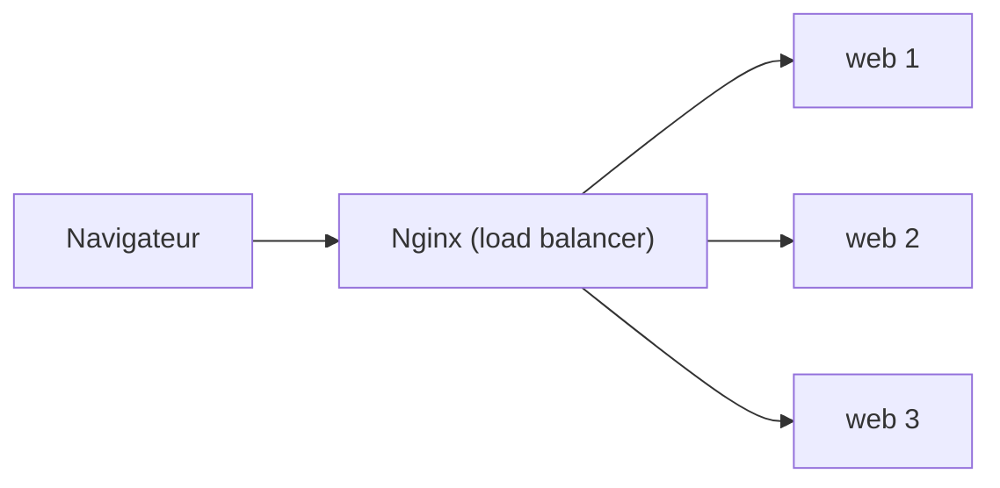

# Énoncé — Projet : Docker + Nginx + Swarm (répartition de charge)

> **Pratique** · Module [06 — Docker, Nginx et Swarm](../README.md) · Niveau **intermédiaire**
>
> **Travaillez d'abord seul !** Réalisez le projet avec ce seul énoncé. Le **corrigé** (nginx.conf, fichiers YAML, explications) est dans le **[README.md](README.md)**, **replié**. Ne l'ouvrez qu'après avoir essayé.

---

## Objectif

Déployer une petite application web en **plusieurs répliques**, derrière **Nginx** qui joue le rôle de **répartiteur de charge**, puis passer du mode **Docker Compose** (une machine) au mode **Docker Swarm** (cluster).

---

## Le résultat attendu

Quand on recharge la page dans le navigateur, **le nom du conteneur qui répond doit changer** : c'est la preuve que la charge est répartie entre les répliques.

---

## Travail à réaliser

### Partie 1 — L'application web

1. Écrivez une petite app web (au langage de votre choix : Python/Flask, Node, etc.) qui, sur `/`, **affiche le nom du conteneur** (`hostname`).
2. Écrivez son **`Dockerfile`** et construisez l'image.

### Partie 2 — Nginx en répartiteur de charge

3. Écrivez un **`nginx.conf`** qui fait du **reverse proxy** vers le service `web` (port interne 5000) et **répartit la charge** entre les répliques.
   > **Indice :** en mode Compose, Nginx doit **re-résoudre** le nom `web` via le DNS interne de Docker (`resolver 127.0.0.11`) pour découvrir toutes les répliques.

### Partie 3 — Mode Compose (une machine)

4. Écrivez un **`docker-compose.yml`** avec deux services : `web` (port interne seulement) et `nginx` (port publié, ex. `8088:80`).
5. Démarrez avec **3 répliques** : `docker compose up --build --scale web=3`.
6. Rechargez la page (ou utilisez `curl`) et **vérifiez que le nom du conteneur change**.

### Partie 4 — Mode Swarm (cluster)

7. Écrivez un **`docker-stack.yml`** qui déclare **`deploy.replicas: 3`** pour `web`, avec une **politique de redémarrage** (auto-réparation).
8. Initialisez le cluster (`docker swarm init`), déployez (`docker stack deploy`), et vérifiez les services (`docker stack services`).
9. **Mettez à l'échelle** (`docker service scale demo_web=5`) et testez l'**auto-réparation** en supprimant un conteneur à la main.

---

## Questions de réflexion

- Pourquoi le service `web` ne doit-il **pas** publier son port directement (pas de `ports:`) ?
- Quelle est la différence entre `--scale web=3` (Compose) et `deploy.replicas: 3` (Swarm) ?
- Pourquoi la clé `deploy:` est-elle ignorée par `docker compose` ?
- Comment Swarm assure-t-il l'**auto-réparation** d'un conteneur qui plante ?

---

## Livrables

- `app/` (code + Dockerfile), `nginx/nginx.conf`, `docker-compose.yml`, `docker-stack.yml`.
- Une capture (ou sortie `curl`) montrant **au moins 2 noms de conteneurs différents**.
- Une capture de `docker stack services` montrant `web 3/3`.

---

## Critères de réussite

| Critère | Attendu |
|---|---|
| App affiche le hostname | Nom du conteneur visible sur `/` |
| Nginx répartit la charge | Le nom change entre les requêtes |
| Mode Compose | `--scale web=3` fonctionne |
| Mode Swarm | `stack deploy` avec 3 répliques + auto-réparation |

---

> Bloqué ? Le **[README.md](README.md)** contient le **corrigé complet** (nginx.conf commenté, YAML, explications Compose vs Swarm) — à consulter **après** avoir essayé.
