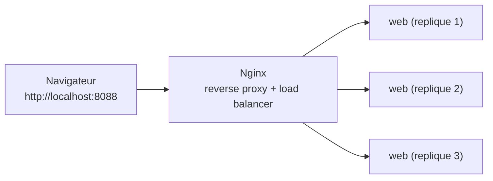

<a id="top"></a>

# Projet — Docker + Nginx + Swarm (répartition de charge)

> **Pratique guidée** · Module [06 — Docker, Nginx et Swarm](../README.md)
>
> Objectif : lancer une petite **app web** en **plusieurs répliques**, placées derrière **Nginx** (répartiteur de charge), et voir la charge se répartir. Deux modes de déploiement : **`docker compose`** (une machine) et **Docker Swarm** (`stack deploy`, cluster).
>
> Pressé ? Voir l'**[aide-mémoire des commandes](COMMANDES.md)**.

> [!IMPORTANT]
> **Travaillez d'abord seul !** Commencez par l'**[énoncé (ENONCE.md)](ENONCE.md)** et tentez de réaliser le projet par vous-même. Ce README est le **guide + corrigé** : les explications détaillées sont **repliées** plus bas.

---

## Ce qu'on construit

Une app web minimale (Flask) qui affiche **le nom du conteneur qui répond**. En la lançant en **3 répliques** derrière **Nginx**, le nom **change** d'une requête à l'autre : c'est la **preuve visuelle** de la répartition de charge.



---

## Prérequis

- **Docker Desktop** installé et démarré.

```bash
docker --version
docker compose version
```

---

## Structure du projet

```text
projet01-docker-nginx-swarm/
├── docker-compose.yml          <- MODE DEV (1 machine, scale)
├── docker-stack.yml            <- MODE SWARM (cluster, replicas)
├── README.md                   <- ce fichier
├── ENONCE.md                   <- l'exercice a tenter d'abord
├── COMMANDES.md                <- aide-memoire
├── app/                        <- l'application web
│   ├── Dockerfile
│   ├── app.py                  <- Flask : affiche le hostname du conteneur
│   ├── requirements.txt
│   └── .dockerignore
└── nginx/
    └── nginx.conf              <- reverse proxy + repartition de charge
```

---

## Mode 1 — Docker Compose (une machine)

### Démarrer avec 3 répliques

```bash
docker compose up -d --build --scale web=3
```

Ouvrez **http://localhost:8088** et **rechargez plusieurs fois** (Ctrl+R) : le **nom du conteneur** affiché change. En ligne de commande :

```bash
curl -H "Accept: application/json" http://localhost:8088/
# -> {"conteneur":"94ca4d028b3b", ...}  puis un autre nom au rechargement
```

### Changer le nombre de répliques à chaud

```bash
docker compose up -d --scale web=5      # passe a 5 instances
docker compose ps                        # liste les conteneurs
```

### Arrêter

```bash
docker compose down
```

<details>
<summary><strong>Corrigé — comment Nginx répartit la charge en mode Compose</strong></summary>

Le secret est dans [`nginx/nginx.conf`](nginx/nginx.conf) :

```nginx
resolver 127.0.0.11 valid=5s;      # DNS interne de Docker
location / {
    set $backend http://web:5000;  # variable => re-resolution a chaque requete
    proxy_pass $backend;
}
```

- `web` est le **nom du service** ; le DNS Docker (`127.0.0.11`) renvoie **les IP de toutes les répliques**.
- En passant par une **variable** (`$backend`) + `resolver`, Nginx **re-résout** `web` régulièrement et répartit les requêtes (round-robin), au lieu de figer une seule IP au démarrage.
- Le service `web` n'expose son port `5000` **qu'en interne** (`expose`, pas `ports`) : **seul Nginx** y accède ; le monde extérieur passe par le port **8088**.

</details>

---

## Mode 2 — Docker Swarm (cluster)

Swarm transforme votre machine (ou plusieurs) en **cluster** et gère les répliques, l'**auto-réparation** et les mises à jour progressives.

### Étapes

```bash
# 1. Construire l'image (Swarm ne construit pas, il deploie une image existante)
docker compose build

# 2. Initialiser le cluster (une seule fois)
docker swarm init

# 3. Deployer le stack (3 repliques web + 1 nginx)
docker stack deploy -c docker-stack.yml demo

# 4. Observer
docker stack services demo        # voit "web  3/3" et "nginx 1/1"
docker service ps demo_web         # les 3 taches (repliques) web
```

Ouvrez **http://localhost:8088** et rechargez : la charge est répartie par le **routing mesh** de Swarm.

### Mettre à l'échelle et observer l'auto-réparation

```bash
docker service scale demo_web=5    # passe a 5 repliques
docker service ps demo_web         # Swarm cree/ retire des taches
```

> **Auto-réparation :** supprimez un conteneur `web` à la main (`docker rm -f <id>`). Swarm en **recrée un** automatiquement pour maintenir le nombre de répliques.

### Arrêter

```bash
docker stack rm demo               # retire le stack
docker swarm leave --force         # quitte le mode Swarm (optionnel)
```

<details>
<summary><strong>Corrigé — Compose vs Swarm (quelles différences ?)</strong></summary>

| | **Compose** (`docker compose`) | **Swarm** (`docker stack deploy`) |
|---|---|---|
| Portée | **1 machine** | **cluster** de machines |
| Répliques | `--scale web=3` (option CLI) | `deploy.replicas: 3` (déclaratif dans le YAML) |
| Auto-réparation | non native | **oui** (`restart_policy`) |
| Mise à jour | recréation manuelle | **progressive** (`update_config`) |
| Load balancing | via Nginx + DNS Docker | via Nginx **ou** le **routing mesh** Swarm |
| Construction d'image | `build:` fonctionne | **ne construit pas** : image pré-construite requise |

- La clé **`deploy:`** (replicas, restart_policy, update_config) est **ignorée par `docker compose`** et **utilisée par Swarm**. C'est pourquoi on a deux fichiers : `docker-compose.yml` (dev) et `docker-stack.yml` (Swarm).
- Sur **Docker Desktop**, le cluster Swarm est **mono-nœud** : parfait pour apprendre. En production, on ajoute des nœuds avec `docker swarm join`.

</details>

---

## Dépannage

| Symptôme | Solution |
|---|---|
| `port 8088 déjà utilisé` | Changez `8088:80` dans le fichier YAML (ex. `9090:80`). |
| Le nom du conteneur ne change jamais | Vérifiez que vous avez bien **plusieurs répliques** (`docker compose ps`), et que le navigateur ne met pas la page en cache (testez avec `curl`). |
| `docker stack deploy` : image introuvable | Lancez d'abord `docker compose build` pour créer `demo-web:1.0`. |
| `this node is not a swarm manager` | Lancez `docker swarm init` avant `docker stack deploy`. |

---

<p align="center">
  <strong>Cours créé par Dr. Haythem REHOUMA — Développement et déploiement de solutions de données</strong>
</p>
