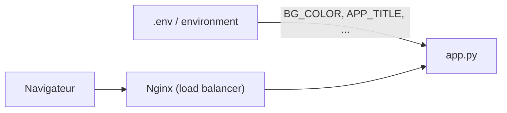

<a id="top"></a>

# TP — Enrichir l'application Docker + Nginx + Swarm

> **Travail pratique** · Module [06 — Docker, Nginx et Swarm](../README.md) · Niveau **intermédiaire → avancé**
>
> Ce TP **part de l'application déjà vue en classe** ([README.md](README.md)) : une app web derrière Nginx, répliquée, qui affiche le nom du conteneur. Votre mission : la **faire évoluer** en la rendant **entièrement configurable par variables d'environnement**, puis en ajoutant de nouvelles fonctionnalités.

---

## Objectif pédagogique

À la fin de ce TP, vous saurez :

- **paramétrer** une application sans toucher au code, uniquement via des **variables d'environnement** ;
- gérer proprement ces variables avec un fichier **`.env`** et la clé **`env_file`** ;
- comprendre la différence de configuration entre **`docker-compose`** (mode dev) et **`docker stack`** (Swarm) ;
- observer l'effet des variables lors d'une **mise à l'échelle** et d'une **mise à jour progressive** (rolling update).

> **Règle d'or du TP :** aucune valeur « en dur » dans le code. Tout ce qui peut changer d'un environnement à l'autre (titre, couleurs, message, version…) doit passer par une **variable d'environnement** avec une **valeur par défaut**.

---

## Point de départ

Vous réutilisez le projet existant :

```
projet01-docker-nginx-swarm/
├── app/                 (app.py, Dockerfile, requirements.txt)
├── nginx/nginx.conf
├── docker-compose.yml
└── docker-stack.yml
```

Rappel de la seule variable déjà présente : `BG_COLOR` (couleur de fond).



---

## Partie 1 — Rendre l'application configurable (variables d'environnement)

Modifiez `app.py` pour lire **au minimum** les variables suivantes, **chacune avec une valeur par défaut** (utilisez `os.environ.get("NOM", "défaut")`) :

| Variable | Rôle | Exemple de défaut |
|---|---|---|
| `APP_TITLE` | Titre affiché dans la page (`<h1>`) | `Bonjour depuis Docker !` |
| `APP_MESSAGE` | Petit message sous le titre | `Répartition de charge en action` |
| `BG_COLOR` | Couleur de fond (déjà existante) | `#0f172a` |
| `TEXT_COLOR` | Couleur du texte | `#e2e8f0` |
| `ACCENT_COLOR` | Couleur du nom du conteneur | `#38bdf8` |
| `APP_VERSION` | Version affichée en bas de page | `1.0.0` |
| `SHOW_HOSTNAME` | Afficher ou non le hostname (`true`/`false`) | `true` |

**Consignes :**

1. Chaque variable doit avoir une **valeur par défaut** : l'app doit démarrer même si **aucune** variable n'est fournie.
2. `SHOW_HOSTNAME` est un **booléen** : convertissez proprement la chaîne (`"true"`, `"1"`, `"false"`…) en `True`/`False`.
3. La réponse **JSON** (en-tête `Accept: application/json`) doit renvoyer un objet contenant **toute la configuration active** (titre, version, couleurs, hostname).

> **Indice** — lecture d'une variable avec valeur par défaut :
> ```python
> app_title = os.environ.get("APP_TITLE", "Bonjour depuis Docker !")
> show_host = os.environ.get("SHOW_HOSTNAME", "true").lower() in ("1", "true", "yes")
> ```

---

## Partie 2 — Nouvelles routes

Ajoutez **au moins deux** nouvelles routes à l'application :

1. **`/version`** → renvoie la valeur de `APP_VERSION` (texte simple).
2. **`/config`** → renvoie en **JSON** toute la configuration issue des variables d'environnement (sans secret).
3. **(Bonus)** **`/compteur`** → un compteur de requêtes **en mémoire** (variable globale). Rechargez plusieurs fois : chaque **réplique** a **son propre compteur**. Expliquez pourquoi dans votre rapport.

> **Question à traiter dans le rapport :** pourquoi le compteur n'est-il **pas** partagé entre les répliques ? Qu'est-ce que cela révèle sur le stockage **en mémoire** d'un conteneur ?

---

## Partie 3 — Injecter les variables via `docker-compose` et un fichier `.env`

1. Créez un fichier **`.env`** à la racine du projet, par exemple :

   ```env
   APP_TITLE=Plateforme de démonstration
   APP_MESSAGE=Bienvenue à mon cours de déploiement
   BG_COLOR=#0f766e
   TEXT_COLOR=#f0fdfa
   ACCENT_COLOR=#5eead4
   APP_VERSION=2.0.0
   SHOW_HOSTNAME=true
   ```

2. Dans `docker-compose.yml`, faites en sorte que le service `web` **charge ce fichier** avec la clé **`env_file`** (ou déclarez les variables sous `environment:`).
3. Créez aussi un fichier **`.env.example`** (sans valeurs sensibles) et ajoutez `.env` au **`.gitignore`**.
4. Démarrez avec **3 répliques** et vérifiez que **votre nouvelle configuration s'affiche** :

   ```powershell
   docker compose up -d --build --scale web=3
   ```

> **À comprendre :** différence entre `environment:` (valeurs dans le YAML) et `env_file:` (valeurs dans un fichier `.env` séparé). Quand utiliser l'un ou l'autre ?

---

## Partie 4 — Reporter la configuration en mode Swarm (`docker stack`)

1. Reportez la configuration par variables d'environnement dans **`docker-stack.yml`** (section `environment:` du service `web`).
   > **Attention :** en Swarm, `env_file` est chargé **côté client au déploiement**. Testez et **notez le comportement** que vous observez.
2. Déployez le stack :

   ```powershell
   docker swarm init
   docker compose build           # construit l'image demo-web:1.0
   docker stack deploy -c docker-stack.yml demo
   ```

3. **Rolling update :** changez `APP_VERSION` (ex. `2.1.0`), redéployez avec `docker stack deploy`, et **observez** la mise à jour **progressive** (`update_config.parallelism: 1`). Vérifiez avec :

   ```powershell
   docker service ps demo_web
   ```

> **Question à traiter :** pendant le rolling update, voit-on cohabiter **deux versions** en même temps ? Pourquoi est-ce utile en production ?

---

## Partie 5 (bonus avancé) — Aller plus loin

Choisissez **au moins un** défi :

- **Validation stricte :** faites échouer le démarrage (avec un message clair) si une variable **obligatoire** manque (ex. `APP_ENV`).
- **Badge d'environnement :** ajoutez `APP_ENV` (`dev` / `staging` / `prod`) et affichez un **badge coloré** différent selon la valeur.
- **En-tête Nginx :** ajoutez dans `nginx.conf` un en-tête `add_header X-Servi-Par "nginx-demo";` et vérifiez-le avec `curl -I`.
- **Secret Swarm :** stockez une valeur sensible (ex. un faux token) via un **Docker secret** au lieu d'une variable d'environnement, et expliquez la différence.

---

## Livrables

- Le **code modifié** : `app/app.py`, `docker-compose.yml`, `docker-stack.yml`, `.env.example`, `.gitignore`.
- Un **`RAPPORT.md`** (1 à 2 pages) contenant :
  - la liste des variables ajoutées et leur rôle ;
  - une **capture** de la page avec **votre** configuration (couleurs/titre personnalisés) ;
  - une **capture** montrant **2 hostnames différents** (preuve de répartition) ;
  - la sortie de `docker service ps demo_web` **pendant** un rolling update ;
  - vos **réponses** aux questions de réflexion (compteur, `environment` vs `env_file`, rolling update).

---

## Barème (sur 20)

| Critère | Points |
|---|---|
| App configurable par variables d'env (Partie 1) | 5 |
| Nouvelles routes `/version` et `/config` (Partie 2) | 3 |
| Fichier `.env` + `env_file` + `.gitignore` (Partie 3) | 4 |
| Configuration reportée en Swarm + rolling update (Partie 4) | 4 |
| Rapport clair et réponses de réflexion | 3 |
| Bonus avancé (Partie 5) | +1 |

---

## Critères de réussite

| Critère | Attendu |
|---|---|
| Aucune valeur « en dur » | Titre, couleurs, version, message viennent de variables |
| Démarrage sans variable | L'app démarre avec les **valeurs par défaut** |
| `.env` fonctionnel | La config du `.env` s'affiche bien dans la page |
| Répartition visible | Le hostname change entre deux requêtes |
| Swarm | `stack deploy` + rolling update de `APP_VERSION` observés |

---

> Besoin d'un rappel des commandes (`up`, `--scale`, `exec`, `stack deploy`, Nginx) ? Voir l'**[aide-mémoire des commandes](COMMANDES.md)**.
>
> Pour réviser les concepts avant de commencer : **[Quiz ciblé (25 questions)](QUIZ.md)**.

---

<p align="center">
  <strong>Cours créé par Dr. Haythem REHOUMA — Développement et déploiement de solutions de données</strong>
</p>
