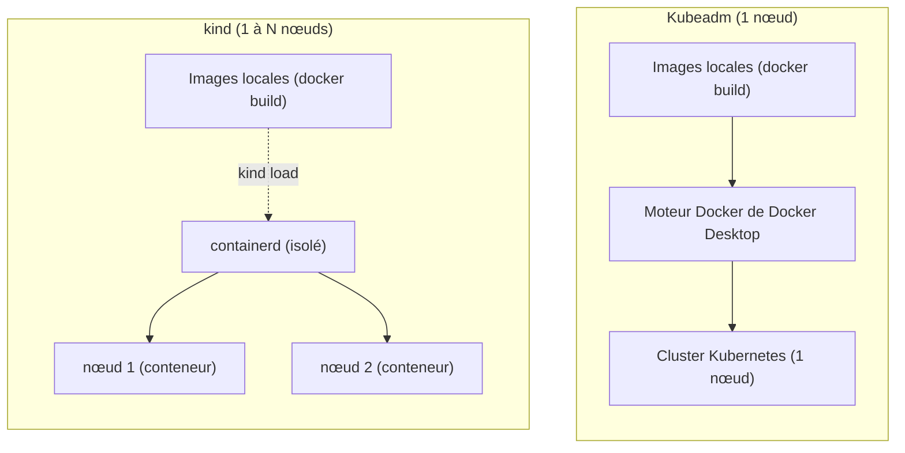

<a id="top"></a>

# Choisir son cluster local : kind vs Kubeadm (Docker Desktop)

> **Projet [projet10-kubernetes-deploiements](README.md)** · Quand Docker Desktop affiche **« Create Kubernetes Cluster »**, il propose **deux types** de cluster : **kind** ou **Kubeadm**. Ce document explique la différence et lequel choisir pour ce cours.

## En une phrase

- **Kubeadm** = un cluster **à 1 nœud**, simple, qui **partage le moteur Docker** → vos images construites en local sont **immédiatement utilisables**. ⭐ **Recommandé pour ce projet.**
- **kind** (*Kubernetes IN Docker*) = chaque nœud est un **conteneur** avec son **propre stockage d'images (containerd)** → il faut **charger** vos images locales avant de déployer, mais on peut simuler **plusieurs nœuds**.



---

## Tableau comparatif

| Critère | **Kubeadm** | **kind** |
|---|---|---|
| Signification | Outil officiel d'amorçage d'un cluster | **K**ubernetes **in** **D**ocker |
| Nombre de nœuds | **1 seul** (single-node) | **1 à 10** (multi-nœuds possible) |
| Où tournent les nœuds | Directement dans la VM de Docker Desktop | Chaque nœud = **un conteneur Docker** |
| Stockage des images | **Partagé** avec le moteur Docker | **Isolé** (containerd propre à kind) |
| Image locale (`docker build`) | **Visible tout de suite** (`imagePullPolicy: IfNotPresent`) | **Non visible** → `kind load docker-image ` obligatoire |
| Simuler une panne de **nœud** | Non (un seul nœud) | **Oui** (on peut arrêter un conteneur-nœud) |
| Vitesse / légèreté | Très rapide à démarrer | Rapide, mais une étape de chargement d'image en plus |
| Idéal pour | **Apprendre** Pods / Deployments / Services sans friction | Tester le **multi-nœuds**, le scheduling, l'affinité |
| Réinitialisation | Reset du cluster | Changer le nombre de nœuds **réinitialise** tout |

---

## Impact concret sur CE projet

Notre projet construit une image **en local** :

```powershell
docker build -t demo-k8s:1.0 ./app
```

et le `deployment.yaml` utilise :

```yaml
image: demo-k8s:1.0
imagePullPolicy: IfNotPresent   # n'essaie PAS de télécharger depuis un registre
```

### Avec Kubeadm — rien de plus à faire
Le cluster partage le moteur Docker : l'image `demo-k8s:1.0` est déjà là.

```powershell
docker build -t demo-k8s:1.0 ./app
kubectl apply -f k8s/
```

### Avec kind — une étape en plus (charger l'image)
Sinon les Pods restent en **`ErrImagePull` / `ImagePullBackOff`** (le cluster ne trouve pas l'image).

```powershell
docker build -t demo-k8s:1.0 ./app
kind load docker-image demo-k8s:1.0    # <-- indispensable avec kind
kubectl apply -f k8s/
```

> **À refaire à CHAQUE reconstruction d'image** avec kind. C'est l'oubli n°1 qui bloque les débutants.

---

## Recommandation pour le cours

| Votre objectif | Choisissez |
|---|---|
| Découvrir Pods, Deployments, Services, ConfigMap, scaling, rolling update | **Kubeadm** ⭐ |
| Montrer un **cluster multi-nœuds** et la répartition des Pods entre nœuds | **kind** (2 nœuds ou plus) |

**Pour ce projet, cochez `Kubeadm` puis `Create`.**

### Réglages de la fenêtre « Create Kubernetes Cluster »
- **Cluster Type :** `Kubeadm`.
- **Version :** celle proposée (ex. `v1.34.1`) convient.
- **Advanced Settings → Show system containers :** **laissez décoché** (sinon les conteneurs internes de Kubernetes apparaîtront dans `docker ps`, ce qui encombre la vue).

---

## Vérifier que le cluster est prêt

```powershell
kubectl config use-context docker-desktop
kubectl get nodes            # doit afficher un nœud  Ready
```

En cas de souci d'accès aux images ou aux Pods, voir l'**[annexe dépannage de COMMANDES.md](COMMANDES.md#annexe-b--depannage)**.

---

<p align="center">
  <strong>Cours créé par Dr. Haythem REHOUMA — Développement et déploiement de solutions de données</strong>
</p>
