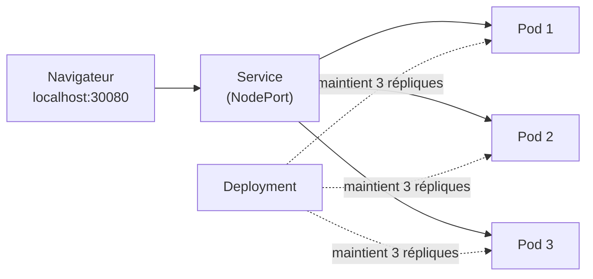

<a id="top"></a>

# Énoncé — Projet : Premiers pas avec Kubernetes (Pods, Deployments, Services)

> **Pratique** · Module [07 — Kubernetes : concepts de base](../README.md) · Niveau **débutant → intermédiaire**
>
> **Essayez d'abord seul !** Réalisez le projet avec ce seul énoncé. Le **corrigé** (manifestes YAML commentés + commandes `kubectl`) est dans le **[README.md](README.md)**, **replié**. Ne l'ouvrez qu'après avoir essayé.

---

## Pas besoin de minikube !

Vous **n'avez rien à installer** de plus : **Docker Desktop** contient un cluster **Kubernetes intégré**.

1. Ouvrez **Docker Desktop → Settings (⚙️) → Kubernetes**.
2. Cochez **« Enable Kubernetes »**, cliquez **Apply & Restart**, patientez que l'indicateur passe au **vert**.
3. Vérifiez dans un terminal :
   ```powershell
   kubectl get nodes
   ```
   Vous devez voir un nœud `docker-desktop` à l'état `Ready`.

> *(Alternatives possibles : `minikube start` ou `kind create cluster`. Le projet fonctionne aussi, moyennant le chargement de l'image — voir [COMMANDES.md](COMMANDES.md).)*

---

## Objectif

Déployer une petite application web sur Kubernetes en **plusieurs répliques (Pods)**, l'**exposer** via un **Service**, puis pratiquer les gestes du quotidien : **scaling**, **rolling update**, **rollback** et **auto-réparation**.

---

## Le résultat attendu

Quand on recharge la page, **le nom du Pod qui répond change** : preuve que le Service répartit la charge entre les Pods.



---

## Travail à réaliser

### Partie 1 — Construire l'image

1. Reprenez l'app web du module 06 (ou écrivez une app qui, sur `/`, **affiche son `hostname`** = le nom du Pod).
2. Construisez l'image en local et **nommez-la `demo-k8s:1.0`**.

### Partie 2 — Le Deployment (les Pods)

3. Écrivez un manifeste **`Deployment`** avec **3 répliques**, des **labels** cohérents (`app: demo-web`) et une **sonde** (`readinessProbe` / `livenessProbe`) sur `/health`.
4. Appliquez-le, puis listez et inspectez vos **Pods** (`kubectl get pods`, `kubectl describe pod ...`, `kubectl logs ...`).

### Partie 3 — Le Service (exposer + répartir)

5. Écrivez un **`Service`** de type **`NodePort`** (port `30080`) qui pointe vers les Pods via le **sélecteur de labels**.
6. Ouvrez `http://localhost:30080` et **rechargez** : vérifiez que le **nom du Pod change**.

### Partie 4 — La configuration (ConfigMap + variables d'env)

7. Créez un **`ConfigMap`** contenant `APP_TITLE`, `APP_VERSION` et `BG_COLOR`, et injectez-le dans les Pods (`envFrom`).
8. **Changez `BG_COLOR`**, réappliquez le ConfigMap, relancez les Pods (`kubectl rollout restart`) et **observez** la nouvelle couleur.

### Partie 5 — Les gestes du quotidien

9. **Scaling** : passez à **5 répliques** (`kubectl scale`) puis revenez à 3.
10. **Rolling update** : changez `APP_VERSION`, appliquez, et suivez le déploiement progressif (`kubectl rollout status`).
11. **Rollback** : revenez à la version précédente (`kubectl rollout undo`).
12. **Auto-réparation** : supprimez un Pod à la main (`kubectl delete pod ...`) et constatez que Kubernetes en **recrée un** tout seul.

---

## Questions de réflexion

- Quelle est la différence entre un **Pod**, un **ReplicaSet** et un **Deployment** ?
- Pourquoi passe-t-on par un **Service** au lieu de contacter un Pod directement par son IP ?
- À quoi sert le **sélecteur de labels** entre le Service et les Pods ?
- Pourquoi séparer la configuration (**ConfigMap**) du **code** (image Docker) ?
- Que fait Kubernetes quand un Pod tombe en panne ? Et pendant un **rolling update** ?

---

## Livrables

- Le dossier `app/` (code + Dockerfile) et le dossier `k8s/` (`configmap.yaml`, `deployment.yaml`, `service.yaml`).
- Une **capture** montrant **au moins 2 noms de Pods différents** dans le navigateur (ou via `curl`).
- La sortie de `kubectl get pods` montrant **3/3** Pods `Running`.
- Une **capture** d'un `kubectl rollout status` pendant un rolling update.

---

## Critères de réussite

| Critère | Attendu |
|---|---|
| Image construite | `demo-k8s:1.0` disponible pour le cluster |
| Deployment | 3 Pods `Running`, sondes OK |
| Service | Page accessible sur `localhost:30080`, le nom du Pod change |
| ConfigMap | Changement de `BG_COLOR` visible après réapplication |
| Cycle de vie | Scaling, rolling update, rollback et auto-réparation démontrés |

---

> Bloqué ? Le **[README.md](README.md)** contient le **corrigé complet** (manifestes commentés + commandes), et l'**[aide-mémoire des commandes](COMMANDES.md)** liste tout `kubectl` utile — à consulter **après** avoir essayé.
