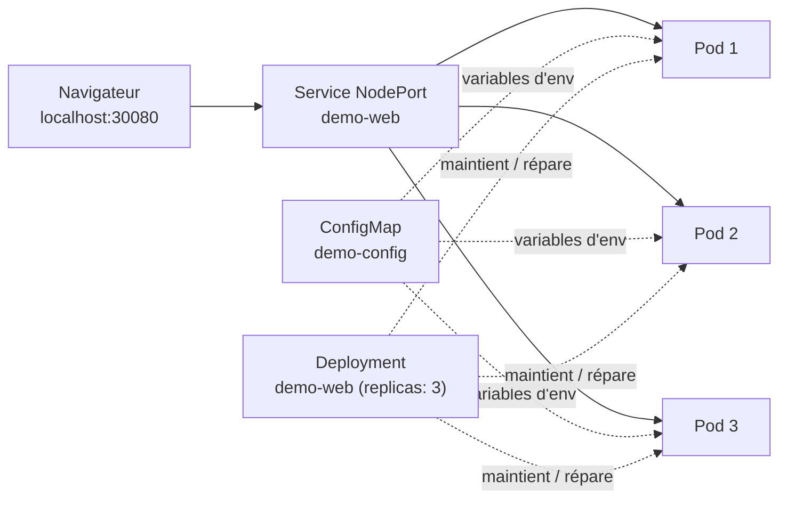

<a id="top"></a>

# Projet 10 — Premiers pas avec Kubernetes (Pods, Deployments, Services)

> **Module [07 — Kubernetes : concepts de base](../README.md)** · Niveau **débutant → intermédiaire**

> [!IMPORTANT]
> **Commencez par l'[ÉNONCÉ](ENONCE.md) et essayez par vous-même.**
> Ce `README.md` est le **corrigé** : les manifestes et explications sont **repliés** (`<details>`). Ne les ouvrez qu'après avoir tenté l'exercice.
>
> Pressé ? Voir l'**[aide-mémoire des commandes](COMMANDES.md)**.

---

## Faut-il installer minikube ?

**Non.** Docker Desktop (déjà installé) embarque un **cluster Kubernetes**. On l'active en un clic — aucune installation supplémentaire.

> Docker Desktop propose deux types de cluster (**kind** ou **Kubeadm**) : voir le comparatif **[kind vs Kubeadm](CLUSTER-KIND-VS-KUBEADM.md)**. Pour ce projet, choisissez **Kubeadm**.



| Objet Kubernetes | Rôle dans ce projet |
|---|---|
| **Pod** | La plus petite unité déployable : un conteneur de notre app |
| **Deployment** | Maintient **3 Pods** en vie, gère scaling / update / rollback / auto-réparation |
| **Service (NodePort)** | Adresse **stable** + **répartition de charge** ; expose sur `localhost:30080` |
| **ConfigMap** | La **configuration** (titre, version, couleur) séparée du code |

---

## Arborescence du projet

```
projet10-kubernetes-deploiements/
├── app/
│   ├── app.py               # app Flask : affiche le nom du Pod, config par variables d'env
│   ├── requirements.txt
│   └── Dockerfile
├── k8s/
│   ├── configmap.yaml       # APP_TITLE, APP_VERSION, BG_COLOR
│   ├── deployment.yaml      # 3 répliques + sondes + ressources
│   └── service.yaml         # NodePort 30080
├── ENONCE.md                # l'énoncé (à faire d'abord)
├── COMMANDES.md             # aide-mémoire kubectl
└── README.md                # ce corrigé
```

---

## Démarrage rapide (le corrigé en 4 commandes)

```powershell
# 0) Kubernetes activé dans Docker Desktop (voir COMMANDES.md §0)
docker build -t demo-k8s:1.0 ./app        # 1) construire l'image
kubectl apply -f k8s/                     # 2) déployer configmap + deployment + service
kubectl get pods                          # 3) vérifier : 3 Pods Running
# 4) ouvrir http://localhost:30080 et recharger : le nom du Pod change
```

---

## Les manifestes expliqués

<details>
<summary><strong>Corrigé — le ConfigMap (configuration par variables d'environnement)</strong></summary>

```yaml
apiVersion: v1
kind: ConfigMap
metadata:
  name: demo-config
data:
  APP_TITLE: "Bonjour depuis Kubernetes !"
  APP_VERSION: "1.0.0"
  BG_COLOR: "#0f172a"
```

- Un **ConfigMap** stocke des paires clé/valeur, **hors du code**.
- Dans le Deployment, `envFrom.configMapRef` injecte **toutes** ces clés comme **variables d'environnement** dans le conteneur.
- Avantage : on change la couleur / le titre **sans reconstruire l'image**. Il suffit de réappliquer et de relancer les Pods (`kubectl rollout restart`).
</details>

<details>
<summary><strong>Corrigé — le Deployment (les Pods, les sondes, l'auto-réparation)</strong></summary>

```yaml
apiVersion: apps/v1
kind: Deployment
metadata:
  name: demo-web
spec:
  replicas: 3
  selector:
    matchLabels:
      app: demo-web
  template:
    metadata:
      labels:
        app: demo-web
    spec:
      containers:
        - name: web
          image: demo-k8s:1.0
          imagePullPolicy: IfNotPresent
          ports:
            - containerPort: 5000
          envFrom:
            - configMapRef:
                name: demo-config
          readinessProbe:
            httpGet: { path: /health, port: 5000 }
          livenessProbe:
            httpGet: { path: /health, port: 5000 }
```

- **`replicas: 3`** → Kubernetes maintient **toujours** 3 Pods. Si un meurt, il en recrée un (**auto-réparation**).
- **`selector` / `labels`** → le Deployment gère les Pods portant `app: demo-web`. Le **Service** utilise le même label pour les trouver.
- **`imagePullPolicy: IfNotPresent`** → utilise l'**image locale** (indispensable sans registre distant).
- **`readinessProbe`** → un Pod ne reçoit du trafic **que lorsqu'il répond** sur `/health`.
- **`livenessProbe`** → si un Pod se bloque, Kubernetes le **redémarre**.
</details>

<details>
<summary><strong>Corrigé — le Service NodePort (exposer + répartir)</strong></summary>

```yaml
apiVersion: v1
kind: Service
metadata:
  name: demo-web
spec:
  type: NodePort
  selector:
    app: demo-web
  ports:
    - port: 80
      targetPort: 5000
      nodePort: 30080
```

- **`selector: app: demo-web`** → le Service envoie le trafic vers **tous** les Pods portant ce label, en **round-robin** (répartition de charge).
- **`targetPort: 5000`** = port du conteneur (Flask) ; **`port: 80`** = port du Service ; **`nodePort: 30080`** = port ouvert sur la machine → `http://localhost:30080`.
- La plage NodePort autorisée est **30000–32767**.
</details>

---

## Les gestes du quotidien

<details>
<summary><strong>Corrigé — scaling, rolling update, rollback, auto-réparation</strong></summary>

```powershell
# Scaling
kubectl scale deployment demo-web --replicas=5
kubectl get pods                              # 5 Pods

# Rolling update (ex. nouvelle APP_VERSION dans le ConfigMap)
kubectl apply -f k8s/configmap.yaml
kubectl rollout restart deployment demo-web
kubectl rollout status deployment demo-web    # mise à jour progressive

# Rollback
kubectl rollout history deployment demo-web
kubectl rollout undo deployment demo-web

# Auto-réparation
kubectl delete pod <nom-du-pod>
kubectl get pods --watch                      # un nouveau Pod apparaît tout seul
```

- **Scaling** : Kubernetes ajuste le nombre de Pods à l'état voulu.
- **Rolling update** : remplacement **progressif** des Pods (aucune coupure).
- **Rollback** : retour instantané à la version précédente grâce à l'historique.
- **Auto-réparation** : l'état réel est **réconcilié** en continu avec l'état déclaré.
</details>

---

## Nettoyage

```powershell
kubectl delete -f k8s/
```

---

## Réponses aux questions de réflexion

<details>
<summary><strong>Corrigé — réponses</strong></summary>

- **Pod vs ReplicaSet vs Deployment** : le **Pod** exécute le(s) conteneur(s) ; le **ReplicaSet** garantit un nombre de Pods ; le **Deployment** gère les ReplicaSet et orchestre les **mises à jour/rollback**.
- **Pourquoi un Service ?** Les Pods sont **éphémères** (IP qui changent). Le Service fournit une **adresse stable** et **répartit** le trafic.
- **Sélecteur de labels** : c'est le « lien » logique entre le Service et les Pods (et entre le Deployment et ses Pods). Pas d'IP en dur.
- **ConfigMap séparé du code** : on **reconfigure** sans rebuild ni redéploiement d'image ; même image réutilisable en dev/prod avec des valeurs différentes.
- **Panne / rolling update** : un Pod mort est **recréé** ; pendant un update, les Pods sont remplacés **un par un** pour éviter toute coupure.
</details>

---

> Toutes les commandes détaillées (exec, logs, port-forward, minikube/kind, dépannage) sont dans **[COMMANDES.md](COMMANDES.md)**.

---

<p align="center">
  <strong>Cours créé par Dr. Haythem REHOUMA — Développement et déploiement de solutions de données</strong>
</p>
