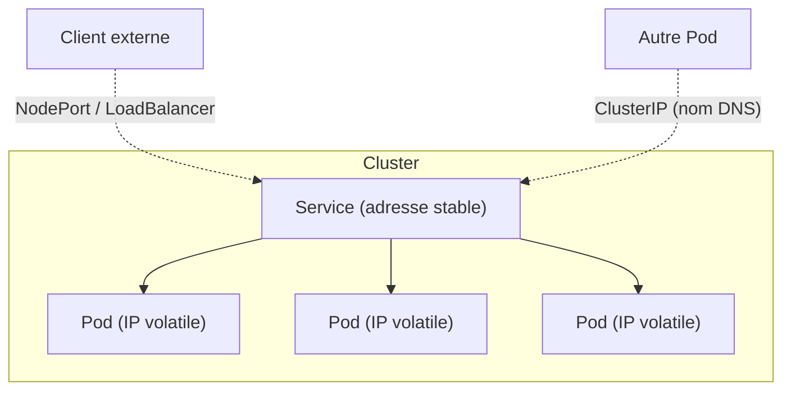

<a id="top"></a>

# Énoncé — Projet 11 : Les Services Kubernetes (ClusterIP, NodePort, LoadBalancer)

> **Pratique** · Module [07 — Kubernetes : concepts de base](../README.md) · Niveau **intermédiaire**
>
> **Essayez d'abord seul !** Réalisez le projet avec ce seul énoncé. Le **corrigé** (manifestes commentés + commandes) est dans le **[README.md](README.md)**, **replié**. Ne l'ouvrez qu'après avoir essayé.

---

## Pré-requis

- Le cluster **Kubernetes de Docker Desktop** activé (type **Kubeadm**) — voir le [projet 10](../projet10-kubernetes-deploiements/README.md).
- L'image `demo-k8s:1.0` déjà construite (sinon : `docker build -t demo-k8s:1.0 ./app`).

---

## Objectif

Comprendre **à quoi sert un Service** et **maîtriser les trois types** principaux :

- **ClusterIP** — accès **interne** au cluster + **découverte de services** par nom DNS ;
- **NodePort** — accès **externe** via un port de la machine ;
- **LoadBalancer** — accès **externe** via une IP « publique » (localhost avec Docker Desktop).

Le tout **au-dessus d'un même Deployment** : un seul lot de Pods, trois façons de les exposer.

---

## Le problème à résoudre

Les **Pods sont éphémères** : ils naissent, meurent, changent d'IP. On ne peut donc **pas** compter sur l'IP d'un Pod. Il faut une **adresse stable** qui répartit le trafic vers les bons Pods : c'est le rôle du **Service**, qui trouve ses Pods grâce aux **labels**.



---

## Travail à réaliser

### Partie 1 — Le Deployment (les Pods à exposer)

1. Déployez une app en **3 répliques** qui affiche le **nom du Pod** (réutilisez `demo-k8s:1.0`).
2. Donnez aux Pods un **label** clair (ex. `app: demo-back`).

### Partie 2 — ClusterIP + découverte de services

3. Créez un Service **`ClusterIP`** nommé `demo-clusterip` (port 80 → 5000).
4. Démontrez la **découverte par DNS** : lancez un **Pod client temporaire** et appelez le service **par son nom** :
   ```
   curl http://demo-clusterip
   ```
5. Rechargez plusieurs fois et **constatez** que le nom du Pod change (répartition de charge interne).

### Partie 3 — NodePort (accès externe)

6. Créez un Service **`NodePort`** nommé `demo-nodeport` (nodePort `30082`).
7. Ouvrez `http://localhost:30082` depuis votre navigateur.

### Partie 4 — LoadBalancer (accès externe « cloud »)

8. Créez un Service **`LoadBalancer`** nommé `demo-lb` (port `8090`).
9. Vérifiez l'`EXTERNAL-IP` (`kubectl get svc`) et ouvrez `http://localhost:8090`.

### Partie 5 — Observer et comprendre

10. Listez les Services (`kubectl get svc`) et repérez : **TYPE**, **CLUSTER-IP**, **EXTERNAL-IP**, **PORT(S)**.
11. Regardez les **Endpoints** (`kubectl get endpoints demo-clusterip`) : ce sont les **IP des Pods** derrière le Service.
12. Changez un **label** d'un Pod (ou du sélecteur) et observez qu'il **sort** des Endpoints.

---

## Questions de réflexion

- Pourquoi ne peut-on pas simplement utiliser l'**IP d'un Pod** ?
- Quel type de Service pour : (a) une **base de données interne**, (b) un **site web public** en dev local, (c) une **API publique** en production cloud ?
- Comment un Pod trouve-t-il un autre service **par son nom** ? (rôle de **CoreDNS**)
- Que contient la liste des **Endpoints** d'un Service, et qui la met à jour ?
- Que se passe-t-il si **aucun Pod** ne correspond au sélecteur du Service ?

---

## Livrables

- `k8s/deployment.yaml` et les trois Services (`service-clusterip.yaml`, `service-nodeport.yaml`, `service-loadbalancer.yaml`).
- Une **capture** de `kubectl get svc` montrant les 3 types.
- Une **capture** de la découverte par DNS (`curl http://demo-clusterip` depuis un Pod client) avec **2 noms de Pods différents**.
- Une **capture** de `kubectl get endpoints demo-clusterip`.

---

## Critères de réussite

| Critère | Attendu |
|---|---|
| ClusterIP | Accessible **par nom DNS** depuis un autre Pod |
| NodePort | Accessible sur `http://localhost:30082` |
| LoadBalancer | `EXTERNAL-IP` = localhost, accessible sur `http://localhost:8090` |
| Répartition | Le nom du Pod change entre deux requêtes |
| Endpoints | Les IP des 3 Pods apparaissent derrière le Service |

---

> Bloqué ? Le **[README.md](README.md)** contient le **corrigé complet**, les notions sont détaillées dans **[01-CONCEPTS-SERVICES.md](01-CONCEPTS-SERVICES.md)**, et **[02-COMMANDES.md](02-COMMANDES.md)** liste tout `kubectl` utile — à consulter **après** avoir essayé.
