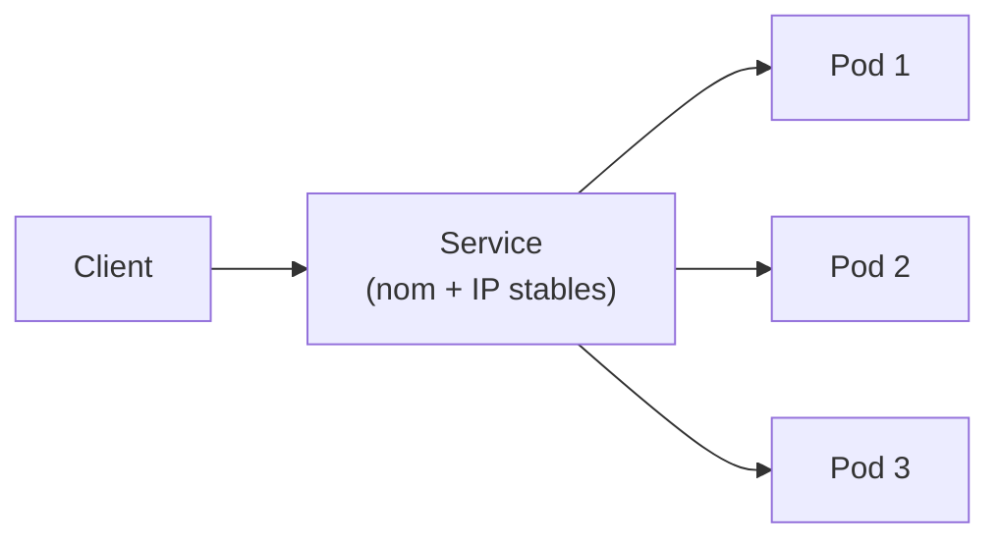
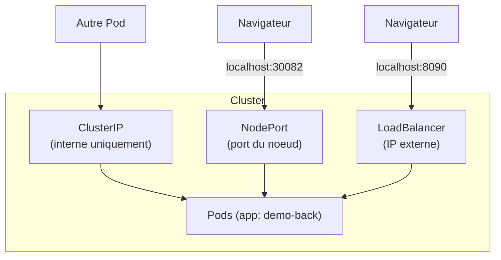
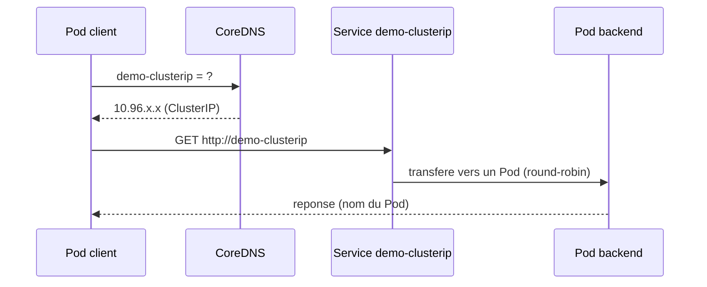

<a id="top"></a>

# Les Services Kubernetes — concepts essentiels

> **Projet [projet11-kubernetes-services](README.md)** · la théorie utile avant (ou pendant) la pratique.

## Pourquoi un Service ?

Un **Pod est éphémère** : il peut être supprimé, recréé, déplacé sur un autre nœud — et son **adresse IP change**. Impossible donc de coder « en dur » l'IP d'un Pod.

Le **Service** résout ce problème : il fournit une **adresse stable** (IP + nom DNS) et **répartit** automatiquement le trafic vers l'ensemble des Pods qui correspondent à son **sélecteur de labels**.



> Le lien Service → Pods **n'est pas** une IP figée : c'est un **sélecteur de labels**. Kubernetes maintient tout seul la liste des Pods correspondants (les **Endpoints**).

---

## Les trois types principaux



### 1. ClusterIP (par défaut)

- Adresse IP **interne** au cluster, **inaccessible** depuis l'extérieur.
- Sert à la **communication entre Pods** (ex. le frontend appelle le backend).
- Base de la **découverte de services** : joignable par **nom DNS** (`http://demo-clusterip`).

### 2. NodePort

- Ouvre un **port fixe sur chaque nœud** (plage **30000–32767**).
- Accès **externe** simple : `http://<ip-du-noeud>:<nodePort>` (ici `http://localhost:30082`).
- Pratique en **dev/local** ; rarement exposé tel quel en production.

### 3. LoadBalancer

- Demande une **IP externe** à l'infrastructure.
- Dans le **cloud** (AWS/GCP/Azure) : provisionne un **vrai load balancer**.
- Avec **Docker Desktop** : l'`EXTERNAL-IP` devient **localhost** (`http://localhost:8090`).

---

## Tableau comparatif

| Type | Portée | Accès | Cas d'usage typique |
|---|---|---|---|
| **ClusterIP** | Interne | Nom DNS interne | Base de données, API interne, communication Pod↔Pod |
| **NodePort** | Externe | `localhost:<30000-32767>` | Démo / dev local |
| **LoadBalancer** | Externe | IP publique (localhost en local) | Service public en **production cloud** |

> Il existe aussi **ExternalName** (alias DNS vers un service externe) et l'**Ingress** (routage HTTP/HTTPS par nom de domaine, vu plus tard) — hors de ce projet.

---

## La découverte de services (DNS interne)

Kubernetes exécute **CoreDNS** dans le cluster. Chaque Service reçoit un **nom DNS** :

```
<nom-du-service>                       # depuis le meme namespace
<nom-du-service>.<namespace>           # depuis un autre namespace
<nom-du-service>.<namespace>.svc.cluster.local   # nom complet (FQDN)
```

Ainsi, depuis n'importe quel Pod du même namespace :

```bash
curl http://demo-clusterip            # resolu par CoreDNS -> IP du Service -> un Pod
```



---

## Service et Endpoints

- Le **Service** définit *quoi* exposer (via le **sélecteur**).
- Les **Endpoints** sont la **liste réelle** des `IP:port` des Pods correspondants, **mise à jour automatiquement** par Kubernetes.

```bash
kubectl get endpoints demo-clusterip   # affiche les IP des Pods derriere le Service
```

- Si **aucun Pod** ne correspond au sélecteur → **Endpoints vide** → le Service répond « pas de backend » (connexion refusée).
- C'est **l'erreur n°1** : un **label** du Pod qui ne correspond pas au **sélecteur** du Service.

---

## À retenir

- Un Service = **adresse stable** + **répartition de charge** + **sélecteur de labels**.
- **ClusterIP** (interne, DNS), **NodePort** (port du nœud), **LoadBalancer** (IP externe).
- La **découverte de services** se fait par **nom DNS** grâce à CoreDNS.
- Les **Endpoints** relient dynamiquement le Service à ses Pods.

---

<p align="center">
  <strong>Cours créé par Dr. Haythem REHOUMA — Développement et déploiement de solutions de données</strong>
</p>
