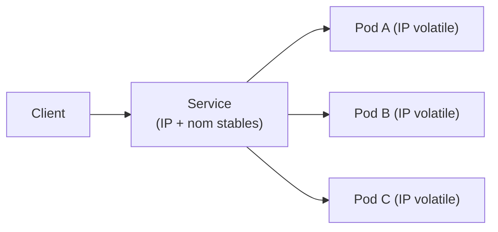
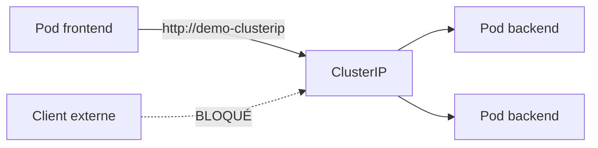
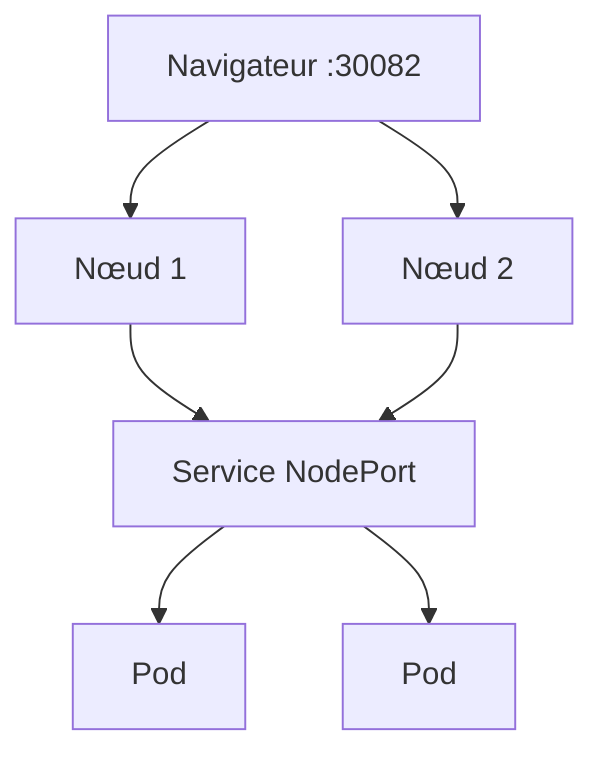
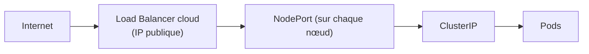
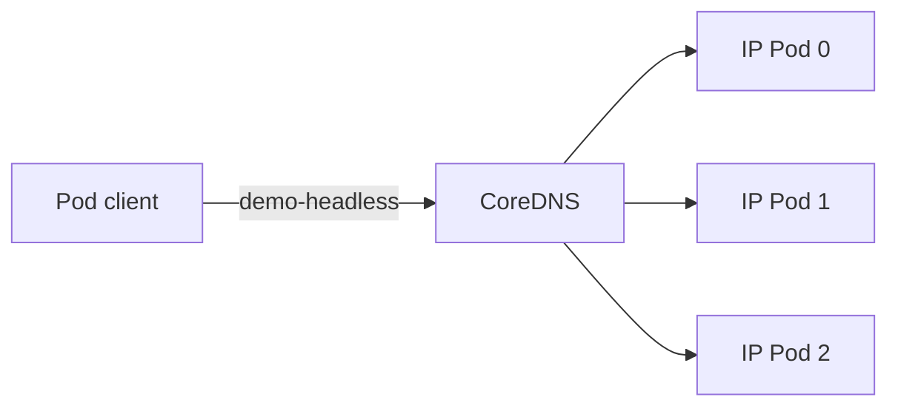
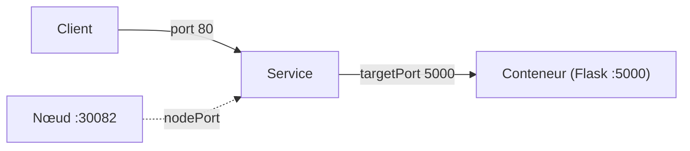
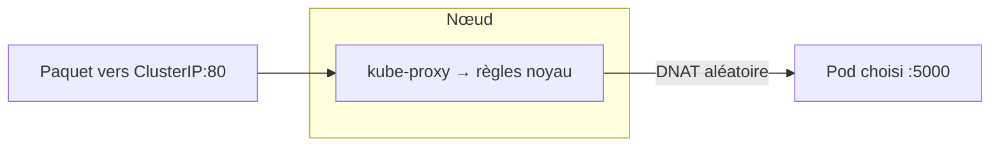
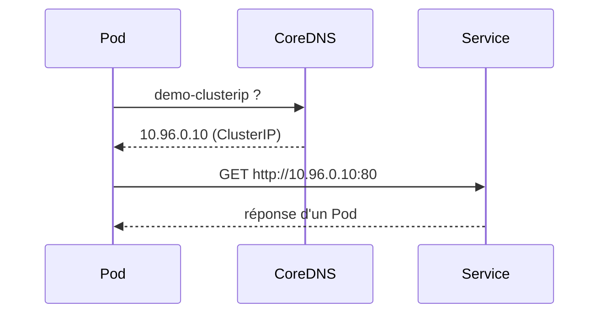
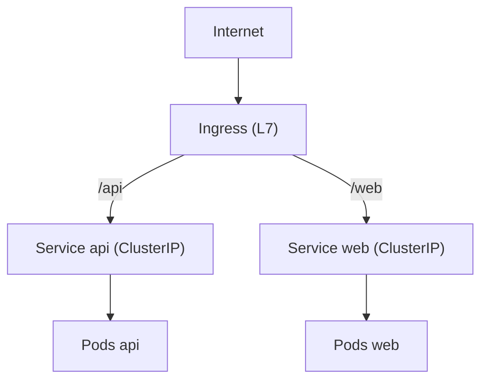

<a id="top"></a>

# Les types de Services Kubernetes — guide ultra-exhaustif

> **Projet [projet11-kubernetes-services](README.md)** · Document de référence approfondi.
>
> Ce document va **beaucoup plus loin** que le corrigé : il détaille **tous** les types de Services, les notions internes (kube-proxy, Endpoints, EndpointSlices, DNS), les champs YAML importants, les politiques de trafic, la session affinity, le multi-port, les pièges classiques et les bonnes pratiques.

## Table des matières

1. [Rappel : le rôle d'un Service](#1-rappel--le-role-dun-service)
2. [Anatomie d'un Service (tous les champs)](#2-anatomie-dun-service-tous-les-champs)
3. [Type 1 — ClusterIP](#3-type-1--clusterip)
4. [Type 2 — NodePort](#4-type-2--nodeport)
5. [Type 3 — LoadBalancer](#5-type-3--loadbalancer)
6. [Type 4 — ExternalName](#6-type-4--externalname)
7. [Service Headless (sans ClusterIP)](#7-service-headless-sans-clusterip)
8. [Service sans sélecteur (Endpoints manuels)](#8-service-sans-selecteur-endpoints-manuels)
9. [port vs targetPort vs nodePort](#9-port-vs-targetport-vs-nodeport)
10. [Multi-port et ports nommés](#10-multi-port-et-ports-nommes)
11. [Comment ça marche sous le capot : kube-proxy](#11-comment-ca-marche-sous-le-capot--kube-proxy)
12. [Endpoints et EndpointSlices](#12-endpoints-et-endpointslices)
13. [Le DNS des Services (CoreDNS)](#13-le-dns-des-services-coredns)
14. [Politiques de trafic (externalTrafficPolicy / internalTrafficPolicy)](#14-politiques-de-trafic)
15. [Session affinity](#15-session-affinity)
16. [Protocoles : TCP, UDP, SCTP, appProtocol](#16-protocoles--tcp-udp-sctp-appprotocol)
17. [Service vs Ingress vs Gateway API](#17-service-vs-ingress-vs-gateway-api)
18. [Tableau récapitulatif des types](#18-tableau-recapitulatif-des-types)
19. [Pièges classiques et dépannage](#19-pieges-classiques-et-depannage)
20. [Bonnes pratiques](#20-bonnes-pratiques)
21. [Mini-exercices](#21-mini-exercices)

---

## 1. Rappel : le rôle d'un Service

Un **Pod** est **éphémère** : il peut être recréé à tout moment, avec une **nouvelle IP**. On ne peut donc pas s'appuyer sur l'IP d'un Pod pour communiquer.

Un **Service** est une **abstraction stable** qui :

- fournit une **identité réseau permanente** (une IP virtuelle et/ou un nom DNS) ;
- **sélectionne** un ensemble de Pods via leurs **labels** ;
- **répartit** le trafic (load balancing) entre ces Pods ;
- se met à jour **automatiquement** quand les Pods apparaissent ou disparaissent.



> **Idée maîtresse :** le Service ne « contient » pas les Pods. Il les **retrouve** en continu grâce au **sélecteur de labels**, et maintient la liste de leurs adresses dans les **Endpoints**.

---

## 2. Anatomie d'un Service (tous les champs)

```yaml
apiVersion: v1
kind: Service
metadata:
  name: mon-service
  labels:
    app: demo
  annotations: {}               # métadonnées (souvent utilisées par les LoadBalancer cloud)
spec:
  type: ClusterIP               # ClusterIP | NodePort | LoadBalancer | ExternalName
  selector:                     # quels Pods ce Service cible (par labels)
    app: demo
  ports:
    - name: http                # nom du port (utile si plusieurs ports)
      protocol: TCP             # TCP (défaut) | UDP | SCTP
      port: 80                  # port du Service (ce que voient les clients)
      targetPort: 5000          # port du conteneur (ou nom de port du conteneur)
      nodePort: 30080           # (NodePort/LoadBalancer) port ouvert sur le nœud
  clusterIP: 10.96.0.10         # (optionnel) IP fixe ; "None" = headless
  sessionAffinity: None         # None | ClientIP
  externalTrafficPolicy: Cluster  # Cluster | Local (NodePort/LoadBalancer)
  internalTrafficPolicy: Cluster  # Cluster | Local
  ipFamilyPolicy: SingleStack   # SingleStack | PreferDualStack | RequireDualStack
  externalIPs: []               # IP externes routées vers ce Service (avancé)
```

Chaque champ est détaillé plus bas. On peut créer un Service **minimal** en 8 lignes ; tous les autres champs ont des **valeurs par défaut** raisonnables.

---

## 3. Type 1 — ClusterIP

**Le type par défaut.** Attribue une **IP virtuelle interne** (dans la plage `Service CIDR`, ex. `10.96.0.0/12`), joignable **uniquement depuis l'intérieur du cluster**.

```yaml
apiVersion: v1
kind: Service
metadata:
  name: demo-clusterip
spec:
  type: ClusterIP
  selector:
    app: demo-back
  ports:
    - port: 80
      targetPort: 5000
```

**Caractéristiques :**

- **Inaccessible** depuis l'extérieur (pas d'`EXTERNAL-IP`).
- Base de la **communication interne** (frontend → backend, app → base de données, microservices entre eux).
- Joignable par **nom DNS** : `http://demo-clusterip` (voir §13).

**Quand l'utiliser :** pour **tout ce qui reste dans le cluster**. C'est le type **le plus courant**.



---

## 4. Type 2 — NodePort

Fait **tout** ce que fait ClusterIP (il en obtient une IP interne), **plus** : il ouvre un **port statique** sur **chaque nœud** du cluster (plage par défaut **30000–32767**).

```yaml
apiVersion: v1
kind: Service
metadata:
  name: demo-nodeport
spec:
  type: NodePort
  selector:
    app: demo-back
  ports:
    - port: 80          # port du Service (interne)
      targetPort: 5000  # port du conteneur
      nodePort: 30082   # port ouvert sur CHAQUE nœud
```

**Accès :** `http://<ip-de-n-importe-quel-noeud>:30082` (avec Docker Desktop : `http://localhost:30082`).

**Points importants :**

- Si vous ne précisez pas `nodePort`, Kubernetes en **choisit un** dans la plage.
- Le **même port** est ouvert sur **tous** les nœuds (grâce au *routing mesh* / kube-proxy), même ceux qui n'hébergent aucun Pod du Service.
- Peu élégant pour la production (ports non standard, gestion manuelle), mais **parfait en dev/local** et souvent **la brique sous** un LoadBalancer.



---

## 5. Type 3 — LoadBalancer

Fait **tout** ce que fait NodePort, **plus** : il demande à l'**infrastructure** (le cloud) de provisionner un **équilibreur de charge externe** avec une **IP publique**.

```yaml
apiVersion: v1
kind: Service
metadata:
  name: demo-lb
spec:
  type: LoadBalancer
  selector:
    app: demo-back
  ports:
    - port: 8090
      targetPort: 5000
```

**Selon l'environnement :**

| Environnement | Comportement |
|---|---|
| **AWS / GCP / Azure** | Crée un vrai LB managé (ELB/NLB, GCP LB…) et remplit `EXTERNAL-IP` |
| **Docker Desktop** | `EXTERNAL-IP` = **localhost** → `http://localhost:8090` |
| **minikube** | `minikube tunnel` fournit l'IP externe |
| **kind / bare-metal** | Reste `<pending>` sans un contrôleur comme **MetalLB** |

**Chaîne complète :** LoadBalancer → NodePort → ClusterIP → Endpoints → Pods.



**Annotations** (spécifiques au fournisseur) pilotent le LB, par ex. sur AWS :

```yaml
metadata:
  annotations:
    service.beta.kubernetes.io/aws-load-balancer-type: "nlb"
    service.beta.kubernetes.io/aws-load-balancer-internal: "true"
```

> Un LoadBalancer par service = **coûteux** dans le cloud. En production, on préfère souvent **un seul** point d'entrée (Ingress/Gateway) devant plusieurs services (voir §17).

---

## 6. Type 4 — ExternalName

Cas particulier : **aucun sélecteur, aucun Pod, aucune IP**. Il crée simplement un **alias DNS** (enregistrement **CNAME**) vers un **nom externe**.

```yaml
apiVersion: v1
kind: Service
metadata:
  name: base-externe
spec:
  type: ExternalName
  externalName: db.exemple.com     # les Pods qui appellent "base-externe" sont redirigés ici
```

**Usage :** faire pointer un nom interne stable (`base-externe`) vers un service **hors cluster** (une base managée, une API tierce). Si l'adresse change, on modifie **un seul** endroit.


> Limite : c'est du **DNS pur**, sans répartition de charge ni contrôle de port. Ne convient pas si le service externe attend un `Host` HTTP particulier.

---

## 7. Service Headless (sans ClusterIP)

En posant **`clusterIP: None`**, on obtient un **Service sans IP virtuelle**. Le DNS renvoie alors **directement les IP de tous les Pods** (une liste d'enregistrements A), au lieu d'une IP unique.

```yaml
apiVersion: v1
kind: Service
metadata:
  name: demo-headless
spec:
  clusterIP: None        # <-- headless
  selector:
    app: demo-back
  ports:
    - port: 80
      targetPort: 5000
```

**À quoi ça sert :**

- Quand le **client** veut voir **chaque Pod individuellement** (pas de LB centralisé).
- Indispensable pour les **StatefulSet** : chaque Pod obtient un **nom DNS stable** (`pod-0.demo-headless`, `pod-1.demo-headless`…), utile pour les bases de données répliquées (Cassandra, Kafka, etc.).



| | ClusterIP normal | Headless (`clusterIP: None`) |
|---|---|---|
| IP virtuelle | Oui (une seule) | Non |
| Réponse DNS | 1 IP (celle du Service) | N IP (celles des Pods) |
| Répartition | Par kube-proxy | À la charge du client |
| Cas d'usage | Web/API sans état | Bases répliquées, StatefulSet |

---

## 8. Service sans sélecteur (Endpoints manuels)

Un Service **peut ne pas avoir de sélecteur**. Dans ce cas, Kubernetes ne remplit pas les Endpoints tout seul : **vous** les définissez à la main. Pratique pour exposer une ressource **externe** sous une **IP interne stable**.

```yaml
apiVersion: v1
kind: Service
metadata:
  name: api-legacy
spec:
  ports:
    - port: 80
      targetPort: 8080
---
apiVersion: v1
kind: Endpoints           # (ou EndpointSlice, plus moderne)
metadata:
  name: api-legacy         # MÊME nom que le Service
subsets:
  - addresses:
      - ip: 192.168.1.50   # serveur externe
    ports:
      - port: 8080
```

> Différence avec **ExternalName** : ici on route par **IP** (avec load balancing possible sur plusieurs IP), pas par CNAME DNS.

---

## 9. port vs targetPort vs nodePort

C'est **la** source de confusion. Trois ports différents, trois rôles :

| Champ | Où | Signification |
|---|---|---|
| **`port`** | Sur le **Service** | Le port qu'utilisent les **clients** pour joindre le Service |
| **`targetPort`** | Sur le **conteneur** | Le port où **écoute réellement** l'application dans le Pod |
| **`nodePort`** | Sur le **nœud** | (NodePort/LoadBalancer) le port ouvert sur la **machine** |



Exemple lu à voix haute : « les clients tapent sur le **port 80** du Service, qui transmet vers le **port 5000** du conteneur ; en NodePort, on entre aussi par le **port 30082** de la machine ».

> `targetPort` peut référencer un **nom de port** défini dans le conteneur (voir §10), ce qui évite de coder le numéro en dur.

---

## 10. Multi-port et ports nommés

Un Service peut exposer **plusieurs ports** (ex. HTTP + métriques). Dans ce cas, chaque entrée **doit** avoir un `name`.

```yaml
spec:
  selector:
    app: demo
  ports:
    - name: http
      port: 80
      targetPort: web          # référence un port NOMMÉ du conteneur
    - name: metrics
      port: 9090
      targetPort: 9090
```

Côté conteneur, on **nomme** les ports :

```yaml
containers:
  - name: app
    ports:
      - name: web              # <-- réutilisé par targetPort: web
        containerPort: 5000
      - name: metrics
        containerPort: 9090
```

**Avantage des ports nommés :** si le port du conteneur change, on n'a rien à modifier dans le Service.

---

## 11. Comment ça marche sous le capot : kube-proxy

Le Service est un **objet abstrait** : ce n'est **pas** un processus qui reçoit le trafic. La magie est réalisée par **kube-proxy**, un composant présent sur **chaque nœud**, qui programme les **règles réseau** du noyau pour rediriger « IP:port du Service » vers « IP:port d'un Pod ».

**Modes de kube-proxy :**

| Mode | Principe | Notes |
|---|---|---|
| **iptables** (défaut) | Règles iptables, sélection **aléatoire** d'un Pod | Simple, robuste, très répandu |
| **IPVS** | Table de hachage noyau, vrais algos de LB (rr, lc, sh…) | Plus performant sur **grands** clusters |
| **nftables** | Successeur d'iptables | Plus récent |



**Conséquences pratiques :**

- La répartition iptables est **aléatoire** (pas un vrai round-robin ordonné).
- kube-proxy **ne voit pas** la couche HTTP : c'est du **L3/L4** (IP/port). Pour du routage **HTTP** (par chemin, par host), il faut un **Ingress** (§17).

---

## 12. Endpoints et EndpointSlices

Le lien Service ↔ Pods est matérialisé par des objets :

- **Endpoints** (historique) : un seul objet listant **tous** les `IP:port` des Pods **prêts**.
- **EndpointSlices** (moderne, recommandé) : la liste est **découpée en tranches** (max ~100 endpoints chacune) → **scalabilité** bien meilleure sur les gros services.

```bash
kubectl get endpoints demo-clusterip
kubectl get endpointslices -l kubernetes.io/service-name=demo-clusterip
```

**Qui met à jour la liste ?** Le **endpoint controller** : dès qu'un Pod devient **Ready** (readinessProbe OK) et correspond au sélecteur, son IP **entre** ; s'il tombe, elle **sort**.

> Un Pod **non Ready** est **retiré** des Endpoints → il ne reçoit **pas** de trafic. C'est pourquoi la **readinessProbe** est essentielle : elle contrôle qui est « dans » le Service. (Exception : `publishNotReadyAddresses: true` publie aussi les Pods non prêts — usage headless spécifique.)

---

## 13. Le DNS des Services (CoreDNS)

Kubernetes fait tourner **CoreDNS**. Chaque Service reçoit un nom DNS déterministe :

```
<service>                                   # même namespace
<service>.<namespace>                        # autre namespace
<service>.<namespace>.svc.cluster.local      # FQDN complet
```

Exemple depuis un Pod :

```bash
curl http://demo-clusterip                       # même namespace
curl http://demo-clusterip.default               # explicite
curl http://demo-clusterip.default.svc.cluster.local
```

**Enregistrements produits :**

- Service **normal** → un enregistrement **A** vers la **ClusterIP**.
- Service **headless** → **plusieurs A**, un par Pod.
- Ports nommés → enregistrements **SRV** : `_http._tcp.demo-clusterip…`.
- **ExternalName** → **CNAME** vers la cible.



> Historiquement, Kubernetes injectait aussi des **variables d'environnement** (`DEMO_CLUSTERIP_SERVICE_HOST`, `..._PORT`) dans les Pods créés **après** le Service. Le **DNS reste la méthode recommandée** (fonctionne quel que soit l'ordre de création).

---

## 14. Politiques de trafic

### externalTrafficPolicy (trafic **entrant externe**, NodePort/LoadBalancer)

| Valeur | Effet | Compromis |
|---|---|---|
| **Cluster** (défaut) | Le trafic peut être **redirigé vers un autre nœud** pour atteindre un Pod | Bonne répartition, mais **l'IP source du client est masquée** (SNAT) et un saut réseau en plus |
| **Local** | Ne sert **que** les Pods **du nœud** qui reçoit le paquet | **Préserve l'IP source** du client, pas de saut ; mais déséquilibre si les Pods sont mal répartis |

### internalTrafficPolicy (trafic **interne**, entre Pods)

| Valeur | Effet |
|---|---|
| **Cluster** (défaut) | Route vers **n'importe quel** Pod du Service |
| **Local** | Route **uniquement** vers les Pods du **même nœud** (utile pour la latence / la localité) |

> `externalTrafficPolicy: Local` est le réglage clé quand vous avez besoin de connaître la **vraie IP du client** (logs, sécurité, géolocalisation).

---

## 15. Session affinity

Par défaut, chaque requête peut aller vers **n'importe quel** Pod. Pour « coller » un client à un même Pod :

```yaml
spec:
  sessionAffinity: ClientIP
  sessionAffinityConfig:
    clientIP:
      timeoutSeconds: 10800     # 3 h
```

- **`None`** (défaut) : répartition à chaque requête.
- **`ClientIP`** : toutes les requêtes d'une **même IP** vont au **même Pod** (sticky sessions basiques L4).

> Pour des sessions HTTP plus fines (par cookie), on utilise plutôt un **Ingress** (L7).

---

## 16. Protocoles : TCP, UDP, SCTP, appProtocol

- `protocol: TCP` (défaut), `UDP` (DNS, jeux, streaming), `SCTP` (télécoms).
- On peut mélanger plusieurs protocoles sur un même Service (ports distincts).
- `appProtocol` (indicatif) précise le protocole applicatif (`http`, `https`, `grpc`) pour les outils/LB.

```yaml
ports:
  - name: dns-udp
    port: 53
    protocol: UDP
    targetPort: 53
  - name: dns-tcp
    port: 53
    protocol: TCP
    targetPort: 53
```

---

## 17. Service vs Ingress vs Gateway API

Un **Service** travaille en **L4** (IP/port). Il ne sait **pas** router selon l'URL, le nom d'hôte, ni gérer le **TLS**. Pour cela :

| Objet | Couche | Rôle |
|---|---|---|
| **Service** (ClusterIP/NodePort/LB) | L3/L4 | Adresse stable + LB simple vers des Pods |
| **Ingress** | L7 (HTTP/HTTPS) | Routage par **host** et **chemin**, **TLS**, un seul point d'entrée pour **plusieurs** services |
| **Gateway API** | L7 (successeur d'Ingress) | Plus expressif, séparation des rôles, multi-protocoles |



> Modèle typique en production : **un seul** LoadBalancer → **Ingress** → plusieurs **ClusterIP** internes. On économise les LB coûteux et on centralise TLS/routage.

---

## 18. Tableau récapitulatif des types

| Type | IP interne | Accès externe | DNS | Sélecteur | Cas d'usage |
|---|---|---|---|---|---|
| **ClusterIP** | Oui | Non | 1 A (ClusterIP) | Oui | Communication interne (le plus courant) |
| **NodePort** | Oui | Port du nœud | 1 A | Oui | Dev/local, brique d'un LB |
| **LoadBalancer** | Oui | IP publique | 1 A | Oui | Service public en cloud |
| **ExternalName** | Non | — (CNAME) | CNAME | Non | Alias vers un service externe |
| **Headless** (`clusterIP: None`) | Non | Non | N A (Pods) | Oui | StatefulSet, bases répliquées |
| **Sans sélecteur** | Oui | selon type | 1 A | Non | Endpoints manuels (ressource externe) |

---

## 19. Pièges classiques et dépannage

| Symptôme | Cause fréquente | Solution |
|---|---|---|
| Service ne répond pas | **Sélecteur ≠ labels** des Pods | Aligner `spec.selector` et les `labels` du template de Pod |
| Endpoints **vides** | Aucun Pod **Ready** ou aucun Pod correspondant | `kubectl get endpoints <svc>` ; vérifier readinessProbe et labels |
| Connexion refusée en interne | Mauvais `targetPort` | `targetPort` = port **réel** du conteneur |
| `EXTERNAL-IP` reste `<pending>` | Pas de contrôleur LB (kind/bare-metal) | Docker Desktop OK ; sinon MetalLB / `port-forward` |
| IP source du client masquée | `externalTrafficPolicy: Cluster` | Passer à `Local` |
| NodePort inaccessible | Port hors plage / occupé | Utiliser 30000–32767, changer `nodePort` |
| DNS ne résout pas | Mauvais namespace / CoreDNS KO | Tester le FQDN ; `kubectl -n kube-system get pods` (coredns) |

**Commandes de diagnostic :**

```bash
kubectl get svc <nom> -o wide
kubectl describe svc <nom>
kubectl get endpoints <nom>
kubectl get endpointslices -l kubernetes.io/service-name=<nom>
kubectl run test --rm -it --image=busybox:1.36 -- sh   # nslookup <svc>, wget -qO- http://<svc>
```

---

## 20. Bonnes pratiques

- **Par défaut, ClusterIP.** N'exposez à l'extérieur **que** ce qui doit l'être.
- **Un seul LoadBalancer** + **Ingress** devant plusieurs ClusterIP (coût + TLS centralisé).
- **Nommez vos ports** (multi-port, et `targetPort` par nom → découplage).
- Soignez les **readinessProbe** : elles décident qui est **dans** les Endpoints.
- **Cohérence labels/sélecteurs** : c'est l'erreur n°1. Gardez des labels stables (`app`, `tier`, `version`).
- Utilisez **`externalTrafficPolicy: Local`** quand la **vraie IP client** compte.
- Préférez les **EndpointSlices** (activés par défaut sur les versions récentes) pour la scalabilité.
- Ne codez **jamais** une IP de Pod en dur : utilisez le **nom DNS du Service**.

---

## 21. Mini-exercices

<details>
<summary><strong>Exercice 1 — Transformer un NodePort en ClusterIP</strong></summary>

Retirez `type: NodePort` (ou mettez `ClusterIP`), réappliquez, puis prouvez qu'il n'est plus accessible depuis l'hôte mais l'est **par nom** depuis un Pod (`curl http://demo-nodeport`... renommé). Observez `kubectl get svc` : plus de colonne `nodePort`.
</details>

<details>
<summary><strong>Exercice 2 — Casser puis réparer les Endpoints</strong></summary>

Changez le sélecteur du Service en `app: inexistant`, réappliquez, et constatez `kubectl get endpoints` **vide** + service injoignable. Remettez `app: demo-back` : les Endpoints reviennent.
</details>

<details>
<summary><strong>Exercice 3 — Service headless</strong></summary>

Créez un Service avec `clusterIP: None`, puis depuis un Pod : `nslookup demo-headless`. Vous devez voir **plusieurs IP** (une par Pod) au lieu d'une seule.
</details>

<details>
<summary><strong>Exercice 4 — Multi-port</strong></summary>

Ajoutez un port `metrics` (9090) nommé au conteneur et au Service. Vérifiez avec `kubectl describe svc` que les deux ports apparaissent, et que `targetPort` référence bien le **nom** du port.
</details>

<details>
<summary><strong>Exercice 5 — ExternalName</strong></summary>

Créez un Service `ExternalName` vers `example.com`. Depuis un Pod : `nslookup mon-alias` doit renvoyer un **CNAME** vers `example.com`.
</details>

---

> Retour au **[corrigé du projet](README.md)** · Concepts de base : **[01-CONCEPTS-SERVICES.md](01-CONCEPTS-SERVICES.md)** · Commandes : **[02-COMMANDES.md](02-COMMANDES.md)**.

---

<p align="center">
  <strong>Cours créé par Dr. Haythem REHOUMA — Développement et déploiement de solutions de données</strong>
</p>
