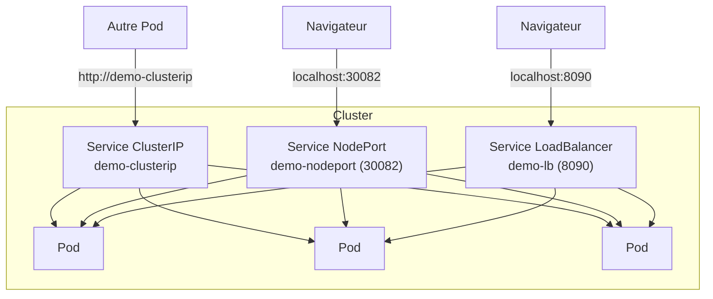

<a id="top"></a>

# Projet 11 — Les Services Kubernetes (ClusterIP, NodePort, LoadBalancer)

> **Module [07 — Kubernetes : concepts de base](../README.md)** · Niveau **intermédiaire**

> [!IMPORTANT]
> **Commencez par l'[ÉNONCÉ](00-ENONCE.md) et essayez par vous-même.**
> Ce `README.md` est le **corrigé** : manifestes et explications sont **repliés** (`<details>`).
>
> Notions détaillées : **[01-CONCEPTS-SERVICES.md](01-CONCEPTS-SERVICES.md)** · Commandes : **[02-COMMANDES.md](02-COMMANDES.md)**.

---

## Idée du projet

Un **seul Deployment** (3 Pods), **trois façons de l'exposer**. On compare les types de Service et on démontre la **découverte de services par DNS**.



| Type | Portée | Accès dans ce projet |
|---|---|---|
| **ClusterIP** | Interne | `http://demo-clusterip` (depuis un Pod) |
| **NodePort** | Externe | `http://localhost:30082` |
| **LoadBalancer** | Externe | `http://localhost:8090` |

---

## Arborescence du projet

```
projet11-kubernetes-services/
├── app/                            # app Flask (affiche le nom du Pod)
│   ├── app.py
│   ├── requirements.txt
│   └── Dockerfile
├── k8s/
│   ├── deployment.yaml             # 3 Pods (label app: demo-back)
│   ├── service-clusterip.yaml      # ClusterIP (interne + DNS)
│   ├── service-nodeport.yaml       # NodePort 30082
│   └── service-loadbalancer.yaml   # LoadBalancer 8090
├── 00-ENONCE.md                    # l'énoncé (à faire d'abord)
├── 01-CONCEPTS-SERVICES.md         # la théorie
├── 02-COMMANDES.md                 # aide-mémoire kubectl
└── README.md                       # ce corrigé
```

---

## Démarrage rapide (le corrigé en 4 commandes)

```powershell
kubectl config use-context docker-desktop
docker build -t demo-k8s:1.0 ./app        # (déjà fait au projet 10 ? sautez cette ligne)
kubectl apply -f k8s/                     # deployment + 3 services
kubectl get svc                           # comparez TYPE / CLUSTER-IP / EXTERNAL-IP / PORT(S)
```

---

## Les manifestes expliqués

<details>
<summary><strong>Corrigé — le Deployment (les Pods ciblés par les Services)</strong></summary>

```yaml
apiVersion: apps/v1
kind: Deployment
metadata:
  name: demo-back
spec:
  replicas: 3
  selector:
    matchLabels:
      app: demo-back
  template:
    metadata:
      labels:
        app: demo-back        # <-- label cible par TOUS les Services
    spec:
      containers:
        - name: web
          image: demo-k8s:1.0
          imagePullPolicy: IfNotPresent
          ports: [{ containerPort: 5000 }]
          env:
            - { name: APP_ROLE, value: "backend" }
```

Le **label `app: demo-back`** est la clé : chacun des trois Services utilise ce label comme **sélecteur** pour trouver ces Pods.
</details>

<details>
<summary><strong>Corrigé — ClusterIP (interne + découverte DNS)</strong></summary>

```yaml
apiVersion: v1
kind: Service
metadata:
  name: demo-clusterip
spec:
  type: ClusterIP            # valeur par défaut
  selector:
    app: demo-back
  ports:
    - port: 80
      targetPort: 5000
```

- **Non joignable depuis l'hôte** : c'est une IP **interne**.
- On l'appelle **par son nom** depuis un autre Pod → `http://demo-clusterip` (résolu par **CoreDNS**).
- C'est le type utilisé pour les communications **Pod ↔ Pod** (ex. frontend → backend, app → base de données).
</details>

<details>
<summary><strong>Corrigé — NodePort (accès externe par port du nœud)</strong></summary>

```yaml
apiVersion: v1
kind: Service
metadata:
  name: demo-nodeport
spec:
  type: NodePort
  selector:
    app: demo-back
  ports:
    - port: 80
      targetPort: 5000
      nodePort: 30082        # plage autorisée : 30000-32767
```

Ouvre le port **30082** sur la machine → `http://localhost:30082`. Idéal pour une **démo locale**.
</details>

<details>
<summary><strong>Corrigé — LoadBalancer (IP externe)</strong></summary>

```yaml
apiVersion: v1
kind: Service
metadata:
  name: demo-lb
spec:
  type: LoadBalancer
  selector:
    app: demo-back
  ports:
    - port: 8090
      targetPort: 5000
```

- En **cloud** : provisionne un vrai load balancer (IP publique).
- Avec **Docker Desktop** : `EXTERNAL-IP` devient **localhost** → `http://localhost:8090`.
</details>

---

## La démonstration clé : la découverte par DNS

<details>
<summary><strong>Corrigé — appeler un ClusterIP par son nom depuis un Pod</strong></summary>

```powershell
kubectl run client --rm -it --image=curlimages/curl -- sh
```

Dans le Pod client :

```sh
curl http://demo-clusterip        # resolu par CoreDNS -> un des 3 Pods
curl http://demo-clusterip        # relancez : le nom du Pod change (round-robin)
exit
```

**Ce qu'on prouve :** un Pod n'a **pas besoin de connaître les IP** des autres Pods. Il utilise le **nom du Service**, stable, et Kubernetes s'occupe de la résolution et de la répartition.
</details>

<details>
<summary><strong>Corrigé — Endpoints : le lien Service ↔ Pods</strong></summary>

```powershell
kubectl get endpoints demo-clusterip     # les IP:port des 3 Pods
kubectl get pods --selector app=demo-back -o wide
```

Les **Endpoints** sont mis à jour **automatiquement** : si un Pod meurt, il **sort** de la liste ; s'il en naît un, il **entre**. Si le **sélecteur** ne correspond à aucun label → **Endpoints vides** (le Service ne répond plus).
</details>

---

## Nettoyage

```powershell
kubectl delete -f k8s/
```

---

## Réponses aux questions de réflexion

<details>
<summary><strong>Corrigé — réponses</strong></summary>

- **Pourquoi pas l'IP d'un Pod ?** Elle est **éphémère** (change à chaque recréation). Le Service donne une adresse **stable**.
- **Quel type pour quoi ?** (a) base interne → **ClusterIP** ; (b) site web en dev local → **NodePort** ; (c) API publique en prod cloud → **LoadBalancer** (ou Ingress).
- **Trouver un service par nom ?** Grâce à **CoreDNS** : `http://<service>` (même namespace) ou le FQDN `…svc.cluster.local`.
- **Endpoints ?** La liste réelle des `IP:port` des Pods correspondant au sélecteur, **maintenue par Kubernetes**.
- **Aucun Pod ne correspond ?** Endpoints vides → connexions **refusées** (le Service n'a personne vers qui router).
</details>

---

> Toutes les commandes (DNS, port-forward, endpoints, dépannage) sont dans **[02-COMMANDES.md](02-COMMANDES.md)**.

---

<p align="center">
  <strong>Cours créé par Dr. Haythem REHOUMA — Développement et déploiement de solutions de données</strong>
</p>
