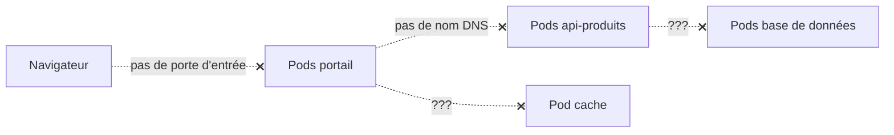

<a id="top"></a>

# Mission : rétablir les communications du cluster

> **Projet 12** · Module [07 — Kubernetes : concepts de base](../README.md) · Niveau **intermédiaire → avancé** · Durée estimée : **3 à 5 h**
>
> **Projet d'application intégrateur sur les Services Kubernetes.** Tout le code applicatif vous est **fourni**. Votre travail : **écrire, déterminer et compléter les Services** qui manquent — c'est-à-dire faire communiquer un système qui, en l'état, est **totalement muet**.

---

## Le contexte

Une équipe a déployé une petite plateforme de commerce en ligne sur Kubernetes. Les images sont construites, les **Deployments** et le **StatefulSet** tournent, tous les Pods sont `Running`.

**Et pourtant, rien ne fonctionne.**

Le portail affiche un tableau de bord entièrement **rouge** : il ne joint aucun composant. La base de données est injoignable. Le cache est invisible. Aucune page n'est accessible depuis le navigateur.

La raison est simple : **la personne qui devait écrire les Services est partie sans les livrer.**



> **Rappel fondamental que ce projet va vous faire vivre :** des Pods qui tournent ne constituent **pas** une application. Sans Services, ils sont des îlots isolés, sans adresse stable ni nom, incapables de se trouver les uns les autres.

**Votre mission :** rétablir toutes les communications, **uniquement** en écrivant les bons Services.

---

## Ce qui vous est fourni

```
projet12-mission-services/
├── apps/                          # LE CODE — ne pas modifier
│   ├── portail/                   # tableau de bord (affiche l'état de chaque liaison)
│   ├── api-produits/
│   ├── api-commandes/
│   └── metriques/                 # expose 2 ports : web + métriques
├── k8s/
│   ├── 01-deployments.yaml        # FOURNI et COMPLET — ne pas modifier
│   ├── 02-statefulset-bd.yaml     # FOURNI et COMPLET — ne pas modifier
│   └── services/                  # À VOUS DE JOUER
│       ├── README-TODO.md         # la liste des Services attendus
│       ├── 01-api-produits.yaml   # squelette à compléter (TODO)
│       ├── 02-portail.yaml        # squelette à compléter (TODO)
│       ├── 03-bd-headless.yaml    # squelette à compléter (TODO)
│       ├── 04-metriques.yaml      # squelette à compléter (TODO)
│       ├── 05-api-externe.yaml    # squelette à compléter (TODO)
│       └── 06-casses/             # 3 Services FOURNIS mais DÉFECTUEUX (à réparer)
├── outils/
│   └── valider.ps1                # script de validation automatique (donne un score)
└── 00-ENONCE.md                   # ce document
```

### Le tableau de bord : votre indicateur de progression

Le portail interroge en continu chaque composant et affiche une **tuile par liaison** :

| Tuile | Signification |
|---|---|
| 🔴 **Rouge** | Aucune résolution DNS : le Service **n'existe pas** |
| 🟠 **Orange** | Le nom est résolu, mais **aucun Pod ne répond** : Service créé, mais **sélecteur ou port erroné** |
| 🟢 **Vert** | Communication établie : **votre Service est correct** |

**Objectif final : sept tuiles vertes.** Chaque Service correctement écrit fait basculer une tuile — vous voyez votre progression **en direct**, sans attendre une correction.

---

## Les règles du jeu

1. **Interdiction absolue de modifier** `apps/`, `01-deployments.yaml` et `02-statefulset-bd.yaml`.
   *(Toute la difficulté consiste à s'adapter à l'existant : c'est exactement la situation d'un vrai poste de travail.)*
2. Vous ne créez et ne modifiez **que** des fichiers dans `k8s/services/`.
3. **Aucune IP en dur.** Tout doit reposer sur les **noms DNS** et les **sélecteurs de labels**.
4. Vous devez **déterminer vous-même le type** de chaque Service : rien ne vous dit si c'est un `ClusterIP`, un `NodePort`, un `LoadBalancer`, un **headless** ou un `ExternalName`. C'est **le cœur de l'évaluation**.
5. Les **noms** de Services sont **imposés** (le code applicatif les utilise) : ils figurent dans le tableau des missions ci-dessous. Un nom erroné = tuile rouge.
6. Vous travaillez sur le **Kubernetes de Docker Desktop** (voir le [projet 10](../projet10-kubernetes-deploiements/00-ENONCE.md) pour l'activer).

---

## Préparation

```powershell
kubectl config use-context docker-desktop   # indispensable si minikube a déjà servi
kubectl get nodes                            # docker-desktop  Ready

# Construire les images des 4 applications
docker build -t portail:1.0        ./apps/portail
docker build -t api-produits:1.0   ./apps/api-produits
docker build -t api-commandes:1.0  ./apps/api-commandes
docker build -t metriques:1.0      ./apps/metriques

# Déployer la base fournie (Pods uniquement, aucun Service)
kubectl apply -f k8s/01-deployments.yaml
kubectl apply -f k8s/02-statefulset-bd.yaml
kubectl get pods
```

À ce stade : **tous les Pods tournent**, et **rien ne communique**. C'est le point de départ normal.

> **Question à vous poser immédiatement :** comment allez-vous seulement *voir* le tableau de bord, puisqu'aucune porte d'entrée n'existe encore ? *(Indice : `kubectl port-forward` fonctionne même sans Service, directement sur un Pod. C'est votre bouée de secours pour observer votre progression avant d'avoir écrit le Service du portail.)*

---

## Les missions

### Mission 1 — Faire parler le portail à l'API produits *(15 points)*

Le portail appelle `http://api-produits` (port **80**). Les Pods de l'API écoutent sur le port **8000** et portent le label `app: api-produits`.

**À produire :** `k8s/services/01-api-produits.yaml`

**À déterminer :** le type de Service, le sélecteur, `port` et `targetPort`.

**Validation :**
```powershell
kubectl get svc api-produits
kubectl get endpoints api-produits      # doit lister les IP des Pods
```
La tuile **API Produits** passe au vert.

---

### Mission 2 — Ouvrir la porte d'entrée *(15 points)*

Le tableau de bord doit être accessible **depuis votre navigateur**, à l'adresse **`http://localhost:30500`**. Les Pods du portail écoutent sur le port **5000**.

**À produire :** `k8s/services/02-portail.yaml`

**À déterminer :** quel type expose un service **à l'extérieur** du cluster sur un port fixe de la machine ? Quelle est la **plage autorisée** pour ce port ?

**Validation :**
```powershell
kubectl get svc portail                  # la colonne PORT(S) doit montrer 80:30500/TCP
start http://localhost:30500
```

> **Question à traiter dans le rapport :** un autre type de Service aurait aussi rendu le portail accessible depuis le navigateur sur Docker Desktop. Lequel, et quelle différence en **production** dans le cloud ?

---

### Mission 3 — Donner une identité à chaque base de données *(20 points)*

Le StatefulSet `bd` fournit **3 répliques**. L'API commandes doit joindre **précisément la réplique primaire**, à l'adresse :

```
bd-0.bd-interne
```

Les Pods de la base portent le label `app: bd` et écoutent sur le port **5432**.

**À produire :** `k8s/services/03-bd-headless.yaml`

**À déterminer :** quel type de Service donne un **nom DNS individuel à chaque Pod** au lieu d'une seule IP virtuelle ? Quel champ, avec quelle valeur particulière, faut-il écrire ?

**Validation :**
```powershell
kubectl run dns --rm -it --image=busybox:1.36 -- sh
#   nslookup bd-interne        -> doit renvoyer PLUSIEURS adresses (une par Pod)
#   nslookup bd-0.bd-interne   -> doit renvoyer UNE adresse précise
```

> **Piège :** vérifiez aussi le champ `serviceName` du StatefulSet fourni. Le nom de votre Service **doit** lui correspondre, sinon les noms individuels ne seront jamais créés.

---

### Mission 4 — Exposer deux ports sur un même Service *(15 points)*

Le composant `metriques` écoute sur **deux** ports :

| Usage | Port du conteneur | Nom du port dans le Deployment |
|---|---|---|
| Interface web | 8080 | `web` |
| Métriques Prometheus | 9090 | `prom` |

Le portail appelle `http://metriques` (port **80**) et `http://metriques:9090/metrics`.

**À produire :** `k8s/services/04-metriques.yaml`

**À déterminer :** comment déclarer **plusieurs ports** sur un Service ? Quelle contrainte s'applique alors obligatoirement à chaque entrée ? Et comment référencer un port du conteneur **par son nom** plutôt que par son numéro (afin que le Service reste valide si le numéro change) ?

**Validation :**
```powershell
kubectl describe svc metriques      # les deux ports doivent apparaître
```

---

### Mission 5 — Donner un nom interne à un service externe *(10 points)*

L'API commandes doit joindre un service de paiement **hébergé à l'extérieur du cluster**, mais le code appelle un nom **interne** : `paiement-externe`. Ce nom doit renvoyer vers `api.exemple.com`.

**À produire :** `k8s/services/05-api-externe.yaml`

**À déterminer :** quel type de Service crée un simple **alias DNS** vers un nom externe, **sans sélecteur ni Pod** ?

**Validation :**
```powershell
kubectl run dns --rm -it --image=busybox:1.36 -- sh
#   nslookup paiement-externe    -> doit montrer un renvoi vers api.exemple.com
```

---

### Mission 6 — L'enquête : réparer trois Services défectueux *(20 points)*

Le dossier `k8s/services/06-casses/` contient **trois Services déjà écrits**… qui **ne fonctionnent pas**. Chacun comporte **une seule erreur**, et ce sont les trois erreurs les plus fréquentes en entreprise.

```powershell
kubectl apply -f k8s/services/06-casses/
```

| Fichier | Symptôme observé |
|---|---|
| `casse-1.yaml` | Le Service existe, mais `kubectl get endpoints` renvoie `<none>` |
| `casse-2.yaml` | Les Endpoints sont bien remplis, mais toute connexion est **refusée** |
| `casse-3.yaml` | Le Service semble parfait, mais le portail ne le joint **jamais** |

**Pour chaque cas, votre rapport doit contenir :**

1. la **commande** de diagnostic qui vous a mis sur la piste ;
2. la **cause exacte** de la panne ;
3. le **correctif** appliqué ;
4. la **preuve** que la liaison fonctionne.

> **Méthode conseillée :** procédez comme un enquêteur — `kubectl describe svc`, `kubectl get endpoints`, `kubectl get pods --show-labels`, puis comparez **ligne à ligne** le Service et le Pod. La différence entre « Endpoints vides » et « connexion refusée » vous dit **déjà** de quel côté chercher.

---

### Mission 7 — Bonus : le grand écart *(5 points)*

Au choix (un seul suffit) :

- **a)** Faire en sorte qu'un même client soit **toujours servi par le même Pod** de l'API produits *(indice : un champ du Service permet une « adhérence » basée sur l'IP du client)*.
- **b)** Créer un Service **sans sélecteur** pointant vers une adresse IP **externe fixe**, en écrivant vous-même ses Endpoints.
- **c)** Écrire un Service de type `LoadBalancer` pour le portail et **expliquer** ce que devient `EXTERNAL-IP` sur Docker Desktop, puis ce qu'il deviendrait sur AWS.

---

## Validation automatique

Un script vous donne votre score **à tout moment** :

```powershell
.\outils\valider.ps1
```

```
[OK]     Mission 1 — api-produits ......... 15/15
[OK]     Mission 2 — portail .............. 15/15
[ÉCHEC]  Mission 3 — bd-interne ...........  0/20   (nslookup bd-0.bd-interne : aucune réponse)
...
SCORE : 45/100
```

Le script **ne donne aucune solution** : il indique seulement ce qui échoue et **où regarder**.

---

## Livrables

1. Le dossier **`k8s/services/`** complet (vos 5 Services écrits + les 3 réparés).
2. Un **`RAPPORT.md`** contenant :
   - pour **chaque** Service : le **type choisi** et une **justification en deux phrases** (« pourquoi ce type et pas un autre ») ;
   - l'**enquête complète** de la mission 6 (commande → cause → correctif → preuve) ;
   - une **capture** du tableau de bord avec **sept tuiles vertes** ;
   - une **capture** de `kubectl get svc` montrant **tous** vos Services et leurs types ;
   - vos réponses aux **questions de réflexion** ci-dessous.
3. La sortie finale de `.\outils\valider.ps1`.

---

## Questions de réflexion

À traiter dans le rapport :

1. Pourquoi l'application ne pouvait-elle **absolument pas** fonctionner sans Services, alors que **tous** les Pods étaient `Running` ?
2. Quelle est la différence concrète entre une tuile **rouge** et une tuile **orange** ? Que vous apprend chacune sur l'endroit où se trouve l'erreur ?
3. Pourquoi le Service de la base de données doit-il être **headless**, alors qu'un ClusterIP ordinaire suffit pour l'API produits ?
4. Que contient exactement la liste des **Endpoints**, et **qui** la met à jour ? Que se passe-t-il lorsqu'un Pod devient `NotReady` ?
5. Vous supprimez un Pod de l'API produits et Kubernetes en recrée un avec une **IP différente**. Pourquoi le portail continue-t-il de fonctionner **sans aucune modification** ?
6. En production, exposeriez-vous dix applications avec dix Services `LoadBalancer` ? Justifiez, et proposez une alternative.

---

## Barème

| Élément | Points |
|---|---|
| Mission 1 — ClusterIP et découverte DNS | 15 |
| Mission 2 — Exposition externe | 15 |
| Mission 3 — Service headless et identités stables | 20 |
| Mission 4 — Multi-port et ports nommés | 15 |
| Mission 5 — ExternalName | 10 |
| Mission 6 — Diagnostic et réparation (3 × 6,67) | 20 |
| Qualité du rapport et justifications | 5 |
| **Bonus** — Mission 7 | **+5** |
| **Total** | **100 (+5)** |

**Pénalités :** −10 par modification d'un fichier interdit (`apps/`, `01-deployments.yaml`, `02-statefulset-bd.yaml`) ; −5 par adresse IP codée en dur.

---

## Critères de réussite

| Critère | Attendu |
|---|---|
| Tableau de bord | **7 tuiles vertes** |
| Types de Services | Chacun **justifié** et **adapté** à son usage |
| DNS individuel | `bd-0.bd-interne` résolu vers **un seul** Pod |
| Multi-port | Les deux ports visibles dans `describe svc`, `targetPort` **par nom** |
| Enquête | Les 3 pannes **identifiées, expliquées et corrigées** |
| Résilience | Après suppression d'un Pod, le portail **continue** de fonctionner |
| Aucune IP en dur | Uniquement des **noms DNS** et des **sélecteurs** |

---

## Boîte à outils (aucune solution, seulement des pistes)

```powershell
kubectl get svc                              # types, IP, ports
kubectl describe svc <nom>                   # détails + Endpoints
kubectl get endpoints <nom>                  # QUI est derrière le Service ?
kubectl get pods --show-labels               # les labels réels des Pods
kubectl get pods -l app=<valeur>             # tester un sélecteur
kubectl port-forward pod/<pod> 5000:5000     # accéder à un Pod SANS Service
kubectl run test --rm -it --image=busybox:1.36 -- sh    # nslookup, wget
kubectl logs -l app=portail --tail=30        # ce que le portail n'arrive pas à joindre
```

**Les trois questions qui débloquent 90 % des situations :**

1. Le Service **existe-t-il** avec le **bon nom** ? *(sinon → rouge : rien à résoudre)*
2. Les **Endpoints** sont-ils remplis ? *(vides → le **sélecteur** ne correspond à aucun label)*
3. Le **`targetPort`** correspond-il au port **réellement écouté** par le conteneur ? *(sinon → connexion refusée)*

---

## Rappels théoriques utiles

- Les concepts : **[01-CONCEPTS-SERVICES.md](../projet11-kubernetes-services/01-CONCEPTS-SERVICES.md)**
- La référence exhaustive (tous les types, headless, ExternalName, ports nommés, Endpoints) : **[03-TYPES-DE-SERVICES-EXHAUSTIF.md](../projet11-kubernetes-services/03-TYPES-DE-SERVICES-EXHAUSTIF.md)**
- Les commandes : **[02-COMMANDES.md](../projet11-kubernetes-services/02-COMMANDES.md)**

> Tout ce dont vous avez besoin s'y trouve. **Aucune** solution toute faite n'est fournie pour ce projet : c'est à vous d'assembler les pièces.

---

<p align="center">
  <strong>Cours créé par Dr. Haythem REHOUMA — Développement et déploiement de solutions de données</strong>
</p>
