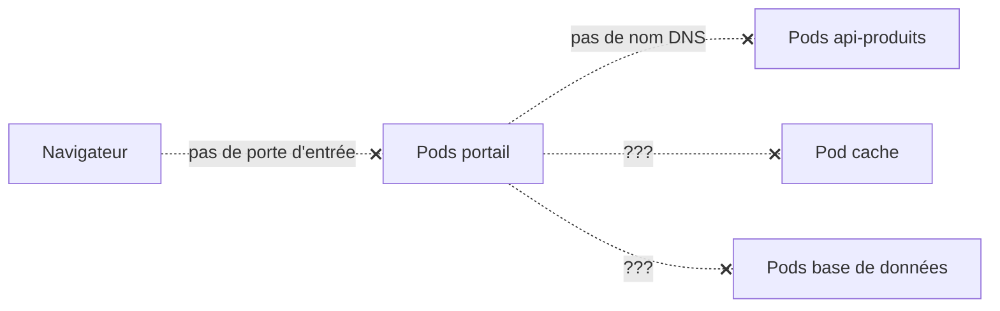
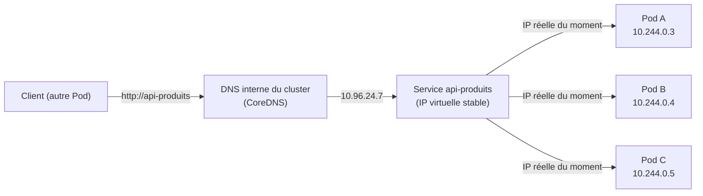
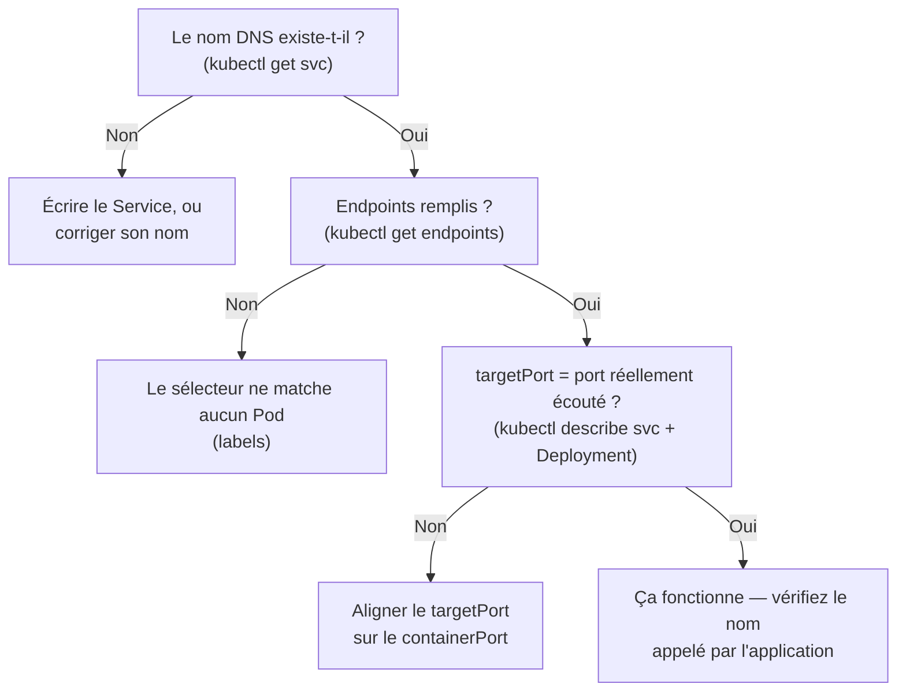
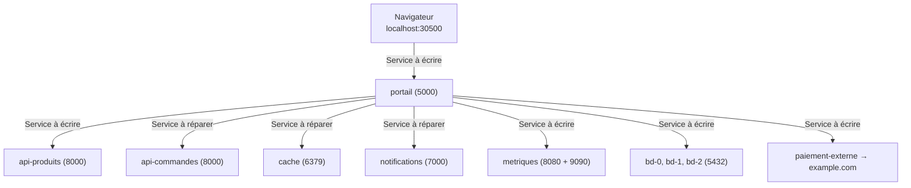

<a id="top"></a>

# Mission : rétablir les communications du cluster

> **Projet 12 — Les Services Kubernetes** · Niveau **intermédiaire → avancé** · Durée estimée : **3 à 5 h**
>
> Tout le code applicatif vous est **fourni en annexe de ce document**. Votre travail : **écrire, déterminer et compléter les Services** qui manquent — c'est-à-dire faire communiquer un système qui, en l'état, est **totalement muet**.

---

## Table des matières

- [Le contexte](#le-contexte)
- [Concepts essentiels avant de commencer](#concepts-essentiels-avant-de-commencer)
- [L'architecture à mettre en service](#larchitecture-a-mettre-en-service)
- [Disposition des fichiers](#disposition-des-fichiers)
- [Le tableau de bord : votre indicateur de progression](#le-tableau-de-bord--votre-indicateur-de-progression)
- [Les règles du jeu](#les-regles-du-jeu)
- [Préparation](#preparation)
- [Les missions](#les-missions)
- [Validation automatique](#validation-automatique)
- [Livrables](#livrables)
- [Questions de réflexion](#questions-de-reflexion)
- [Barème](#bareme)
- [Critères de réussite](#criteres-de-reussite)
- [Boîte à outils](#boite-a-outils)
- [ANNEXE A — Les applications](#annexe-a--les-applications)
- [ANNEXE B — Les manifestes fournis](#annexe-b--les-manifestes-fournis)
- [ANNEXE C — Les squelettes de Services à compléter](#annexe-c--les-squelettes-de-services-a-completer)
- [ANNEXE D — Les trois Services défectueux](#annexe-d--les-trois-services-defectueux)
- [ANNEXE E — Le script de validation](#annexe-e--le-script-de-validation)

---

## Le contexte

Une équipe a déployé une petite plateforme de commerce en ligne sur Kubernetes. Les images sont construites, les **Deployments** et le **StatefulSet** tournent, tous les Pods sont `Running`.

**Et pourtant, rien ne fonctionne.**

Le portail affiche un tableau de bord entièrement **rouge** : il ne joint aucun composant. La base de données est injoignable. Le cache est invisible. Aucune page n'est accessible depuis le navigateur.

La raison est simple : **la personne qui devait écrire les Services est partie sans les livrer.**



> **Rappel fondamental que ce projet va vous faire vivre :** des Pods qui tournent ne constituent **pas** une application. Sans Services, ce sont des îlots isolés, sans adresse stable ni nom, incapables de se trouver les uns les autres.

**Votre mission :** rétablir toutes les communications, **uniquement** en écrivant les bons Services.

---

## Concepts essentiels avant de commencer

> Cette section est un **mini-manuel autosuffisant** : elle contient tout le vocabulaire nécessaire aux missions. Lisez-la une fois, revenez-y quand un mot vous échappe.

### 1. Le problème que résout un Service

Un **Pod** est mortel : Kubernetes peut le supprimer, le déplacer, le recréer — et sa **nouvelle IP sera différente**. On ne se connecte donc jamais à un Pod par son IP.

Un **Service** est un objet stable — nom, IP, port — qui **suit** les Pods où qu'ils aillent. Le mécanisme est simple :



Ce qui fait le lien entre un Service et « ses » Pods, c'est le **sélecteur de labels** :

```yaml
spec:
  selector:
    app: api-produits          # tout Pod portant CE label est atteint
```

La liste des Pods qui correspondent forme l'objet **Endpoints** — c'est votre **radiographie** du Service.

```powershell
kubectl get endpoints api-produits
# api-produits   10.244.0.3:8000,10.244.0.4:8000,10.244.0.5:8000
```

Si `Endpoints` est **vide**, le sélecteur ne correspond à **aucun Pod** : c'est presque toujours une faute de frappe dans un label.

---

### 2. Les cinq types de Services (les seuls dont vous avez besoin)

| Type | À quoi ça sert | Vu de l'extérieur ? | Dans ce projet |
|---|---|---|---|
| **ClusterIP** | Adresse **interne** au cluster, valeur par défaut | Non | api-produits, api-commandes, cache, notifications, metriques |
| **NodePort** | Ouvre un port fixe (30000–32767) sur **chaque nœud** | Oui, `localhost:<nodePort>` | portail |
| **LoadBalancer** | Demande une IP publique au cloud (AWS, GCP, Azure) | Oui | (mission bonus) |
| **Headless** | Un ClusterIP **sans** IP virtuelle : renvoie **la liste** des IP des Pods, plus un **nom DNS par Pod** | Non | bd-interne |
| **ExternalName** | **Alias DNS** vers un nom externe. Aucun Pod, aucun sélecteur. | Non | paiement-externe |

**Point important :** un Service qui « ne fonctionne pas » n'est presque jamais un problème de type. C'est presque toujours **sélecteur** ou **port**.

---

### 3. DNS interne : les règles qui donnent l'illusion de magie

Dans le cluster, **CoreDNS** fabrique automatiquement des noms selon des règles fixes :

| Vous appelez | CoreDNS résout vers |
|---|---|
| `api-produits` | le Service `api-produits` du **même namespace** |
| `api-produits.default` | le Service `api-produits` du namespace `default` |
| `api-produits.default.svc.cluster.local` | forme longue et pleinement qualifiée |

**Corollaire capital** : le **nom du Service** est le nom que l'application appelle. Un Service nommé `notification` ne répond **pas** à `http://notifications`. Ce piège est au cœur de la mission 6.

---

### 4. StatefulSet et Service headless : le tandem

Un **Deployment** traite ses répliques comme des jumelles interchangeables (`web-abc123-x7k9`, `web-abc123-p2m1`…). Parfait pour du web sans état.

Un **StatefulSet** produit au contraire des Pods **numérotés et stables** : `bd-0`, `bd-1`, `bd-2`. Chaque Pod garde son **identité** à travers les redémarrages — indispensable pour une base de données où l'on doit désigner **précisément la primaire**.

Mais un StatefulSet **ne suffit pas seul** : il exige d'être **associé à un Service headless** dont il indique le nom dans son champ `serviceName`.

```yaml
kind: StatefulSet
spec:
  serviceName: bd-interne         # <-- pointe vers un Service headless du même nom
  replicas: 3
```

Ce Service headless donne alors **un nom DNS par Pod** :

```
bd-0.bd-interne         -> IP du Pod bd-0 UNIQUEMENT
bd-1.bd-interne         -> IP du Pod bd-1 UNIQUEMENT
bd-interne              -> IPs des trois Pods (liste)
```

Sans le mot `None` dans `spec.clusterIP`, aucun de ces noms n'existe.

```yaml
spec:
  clusterIP: None                  # transforme le Service en "headless"
```

**Retenez ceci :** pour joindre `bd-0.bd-interne`, il faut deux conditions **simultanées** — un StatefulSet dont `serviceName: bd-interne`, et un Service **headless** nommé `bd-interne`. Si l'une manque, le nom individuel **n'existe pas**.

---

### 5. Ports nommés et Services multi-ports

Quand un Service expose **plusieurs ports**, chaque entrée devient obligatoirement **nommée** :

```yaml
ports:
  - name: web
    port: 80
    targetPort: 8080
  - name: prom
    port: 9090
    targetPort: 9090
```

Le nom sert au moins à deux choses :
1. **Kubernetes le refuse sans nom** dès qu'il y a plusieurs entrées ;
2. Il permet de référencer un port du conteneur **par son nom** plutôt que par son numéro :

```yaml
ports:
  - name: web
    port: 80
    targetPort: web              # renvoie au containerPort nommé "web"
```

Avantage concret : si demain le conteneur passe de 8080 à 8081, on modifie **un seul** endroit (le Pod). Le Service reste juste.

---

### 6. ExternalName : un alias DNS, rien de plus

Le type `ExternalName` **ne route rien**. Il demande simplement à CoreDNS de répondre :

> « Le nom `paiement-externe`, c'est **example.com**. »

Un `ExternalName` **n'a jamais** de sélecteur, de Pods ou de ports. Ce n'est **pas** un proxy : c'est un alias.

```yaml
apiVersion: v1
kind: Service
metadata:
  name: paiement-externe
spec:
  type: ExternalName
  externalName: example.com
```

Utilité : votre code garde le même nom interne (`paiement-externe`) qu'il s'agisse d'un service dans le cluster, d'un service SaaS externe, ou d'un déménagement d'API. On change **le Service**, pas **le code**.

---

### 7. Les trois questions qui débloquent 90 % des pannes

Chaque fois qu'un Service ne fonctionne pas, posez ces trois questions **dans cet ordre** :



C'est exactement la méthode de la mission 6.

---

### Ce que vous saurez faire à la fin

- Distinguer les cinq types de Services **et savoir quand utiliser chacun**.
- Utiliser `kubectl get svc`, `kubectl describe svc`, `kubectl get endpoints` comme trois outils **complémentaires**.
- Coupler correctement un **StatefulSet** avec un **Service headless**.
- Écrire un Service **multi-port** propre, avec `targetPort` référencé par nom.
- Diagnostiquer les trois pannes les plus fréquentes en entreprise (label erroné, port erroné, nom erroné).

---

## L'architecture à mettre en service

Sept composants tournent déjà. Aucun n'est joignable.



| Composant | Port(s) du conteneur | Label des Pods | Contrôleur |
|---|---|---|---|
| `portail` | 5000 | `app: portail` | Deployment (1 réplique) |
| `api-produits` | 8000 | `app: api-produits` | Deployment (3 répliques) |
| `api-commandes` | 8000 | `app: api-commandes` | Deployment (2 répliques) |
| `cache` | 6379 | `app: cache` | Deployment (1 réplique) |
| `notifications` | 7000 | `app: notifications` | Deployment (2 répliques) |
| `metriques` | 8080 (nommé `web`) et 9090 (nommé `prom`) | `app: metriques` | Deployment (2 répliques) |
| `bd` | 5432 | `app: bd` | StatefulSet (3 répliques) |

---

## Disposition des fichiers

**Créez exactement cette arborescence**, en recopiant le contenu des annexes. Chaque annexe indique le **chemin exact** du fichier à créer.

```
projet12-mission-services/
├── 00-ENONCE.md                      <- ce document
│
├── apps/                             <- LE CODE (ANNEXE A) — NE PAS MODIFIER
│   ├── micro/
│   │   ├── app.py
│   │   ├── requirements.txt
│   │   └── Dockerfile
│   ├── metriques/
│   │   ├── app.py
│   │   ├── requirements.txt
│   │   └── Dockerfile
│   └── portail/
│       ├── app.py
│       ├── requirements.txt
│       └── Dockerfile
│
├── k8s/
│   ├── 01-deployments.yaml           <- FOURNI (ANNEXE B) — NE PAS MODIFIER
│   ├── 02-statefulset-bd.yaml        <- FOURNI (ANNEXE B) — NE PAS MODIFIER
│   │
│   └── services/                     <- À VOUS DE JOUER
│       ├── 01-api-produits.yaml      <- squelette à compléter (ANNEXE C)
│       ├── 02-portail.yaml           <- squelette à compléter (ANNEXE C)
│       ├── 03-bd-interne.yaml        <- squelette à compléter (ANNEXE C)
│       ├── 04-metriques.yaml         <- squelette à compléter (ANNEXE C)
│       ├── 05-paiement-externe.yaml  <- squelette à compléter (ANNEXE C)
│       │
│       └── 06-casses/                <- FOURNIS mais DÉFECTUEUX (ANNEXE D)
│           ├── casse-1.yaml
│           ├── casse-2.yaml
│           └── casse-3.yaml
│
├── outils/
│   └── valider.ps1                   <- FOURNI (ANNEXE E)
│
└── RAPPORT.md                        <- À RÉDIGER par vous
```

**Trois images seulement** sont nécessaires : `micro:1.0` sert à cinq composants différents (le comportement change par **variables d'environnement**), `metriques:1.0` expose deux ports, et `portail:1.0` affiche le tableau de bord.

---

## Le tableau de bord : votre indicateur de progression

Le portail interroge en continu chaque composant et affiche une **tuile par liaison**, rafraîchie toutes les 3 secondes :

| Tuile | Signification | Où chercher l'erreur |
|---|---|---|
| **ROUGE** | Le nom DNS n'existe pas | Le Service **n'a pas été créé**, ou son **nom** est erroné |
| **ORANGE** | Le nom est résolu, mais personne ne répond | Le Service existe, mais son **sélecteur** ou son **port** est erroné |
| **VERT** | Communication établie | **Votre Service est correct** |

**Objectif final : les 8 tuiles au vert**, et le compteur qui affiche `8 / 8`.

> Cette distinction rouge/orange n'est pas décorative : elle vous dit **de quel côté chercher**. Rouge = le Service n'existe pas (rien à déboguer, il faut l'écrire). Orange = le Service existe mais **ne trouve pas ses Pods** ou **tape sur le mauvais port**.

Les 8 liaisons vérifiées :

| # | Tuile | Ce que le portail teste |
|---|---|---|
| 1 | Accès externe | Que vous consultez bien le portail via le port **30500** |
| 2 | API Produits | `http://api-produits/ping` |
| 3 | Base de données | `http://bd-0.bd-interne:5432/ping` |
| 4 | Métriques | `http://metriques/ping` **et** `http://metriques:9090/metrics` |
| 5 | Paiement externe | Résolution DNS du nom `paiement-externe` |
| 6 | API Commandes | `http://api-commandes/ping` |
| 7 | Cache | `http://cache/ping` |
| 8 | Notifications | `http://notifications/ping` |

---

## Les règles du jeu

1. **Interdiction absolue de modifier** le dossier `apps/`, ainsi que `01-deployments.yaml` et `02-statefulset-bd.yaml`.
   *(Toute la difficulté consiste à s'adapter à l'existant : c'est exactement la situation d'un vrai poste de travail.)*
2. Vous ne créez et ne modifiez **que** des fichiers situés dans `k8s/services/`.
3. **Aucune adresse IP en dur.** Tout doit reposer sur les **noms DNS** et les **sélecteurs de labels**.
4. Vous devez **déterminer vous-même le type** de chaque Service : rien ne vous dit s'il s'agit d'un `ClusterIP`, d'un `NodePort`, d'un `LoadBalancer`, d'un service **headless** ou d'un `ExternalName`. C'est **le cœur de l'évaluation**.
5. Les **noms** des Services sont **imposés** : le code applicatif les appelle tels quels. Un nom erroné donne une tuile rouge.
6. Vous travaillez sur le **Kubernetes intégré à Docker Desktop** (Settings → Kubernetes → Enable Kubernetes).

---

## Préparation

### Prérequis — à vérifier une seule fois

1. **Docker Desktop est démarré** (icône verte dans la barre système).
2. **Kubernetes est activé dans Docker Desktop** : *Settings → Kubernetes → Enable Kubernetes → Apply & Restart*. Sans cette case cochée, aucune commande `kubectl` ne fonctionnera.
3. **Docker Desktop dispose d'au moins 4 Go de RAM** : *Settings → Resources → Memory ≥ 4 GB*. Ce projet lance 14 Pods ; sur 2 Go la machine s'étouffe et des Pods restent en `Pending`.
4. **Vous avez Internet** (pour la mission 5 et pour télécharger l'image `busybox`).

### Séquence de mise en route

```powershell
# 0) Se placer sur le bon cluster (indispensable si minikube ou kind a déjà servi)
kubectl config use-context docker-desktop
kubectl get nodes                       # doit afficher docker-desktop   Ready

# 1) Construire les trois images
docker build -t micro:1.0      ./apps/micro
docker build -t metriques:1.0  ./apps/metriques
docker build -t portail:1.0    ./apps/portail

# 2) Déployer la base fournie (des Pods, et AUCUN Service)
kubectl apply -f k8s/01-deployments.yaml
kubectl apply -f k8s/02-statefulset-bd.yaml

# 3) Attendre que TOUS les Pods soient Ready (environ 30 s)
kubectl wait --for=condition=ready pod --all --timeout=180s

# 4) Constater la situation de départ
kubectl get pods                        # 14 Pods, tous Running
kubectl get svc                         # seulement "kubernetes" : aucun de vos Services
```

À ce stade : **tous les Pods tournent** et **rien ne communique**. C'est le point de départ normal.

> **Deux avertissements techniques à connaître dès maintenant — ce n'est pas une erreur de votre part** :
>
> 1. **Warning `Endpoints is deprecated in v1.33+`** — Kubernetes affiche systématiquement ce message à chaque `kubectl get endpoints`. La commande fonctionne toujours parfaitement, ignorez le warning. La nouvelle API équivalente est `kubectl get endpointslices`, mais toutes les commandes de ce TP utilisent volontairement `endpoints`, plus lisible pour apprendre.
>
> 2. **Le tableau de bord peut mettre 10 à 15 secondes à s'afficher la première fois** : le portail teste **8 liaisons réseau** à chaque affichage, chacune avec un délai d'attente de 1,5 s. Quand rien ne fonctionne encore, il attend chaque délai avant d'afficher rouge ou orange. Une fois les Services corrects, le temps de réponse retombe à quelques centaines de millisecondes.

> **Question à vous poser immédiatement :** comment allez-vous seulement *voir* le tableau de bord, puisqu'aucune porte d'entrée n'existe encore ?
>
> **Bouée de secours :** `kubectl port-forward` fonctionne **sans aucun Service**, directement sur un Pod.
> ```powershell
> kubectl port-forward deploy/portail 5000:5000
> ```
> Puis ouvrez `http://localhost:5000`. Vous verrez le tableau de bord **tout rouge**, avec la tuile « Accès externe » en orange (normal : vous n'êtes pas passé par le port 30500).

---

## Les missions

### Mission 1 — Faire parler le portail à l'API produits *(15 points)*

Le portail appelle `http://api-produits` sur le port **80**. Les Pods de l'API écoutent sur le port **8000** et portent le label `app: api-produits`.

**Fichier à compléter :** `k8s/services/01-api-produits.yaml`

**À déterminer :** le **type** de Service, le **sélecteur**, ainsi que `port` et `targetPort`.

**Validation :**
```powershell
kubectl apply -f k8s/services/01-api-produits.yaml
kubectl get svc api-produits
kubectl get endpoints api-produits        # doit lister 3 adresses IP
```
La tuile **API Produits** passe au vert.

---

### Mission 2 — Ouvrir la porte d'entrée *(15 points)*

Le tableau de bord doit être accessible **depuis votre navigateur** à l'adresse exacte **`http://localhost:30500`**. Les Pods du portail écoutent sur le port **5000**.

**Fichier à compléter :** `k8s/services/02-portail.yaml`

**À déterminer :** quel type de Service expose une application **à l'extérieur du cluster** sur un port fixe de la machine ? Quelle est la **plage de ports autorisée** pour ce champ ?

**Validation :**
```powershell
kubectl get svc portail                   # PORT(S) doit afficher 80:30500/TCP
start http://localhost:30500
```
La tuile **Accès externe** passe au vert.

> **Question à traiter dans le rapport :** un autre type de Service aurait lui aussi rendu le portail accessible depuis le navigateur sur Docker Desktop. Lequel ? Et quelle différence cela ferait-il **en production dans le cloud** ?

---

### Mission 3 — Donner une identité à chaque base de données *(20 points)*

Le StatefulSet `bd` fournit **3 répliques**. Le portail doit joindre **précisément la première** (la primaire), à l'adresse :

```
bd-0.bd-interne
```

Les Pods de la base portent le label `app: bd` et écoutent sur le port **5432**.

**Fichier à compléter :** `k8s/services/03-bd-interne.yaml`

**À déterminer :** quel type de Service donne un **nom DNS individuel à chaque Pod**, au lieu d'une unique IP virtuelle ? Quel **champ** faut-il écrire, et avec quelle **valeur particulière** ?

**Validation :**
```powershell
# 1) Depuis un Pod utilitaire, joindre directement bd-0 :
kubectl run test --rm -i --restart=Never --image=busybox:1.36 -- wget -qO- http://bd-0.bd-interne:5432/ping
# doit repondre : {"pod":"bd-0","port":5432,"service":"base-de-donnees"}

# 2) Verifier les entrees DNS avec le nom pleinement qualifie
#    (busybox nslookup n'applique PAS les search domains, il faut donner le FQDN) :
kubectl run test --rm -i --restart=Never --image=busybox:1.36 -- nslookup bd-0.bd-interne.default.svc.cluster.local
# doit renvoyer UNE seule adresse (celle du Pod bd-0)

kubectl run test --rm -i --restart=Never --image=busybox:1.36 -- nslookup bd-interne.default.svc.cluster.local
# doit renvoyer TROIS adresses (une par Pod du StatefulSet)
```

> **Piège à ne pas manquer :** examinez le champ `serviceName` du StatefulSet fourni. Le **nom** de votre Service **doit** lui correspondre exactement, sinon les noms individuels des Pods ne seront **jamais** créés.
>
> **Piège technique (busybox) :** `nslookup nom-court` ne fonctionne pas depuis un Pod busybox car son résolveur n'utilise pas les *search domains* de `/etc/resolv.conf`. Depuis un vrai Pod applicatif (comme `portail`), en revanche, `bd-0.bd-interne` **résout parfaitement**. Utilisez donc `wget` pour tester la vraie chaîne applicative, et le FQDN pour lever toute ambiguïté DNS.

---

### Mission 4 — Exposer deux ports sur un même Service *(15 points)*

Le composant `metriques` écoute sur **deux** ports :

| Usage | Port du conteneur | Nom du port déclaré dans le Deployment |
|---|---|---|
| Interface web | 8080 | `web` |
| Métriques | 9090 | `prom` |

Le portail appelle `http://metriques` (port **80**) **et** `http://metriques:9090/metrics`.

**Fichier à compléter :** `k8s/services/04-metriques.yaml`

**À déterminer :** comment déclarer **plusieurs ports** sur un Service ? Quelle contrainte devient alors **obligatoire** pour chaque entrée ? Et comment faire pointer `targetPort` vers un port du conteneur **par son nom** plutôt que par son numéro, afin que le Service reste valide même si le numéro change ?

**Validation :**
```powershell
kubectl describe svc metriques            # les DEUX ports doivent apparaître
```

---

### Mission 5 — Donner un nom interne à un service externe *(10 points)*

Le portail doit joindre un service de paiement **hébergé à l'extérieur du cluster**, mais le code appelle un nom **interne** : `paiement-externe`. Ce nom doit renvoyer vers **`example.com`**.

**Fichier à compléter :** `k8s/services/05-paiement-externe.yaml`

**À déterminer :** quel type de Service crée un simple **alias DNS** vers un nom externe, **sans sélecteur et sans aucun Pod** ?

**Validation :**
```powershell
kubectl run test --rm -i --restart=Never --image=busybox:1.36 -- nslookup paiement-externe.default.svc.cluster.local
# doit afficher :
#   paiement-externe.default.svc.cluster.local  canonical name = example.com
#   Name: example.com
#   Address: <IP publique>
```

> Cette mission nécessite que le cluster puisse résoudre les noms publics. Si vous n'avez **aucun accès Internet**, remplacez la cible par `api-produits.default.svc.cluster.local` et signalez-le dans votre rapport.

---

### Mission 6 — L'enquête : réparer trois Services défectueux *(20 points)*

Le dossier `k8s/services/06-casses/` contient **trois Services déjà écrits**… qui **ne fonctionnent pas**. Chacun comporte **une seule erreur**, et ce sont les trois fautes les plus fréquentes en entreprise.

```powershell
kubectl apply -f k8s/services/06-casses/
```

| Fichier | Symptôme observé |
|---|---|
| `casse-1.yaml` | Le Service existe, mais `kubectl get endpoints` renvoie `<none>` |
| `casse-2.yaml` | Les Endpoints sont bien remplis, mais toute connexion est **refusée** |
| `casse-3.yaml` | Le Service semble parfait, mais le portail ne le joint **jamais** |

**Pour chacun des trois cas, votre rapport doit contenir :**

1. la **commande de diagnostic** qui vous a mis sur la piste ;
2. la **cause exacte** de la panne ;
3. le **correctif** appliqué ;
4. la **preuve** que la liaison fonctionne (tuile verte + sortie de commande).

> **Méthode conseillée :** procédez comme un enquêteur. `kubectl describe svc`, `kubectl get endpoints`, `kubectl get pods --show-labels`, puis comparez **ligne à ligne** le Service et les Pods. La différence entre « Endpoints vides » et « connexion refusée » vous indique **déjà** de quel côté chercher.

---

### Mission 7 — Bonus : le grand écart *(5 points)*

Au choix, **un seul** suffit :

- **a)** Faire en sorte qu'un même client soit **toujours servi par le même Pod** de l'API produits. *(Indice : un champ du Service permet une « adhérence » fondée sur l'IP du client.)*
- **b)** Créer un Service **sans sélecteur** pointant vers une adresse IP externe fixe, en écrivant **vous-même** ses Endpoints.
- **c)** Écrire un Service de type `LoadBalancer` pour le portail, puis **expliquer** ce que devient `EXTERNAL-IP` sur Docker Desktop, et ce qu'il deviendrait sur AWS.

---

## Validation automatique

Un script vous donne votre score **à tout moment** :

```powershell
.\outils\valider.ps1
```

> **Si PowerShell refuse d'exécuter le script** avec un message du type `l'exécution de scripts est désactivée sur ce système`, contournez la restriction pour cette seule commande :
>
> ```powershell
> powershell -ExecutionPolicy Bypass -File .\outils\valider.ps1
> ```
>
> Autre solution durable (à ne faire qu'une fois pour votre utilisateur) :
> ```powershell
> Set-ExecutionPolicy -Scope CurrentUser -ExecutionPolicy RemoteSigned
> ```

```
[OK]     Mission 1 - api-produits ............. 15/15
[OK]     Mission 2 - portail .................. 15/15
[ECHEC]  Mission 3 - bd-interne ...............  0/20   -> clusterIP doit valoir None
[OK]     Mission 4 - metriques ................ 15/15
[ECHEC]  Mission 5 - paiement-externe .........  0/10   -> Service introuvable
[ECHEC]  Mission 6 - reparations ..............  7/20   -> cache : aucun Pod ne repond

SCORE : 52 / 100
```

Le script **ne donne aucune solution** : il indique seulement ce qui échoue et **où regarder**.

---

## Livrables

1. Le dossier **`k8s/services/`** complet : vos 5 Services écrits et les 3 Services réparés.
2. Un **`RAPPORT.md`** contenant :
   - pour **chaque** Service : le **type choisi** et une **justification en deux phrases** (« pourquoi celui-ci et pas un autre ») ;
   - l'**enquête complète** de la mission 6 (commande → cause → correctif → preuve) ;
   - une **capture** du tableau de bord affichant **8 / 8** ;
   - une **capture** de `kubectl get svc` montrant tous vos Services et leurs types ;
   - vos réponses aux **questions de réflexion**.
3. La sortie finale de `.\outils\valider.ps1`.

---

## Questions de réflexion

1. Pourquoi l'application ne pouvait-elle **absolument pas** fonctionner sans Services, alors que **tous** les Pods étaient `Running` ?
2. Quelle est la différence concrète entre une tuile **rouge** et une tuile **orange** ? Que vous apprend chacune sur l'endroit où se trouve l'erreur ?
3. Pourquoi le Service de la base de données doit-il être **headless**, alors qu'un Service ordinaire suffit pour l'API produits ?
4. Que contient exactement la liste des **Endpoints**, et **qui** la met à jour ? Que se passe-t-il lorsqu'un Pod devient `NotReady` ?
5. Vous supprimez un Pod de l'API produits ; Kubernetes en recrée un avec une **adresse IP différente**. Pourquoi le portail continue-t-il de fonctionner **sans la moindre modification** ?
6. En production, exposeriez-vous dix applications avec dix Services de type `LoadBalancer` ? Justifiez, et proposez une alternative.

---

## Barème

| Élément | Points |
|---|---|
| Mission 1 — Service interne et découverte DNS | 15 |
| Mission 2 — Exposition externe sur le port 30500 | 15 |
| Mission 3 — Service headless et identités stables | 20 |
| Mission 4 — Multi-port et ports nommés | 15 |
| Mission 5 — Alias vers un service externe | 10 |
| Mission 6 — Diagnostic et réparation (3 pannes) | 20 |
| Qualité du rapport et justification des choix | 5 |
| **Bonus** — Mission 7 | **+5** |
| **Total** | **100 (+5)** |

**Pénalités :** −10 par modification d'un fichier interdit (`apps/`, `01-deployments.yaml`, `02-statefulset-bd.yaml`) ; −5 par adresse IP codée en dur.

---

## Critères de réussite

| Critère | Attendu |
|---|---|
| Tableau de bord | **8 / 8** tuiles vertes |
| Types de Services | Chacun **adapté** à son usage et **justifié** |
| DNS individuel | `bd-0.bd-interne` résolu vers **un seul** Pod |
| Multi-port | Les deux ports visibles, `targetPort` référencé **par nom** |
| Enquête | Les 3 pannes **identifiées, expliquées et corrigées** |
| Résilience | Après suppression d'un Pod, le portail **continue** de fonctionner |
| Aucune IP en dur | Uniquement des **noms DNS** et des **sélecteurs de labels** |

---

## Boîte à outils

Aucune solution ici — seulement des pistes.

```powershell
kubectl get svc                              # types, IP, ports
kubectl describe svc <nom>                   # détails + Endpoints
kubectl get endpoints <nom>                  # QUI se trouve derrière le Service ?
kubectl get pods --show-labels               # les labels réels des Pods
kubectl get pods -l app=<valeur>             # tester un sélecteur
kubectl port-forward deploy/portail 5000:5000    # accéder à un Pod SANS Service
kubectl run test --rm -i --restart=Never --image=busybox:1.36 -- wget -qO- http://<nom>/ping
kubectl run test --rm -i --restart=Never --image=busybox:1.36 -- nslookup <nom>.default.svc.cluster.local
kubectl logs -l app=portail --tail=30        # ce que le portail n'arrive pas à joindre
kubectl delete svc <nom>                     # repartir de zéro sur un Service
```

> **Piège à connaître avec `kubectl run test` :** si vous enchaînez plusieurs commandes rapidement, le Pod précédent n'est pas toujours supprimé à temps et vous obtiendrez :
> ```
> Error from server (AlreadyExists): pods "test" already exists
> ```
> **Deux solutions :** changer le nom (`test1`, `test2`…) à chaque commande, ou nettoyer avant :
> ```powershell
> kubectl delete pod test --ignore-not-found; kubectl run test --rm -i --restart=Never ...
> ```

**Les trois questions qui débloquent 90 % des situations :**

1. Le Service **existe-t-il**, avec le **bon nom** ? *(sinon → tuile rouge : il n'y a rien à déboguer, il faut l'écrire)*
2. Les **Endpoints** sont-ils remplis ? *(vides → le **sélecteur** ne correspond à aucun label de Pod)*
3. Le **`targetPort`** correspond-il au port **réellement écouté** par le conteneur ? *(sinon → connexion refusée)*

---
---

# ANNEXE A — Les applications

> **Ne modifiez aucun de ces fichiers.** Recopiez-les tels quels aux chemins indiqués.

## A.1 — Le micro-service générique

Cette **unique** application sert à cinq composants (`api-produits`, `api-commandes`, `cache`, `notifications`, `bd`). Son nom et son port sont fixés par des **variables d'environnement**.

### Fichier : `apps/micro/app.py`

```python
"""Micro-service generique de demonstration.

La meme image sert a plusieurs composants : le nom et le port d'ecoute sont
fournis par des variables d'environnement (APP_NAME, PORT).
Chaque reponse contient le nom du Pod, ce qui rend visible la repartition
de charge realisee par un Service.
"""

import os
import socket

from flask import Flask, jsonify

app = Flask(__name__)

NOM = os.environ.get("APP_NAME", "micro")
PORT = int(os.environ.get("PORT", "8000"))


@app.route("/")
@app.route("/ping")
def ping():
    return jsonify(service=NOM, pod=socket.gethostname(), port=PORT)


@app.route("/health")
def health():
    return "OK", 200


if __name__ == "__main__":
    app.run(host="0.0.0.0", port=PORT)
```

### Fichier : `apps/micro/requirements.txt`

```text
flask==3.0.3
```

### Fichier : `apps/micro/Dockerfile`

```dockerfile
FROM python:3.12-slim
WORKDIR /app
COPY requirements.txt .
RUN pip install --no-cache-dir -r requirements.txt
COPY app.py .
CMD ["python", "app.py"]
```

---

## A.2 — Le composant « metriques » (deux ports)

Cette application écoute **simultanément** sur deux ports : `8080` (interface web) et `9090` (métriques). C'est elle qui rend la mission 4 possible.

### Fichier : `apps/metriques/app.py`

```python
"""Composant exposant DEUX ports simultanement.

  - 8080 : interface web         (route /ping)
  - 9090 : metriques Prometheus  (route /metrics)

Deux serveurs Flask tournent dans deux fils d'execution distincts.
"""

import socket
import threading

from flask import Flask, jsonify

web = Flask("web")
prom = Flask("prom")


@web.route("/")
@web.route("/ping")
def ping():
    return jsonify(service="metriques", pod=socket.gethostname(), port=8080)


@web.route("/health")
def health_web():
    return "OK", 200


@prom.route("/metrics")
def metrics():
    pod = socket.gethostname()
    corps = (
        "# HELP demo_requetes_total Nombre total de requetes\n"
        "# TYPE demo_requetes_total counter\n"
        'demo_requetes_total{pod="%s"} 42\n' % pod
    )
    return corps, 200, {"Content-Type": "text/plain; charset=utf-8"}


@prom.route("/health")
def health_prom():
    return "OK", 200


def demarrer(application, port):
    application.run(host="0.0.0.0", port=port)


if __name__ == "__main__":
    threading.Thread(target=demarrer, args=(prom, 9090), daemon=True).start()
    demarrer(web, 8080)
```

### Fichier : `apps/metriques/requirements.txt`

```text
flask==3.0.3
```

### Fichier : `apps/metriques/Dockerfile`

```dockerfile
FROM python:3.12-slim
WORKDIR /app
COPY requirements.txt .
RUN pip install --no-cache-dir -r requirements.txt
COPY app.py .
CMD ["python", "app.py"]
```

---

## A.3 — Le portail (tableau de bord)

C'est lui qui affiche les **8 tuiles** et votre score en direct.

### Fichier : `apps/portail/app.py`

```python
"""Tableau de bord des liaisons du cluster.

Pour chaque liaison, le portail distingue TROIS situations :
  - ROUGE  : le nom DNS n'existe pas       -> le Service n'a pas ete cree
  - ORANGE : le nom resout, aucune reponse -> selecteur ou port errone
  - VERT   : la communication fonctionne   -> le Service est correct
"""

import socket
import urllib.error
import urllib.parse
import urllib.request

from flask import Flask, request

app = Flask(__name__)

DELAI = 1.5          # secondes
PORT_ATTENDU = 30500  # port par lequel le portail doit etre consulte

CIBLES = [
    {"cle": "externe", "titre": "Acces externe", "mode": "externe",
     "aide": "Le portail doit etre consulte via http://localhost:30500"},
    {"cle": "produits", "titre": "API Produits", "mode": "http",
     "url": "http://api-produits/ping"},
    {"cle": "bd", "titre": "Base de donnees (bd-0)", "mode": "http",
     "url": "http://bd-0.bd-interne:5432/ping"},
    {"cle": "metriques", "titre": "Metriques (2 ports)", "mode": "http2",
     "url": "http://metriques/ping", "url2": "http://metriques:9090/metrics"},
    {"cle": "paiement", "titre": "Paiement externe", "mode": "dns",
     "hote": "paiement-externe"},
    {"cle": "commandes", "titre": "API Commandes", "mode": "http",
     "url": "http://api-commandes/ping"},
    {"cle": "cache", "titre": "Cache", "mode": "http",
     "url": "http://cache/ping"},
    {"cle": "notifications", "titre": "Notifications", "mode": "http",
     "url": "http://notifications/ping"},
]


def resout(hote):
    try:
        socket.getaddrinfo(hote, None)
        return True
    except socket.gaierror:
        return False


def tester_http(url):
    hote = urllib.parse.urlparse(url).hostname
    if not resout(hote):
        return "rouge", "nom DNS introuvable : le Service n'existe pas"
    try:
        with urllib.request.urlopen(url, timeout=DELAI) as reponse:
            corps = reponse.read(160).decode("utf-8", "ignore")
        return "vert", corps.strip()
    except urllib.error.HTTPError as err:
        return "orange", "reponse HTTP %s" % err.code
    except Exception as err:
        return "orange", "nom resolu mais aucune reponse (%s)" % type(err).__name__


def evaluer(cible):
    mode = cible["mode"]

    if mode == "externe":
        port = (request.host.split(":") + ["80"])[1]
        if str(port) == str(PORT_ATTENDU):
            return "vert", "consulte via le port %s" % PORT_ATTENDU
        return "orange", "consulte via le port %s : ecrivez le Service du portail" % port

    if mode == "dns":
        if resout(cible["hote"]):
            return "vert", "le nom %s est resolu" % cible["hote"]
        return "rouge", "le nom %s n'est pas resolu" % cible["hote"]

    if mode == "http2":
        etat1, det1 = tester_http(cible["url"])
        etat2, det2 = tester_http(cible["url2"])
        if etat1 == "vert" and etat2 == "vert":
            return "vert", "les deux ports repondent"
        if etat1 == "rouge" or etat2 == "rouge":
            return "rouge", "port 80 : %s | port 9090 : %s" % (det1, det2)
        return "orange", "port 80 : %s | port 9090 : %s" % (det1, det2)

    return tester_http(cible["url"])


COULEURS = {"vert": "#16a34a", "orange": "#ea580c", "rouge": "#b91c1c"}


@app.route("/health")
def health():
    return "OK", 200


@app.route("/")
def accueil():
    resultats = []
    for cible in CIBLES:
        etat, detail = evaluer(cible)
        resultats.append((cible["titre"], etat, detail))

    score = sum(1 for _, etat, _ in resultats if etat == "vert")
    total = len(resultats)

    tuiles = ""
    for titre, etat, detail in resultats:
        tuiles += """
        <div class="tuile" style="border-left:10px solid {couleur}">
          <div class="t">{titre}</div>
          <div class="e" style="color:{couleur}">{etat}</div>
          <div class="d">{detail}</div>
        </div>""".format(couleur=COULEURS[etat], titre=titre,
                         etat=etat.upper(), detail=detail)

    couleur_score = "#16a34a" if score == total else "#ea580c"

    return """<!DOCTYPE html>
<html lang="fr">
<head>
  <meta charset="UTF-8">
  <meta http-equiv="refresh" content="3">
  <title>Mission : retablir les communications</title>
  <style>
    body {{ font-family: system-ui, sans-serif; background:#0f172a; color:#e2e8f0;
            margin:0; padding:32px; }}
    h1 {{ margin:0 0 4px; }}
    .sous {{ color:#94a3b8; margin-bottom:24px; }}
    .score {{ font-size:2.4rem; font-weight:800; color:{couleur_score}; margin-bottom:24px; }}
    .grille {{ display:grid; grid-template-columns:repeat(auto-fill,minmax(320px,1fr)); gap:16px; }}
    .tuile {{ background:#1e293b; border-radius:12px; padding:16px 20px;
              box-shadow:0 6px 20px rgba(0,0,0,.35); }}
    .t {{ font-weight:700; font-size:1.05rem; }}
    .e {{ font-weight:800; font-size:.8rem; letter-spacing:2px; margin:6px 0; }}
    .d {{ color:#94a3b8; font-size:.85rem; word-break:break-word; }}
    .pied {{ margin-top:28px; color:#64748b; font-size:.85rem; }}
  </style>
</head>
<body>
  <h1>Mission : retablir les communications du cluster</h1>
  <div class="sous">Servi par le pod <strong>{pod}</strong> &middot; rafraichissement automatique toutes les 3 s</div>
  <div class="score">{score} / {total}</div>
  <div class="grille">{tuiles}</div>
  <div class="pied">ROUGE : le Service n'existe pas &middot; ORANGE : selecteur ou port errone &middot; VERT : liaison etablie</div>
</body>
</html>""".format(pod=socket.gethostname(), score=score, total=total,
                  tuiles=tuiles, couleur_score=couleur_score)


if __name__ == "__main__":
    app.run(host="0.0.0.0", port=5000)
```

### Fichier : `apps/portail/requirements.txt`

```text
flask==3.0.3
```

### Fichier : `apps/portail/Dockerfile`

```dockerfile
FROM python:3.12-slim
WORKDIR /app
COPY requirements.txt .
RUN pip install --no-cache-dir -r requirements.txt
COPY app.py .
CMD ["python", "app.py"]
```

---
---

# ANNEXE B — Les manifestes fournis

> **Ne modifiez aucun de ces deux fichiers.** Ils constituent l'existant auquel vos Services doivent s'adapter.

## Fichier : `k8s/01-deployments.yaml`

```yaml
# ---------------------------------------------------------------------------
# LES PODS DE LA PLATEFORME — FOURNI, NE PAS MODIFIER
# Observez attentivement : les LABELS et les PORTS declares ici sont les seules
# informations dont vous disposez pour ecrire vos Services.
# ---------------------------------------------------------------------------
apiVersion: apps/v1
kind: Deployment
metadata:
  name: portail
spec:
  replicas: 1
  selector:
    matchLabels:
      app: portail
  template:
    metadata:
      labels:
        app: portail
    spec:
      containers:
        - name: portail
          image: portail:1.0
          imagePullPolicy: IfNotPresent
          ports:
            - containerPort: 5000
          readinessProbe:
            httpGet: { path: /health, port: 5000 }
            initialDelaySeconds: 3
            periodSeconds: 5
---
apiVersion: apps/v1
kind: Deployment
metadata:
  name: api-produits
spec:
  replicas: 3
  selector:
    matchLabels:
      app: api-produits
  template:
    metadata:
      labels:
        app: api-produits
    spec:
      containers:
        - name: micro
          image: micro:1.0
          imagePullPolicy: IfNotPresent
          env:
            - { name: APP_NAME, value: "api-produits" }
            - { name: PORT,     value: "8000" }
          ports:
            - containerPort: 8000
          readinessProbe:
            httpGet: { path: /health, port: 8000 }
            initialDelaySeconds: 3
            periodSeconds: 5
---
apiVersion: apps/v1
kind: Deployment
metadata:
  name: api-commandes
spec:
  replicas: 2
  selector:
    matchLabels:
      app: api-commandes
  template:
    metadata:
      labels:
        app: api-commandes
    spec:
      containers:
        - name: micro
          image: micro:1.0
          imagePullPolicy: IfNotPresent
          env:
            - { name: APP_NAME, value: "api-commandes" }
            - { name: PORT,     value: "8000" }
          ports:
            - containerPort: 8000
          readinessProbe:
            httpGet: { path: /health, port: 8000 }
            initialDelaySeconds: 3
            periodSeconds: 5
---
apiVersion: apps/v1
kind: Deployment
metadata:
  name: cache
spec:
  replicas: 1
  selector:
    matchLabels:
      app: cache
  template:
    metadata:
      labels:
        app: cache
    spec:
      containers:
        - name: micro
          image: micro:1.0
          imagePullPolicy: IfNotPresent
          env:
            - { name: APP_NAME, value: "cache" }
            - { name: PORT,     value: "6379" }
          ports:
            - containerPort: 6379
          readinessProbe:
            httpGet: { path: /health, port: 6379 }
            initialDelaySeconds: 3
            periodSeconds: 5
---
apiVersion: apps/v1
kind: Deployment
metadata:
  name: notifications
spec:
  replicas: 2
  selector:
    matchLabels:
      app: notifications
  template:
    metadata:
      labels:
        app: notifications
    spec:
      containers:
        - name: micro
          image: micro:1.0
          imagePullPolicy: IfNotPresent
          env:
            - { name: APP_NAME, value: "notifications" }
            - { name: PORT,     value: "7000" }
          ports:
            - containerPort: 7000
          readinessProbe:
            httpGet: { path: /health, port: 7000 }
            initialDelaySeconds: 3
            periodSeconds: 5
---
apiVersion: apps/v1
kind: Deployment
metadata:
  name: metriques
spec:
  replicas: 2
  selector:
    matchLabels:
      app: metriques
  template:
    metadata:
      labels:
        app: metriques
    spec:
      containers:
        - name: metriques
          image: metriques:1.0
          imagePullPolicy: IfNotPresent
          ports:
            - name: web            # <-- port NOMME
              containerPort: 8080
            - name: prom           # <-- port NOMME
              containerPort: 9090
          readinessProbe:
            httpGet: { path: /health, port: 8080 }
            initialDelaySeconds: 3
            periodSeconds: 5
```

## Fichier : `k8s/02-statefulset-bd.yaml`

```yaml
# ---------------------------------------------------------------------------
# LA BASE DE DONNEES (3 repliques) — FOURNI, NE PAS MODIFIER
#
# ATTENTION : le champ serviceName ci-dessous impose le NOM du Service que
# vous devrez ecrire pour que bd-0, bd-1 et bd-2 obtiennent chacun un nom DNS.
# ---------------------------------------------------------------------------
apiVersion: apps/v1
kind: StatefulSet
metadata:
  name: bd
spec:
  serviceName: bd-interne          # <-- lisez bien cette ligne
  replicas: 3
  selector:
    matchLabels:
      app: bd
  template:
    metadata:
      labels:
        app: bd
    spec:
      containers:
        - name: micro
          image: micro:1.0
          imagePullPolicy: IfNotPresent
          env:
            - { name: APP_NAME, value: "base-de-donnees" }
            - { name: PORT,     value: "5432" }
          ports:
            - containerPort: 5432
          readinessProbe:
            httpGet: { path: /health, port: 5432 }
            initialDelaySeconds: 3
            periodSeconds: 5
```

---
---

# ANNEXE C — Les squelettes de Services à compléter

> Recopiez ces cinq fichiers, puis **remplacez chaque `TODO`** par la bonne valeur.
> Les lignes précédées de `# ?` sont des **questions à trancher** : à vous de décider s'il faut ajouter, modifier ou supprimer la ligne concernée.

## Fichier : `k8s/services/01-api-produits.yaml`

```yaml
# MISSION 1 — Rendre l'API produits joignable depuis le portail.
#
# Le portail appelle :  http://api-produits        (donc le port 80)
# Les Pods ecoutent sur : 8000
# Les Pods portent le label : app: api-produits
#
# ? Quel type de Service pour une communication INTERNE au cluster ?
apiVersion: v1
kind: Service
metadata:
  name: api-produits          # nom IMPOSE : ne pas changer
spec:
  type: TODO
  selector:
    TODO: TODO
  ports:
    - port: TODO              # le port par lequel les clients appellent
      targetPort: TODO        # le port reellement ecoute par le conteneur
```

## Fichier : `k8s/services/02-portail.yaml`

```yaml
# MISSION 2 — Rendre le tableau de bord accessible depuis le navigateur,
#             a l'adresse exacte : http://localhost:30500
#
# Les Pods ecoutent sur : 5000
# Les Pods portent le label : app: portail
#
# ? Quel type de Service ouvre un port sur la MACHINE ?
# ? Quelle est la plage autorisee pour ce port ?
# ? Quel champ supplementaire faut-il ajouter pour imposer le port 30500 ?
apiVersion: v1
kind: Service
metadata:
  name: portail               # nom IMPOSE : ne pas changer
spec:
  type: TODO
  selector:
    TODO: TODO
  ports:
    - port: TODO
      targetPort: TODO
      # ? une ligne manque ici
```

## Fichier : `k8s/services/03-bd-interne.yaml`

```yaml
# MISSION 3 — Donner un nom DNS INDIVIDUEL a chaque replique de la base,
#             afin de pouvoir joindre precisement : bd-0.bd-interne
#
# Les Pods ecoutent sur : 5432
# Les Pods portent le label : app: bd
#
# ? Quel type de Service ne possede PAS d'IP virtuelle unique ?
# ? Quel champ, avec quelle valeur tres particuliere, produit cet effet ?
# ? Le nom ci-dessous doit correspondre a quel champ du StatefulSet ?
apiVersion: v1
kind: Service
metadata:
  name: bd-interne            # nom IMPOSE : ne pas changer
spec:
  # ? une ligne essentielle manque ici
  selector:
    TODO: TODO
  ports:
    - port: TODO
      targetPort: TODO
```

## Fichier : `k8s/services/04-metriques.yaml`

```yaml
# MISSION 4 — Exposer DEUX ports sur un seul et meme Service.
#
# Le portail appelle :  http://metriques         (port 80)
#                  et : http://metriques:9090/metrics
#
# Les Pods ecoutent sur : 8080 (port nomme "web") et 9090 (port nomme "prom")
# Les Pods portent le label : app: metriques
#
# ? Quelle contrainte devient OBLIGATOIRE des qu'un Service expose plusieurs ports ?
# ? Comment faire pointer targetPort vers un port du conteneur PAR SON NOM ?
apiVersion: v1
kind: Service
metadata:
  name: metriques             # nom IMPOSE : ne pas changer
spec:
  type: TODO
  selector:
    TODO: TODO
  ports:
    - TODO: TODO              # ? un champ obligatoire manque sur chaque entree
      port: TODO
      targetPort: TODO
    - TODO: TODO
      port: TODO
      targetPort: TODO
```

## Fichier : `k8s/services/05-paiement-externe.yaml`

```yaml
# MISSION 5 — Faire pointer un nom INTERNE vers un service EXTERNE.
#
# Le portail utilise le nom : paiement-externe
# Ce nom doit renvoyer vers : example.com
#
# ? Quel type de Service cree un simple alias DNS (CNAME) ?
# ? Ce type possede-t-il un selecteur ? des ports ? des Pods ?
apiVersion: v1
kind: Service
metadata:
  name: paiement-externe      # nom IMPOSE : ne pas changer
spec:
  type: TODO
  TODO: TODO                  # ? le champ qui indique la cible externe
```

---
---

# ANNEXE D — Les trois Services défectueux

> Recopiez ces trois fichiers **tels quels**, appliquez-les, puis **diagnostiquez et corrigez**.
> Chacun contient **exactement une** erreur. Ne réécrivez pas le fichier de zéro : **trouvez** la faute.

## Fichier : `k8s/services/06-casses/casse-1.yaml`

```yaml
# PANNE 1
# Symptome : le Service existe, mais "kubectl get endpoints api-commandes"
#            renvoie <none>. Le portail affiche une tuile ORANGE.
apiVersion: v1
kind: Service
metadata:
  name: api-commandes
spec:
  type: ClusterIP
  selector:
    app: api-commande
  ports:
    - port: 80
      targetPort: 8000
```

## Fichier : `k8s/services/06-casses/casse-2.yaml`

```yaml
# PANNE 2
# Symptome : "kubectl get endpoints cache" affiche bien une adresse IP,
#            mais toute connexion echoue. Le portail affiche une tuile ORANGE.
apiVersion: v1
kind: Service
metadata:
  name: cache
spec:
  type: ClusterIP
  selector:
    app: cache
  ports:
    - port: 80
      targetPort: 6380
```

## Fichier : `k8s/services/06-casses/casse-3.yaml`

```yaml
# PANNE 3
# Symptome : ce Service semble parfait (type correct, selecteur correct,
#            Endpoints remplis, ports coherents)... et pourtant le portail
#            affiche une tuile ROUGE et ne le joint JAMAIS.
apiVersion: v1
kind: Service
metadata:
  name: notification
spec:
  type: ClusterIP
  selector:
    app: notifications
  ports:
    - port: 80
      targetPort: 7000
```

---
---

# ANNEXE E — Le script de validation

## Fichier : `outils/valider.ps1`

```powershell
# ---------------------------------------------------------------------------
# Script de validation — donne un score, JAMAIS la solution.
# Utilisation :  .\outils\valider.ps1
# ---------------------------------------------------------------------------

$total = 0

function Existe($nom) {
    kubectl get svc $nom -o name 2>$null | Out-Null
    return $LASTEXITCODE -eq 0
}

function Afficher($libelle, $points, $max, $note) {
    $etat = if ($points -eq $max) { "[OK]    " } else { "[ECHEC] " }
    $ligne = "{0} {1} {2}/{3}" -f $etat, $libelle.PadRight(34, '.'), $points, $max
    if ($note) { $ligne += "   -> $note" }
    Write-Host $ligne
}

Write-Host ""
Write-Host "=== VALIDATION — Mission : retablir les communications ===" -ForegroundColor Cyan
Write-Host ""

# --- Mission 1 : api-produits ---------------------------------------------
$p = 0; $note = ""
if (-not (Existe "api-produits")) { $note = "Service api-produits introuvable" }
else {
    $eps = (kubectl get endpoints api-produits -o jsonpath="{.subsets[*].addresses[*].ip}" 2>$null)
    $tp  = (kubectl get svc api-produits -o jsonpath="{.spec.ports[0].targetPort}" 2>$null)
    if (-not $eps) { $note = "Endpoints vides : le selecteur ne correspond a aucun Pod" }
    elseif ("$tp" -ne "8000") { $note = "targetPort ne correspond pas au port ecoute" }
    else { $p = 15 }
}
Afficher "Mission 1 - api-produits" $p 15 $note; $total += $p

# --- Mission 2 : portail ---------------------------------------------------
$p = 0; $note = ""
if (-not (Existe "portail")) { $note = "Service portail introuvable" }
else {
    $type = (kubectl get svc portail -o jsonpath="{.spec.type}" 2>$null)
    $np   = (kubectl get svc portail -o jsonpath="{.spec.ports[0].nodePort}" 2>$null)
    if ("$np" -ne "30500") { $note = "le port expose sur la machine doit etre 30500 (actuel : '$np')" }
    elseif ($type -notin @("NodePort", "LoadBalancer")) { $note = "type inadapte a un acces externe" }
    else { $p = 15 }
}
Afficher "Mission 2 - portail" $p 15 $note; $total += $p

# --- Mission 3 : bd-interne (headless) -------------------------------------
$p = 0; $note = ""
if (-not (Existe "bd-interne")) { $note = "Service bd-interne introuvable (verifiez serviceName du StatefulSet)" }
else {
    $cip = (kubectl get svc bd-interne -o jsonpath="{.spec.clusterIP}" 2>$null)
    $eps = (kubectl get endpoints bd-interne -o jsonpath="{.subsets[*].addresses[*].ip}" 2>$null)
    if ("$cip" -ne "None") { $note = "ce Service ne doit PAS avoir d'IP virtuelle" }
    elseif (-not $eps) { $note = "Endpoints vides : verifiez le selecteur" }
    else { $p = 20 }
}
Afficher "Mission 3 - bd-interne" $p 20 $note; $total += $p

# --- Mission 4 : metriques (multi-port) ------------------------------------
$p = 0; $note = ""
if (-not (Existe "metriques")) { $note = "Service metriques introuvable" }
else {
    $ports = (kubectl get svc metriques -o jsonpath="{.spec.ports[*].port}" 2>$null)
    $noms  = (kubectl get svc metriques -o jsonpath="{.spec.ports[*].name}" 2>$null)
    $cible = (kubectl get svc metriques -o jsonpath="{.spec.ports[*].targetPort}" 2>$null)
    $liste = ($ports -split '\s+') | Where-Object { $_ }
    if ($liste.Count -lt 2) { $note = "il manque un port : deux sont attendus (80 et 9090)" }
    elseif (-not $noms) { $note = "chaque port doit porter un nom lorsqu'il y en a plusieurs" }
    elseif ($cible -match '^\s*\d+(\s+\d+)*\s*$') { $note = "targetPort doit referencer les ports PAR LEUR NOM" }
    else { $p = 15 }
}
Afficher "Mission 4 - metriques" $p 15 $note; $total += $p

# --- Mission 5 : paiement-externe -------------------------------------------
$p = 0; $note = ""
if (-not (Existe "paiement-externe")) { $note = "Service paiement-externe introuvable" }
else {
    $type = (kubectl get svc paiement-externe -o jsonpath="{.spec.type}" 2>$null)
    $cible = (kubectl get svc paiement-externe -o jsonpath="{.spec.externalName}" 2>$null)
    if ("$type" -ne "ExternalName") { $note = "ce n'est pas le type attendu pour un alias DNS" }
    elseif (-not $cible) { $note = "la cible externe n'est pas renseignee" }
    else { $p = 10 }
}
Afficher "Mission 5 - paiement-externe" $p 10 $note; $total += $p

# --- Mission 6 : les trois reparations --------------------------------------
$p = 0; $notes = @()
foreach ($cas in @(
    @{ nom = "api-commandes"; port = "8000" },
    @{ nom = "cache";         port = "6379" },
    @{ nom = "notifications"; port = "7000" })) {

    if (-not (Existe $cas.nom)) { $notes += "$($cas.nom) : Service introuvable"; continue }
    $eps = (kubectl get endpoints $cas.nom -o jsonpath="{.subsets[*].addresses[*].ip}" 2>$null)
    $tp  = (kubectl get svc $cas.nom -o jsonpath="{.spec.ports[0].targetPort}" 2>$null)
    if (-not $eps) { $notes += "$($cas.nom) : Endpoints vides" }
    elseif ("$tp" -ne $cas.port) { $notes += "$($cas.nom) : aucun Pod ne repond sur ce port" }
    else { $p += 7 }
}
if ($p -gt 20) { $p = 20 }
Afficher "Mission 6 - reparations" $p 20 ($notes -join " | "); $total += $p

Write-Host ""
$couleur = if ($total -ge 90) { "Green" } elseif ($total -ge 50) { "Yellow" } else { "Red" }
Write-Host ("SCORE AUTOMATIQUE : {0} / 95" -f $total) -ForegroundColor $couleur
Write-Host "   (+5 pour la qualite du rapport, +5 de bonus : evalues manuellement)" -ForegroundColor DarkGray
Write-Host ""
Write-Host "Rappel : le tableau de bord doit afficher 8 / 8 sur http://localhost:30500" -ForegroundColor DarkGray
Write-Host ""
```

---

<p align="center">
  <strong>Cours créé par Dr. Haythem REHOUMA — Développement et déploiement de solutions de données</strong>
</p>
