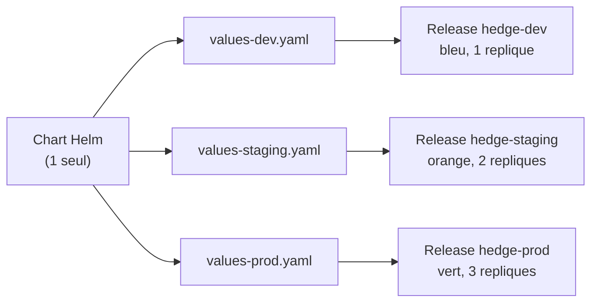
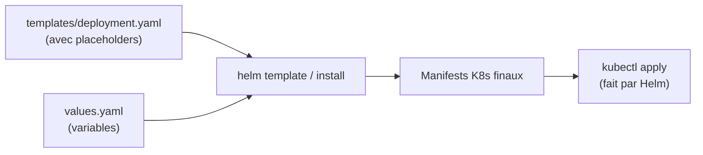

<a id="top"></a>

# Mission Helm : industrialiser un déploiement multi-environnement

> **Projet 13 — Helm sur Kubernetes** · Niveau **intermédiaire → avancé** · Durée estimée : **4 à 6 h**
>
> Vous partez d'une application composée de **deux services Python** (un `portail` visuel et une `api` backend), et vous allez la déployer **trois fois côte à côte** — en `DEV` (bleu), `STAGING` (orange), `PROD` (vert) — avec **un seul Chart Helm** et **trois fichiers de valeurs**. À la fin, vous ferez un `helm upgrade` puis un `helm rollback`, et vous réparerez trois templates truffés de bugs réels vus en entreprise.

---

## Table des matières

- [Le contexte](#le-contexte)
- [Concepts essentiels avant de commencer](#concepts-essentiels-avant-de-commencer)
- [L'architecture cible : DEV / STAGING / PROD](#larchitecture-cible--dev--staging--prod)
- [Disposition des fichiers](#disposition-des-fichiers)
- [Les règles du jeu](#les-regles-du-jeu)
- [Préparation](#preparation)
- [Les missions](#les-missions)
- [Validation automatique](#validation-automatique)
- [Livrables](#livrables)
- [Questions de réflexion](#questions-de-reflexion)
- [Barème](#bareme)
- [Boîte à outils Helm](#boite-a-outils-helm)
- [ANNEXE A — Les applications](#annexe-a--les-applications)
- [ANNEXE B — Squelette du Chart](#annexe-b--squelette-du-chart)
- [ANNEXE C — Les trois pannes à réparer](#annexe-c--les-trois-pannes-a-reparer)
- [ANNEXE D — Le script de validation](#annexe-d--le-script-de-validation)

---

## Le contexte

Vous travaillez dans une équipe où chaque nouvelle version d'une application doit passer par **trois environnements** :

- **DEV** — bac à sable des développeurs, données jetables, une seule réplique.
- **STAGING** — pré-production, données de test, deux répliques pour valider la scalabilité.
- **PROD** — production, données réelles, trois répliques minimum, aucun downtime toléré.

Aujourd'hui, l'équipe **copie-colle** les mêmes manifestes YAML pour chaque environnement en changeant à la main les valeurs différentes. Résultat : les fichiers dérivent, un patch appliqué en dev ne se retrouve pas en prod, et un déploiement demande une demi-journée.

**Votre mission :** industrialiser tout ça avec **Helm**. Un seul Chart, trois fichiers de valeurs, une commande par environnement. Vous prouverez que ça fonctionne en affichant **trois tableaux de bord côte à côte** dans votre navigateur — chacun avec sa propre couleur, son propre nombre de Pods, et son propre message.



---

## Concepts essentiels avant de commencer

> **Ce document est autosuffisant.** Vous n'avez besoin d'aucune référence externe pour le terminer.

### 1. Le rôle de Helm en une phrase

**Helm génère des manifestes Kubernetes à partir de templates et de variables.** Là où `kubectl apply` prend un YAML statique, Helm prend un **template YAML** et un **fichier de valeurs**, produit le YAML final, puis l'applique en tant qu'unité versionnée qu'on appelle une **release**.



### 2. Anatomie d'un Chart

```
mon-chart/
├── Chart.yaml            # metadata (nom, version)
├── values.yaml           # valeurs PAR DEFAUT
└── templates/            # templates YAML
    ├── deployment.yaml
    ├── service.yaml
    └── _helpers.tpl      # fonctions de template partagees (nom prefixe _)
```

Les fichiers dont le nom **commence par `_`** ne produisent **aucun manifeste** : ils servent à définir des « helpers » réutilisables via `{{ include "nom" . }}`.

### 3. La syntaxe des templates (Go template)

| Écrit | Rendu |
|---|---|
| `{{ .Values.portail.replicas }}` | La valeur définie dans values.yaml |
| `{{ .Release.Name }}` | Le nom que vous avez passé à `helm install` (ex : `hedge-dev`) |
| `{{ .Chart.Name }}` | Le nom du chart (défini dans Chart.yaml) |
| `{{ .Chart.AppVersion }}` | La version applicative (défini dans Chart.yaml) |
| `{{ include "hedge.labels" . }}` | Appel d'un helper défini dans `_helpers.tpl` |
| `{{- ... -}}` | Le `-` supprime les espaces avant/après le rendu |
| `{{ .Values.env \| quote }}` | Ajoute des guillemets autour de la valeur |
| `{{ .Values.replicas \| default 1 }}` | Utilise 1 si la valeur n'est pas définie |

### 4. Les 5 commandes Helm que vous utiliserez

```powershell
helm lint ./chart                                              # verifier la syntaxe
helm template <release> ./chart -f values-<env>.yaml           # rendu SEC (aucun deploiement)
helm install <release> ./chart -f values-<env>.yaml -n <ns>    # deploiement reel
helm upgrade <release> ./chart -f values-<env>.yaml -n <ns>    # modification incrementale
helm rollback <release> <revision> -n <ns>                     # retour arriere
```

### 5. Le mot-clé « release »

Une **release** est une **installation** d'un chart. Un même chart peut être installé **plusieurs fois**, chacun avec un nom de release différent (`hedge-dev`, `hedge-staging`, `hedge-prod`) — c'est le fondement du multi-environnement.

`{{ .Release.Name }}` change à chaque install, `{{ .Chart.Name }}` reste identique. **Retenez ce contraste : il est central.**

### 6. La règle d'or du selector immuable

Le champ `spec.selector.matchLabels` d'un Deployment est **fixé une fois pour toutes** à la création. Si votre template met dans ce champ une valeur **qui peut changer** (comme une version, un environnement, une date), le premier `helm install` marchera, mais le **premier `helm upgrade` échouera** avec :

```
spec.selector: Invalid value: ...: field is immutable
```

**Règle à graver dans le marbre :** dans `matchLabels`, ne mettez **que** des choses qui ne changeront JAMAIS pour cette instance — typiquement `name`, `instance`, `component`.

---

## L'architecture cible : DEV / STAGING / PROD

Vous allez déployer **le même chart** dans trois namespaces distincts, chacun avec ses paramètres :

| Paramètre | DEV | STAGING | PROD |
|---|---|---|---|
| Namespace | `hedge-dev` | `hedge-staging` | `hedge-prod` |
| Release name | `hedge-dev` | `hedge-staging` | `hedge-prod` |
| Couleur du bandeau | **bleu** `#2563eb` | **orange** `#ea580c` | **vert** `#16a34a` |
| Message | « Environnement de développement… » | « Pré-production — données de test uniquement » | « Production — chaque action a un impact réel » |
| Répliques `portail` | 1 | 2 | 3 |
| Répliques `api` | 1 | 2 | 3 |
| Port exposé (NodePort) | **30130** | **30131** | **30132** |
| URL de test | `http://localhost:30130` | `http://localhost:30131` | `http://localhost:30132` |

**À la fin du TP, vous ouvrez trois onglets côte à côte** et vous voyez trois dashboards colorés différemment, chacun affichant son environnement, sa version, ses Pods, et l'état de son backend.

---

## Disposition des fichiers

Vous partez de l'arborescence suivante — l'ANNEXE fournit le contenu exact de chaque fichier :

```
projet13-kubernetes-helm-tp/
├── 00-ENONCE.md                              <- ce document
│
├── apps/                                     <- LE CODE (ANNEXE A) — NE PAS MODIFIER
│   ├── portail/
│   │   ├── app.py
│   │   ├── requirements.txt
│   │   └── Dockerfile
│   └── api/
│       ├── app.py
│       ├── requirements.txt
│       └── Dockerfile
│
├── chart/                                    <- LE CHART À COMPLÉTER
│   ├── Chart.yaml                            <- squelette (ANNEXE B)
│   ├── values.yaml                           <- valeurs par défaut (ANNEXE B)
│   │
│   ├── environments/                         <- À VOUS DE JOUER
│   │   ├── values-dev.yaml                   <- squelette TODO (ANNEXE B)
│   │   ├── values-staging.yaml               <- squelette TODO (ANNEXE B)
│   │   └── values-prod.yaml                  <- squelette TODO (ANNEXE B)
│   │
│   ├── templates/                            <- À VOUS DE JOUER
│   │   ├── _helpers.tpl                      <- squelette TODO (ANNEXE B)
│   │   ├── portail-deployment.yaml           <- squelette TODO (ANNEXE B)
│   │   ├── portail-service.yaml              <- squelette TODO (ANNEXE B)
│   │   ├── api-deployment.yaml               <- squelette TODO (ANNEXE B)
│   │   └── api-service.yaml                  <- squelette TODO (ANNEXE B)
│   │
│   └── casses/                               <- FOURNIS mais DÉFECTUEUX (ANNEXE C)
│       ├── casse-1-configmap.yaml
│       ├── casse-2-worker-deployment.yaml
│       └── casse-3-cache-deployment.yaml
│
├── outils/
│   └── valider.ps1                           <- FOURNI (ANNEXE D)
│
└── RAPPORT.md                                <- À RÉDIGER par vous
```

**Point crucial :** les fichiers de `chart/casses/` ne sont **pas** dans `chart/templates/`. Helm ne les charge donc **pas** automatiquement. La mission 6 vous demandera de les **copier un par un** dans `templates/` pour observer le bug, puis de les **réparer** avant de les garder.

---

## Les règles du jeu

1. **Interdiction absolue de modifier** le dossier `apps/`. Le code applicatif est déjà écrit — vous êtes le DevOps, pas le développeur.
2. Vous **ne modifiez que** les fichiers du dossier `chart/`.
3. **Aucune configuration environnementale codée en dur dans un template** : `replicas`, `nodePort`, couleur, message, environnement — tout doit venir d'un `.Values.*`.
4. Les **3 fichiers `values-<env>.yaml`** doivent différer **uniquement** par les valeurs qui distinguent DEV, STAGING et PROD. Un fichier `values-prod.yaml` qui redéfinit inutilement `image.repository` ou `service.targetPort` est **une erreur** — ces choses viennent de `values.yaml`.
5. **Vous travaillez sur le Kubernetes intégré à Docker Desktop.**

---

## Préparation

### Prérequis — à vérifier une seule fois

1. **Docker Desktop est démarré** et **Kubernetes est activé** (*Settings → Kubernetes → Enable Kubernetes*).
2. **Docker Desktop dispose d'au moins 4 Go de RAM alloués** (*Settings → Resources → Memory ≥ 4 GB*). Ce TP fait tourner **12 Pods** simultanément (1+1 + 2+2 + 3+3).
3. **Helm est installé** :
   ```powershell
   helm version --short           # doit afficher v3.x ou v4.x
   ```
   Sinon : `winget install Helm.Helm` (ou `choco install kubernetes-helm`).
4. **Vous êtes bien sur le bon cluster** :
   ```powershell
   kubectl config use-context docker-desktop
   kubectl get nodes              # docker-desktop   Ready
   ```

### Construction des images

Le chart référence deux images locales que vous devez construire **une seule fois** :

```powershell
docker build -t hedge-portail:1.0 .\apps\portail
docker build -t hedge-api:1.0     .\apps\api

docker images | Select-String "^hedge"      # doit afficher les 2 images
```

> **Rappel :** Docker Desktop partage son démon avec Kubernetes ; aucune étape de « chargement » n'est nécessaire (contrairement à `kind` ou `minikube`).

---

## Les missions

### Mission 1 — Faire vivre un Chart minimal *(10 points)*

Complétez `chart/Chart.yaml` (nom, apiVersion, type, version, appVersion). Vérifiez ensuite :

```powershell
helm lint .\chart
# doit afficher : 1 chart(s) linted, 0 chart(s) failed
```

**Attendu :** un Chart qui passe le lint sans erreur.

---

### Mission 2 — Templater portail et api *(20 points)*

Complétez les 4 fichiers de `chart/templates/` :

- `portail-deployment.yaml` — un Deployment qui utilise `.Values.portail.replicas`, `.Values.portail.image.*`, et injecte les variables d'environnement `ENVIRONMENT`, `APP_VERSION`, `THEME_COLOR`, `BANNIERE_MESSAGE`, `BACKEND_URL`, `REPLICAS_INFO`.
- `portail-service.yaml` — un Service NodePort qui pointe sur les Pods du portail.
- `api-deployment.yaml` — un Deployment pour l'api (variables `ENVIRONMENT`, `APP_VERSION`).
- `api-service.yaml` — un Service ClusterIP.

**Point-clé :** la variable `BACKEND_URL` du portail doit contenir le **nom du Service `api` construit avec `{{ .Release.Name }}`** (par exemple `http://hedge-dev-api`), pas un nom en dur.

**Validation :**
```powershell
helm template check .\chart -f .\chart\environments\values-dev.yaml
# doit afficher 2 Deployments + 2 Services, tous prefixes par "check-"
```

---

### Mission 3 — Écrire des helpers propres *(15 points)*

Complétez `chart/templates/_helpers.tpl` avec **trois** helpers :

1. **`hedge.fullname`** — retourne `{{ .Release.Name }}-<composant>` (ex : `hedge-dev-portail`).
2. **`hedge.labels`** — retourne les labels standards :
   - `app.kubernetes.io/name`
   - `app.kubernetes.io/instance`
   - `app.kubernetes.io/component`
   - `app.kubernetes.io/managed-by`
   - `app.kubernetes.io/version`
   - `helm.sh/chart`
   - `hedge/environment`
3. **`hedge.selectorLabels`** — retourne **seulement** `name`, `instance`, `component` (les 3 labels garantis immuables pour cette instance).

**Contrainte forte :** utilisez ces helpers dans **tous** vos templates. Aucun nom de ressource en dur, aucun label recopié à la main.

**Astuce :** pour passer plusieurs valeurs à un helper, utilisez un `dict` :
```yaml
{{ include "hedge.labels" (dict "root" . "composant" "portail") | nindent 4 }}
```
Le helper reçoit alors `.root.Release.Name`, `.root.Values...`, et `.composant`.

---

### Mission 4 — Trois environnements côte à côte *(20 points)*

Créez les 3 fichiers dans `chart/environments/` — chacun **ne redéfinit que** les valeurs qui distinguent son environnement.

| Fichier | `environment` | `replicas` (portail + api) | `nodePort` (portail) | Couleur | Message suggéré |
|---|---|---|---|---|---|
| `values-dev.yaml` | `dev` | 1 | 30130 | `#2563eb` | « Environnement de développement — attention, tout peut changer » |
| `values-staging.yaml` | `staging` | 2 | 30131 | `#ea580c` | « Pré-production — données de test uniquement » |
| `values-prod.yaml` | `prod` | 3 | 30132 | `#16a34a` | « Production — chaque action a un impact réel » |

**Déploiement des 3 environnements :**

```powershell
helm install hedge-dev     .\chart -f .\chart\environments\values-dev.yaml     -n hedge-dev     --create-namespace
helm install hedge-staging .\chart -f .\chart\environments\values-staging.yaml -n hedge-staging --create-namespace
helm install hedge-prod    .\chart -f .\chart\environments\values-prod.yaml    -n hedge-prod    --create-namespace
```

**Attendez** que les Pods soient prêts (~30 s) :
```powershell
kubectl wait --for=condition=ready pod --all -n hedge-dev     --timeout=120s
kubectl wait --for=condition=ready pod --all -n hedge-staging --timeout=120s
kubectl wait --for=condition=ready pod --all -n hedge-prod    --timeout=120s
```

**Ouvrez les 3 dashboards :**

```powershell
start http://localhost:30130       # DEV — bandeau bleu, 1 replique
start http://localhost:30131       # STAGING — bandeau orange, 2 repliques
start http://localhost:30132       # PROD — bandeau vert, 3 repliques
```

**Attendu :** trois pages **de couleurs différentes**, chacune affichant son env, sa version, ses Pods, et son backend en **OK vert**.

---

### Mission 5 — Upgrade puis rollback *(10 points)*

Simulez un incident de production, puis annulez-le.

**Scénario :**

1. En DEV, passez `portail.replicas` à 5 :
   ```powershell
   helm upgrade hedge-dev .\chart -f .\chart\environments\values-dev.yaml --set portail.replicas=5 -n hedge-dev
   ```
2. Vérifiez que **5 Pods de portail** tournent :
   ```powershell
   kubectl get pods -n hedge-dev -l app.kubernetes.io/component=portail
   ```
3. Consultez l'historique :
   ```powershell
   helm history hedge-dev -n hedge-dev
   ```
   Vous voyez au moins **2 révisions**.
4. **Annulez** l'upgrade en revenant à la révision 1 :
   ```powershell
   helm rollback hedge-dev 1 -n hedge-dev
   ```
5. Vérifiez qu'on est revenu à **1 seul Pod portail**, et que l'historique montre une nouvelle révision de type `Rollback` :
   ```powershell
   kubectl get pods -n hedge-dev -l app.kubernetes.io/component=portail
   helm history hedge-dev -n hedge-dev
   ```

**Question à traiter dans le rapport :** quelle est la **différence fondamentale** entre `helm upgrade --set portail.replicas=5` et `kubectl scale deploy/hedge-dev-portail --replicas=5` ? Pourquoi Helm préfère-t-il qu'on passe par lui ?

---

### Mission 6 — Enquête : réparer 3 templates défectueux *(20 points)*

Le dossier `chart/casses/` contient **trois templates déjà écrits** qui compilent mais introduisent chacun un **bug réel** rencontré en entreprise. Vous devez, **pour chacun** :

1. le **copier** dans `chart/templates/` ;
2. **reproduire** le symptôme décrit en haut du fichier ;
3. **diagnostiquer** la cause en lisant le message d'erreur ;
4. **réparer** (en modifiant le template dans `chart/templates/`, **pas** l'original dans `casses/`) ;
5. **prouver** que la panne a disparu.

| Fichier | Composant ajouté | Nature du bug |
|---|---|---|
| `casse-1-configmap.yaml` | Un `ConfigMap` global | Collision de nom entre releases |
| `casse-2-worker-deployment.yaml` | Un `Deployment` `worker` | Selector immuable violé au premier `helm upgrade` |
| `casse-3-cache-deployment.yaml` | Un `Deployment` `cache` | Path de valeur erroné (typo silencieux) |

**Astuce d'enquête :**

```powershell
# rendu SEC d'un seul template (n'installe rien)
helm template hedge-dev .\chart -f .\chart\environments\values-dev.yaml `
  --show-only templates/casse-3-cache-deployment.yaml --debug
```

Cette commande imprime **exactement** ce que Helm enverrait à Kubernetes. Elle est votre premier outil de diagnostic — utilisez-la sans modération.

---

### Mission 7 — Bonus : le raffinement *(5 points)*

Au choix, **un seul** suffit :

- **a)** Ajoutez un **hook `pre-install`** (`Job`) qui affiche `Bienvenue dans <environnement>` dans les logs Helm. La release doit attendre la fin du Job avant de continuer.
- **b)** Rendez le nombre de répliques **dynamique** avec une valeur `values.yaml` qui a une **structure imbriquée** (par exemple `portail.autoscaling.enabled`, `portail.autoscaling.min`, `portail.autoscaling.max`) et faites générer conditionnellement un `HorizontalPodAutoscaler` selon `.enabled`.
- **c)** Ajoutez un `NOTES.txt` dans `templates/` qui affiche, après chaque `helm install`, **l'URL exacte** pour ouvrir le dashboard (avec le bon `nodePort` selon les Values).

---

## Validation automatique

Un script vous donne votre score **à tout moment** :

```powershell
.\outils\valider.ps1
```

Exemple de sortie sur un travail partiellement fait :
```
[OK]    Mission 1 - Chart valide.............. 10/10
[OK]    Mission 2 - Templating de base........ 20/20
[ECHEC] Mission 3 - Helpers et labels.........  0/15   -> helper hedge.selectorLabels manquant
[OK]    Mission 4 - Trois environnements...... 20/20
[ECHEC] Mission 5 - Upgrade + rollback........  0/10   -> aucun rollback detecte dans l'historique
[OK]    Mission 6 - Reparations (3 pannes).... 14/20   -> casse-3 : typo .Values.portal toujours present

SCORE AUTOMATIQUE : 64 / 95
```

> **Si PowerShell refuse d'exécuter le script** (`l'exécution de scripts est désactivée`), utilisez :
> ```powershell
> powershell -ExecutionPolicy Bypass -File .\outils\valider.ps1
> ```

---

## Livrables

1. Le **dossier `chart/`** complet, en état de marche (`helm lint` propre).
2. Un **`RAPPORT.md`** contenant :
   - la sortie de `helm list -A` montrant vos 3 releases ;
   - **une capture par environnement** (3 dashboards colorés) ;
   - l'**historique complet** de `hedge-dev` (avec upgrade + rollback) ;
   - pour **chaque** panne de la mission 6 : commande de diagnostic, cause, correctif, preuve ;
   - vos réponses aux **questions de réflexion**.
3. La sortie finale de `.\outils\valider.ps1`.

---

## Questions de réflexion

1. Pourquoi le champ `spec.selector.matchLabels` est-il **immuable** en Kubernetes ? Quel problème résout cette contrainte ?
2. Vous avez 3 environnements aujourd'hui. Demain, l'équipe DevSecOps demande un 4e (« pre-prod »). Quels fichiers créez-vous et lesquels **ne touchez-vous pas** ?
3. Quelle est la différence entre `helm upgrade --set replicas=5` et `kubectl scale`, du point de vue de la **traçabilité** et du **rollback** ?
4. Le portail affiche « backend OK » — pourquoi cette information est-elle plus fiable qu'un simple `kubectl get svc api` ?
5. Que se passe-t-il si vous supprimez un Pod avec `kubectl delete pod`, alors qu'il a été créé par un Deployment via Helm ? Helm est-il au courant de la « perte » ?
6. Un collègue vous propose de mettre `app.kubernetes.io/version: {{ .Chart.AppVersion }}` dans le `matchLabels` d'un Deployment. Que lui répondez-vous ?

---

## Barème

| Élément | Points |
|---|---|
| Mission 1 — Chart valide et lint propre | 10 |
| Mission 2 — Templating portail + api | 20 |
| Mission 3 — Helpers et labels réutilisables | 15 |
| Mission 4 — Trois environnements côte à côte | 20 |
| Mission 5 — Upgrade + rollback tracés | 10 |
| Mission 6 — Diagnostic + réparation des 3 pannes | 20 |
| Qualité du rapport et justification des choix | 5 |
| **Bonus** — Mission 7 | **+5** |
| **Total** | **100 (+5)** |

**Pénalités :**
- −10 par valeur environnementale codée en dur dans un template (`replicas: 3` littéral au lieu de `.Values....`).
- −5 par redéfinition inutile dans un `values-<env>.yaml` (une valeur qui n'a pas de raison de différer entre environnements).
- −10 par modification d'un fichier de `apps/`.

---

## Boîte à outils Helm

```powershell
# ANALYSE (aucun deploiement)
helm lint .\chart                                                        # syntaxe + best practices
helm template <release> .\chart -f <values.yaml>                         # rendu complet
helm template <release> .\chart -f <values.yaml> --show-only templates/<fichier>   # rendu ciblé
helm template <release> .\chart -f <values.yaml> --debug                 # avec traces
helm show values .\chart                                                 # valeurs par défaut

# DEPLOIEMENT
helm install <release> .\chart -f <values.yaml> -n <ns> --create-namespace
helm upgrade <release> .\chart -f <values.yaml> -n <ns>
helm upgrade <release> .\chart -f <values.yaml> --set portail.replicas=5 -n <ns>
helm rollback <release> <revision> -n <ns>
helm uninstall <release> -n <ns>

# OBSERVATION
helm list -A                                                             # toutes les releases
helm status <release> -n <ns>
helm history <release> -n <ns>
helm get values <release> -n <ns>                                        # les valeurs actives
helm get manifest <release> -n <ns>                                      # les manifestes appliques
```

**Les 3 réflexes en cas de bug :**

1. **Toujours commencer par `helm template`** — c'est un rendu SEC, sans risque, qui montre exactement ce qui va être envoyé à Kubernetes.
2. **Lire le chemin dans le message d'erreur** — Helm donne toujours le fichier + la ligne + le chemin `.Values.*` fautif.
3. **`helm get manifest`** vous montre ce qui **est actuellement** dans le cluster (utile pour comparer avec ce que génère votre nouveau template).

---
---

# ANNEXE A — Les applications

> **Ne modifiez aucun de ces fichiers.** Recopiez-les tels quels aux chemins indiqués.

## A.1 — Le portail (tableau de bord multi-environnement)

Toutes les valeurs affichées viennent de **variables d'environnement** injectées par Helm. La même image se comporte différemment selon les `env:` du Deployment.

### Fichier : `apps/portail/app.py`

```python
"""Portail — tableau de bord multi-environnement.

Ce Pod affiche l'environnement dans lequel il tourne (DEV / STAGING / PROD),
la version applicative, le nombre de replicas, et l'etat du backend.

Toutes les valeurs affichees viennent de VARIABLES D'ENVIRONNEMENT injectees
par Helm depuis values-<env>.yaml. Le meme code s'adapte a chaque
environnement sans aucune modification.
"""

import os
import socket
import time
import urllib.error
import urllib.request

from flask import Flask, jsonify, request

app = Flask(__name__)
DEMARRAGE = time.time()


def cfg():
    return {
        "env": os.environ.get("ENVIRONMENT", "inconnu"),
        "version": os.environ.get("APP_VERSION", "0.0.0"),
        "theme": os.environ.get("THEME_COLOR", "#64748b"),
        "message": os.environ.get("BANNIERE_MESSAGE", "Deploye avec Helm"),
        "backend_url": os.environ.get("BACKEND_URL", "http://api"),
        "replicas_info": os.environ.get("REPLICAS_INFO", "?"),
        "pod": socket.gethostname(),
        "uptime": int(time.time() - DEMARRAGE),
    }


def tester_backend(url):
    try:
        with urllib.request.urlopen(url + "/ping", timeout=1.5) as reponse:
            corps = reponse.read(200).decode("utf-8", "ignore")
        return "ok", corps.strip()
    except urllib.error.HTTPError as err:
        return "http", "HTTP %s" % err.code
    except Exception as err:
        return "ko", type(err).__name__


@app.route("/health")
def health():
    return "OK", 200


@app.route("/api-json")
def api_json():
    """Route utile pour la validation automatique."""
    c = cfg()
    etat, detail = tester_backend(c["backend_url"])
    return jsonify(pod=c["pod"], env=c["env"], version=c["version"],
                   backend=etat, backend_detail=detail, uptime=c["uptime"])


@app.route("/")
def accueil():
    c = cfg()
    etat, detail = tester_backend(c["backend_url"])
    # ... (HTML template complet dans le fichier — non repete ici pour rester lisible)
```

*Le fichier complet est fourni dans `apps/portail/app.py`.*

### Fichier : `apps/portail/requirements.txt`

```text
flask==3.0.3
```

### Fichier : `apps/portail/Dockerfile`

```dockerfile
FROM python:3.12-slim
WORKDIR /app
COPY requirements.txt .
RUN pip install --no-cache-dir -r requirements.txt
COPY app.py .
CMD ["python", "app.py"]
```

---

## A.2 — L'api (backend simple)

### Fichier : `apps/api/app.py`

```python
"""API — backend simple pour l'exemple Helm."""

import os
import socket
import time

from flask import Flask, jsonify

app = Flask(__name__)
DEMARRAGE = time.time()

ENV = os.environ.get("ENVIRONMENT", "inconnu")
VERSION = os.environ.get("APP_VERSION", "0.0.0")


@app.route("/")
@app.route("/ping")
def ping():
    return jsonify(service="api", env=ENV, version=VERSION,
                   pod=socket.gethostname(),
                   uptime=int(time.time() - DEMARRAGE))


@app.route("/health")
def health():
    return "OK", 200


if __name__ == "__main__":
    app.run(host="0.0.0.0", port=8000)
```

### Fichier : `apps/api/requirements.txt`

```text
flask==3.0.3
```

### Fichier : `apps/api/Dockerfile`

```dockerfile
FROM python:3.12-slim
WORKDIR /app
COPY requirements.txt .
RUN pip install --no-cache-dir -r requirements.txt
COPY app.py .
CMD ["python", "app.py"]
```

---
---

# ANNEXE B — Squelette du Chart

> Recopiez ces fichiers, puis **remplacez chaque `TODO`** par la bonne valeur.
> Les lignes précédées de `# ?` sont des **questions à trancher** : à vous de décider comment compléter le code.

## Fichier : `chart/Chart.yaml`

```yaml
# ? Renseignez les champs obligatoires d'un Chart Helm.
# ? apiVersion doit valoir v2 (la v1 est deprecise depuis Helm 3).
# ? type est "application" (par opposition a "library").

apiVersion: TODO
name: hedge
description: TODO
type: TODO
version: 0.1.0
appVersion: "1.0.0"
```

## Fichier : `chart/values.yaml`

```yaml
# values.yaml — valeurs par defaut du chart hedge.
# Chaque environnement fournit un fichier values-<env>.yaml qui SURCHARGE
# ces valeurs par-dessus. Gardez ce fichier NEUTRE (aucune valeur specifique
# a un environnement).

environment: default

banniere:
  message: "Chart Helm — application multi-environnement"
  couleur: "#64748b"

portail:
  image:
    repository: hedge-portail
    tag: "1.0"
    pullPolicy: IfNotPresent
  replicas: 1
  service:
    type: NodePort
    port: 80
    targetPort: 5000
    nodePort: 30130

api:
  image:
    repository: hedge-api
    tag: "1.0"
    pullPolicy: IfNotPresent
  replicas: 1
  service:
    type: ClusterIP
    port: 80
    targetPort: 8000
```

## Fichier : `chart/templates/_helpers.tpl`

```yaml
{{/*
Nom complet d'une ressource : "<release>-<composant>".
Usage : {{ include "hedge.fullname" (dict "root" . "composant" "portail") }}
*/}}
{{- define "hedge.fullname" -}}
{{- printf "TODO" .root.Release.Name .composant | trunc 63 | trimSuffix "-" -}}
{{- end -}}


{{/*
Labels communs a toutes les ressources.
Usage : {{ include "hedge.labels" (dict "root" . "composant" "portail") | nindent 4 }}
*/}}
{{- define "hedge.labels" -}}
# ? renseignez les 7 labels demandes dans la Mission 3
app.kubernetes.io/name: TODO
app.kubernetes.io/instance: TODO
# ... continuez ...
{{- end -}}


{{/*
Selector labels : sous-ensemble STABLE des labels.
Ne mettre ici QUE des labels qui ne changeront JAMAIS pour une instance.
*/}}
{{- define "hedge.selectorLabels" -}}
# ? les 3 labels STRICTEMENT immuables uniquement
{{- end -}}
```

## Fichier : `chart/templates/portail-deployment.yaml`

```yaml
# ? Deployment du portail. Utilisez :
#   - .Values.portail.replicas
#   - .Values.portail.image.{repository,tag,pullPolicy}
#   - .Values.portail.service.targetPort
#   - .Values.environment
#   - .Values.banniere.{couleur,message}
#   - .Chart.AppVersion (pour APP_VERSION)
#   - Le NOM du Service api construit avec .Release.Name (pour BACKEND_URL)
apiVersion: apps/v1
kind: Deployment
metadata:
  name: TODO
  labels:
    TODO
spec:
  replicas: TODO
  selector:
    matchLabels:
      TODO
  template:
    metadata:
      labels:
        TODO
    spec:
      containers:
        - name: portail
          image: TODO
          imagePullPolicy: TODO
          ports:
            - containerPort: TODO
          env:
            - name: ENVIRONMENT
              value: TODO
            # ? ajoutez APP_VERSION, THEME_COLOR, BANNIERE_MESSAGE,
            #   BACKEND_URL, REPLICAS_INFO
          readinessProbe:
            httpGet:
              path: /health
              port: TODO
            initialDelaySeconds: 3
            periodSeconds: 5
```

## Fichier : `chart/templates/portail-service.yaml`

```yaml
# ? Service pour le portail. Type NodePort. Utilisez la condition
#   {{- if eq .Values.portail.service.type "NodePort" }} ... {{- end }}
#   pour n'inclure "nodePort" QUE si c'est bien un NodePort.
apiVersion: v1
kind: Service
metadata:
  name: TODO
  labels:
    TODO
spec:
  type: TODO
  selector:
    TODO
  ports:
    - port: TODO
      targetPort: TODO
      # ? nodePort uniquement si type == NodePort
```

## Fichier : `chart/templates/api-deployment.yaml`

```yaml
# ? Meme structure que portail-deployment.yaml, mais :
#   - composant = "api"
#   - variables d'environnement : ENVIRONMENT et APP_VERSION seulement
#   - port du conteneur = .Values.api.service.targetPort (8000)
apiVersion: apps/v1
kind: Deployment
metadata:
  name: TODO
spec:
  # ... (structure similaire au portail) ...
```

## Fichier : `chart/templates/api-service.yaml`

```yaml
# ? Service ClusterIP pour l'api. Un seul port. Pas de nodePort.
apiVersion: v1
kind: Service
metadata:
  name: TODO
spec:
  type: TODO
  selector:
    TODO
  ports:
    - port: TODO
      targetPort: TODO
```

## Fichier : `chart/environments/values-dev.yaml`

```yaml
# ? Environnement DEV : 1 replique, bandeau bleu #2563eb, NodePort 30130.
environment: TODO

banniere:
  message: TODO
  couleur: TODO

portail:
  replicas: TODO
  service:
    nodePort: TODO

api:
  replicas: TODO
```

## Fichier : `chart/environments/values-staging.yaml`

```yaml
# ? Environnement STAGING : 2 repliques, bandeau orange #ea580c, NodePort 30131.
environment: TODO
# ... completez sur le modele de values-dev.yaml ...
```

## Fichier : `chart/environments/values-prod.yaml`

```yaml
# ? Environnement PROD : 3 repliques, bandeau vert #16a34a, NodePort 30132.
environment: TODO
# ...
```

---
---

# ANNEXE C — Les trois pannes à réparer

> Chaque fichier ci-dessous se trouve dans `chart/casses/`. **Ne modifiez pas** les originaux — **copiez-les** dans `chart/templates/`, reproduisez le bug, puis corrigez la copie.

## Fichier : `chart/casses/casse-1-configmap.yaml`

```yaml
# PANNE 1
# Symptome : deployez hedge-dev, puis essayez de deployer hedge-staging
# DANS LE MEME NAMESPACE. La seconde installation echoue avec :
#   ConfigMap "hedge-config" ... exists and cannot be imported ...
apiVersion: v1
kind: ConfigMap
metadata:
  name: hedge-config
  labels:
    {{- include "hedge.labels" (dict "root" . "composant" "config") | nindent 4 }}
data:
  timezone: "America/Toronto"
  langue: "fr-CA"
```

## Fichier : `chart/casses/casse-2-worker-deployment.yaml`

```yaml
# PANNE 2
# Symptome : "helm install" fonctionne. "helm upgrade" avec un
# --set environment=recette echoue avec :
#   spec.selector: Invalid value: ...: field is immutable
apiVersion: apps/v1
kind: Deployment
metadata:
  name: {{ include "hedge.fullname" (dict "root" . "composant" "worker") }}
spec:
  replicas: 1
  selector:
    matchLabels:
      app.kubernetes.io/name: {{ .Chart.Name }}
      app.kubernetes.io/instance: {{ .Release.Name }}
      app.kubernetes.io/component: worker
      hedge/environment: {{ .Values.environment | quote }}
  template:
    metadata:
      labels:
        {{- include "hedge.labels" (dict "root" . "composant" "worker") | nindent 8 }}
    spec:
      containers:
        - name: worker
          image: "{{ .Values.api.image.repository }}:{{ .Values.api.image.tag }}"
```

## Fichier : `chart/casses/casse-3-cache-deployment.yaml`

```yaml
# PANNE 3
# Symptome : "helm install" echoue avec :
#   Error: template ...at <.Values.portal.replicas>:
#   nil pointer evaluating interface {}.replicas
apiVersion: apps/v1
kind: Deployment
metadata:
  name: {{ include "hedge.fullname" (dict "root" . "composant" "cache") }}
spec:
  replicas: {{ .Values.portal.replicas }}
  selector:
    matchLabels:
      {{- include "hedge.selectorLabels" (dict "root" . "composant" "cache") | nindent 6 }}
  template:
    metadata:
      labels:
        {{- include "hedge.selectorLabels" (dict "root" . "composant" "cache") | nindent 8 }}
    spec:
      containers:
        - name: cache
          image: "{{ .Values.api.image.repository }}:{{ .Values.api.image.tag }}"
```

---
---

# ANNEXE D — Le script de validation

Le fichier `outils/valider.ps1` est fourni **tel quel**. Il ne donne aucune solution — seulement un score et le premier point à corriger. Exécutez-le à tout moment :

```powershell
.\outils\valider.ps1
```

**Ce que le script vérifie :**

| Mission | Critères automatiques |
|---|---|
| 1 | `helm lint` passe, Chart.yaml a `apiVersion: v2`, `type: application` |
| 2 | `helm template` produit bien 2 Deployments et 2 Services, noms préfixés par la release |
| 3 | `_helpers.tpl` définit les 3 helpers, labels standards présents |
| 4 | Les 3 fichiers `values-<env>.yaml` existent avec les bonnes valeurs (env, replicas, port, couleur), les 3 releases sont déployées |
| 5 | La release `hedge-dev` a ≥ 2 révisions et un rollback dans l'historique |
| 6 | Aucun `hedge-config` en dur, aucun label variable dans `matchLabels`, aucun `.Values.portal` (avec typo) |

**Le script n'exécute lui-même aucune commande `helm install`** : c'est à vous de déployer avant de valider.

---

<p align="center">
  <strong>Cours créé par Dr. Haythem REHOUMA — Développement et déploiement de solutions de données</strong>
</p>
