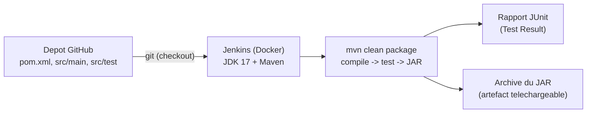

<a id="top"></a>

# Projet 3 — Pipeline Jenkins + Maven + tests unitaires (avec Docker)

> **Pratique guidée** · Module [05 — Jenkins : pipeline CI/CD](../README.md)
>
> Objectif : créer un **pipeline CI** qui récupère un projet **Maven** depuis GitHub, le **compile**, exécute ses **tests unitaires (JUnit)**, **publie le rapport de tests** dans Jenkins et **archive le JAR**. Le tout via **Docker**, sans rien installer.
>
> Pressé ? Voir l'**[aide-mémoire des commandes](COMMANDES.md)**.

---

## Ce qu'on construit

C'est la suite logique du [Projet 1 (Maven)](../../03-projets-java-maven/projet1-introduction-a-maven/README.md) et du [Projet 2 (Jenkins)](../projet2-jenkins-pipeline-docker/README.md) : on **automatise** le `mvn clean package` dans un pipeline Jenkins.



L'image Docker contient déjà **Jenkins + JDK 17 + Maven + Git** : la commande `mvn` fonctionne directement dans la pipeline.

---

## Prérequis

- **Docker Desktop** installé et démarré.
- Un compte **GitHub** (+ un **jeton d'accès** si votre dépôt est privé).

```bash
docker --version
docker compose version
```

---

## Structure du projet

```text
projet3-jenkins-maven-tests/
├── docker-compose.yml          <- lance Jenkins
├── Dockerfile                  <- Jenkins + JDK 17 + Maven
├── README.md                   <- ce fichier
├── COMMANDES.md                <- aide-memoire
└── depot-exemple/              <- le projet Maven a mettre dans VOTRE depot GitHub
    ├── pom.xml
    ├── Jenkinsfile
    └── src/
        ├── main/java/com/example/Calculator.java
        └── test/java/com/example/CalculatorTest.java
```

---

## Étape A — Démarrer Jenkins

```bash
docker compose up -d --build
```

Ouvrez **http://localhost:8080**, récupérez le mot de passe initial :

```bash
docker exec jenkins-maven-tp cat /var/jenkins_home/secrets/initialAdminPassword
```

Puis : **Installer les plugins suggérés** (inclut Git, Pipeline et **JUnit**) → créer votre compte administrateur.

---

## Étape B — Créer votre dépôt GitHub

1. Créez un dépôt (ex. `calculator`).
2. Copiez-y **tout le contenu** du dossier [`depot-exemple/`](depot-exemple) (en gardant la structure `src/main/...` et `src/test/...`).
3. Dans le `Jenkinsfile`, remplacez l'URL par **votre** dépôt :

```groovy
git branch: 'main', url: 'https://github.com/VOTRE-COMPTE/calculator.git'
```

---

## Étape C — Créer la pipeline dans Jenkins

| # | Action |
|---|---|
| 01 | **New Item** → nom → type **Pipeline** → **OK**. |
| 02 | *Build Triggers* : cocher **Poll SCM** (`H/2 * * * *`, optionnel). |
| 03 | *Pipeline* : **Definition = Pipeline script from SCM**. |
| 04 | **SCM = Git**. |
| 05 | **Repository URL** = l'URL de votre dépôt. |
| 06 | **Credentials** (si privé) : *Add → Jenkins → Username with password* (identifiant GitHub + **jeton**). Dépôt public = aucun credential. |
| 07 | **Sélectionnez** le credential créé. |
| 08 | **Branch Specifier** : `*/main` (ou `*/master`). |
| 09 | **Script Path** = `Jenkinsfile`. **Apply** puis **Save**. |

> Git dans le conteneur est à `/usr/bin/git` (vérifier : `docker exec jenkins-maven-tp which git`).

---

## Étape D — Lancer et lire les résultats

Cliquez sur **Build Now**, puis ouvrez le build.

- **Console Output** : vous verrez Maven compiler, lancer les tests, puis `BUILD SUCCESS`.

```text
Tests run: 5, Failures: 0, Errors: 0, Skipped: 0
BUILD SUCCESS
Finished: SUCCESS
```

- **Test Result** (sur la page du build ou la tendance du job) : affiche les **5 tests** et leur statut grâce à la ligne `junit '**/target/surefire-reports/*.xml'`.
- **Artefacts** : le fichier `calculator-1.0-SNAPSHOT.jar` est **archivé** et téléchargeable, grâce à `archiveArtifacts`.

---

## Comprendre le Jenkinsfile

```groovy
stage('Build & Test') {
    steps {
        sh 'mvn -B clean package'   // -B = mode batch (sortie propre, non interactive)
    }
}
post {
    always {
        junit '**/target/surefire-reports/*.xml'   // publie le rapport de tests
        archiveArtifacts artifacts: 'target/*.jar' // archive le livrable
    }
}
```

- `mvn clean package` enchaîne **compile → test → package**. Si **un test échoue**, le build est marqué **FAILURE** et le JAR n'est pas produit.
- Le bloc `post { always { ... } }` s'exécute **même en cas d'échec**, pour toujours publier le rapport de tests.

> **Exercice :** dans `CalculatorTest.java`, changez `add(2, 3)` attendu de `5` à `6`, poussez sur GitHub, relancez le build. Observez le **build rouge** et le test en échec dans **Test Result**. Remettez ensuite `5`.

---

## Arrêter / réinitialiser

```bash
docker compose stop          # arreter (donnees conservees)
docker compose down          # supprimer le conteneur (volume conserve)
docker compose down -v       # tout supprimer (config Jenkins incluse)
```

---

## Annexe — Variante Maven configuré comme outil Jenkins

Ici, Maven est **installé dans l'image** (via le `Dockerfile`), donc `sh 'mvn ...'` fonctionne directement. Alternative possible : *Manage Jenkins → Tools → Maven installations* (installation automatique), puis dans le Jenkinsfile :

```groovy
tools { maven 'Maven3' }
```

Cette variante est utile si vous ne voulez pas installer Maven dans l'image, mais elle nécessite une configuration supplémentaire dans Jenkins.

---

<p align="center">
  <strong>Cours créé par Dr. Haythem REHOUMA — Développement et déploiement de solutions de données</strong>
</p>
