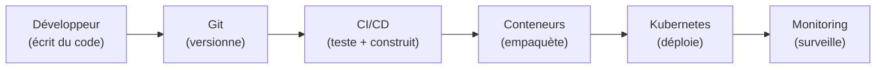
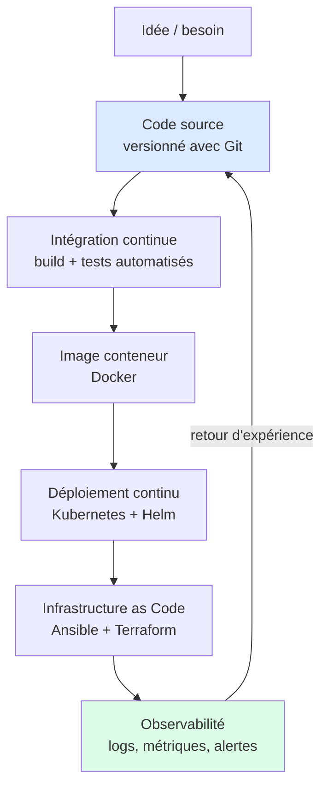
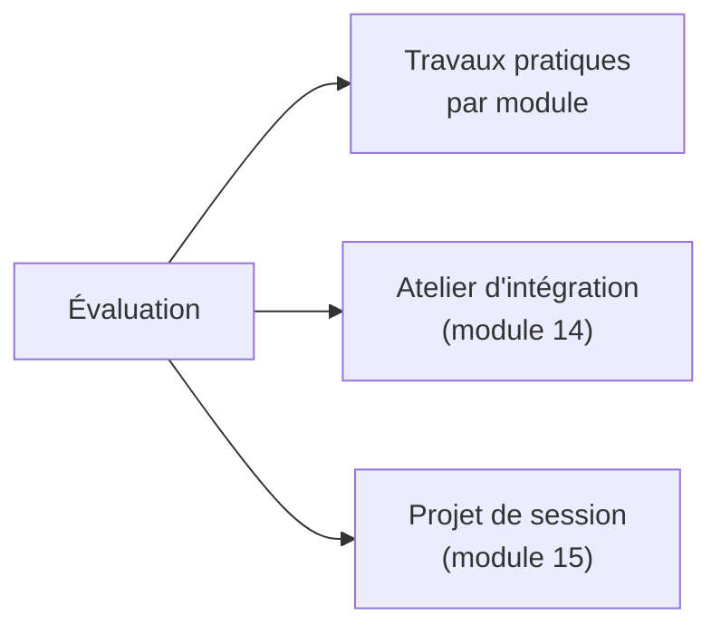
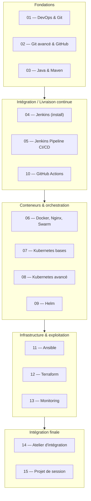
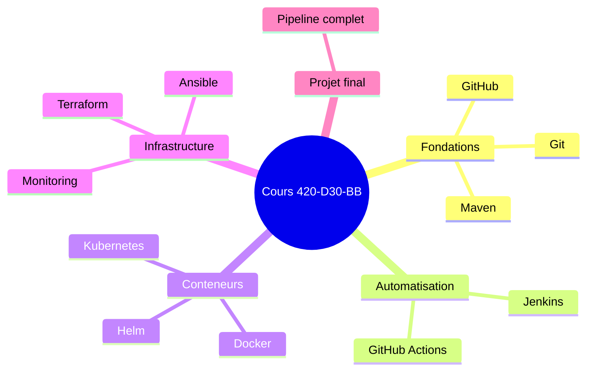

# 01 — Présentation du cours

## Table des matières

| # | Section |
|---|---|
| 1 | [Bienvenue dans le cours](#section-1) |
| 2 | [Objectifs d'apprentissage](#section-2) |
| 3 | [Le fil rouge — du code au déploiement](#section-3) |
| 4 | [Règles du cours et environnement de travail](#section-4) |
| 5 | [Modalités d'évaluation](#section-5) |
| 6 | [Plan de la session — les 15 modules](#section-6) |
| 7 | [Quiz — Comprendre le cadre du cours](#section-7) |
| 8 | [Pratique — Préparer son poste de travail](#section-8) |
| 9 | [Synthèse](#section-9) |

---

1 — Bienvenue dans le cours

 

Ce cours, **Développement et déploiement de solutions de données** (420-D30-BB), vous emmène d'un poste de travail vide jusqu'à une application déployée automatiquement, surveillée et reproductible.

> _L'objectif n'est pas seulement d'apprendre des outils isolés (Git, Docker, Jenkins, Kubernetes…), mais de comprendre **comment ils s'enchaînent** pour livrer un logiciel de manière fiable et répétable._

Vous n'avez pas besoin d'être expert. Vous avez besoin de **curiosité**, d'un peu de rigueur, et de la volonté d'essayer, de casser, et de recommencer. C'est exactement la mentalité DevOps.

<a href="#top">↑ Retour en haut</a>

---

2 — Objectifs d'apprentissage

 

À la fin de la session, vous serez capable de :

| # | Compétence visée |
|---|---|
| 1 | **Versionner** un projet avec Git et collaborer via GitHub |
| 2 | **Construire** un projet Java avec Maven |
| 3 | **Automatiser** les builds et tests avec Jenkins et GitHub Actions |
| 4 | **Conteneuriser** une application avec Docker |
| 5 | **Orchestrer** des conteneurs avec Kubernetes et Helm |
| 6 | **Provisionner** l'infrastructure avec Ansible et Terraform |
| 7 | **Surveiller** une solution en production (monitoring & observabilité) |
| 8 | **Intégrer** tous ces outils dans un pipeline complet de bout en bout |

> _Chaque module ajoute une brique. À la fin, vous aurez assemblé une chaîne DevOps complète — c'est l'objet du projet de session (module 15)._

**🔧 Mini-exercice —** Parmi les 8 compétences du tableau, identifiez celle qui concerne la **surveillance** d'une application en production et nommez le module correspondant.

✅ Voir une solution

Compétence n° 7 : **Surveiller** une solution en production (monitoring & observabilité). Elle est traitée au **module 13** (Monitoring & observabilité).

<a href="#top">↑ Retour en haut</a>

---

3 — Le fil rouge — du code au déploiement

 

Tout au long du cours, nous suivrons le **cycle de vie d'une application**, de l'écriture du code jusqu'à son exploitation en production.

> _Remarquez la **boucle de rétroaction** : le monitoring renvoie de l'information vers le code. C'est le cœur de la culture DevOps que nous verrons à la leçon suivante._

<a href="#top">↑ Retour en haut</a>

---

4 — Règles du cours et environnement de travail

 

### Règles de fonctionnement

- **Pratique d'abord** : chaque concept est suivi d'un exercice. On apprend en faisant.
- **Le droit à l'erreur** : casser un dépôt Git ou un conteneur fait partie de l'apprentissage. Rien n'est irréversible quand on versionne.
- **Travail collaboratif** : Git et GitHub seront utilisés pour rendre les travaux et collaborer.
- **Reproductibilité** : tout doit pouvoir être recréé à partir de zéro (code + scripts), jamais « ça marche sur ma machine ».

### Environnement technique recommandé

| Outil | Usage | Module concerné |
|---|---|---|
| **Git** | Versionnement | 01–02 |
| **Compte GitHub** | Dépôt distant + collaboration | 02 |
| **JDK + Maven** | Build Java | 03 |
| **Docker** | Conteneurisation | 06 |
| **Éditeur (VS Code)** | Écriture du code | tous |

> _Conseil : installez Git et créez votre compte GitHub dès aujourd'hui — c'est la pratique de fin de leçon._

**🔧 Mini-exercice —** Dans le tableau ci-dessus, repérez l'outil utilisé pour la **conteneurisation** et indiquez à quel module il est introduit.

✅ Voir une solution

L'outil est **Docker**, introduit au **module 06**.

<a href="#top">↑ Retour en haut</a>

---

5 — Modalités d'évaluation

 

L'évaluation combine la **pratique continue** et un **projet final intégrateur**.

| Composante | Ce qui est évalué |
|---|---|
| **Travaux pratiques** | Application correcte des outils module par module |
| **Atelier d'intégration** | Capacité à enchaîner plusieurs outils ensemble |
| **Projet de session** | Pipeline DevOps complet, fonctionnel et documenté |

> _Le barème précis est communiqué dans le plan de cours officiel. Cette leçon fixe les attentes générales._

<a href="#top">↑ Retour en haut</a>

---

6 — Plan de la session — les 15 modules

 

| Module | Thème |
|---|---|
| 01 | Introduction au DevOps et Git de base |
| 02 | Git avancé et GitHub |
| 03 | Projets Java avec Maven |
| 04 | Jenkins : installation |
| 05 | Jenkins : pipeline CI/CD |
| 06 | Docker, Nginx, Swarm |
| 07 | Kubernetes : bases |
| 08 | Kubernetes : avancé |
| 09 | Helm |
| 10 | CI/CD avec GitHub Actions |
| 11 | Ansible |
| 12 | Terraform |
| 13 | Monitoring & observabilité |
| 14 | Atelier d'intégration |
| 15 | Projet de session |

**🔧 Mini-exercice —** À l'aide du tableau des 15 modules, citez les **trois outils d'infrastructure et d'exploitation** (modules 11 à 13).

✅ Voir une solution

Module 11 : **Ansible**, module 12 : **Terraform**, module 13 : **Monitoring & observabilité**.

<a href="#top">↑ Retour en haut</a>

---

7 — Quiz — Comprendre le cadre du cours

 

**Question 1 :** Quel est l'objectif global du cours ?

a) Apprendre Git uniquement

b) Maîtriser une chaîne complète du code jusqu'au déploiement surveillé

c) Devenir développeur Java

d) Créer des sites web

💡 Voir la solution

✅ **Réponse : b)** — Le cours couvre toute la chaîne DevOps : versionnement, intégration continue, conteneurs, orchestration, infrastructure as code et monitoring.

---

**Question 2 :** Que représente la « boucle de rétroaction » dans le cycle DevOps ?

a) Le fait de supprimer le code après déploiement

b) Le retour d'information du monitoring vers le développement pour améliorer le produit

c) Une erreur de pipeline

d) Le redémarrage manuel des serveurs

💡 Voir la solution

✅ **Réponse : b)** — L'observabilité renvoie des données (erreurs, performances) vers les équipes, qui ajustent le code. C'est le principe d'amélioration continue.

---

**Question 3 :** Quel principe résume le mieux la philosophie du cours ?

a) « Ça marche sur ma machine »

b) Tout doit être reproductible à partir du code et des scripts

c) On déploie manuellement chaque version

d) On évite d'utiliser des outils

💡 Voir la solution

✅ **Réponse : b)** — La reproductibilité est centrale : code + scripts permettent de tout recréer, sans dépendre d'une configuration manuelle locale.

<a href="#top">↑ Retour en haut</a>

---

8 — Pratique — Préparer son poste de travail

 

### Consigne

Préparez votre environnement pour le reste de la session :

1. Installez **Git** sur votre machine.
2. Créez (ou vérifiez) votre compte **GitHub**.
3. Installez un éditeur de code (**VS Code** recommandé).
4. Vérifiez que vous pouvez ouvrir un terminal.

---

### Correction — Vérifications attendues

| Étape | Commande / action de vérification | Résultat attendu |
|---|---|---|
| Git installé | `git --version` | Affiche un numéro de version (ex. `git version 2.43.0`) |
| Compte GitHub | Connexion sur github.com | Tableau de bord accessible |
| Éditeur | Ouvrir VS Code | L'application démarre |
| Terminal | Ouvrir PowerShell / Terminal | Invite de commande disponible |

> _Si `git --version` ne renvoie rien, c'est que Git n'est pas installé ou pas dans le `PATH` — nous corrigerons cela à la leçon 03 (Git : installation et configuration)._

<a href="#top">↑ Retour en haut</a>

---

9 — Synthèse

 

#### Points à retenir

1. **Le cours est une chaîne**, pas une collection d'outils isolés : du code jusqu'au monitoring.
2. **DevOps = collaboration + automatisation + rétroaction.**
3. **La reproductibilité** est la règle d'or : tout se recrée à partir du code.
4. **On apprend en pratiquant** : chaque leçon a son exercice.
5. **Le projet de session** (module 15) assemblera tout ce que vous aurez appris.

#### La suite

Leçon suivante : **02 — Culture DevOps**, pour comprendre la philosophie avant de plonger dans les outils.

<a href="#top">↑ Retour en haut</a>

---

  <em>Tous droits réservés. Toute reproduction, diffusion, utilisation ou adaptation de ce cours, en tout ou en partie, est strictement interdite sans l'autorisation écrite préalable de Dr. Haythem REHOUMA.</em>

  <strong>Cours créé par Dr. Haythem REHOUMA — Développement et déploiement de solutions de données</strong>

