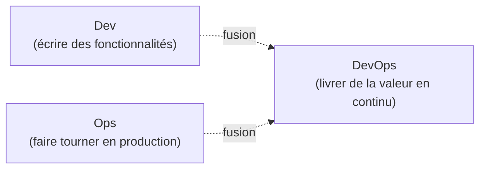
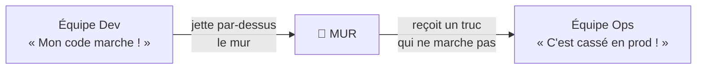
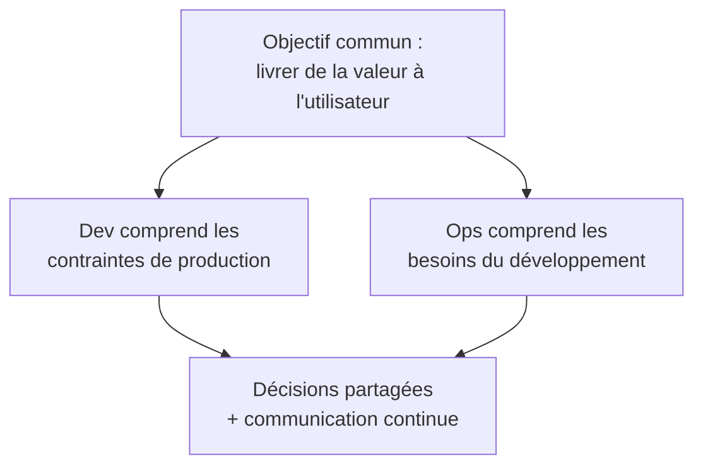
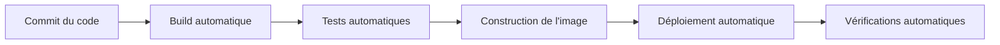
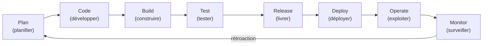
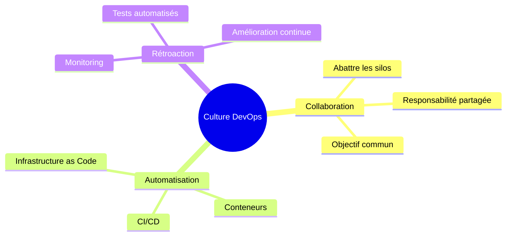

# 02 — Culture DevOps

## Table des matières

| # | Section |
|---|---|
| 1 | [Qu'est-ce que le DevOps ?](#section-1) |
| 2 | [Le mur de la confusion — le problème historique](#section-2) |
| 3 | [Collaboration développement et opérations](#section-3) |
| 4 | [L'automatisation](#section-4) |
| 5 | [La rétroaction rapide](#section-5) |
| 6 | [Le cycle DevOps en boucle infinie](#section-6) |
| 7 | [Les bénéfices concrets](#section-7) |
| 8 | [Quiz — La culture DevOps](#section-8) |
| 9 | [Pratique — Diagnostiquer une organisation](#section-9) |
| 10 | [Synthèse](#section-10) |

---

1 — Qu'est-ce que le DevOps ?

 

Le **DevOps** est une **culture** et un ensemble de pratiques qui rapprochent les équipes de **développement** (*Dev*) et d'**exploitation** (*Ops*) pour livrer des logiciels **plus vite**, **plus souvent** et **plus fiablement**.

> _Le DevOps n'est pas un outil ni un poste. C'est avant tout une **façon de travailler ensemble**. Les outils (Git, Docker, Jenkins…) ne sont que des moyens au service de cette culture._

Le mot lui-même est la fusion de **Dev**eloper + **Op**eration**s** :

### Les trois piliers

| Pilier | Idée centrale |
|---|---|
| **Collaboration** | Dev et Ops partagent la responsabilité du produit |
| **Automatisation** | Les tâches répétitives sont scriptées, pas faites à la main |
| **Rétroaction** | On mesure, on apprend, on améliore en continu |

**🔧 Mini-exercice —** Le mot « DevOps » est la fusion de deux mots. Lesquels, et que désigne chacun ?

✅ Voir une solution

**Dev**eloper (développement : écrire des fonctionnalités) + **Op**eration**s** (exploitation : faire tourner en production).

<a href="#top">↑ Retour en haut</a>

---

2 — Le mur de la confusion — le problème historique

 

Avant le DevOps, les développeurs et les opérationnels travaillaient en **silos** séparés. C'est ce qu'on appelle le **mur de la confusion** (*wall of confusion*).

> _Le développeur livrait son code et passait à autre chose. L'opérationnel devait le faire fonctionner en production, sans toujours comprendre comment. Résultat : conflits, lenteur, et la fameuse phrase « ça marche sur ma machine »._

| Symptôme du silo | Conséquence |
|---|---|
| Dev et Ops ne se parlent pas | Bugs découverts tard, en production |
| Déploiements manuels et rares | Mises en production stressantes et risquées |
| Responsabilités floues | « Ce n'est pas mon problème » des deux côtés |

Le DevOps **abat ce mur** en faisant des deux équipes une seule, partageant les mêmes objectifs et les mêmes outils.

<a href="#top">↑ Retour en haut</a>

---

3 — Collaboration développement et opérations

 

La collaboration signifie que **toute l'équipe est responsable du produit**, de l'écriture du code jusqu'à son bon fonctionnement en production.

**Concrètement, la collaboration se traduit par :**

- Des **outils partagés** : tout le monde utilise Git, le même pipeline, les mêmes tableaux de bord.
- Une **responsabilité partagée** : « you build it, you run it » (qui le construit le fait tourner).
- Une **communication continue** : pas de transfert « par-dessus le mur », mais un travail commun.

> _Analogie : une équipe de cuisine. Le chef (Dev) et le serveur (Ops) ne se renvoient pas la balle — ils visent ensemble la satisfaction du client. Si un plat revient, c'est l'affaire de toute la brigade._

<a href="#top">↑ Retour en haut</a>

---

4 — L'automatisation

 

L'automatisation consiste à **remplacer les tâches manuelles répétitives par des scripts et des outils**. C'est le moteur qui rend le DevOps possible à grande échelle.

**Ce qu'on automatise typiquement :**

| Tâche manuelle | Automatisée avec | Module |
|---|---|---|
| Compiler et tester | Jenkins, GitHub Actions | 04, 05, 10 |
| Empaqueter l'application | Docker | 06 |
| Déployer sur des serveurs | Kubernetes, Helm | 07–09 |
| Configurer l'infrastructure | Ansible, Terraform | 11, 12 |

> _Pourquoi automatiser ? Parce qu'un humain qui répète une tâche fait des erreurs et perd du temps. Une machine exécute la même procédure **mille fois sans se tromper**. C'est plus rapide, plus fiable et reproductible._

**🔧 Mini-exercice —** Donnez deux raisons concrètes pour lesquelles on préfère automatiser une tâche répétitive plutôt que de la faire à la main.

✅ Voir une solution

1. **Fiabilité** : une machine ne fait pas d'erreurs d'inattention, contrairement à un humain qui répète. 2. **Rapidité et reproductibilité** : la même procédure s'exécute identiquement et rapidement, autant de fois que nécessaire.

<a href="#top">↑ Retour en haut</a>

---

5 — La rétroaction rapide

 

La **rétroaction rapide** (*fast feedback*) consiste à **détecter les problèmes le plus tôt possible** et à apprendre vite pour s'améliorer.

| Moment de détection du bug | Coût relatif de correction |
|---|---|
| Pendant le développement | 💲 Faible |
| Pendant les tests automatisés | 💲💲 Modéré |
| En production, signalé par un client | 💲💲💲💲 Très élevé |

**Sources de rétroaction en DevOps :**

- **Tests automatisés** : un échec apparaît en quelques minutes après le commit.
- **Monitoring** : alertes en temps réel quand quelque chose ne va pas (module 13).
- **Logs et métriques** : permettent de comprendre le comportement réel en production.

> _Analogie : un thermostat. Il mesure en continu la température (rétroaction) et ajuste le chauffage immédiatement. Sans cette boucle, on ne saurait que la pièce est trop froide qu'en grelottant._

**🔧 Mini-exercice —** À l'aide du tableau des coûts, indiquez à quel moment la correction d'un bug coûte le plus cher, et pourquoi détecter tôt est préférable.

✅ Voir une solution

C'est **en production, signalé par un client** que la correction coûte le plus cher (💲💲💲💲). Détecter tôt (pendant le développement ou les tests automatisés) réduit fortement le coût, car le problème est corrigé avant d'atteindre les utilisateurs.

<a href="#top">↑ Retour en haut</a>

---

6 — Le cycle DevOps en boucle infinie

 

Le DevOps est souvent représenté par une **boucle infinie** (∞), symbolisant l'amélioration continue : on ne « finit » jamais, on itère sans cesse.

| Phase | Côté | Exemple d'outil |
|---|---|---|
| Plan, Code | **Dev** | Git, GitHub |
| Build, Test | **Dev** | Maven, Jenkins, GitHub Actions |
| Release, Deploy | **Dev + Ops** | Docker, Kubernetes, Helm |
| Operate, Monitor | **Ops** | Ansible, Terraform, outils de monitoring |

> _La moitié gauche est plutôt « Dev », la moitié droite plutôt « Ops » — mais la boucle est unique et partagée. C'est l'essence du DevOps._

<a href="#top">↑ Retour en haut</a>

---

7 — Les bénéfices concrets

 

| Bénéfice | Sans DevOps | Avec DevOps |
|---|---|---|
| **Fréquence des livraisons** | Quelques fois par an | Plusieurs fois par jour |
| **Délai de correction d'un bug** | Jours / semaines | Minutes / heures |
| **Taux d'échec des déploiements** | Élevé | Faible |
| **Stress lors des mises en prod** | Très élevé | Routine maîtrisée |
| **Collaboration des équipes** | Silos, conflits | Objectif commun |

> _Les entreprises les plus performantes déploient des centaines de fois par jour avec un taux d'échec très bas. Ce n'est pas magique : c'est le résultat de la culture + automatisation + rétroaction._

**🔧 Mini-exercice —** D'après le tableau, comparez la **fréquence des livraisons** avec et sans DevOps.

✅ Voir une solution

Sans DevOps : **quelques fois par an**. Avec DevOps : **plusieurs fois par jour**.

<a href="#top">↑ Retour en haut</a>

---

8 — Quiz — La culture DevOps

 

**Question 1 :** Le DevOps est avant tout…

a) Un logiciel à installer

b) Un poste précis dans l'entreprise

c) Une culture et un ensemble de pratiques

d) Un langage de programmation

💡 Voir la solution

✅ **Réponse : c)** — Le DevOps est une culture de collaboration, soutenue par des pratiques (automatisation, rétroaction). Les outils ne sont que des moyens.

---

**Question 2 :** Qu'est-ce que le « mur de la confusion » ?

a) Une faille de sécurité

b) La séparation en silos entre Dev et Ops qui crée des conflits

c) Un type de pare-feu

d) Une étape du pipeline

💡 Voir la solution

✅ **Réponse : b)** — C'est la séparation historique entre développement et opérations, où chacun « jette » le travail par-dessus le mur. Le DevOps l'abat.

---

**Question 3 :** Pourquoi l'automatisation est-elle centrale en DevOps ?

a) Pour supprimer tous les emplois

b) Parce qu'elle rend les tâches répétitives rapides, fiables et reproductibles

c) Parce qu'elle est obligatoire par la loi

d) Pour ralentir les déploiements

💡 Voir la solution

✅ **Réponse : b)** — Une machine exécute la même procédure sans erreur ni fatigue, ce qui rend les livraisons fréquentes possibles.

---

**Question 4 :** Quel est l'intérêt de la rétroaction rapide ?

a) Détecter et corriger les problèmes tôt, quand ils coûtent moins cher

b) Éviter d'écrire des tests

c) Réduire la collaboration

d) Déployer une seule fois par an

💡 Voir la solution

✅ **Réponse : a)** — Plus un bug est détecté tôt, moins il coûte. Tests automatisés et monitoring fournissent cette rétroaction.

---

**Question 5 :** Que symbolise la boucle infinie du DevOps ?

a) Que le travail ne finit jamais et qu'on tourne en rond

b) L'amélioration continue et l'itération sans fin du cycle Plan → Monitor → Plan

c) Une erreur dans le pipeline

d) Le redémarrage des serveurs

💡 Voir la solution

✅ **Réponse : b)** — La boucle ∞ représente l'amélioration continue : chaque cycle alimente le suivant grâce à la rétroaction.

<a href="#top">↑ Retour en haut</a>

---

9 — Pratique — Diagnostiquer une organisation

 

### Consigne

Une entreprise fictive, **DataCorp**, livre son application **deux fois par an**. Chaque mise en production prend un week-end entier, échoue souvent, et l'équipe Ops accuse l'équipe Dev (et inversement). Les bugs remontés par les clients prennent des semaines à être corrigés.

**Identifiez 3 problèmes** et proposez **une pratique DevOps** pour chacun.

---

### Correction proposée

| Problème observé | Cause | Pratique DevOps à appliquer |
|---|---|---|
| Livraisons rares (2×/an) et risquées | Déploiements manuels, en gros lots | **Automatisation** du pipeline CI/CD → livraisons fréquentes et petites |
| Dev et Ops s'accusent mutuellement | Silos, « mur de la confusion » | **Collaboration** : responsabilité partagée, objectifs communs |
| Bugs clients corrigés en semaines | Pas de détection précoce | **Rétroaction rapide** : tests automatisés + monitoring |

**Conclusion attendue :** DataCorp souffre d'un déficit sur les **trois piliers**. En automatisant les déploiements, en cassant les silos et en mettant en place des tests + du monitoring, elle passerait de 2 livraisons par an à des livraisons fréquentes, fiables et peu stressantes.

> _Astuce : tout problème DevOps se ramène presque toujours à un manque dans l'un des trois piliers — collaboration, automatisation ou rétroaction._

<a href="#top">↑ Retour en haut</a>

---

10 — Synthèse

 

#### Points à retenir

1. **Le DevOps est une culture**, pas un outil : il unit Dev et Ops autour d'un produit commun.
2. **Trois piliers** : collaboration, automatisation, rétroaction.
3. **Le mur de la confusion** est le problème que le DevOps résout.
4. **Automatiser** rend les livraisons fréquentes et fiables.
5. **La rétroaction rapide** détecte les problèmes tôt — quand ils coûtent le moins cher.
6. **La boucle infinie** symbolise l'amélioration continue.

#### La suite

Place à la pratique : leçon **03 — Git : installation et configuration**, le premier outil concret du cours.

<a href="#top">↑ Retour en haut</a>

---

  <em>Tous droits réservés. Toute reproduction, diffusion, utilisation ou adaptation de ce cours, en tout ou en partie, est strictement interdite sans l'autorisation écrite préalable de Dr. Haythem REHOUMA.</em>

  <strong>Cours créé par Dr. Haythem REHOUMA — Développement et déploiement de solutions de données</strong>

