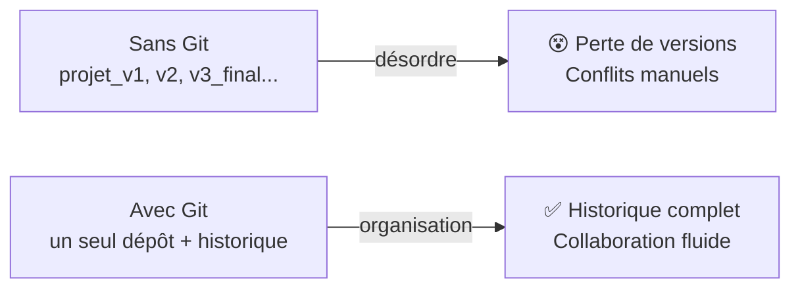
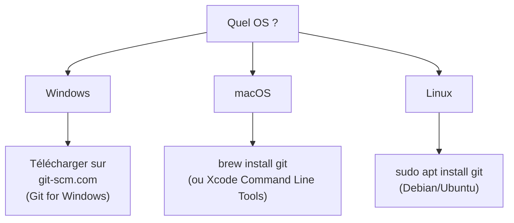
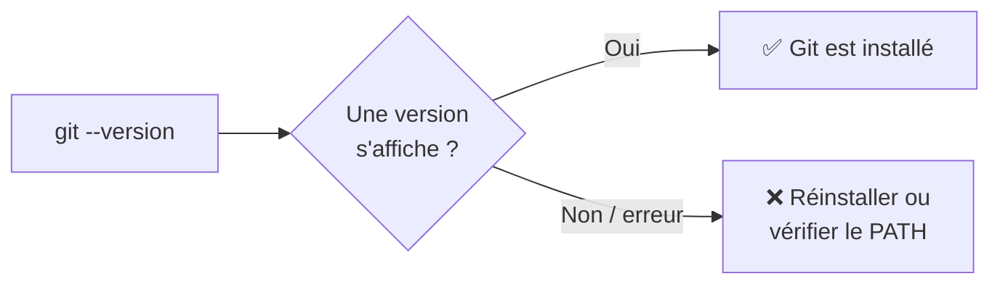
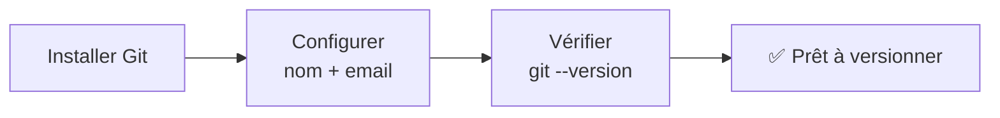

<a id="top"></a>

# 03 — Git : installation et configuration

## Table des matières

| # | Section |
|---|---|
| 1 | [Pourquoi Git ?](#section-1) |
| 2 | [Installation de Git](#section-2) |
| 3 | [Configuration initiale](#section-3) |
| 4 | [Vérifier l'installation](#section-4) |
| 5 | [Aller plus loin — alias et éditeur par défaut](#section-5) |
| 6 | [Quiz — Installation et configuration](#section-6) |
| 7 | [Pratique — Configurer son Git](#section-7) |
| 8 | [Synthèse](#section-8) |

---

<a id="section-1"></a>

<details>
<summary>1 — Pourquoi Git ?</summary>

<br/>

**Git** est un **système de contrôle de version distribué** (*VCS*). Il enregistre l'historique de votre code : chaque modification, qui l'a faite, quand et pourquoi.

> _Sans Git, on bricole avec des dossiers `projet_final`, `projet_final_v2`, `projet_final_vraiment_final`… Git remplace ce chaos par un historique propre et navigable._



**Ce que Git permet :**

- **Revenir en arrière** à n'importe quelle version antérieure.
- **Travailler à plusieurs** sans s'écraser mutuellement (branches, fusions).
- **Tracer** chaque changement (qui, quoi, quand, pourquoi).
- **Servir de socle** à tout le DevOps : CI/CD, déploiements, collaboration.

> _Git est **distribué** : chaque personne possède une copie complète du dépôt, historique inclus. Pas besoin d'être connecté à un serveur pour travailler._

</details>

<p align="right"><a href="#top">↑ Retour en haut</a></p>

---

<a id="section-2"></a>

<details>
<summary>2 — Installation de Git</summary>

<br/>

L'installation dépend de votre système d'exploitation.



### Windows

Téléchargez **Git for Windows** depuis [git-scm.com](https://git-scm.com). L'installeur fournit aussi **Git Bash**, un terminal pratique.

### macOS

```bash
# Avec Homebrew
brew install git
```

### Linux (Debian / Ubuntu)

```bash
sudo apt update
sudo apt install git
```

### Linux (Red Hat / Fedora)

```bash
sudo dnf install git
```

> _Conseil : acceptez les options par défaut de l'installeur Windows, sauf si vous savez ce que vous changez. Elles conviennent à la grande majorité des cas._

**🔧 Mini-exercice —** Écrivez la commande d'installation de Git sur une distribution Linux **Debian/Ubuntu**.

<details>
<summary>✅ Voir une solution</summary>

```bash
sudo apt update
sudo apt install git
```

</details>

</details>

<p align="right"><a href="#top">↑ Retour en haut</a></p>

---

<a id="section-3"></a>

<details>
<summary>3 — Configuration initiale</summary>

<br/>

Avant le premier commit, Git a besoin de savoir **qui vous êtes**. Ces informations apparaîtront dans l'historique de chaque commit.

```bash
# Votre nom (visible dans l'historique des commits)
git config --global user.name "Prénom Nom"

# Votre courriel (idéalement le même que sur GitHub)
git config --global user.email "vous@exemple.com"
```

| Option | Portée | Fichier concerné |
|---|---|---|
| `--global` | Tous vos dépôts (votre utilisateur) | `~/.gitconfig` |
| `--local` (par défaut) | Le dépôt courant uniquement | `.git/config` |
| `--system` | Tous les utilisateurs de la machine | config système |

### Quelques réglages recommandés

```bash
# Définir la branche par défaut sur "main"
git config --global init.defaultBranch main

# Gérer les fins de ligne (important sous Windows)
git config --global core.autocrlf true
```

> _La configuration `--global` se fait **une seule fois** par machine. Ensuite, tous vos dépôts en héritent automatiquement._

**🔧 Mini-exercice —** Écrivez les deux commandes qui configurent en global votre **nom** et votre **courriel** Git.

<details>
<summary>✅ Voir une solution</summary>

```bash
git config --global user.name "Prénom Nom"
git config --global user.email "vous@exemple.com"
```

</details>

</details>

<p align="right"><a href="#top">↑ Retour en haut</a></p>

---

<a id="section-4"></a>

<details>
<summary>4 — Vérifier l'installation</summary>

<br/>

```bash
# Vérifier la version installée
git --version
# → git version 2.43.0  (ou similaire)

# Vérifier votre configuration
git config --list

# Vérifier un réglage précis
git config user.name
git config user.email
```



> _Si `git --version` renvoie « commande introuvable », Git n'est pas installé, ou son dossier n'est pas dans la variable `PATH`. Sous Windows, relancer un nouveau terminal après l'installation résout souvent le problème._

**🔧 Mini-exercice —** Lancez la commande qui affiche la **version de Git** installée sur votre machine.

<details>
<summary>✅ Voir une solution</summary>

```bash
git --version
# → git version 2.43.0 (ou similaire)
```

</details>

</details>

<p align="right"><a href="#top">↑ Retour en haut</a></p>

---

<a id="section-5"></a>

<details>
<summary>5 — Aller plus loin — alias et éditeur par défaut</summary>

<br/>

### Définir l'éditeur par défaut

Git ouvre parfois un éditeur (pour rédiger un message de commit, par exemple).

```bash
# Utiliser VS Code comme éditeur Git
git config --global core.editor "code --wait"
```

### Créer des alias (raccourcis)

```bash
git config --global alias.st status
git config --global alias.co checkout
git config --global alias.br branch
git config --global alias.lg "log --oneline --graph --all"
```

Ensuite, `git st` équivaut à `git status`, `git lg` affiche un joli graphe de l'historique, etc.

| Alias | Équivaut à | Gain |
|---|---|---|
| `git st` | `git status` | Plus court |
| `git co` | `git checkout` | Plus court |
| `git lg` | `git log --oneline --graph --all` | Historique lisible |

> _Les alias sont un petit confort qui fait gagner du temps tous les jours. Optionnels, mais appréciés._

**🔧 Mini-exercice —** Créez un alias global `st` qui exécute `git status`, puis indiquez comment l'utiliser.

<details>
<summary>✅ Voir une solution</summary>

```bash
git config --global alias.st status
```

Ensuite, `git st` équivaut à `git status`.

</details>

</details>

<p align="right"><a href="#top">↑ Retour en haut</a></p>

---

<a id="section-6"></a>

<details>
<summary>6 — Quiz — Installation et configuration</summary>

<br/>

**Question 1 :** Quelle commande affiche la version de Git installée ?

a) `git version --check`

b) `git --version`

c) `git -v install`

d) `git status`

<details>
<summary>💡 Voir la solution</summary>

✅ **Réponse : b)** — `git --version` affiche la version (ex. `git version 2.43.0`) et confirme que Git est bien installé.

</details>

---

**Question 2 :** À quoi sert `git config --global user.email "..."` ?

a) À se connecter à GitHub

b) À enregistrer le courriel associé à vos commits, pour tous vos dépôts

c) À envoyer un email automatique

d) À supprimer un dépôt

<details>
<summary>💡 Voir la solution</summary>

✅ **Réponse : b)** — Avec `--global`, ce courriel sera attaché à vos commits dans tous vos dépôts de la machine.

</details>

---

**Question 3 :** Que fait l'option `--global` ?

a) Applique le réglage à tous les dépôts de votre utilisateur

b) Applique le réglage uniquement au dépôt courant

c) Partage le réglage avec le monde entier

d) Supprime la configuration

<details>
<summary>💡 Voir la solution</summary>

✅ **Réponse : a)** — `--global` écrit dans `~/.gitconfig` et s'applique à tous vos dépôts. Sans option, le réglage est local au dépôt courant.

</details>

---

**Question 4 :** Que signifie « Git est distribué » ?

a) Git est payant

b) Chaque utilisateur possède une copie complète du dépôt, historique inclus

c) Git ne fonctionne qu'en ligne

d) Git efface l'historique à chaque commit

<details>
<summary>💡 Voir la solution</summary>

✅ **Réponse : b)** — Contrairement aux VCS centralisés, chacun a une copie intégrale et peut travailler hors ligne.

</details>

</details>

<p align="right"><a href="#top">↑ Retour en haut</a></p>

---

<a id="section-7"></a>

<details>
<summary>7 — Pratique — Configurer son Git</summary>

<br/>

### Consigne

1. Installez Git si ce n'est pas déjà fait.
2. Configurez votre **nom** et votre **courriel** en global.
3. Définissez `main` comme branche par défaut.
4. Vérifiez l'ensemble de votre configuration.

---

### Correction — Suite de commandes attendue

```bash
# 1. Vérifier l'installation
git --version

# 2. Configurer l'identité
git config --global user.name "Prénom Nom"
git config --global user.email "vous@exemple.com"

# 3. Branche par défaut
git config --global init.defaultBranch main

# 4. Vérifier
git config --list
```

**Résultat attendu de `git config --list` :**

```
user.name=Prénom Nom
user.email=vous@exemple.com
init.defaultbranch=main
core.autocrlf=true
```

> _Si votre nom et votre courriel apparaissent, votre Git est prêt. Vous pouvez passer à la création de votre premier dépôt local (leçon 04)._

</details>

<p align="right"><a href="#top">↑ Retour en haut</a></p>

---

<a id="section-8"></a>

<details>
<summary>8 — Synthèse</summary>

<br/>

#### Points à retenir

1. **Git** est un système de contrôle de version **distribué** : chacun a une copie complète.
2. **Installation** : `git-scm.com` (Windows), `brew`/`apt`/`dnf` (macOS/Linux).
3. **Configuration minimale** : `user.name` et `user.email` en `--global`.
4. **Vérification** : `git --version` et `git config --list`.
5. **Confort optionnel** : éditeur par défaut et alias.



#### La suite

Leçon **04 — Dépôt local et commits** : créer votre premier dépôt et enregistrer vos premiers changements.

</details>

<p align="right"><a href="#top">↑ Retour en haut</a></p>

---

<p align="center">
  <em>Tous droits réservés. Toute reproduction, diffusion, utilisation ou adaptation de ce cours, en tout ou en partie, est strictement interdite sans l'autorisation écrite préalable de Dr. Haythem REHOUMA.</em>
</p>

<p align="center">
  <strong>Cours créé par Dr. Haythem REHOUMA — Développement et déploiement de solutions de données</strong>
</p>
