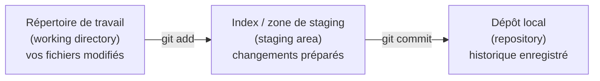
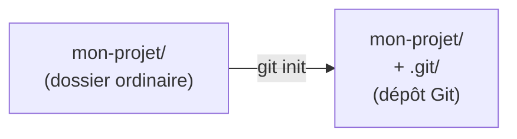
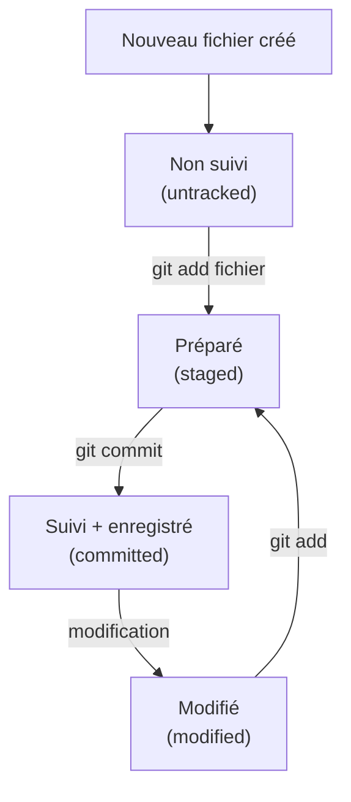
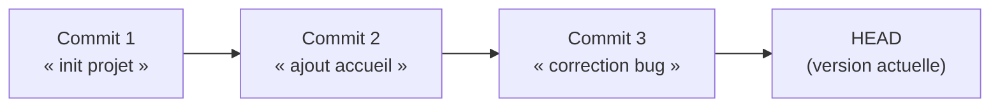
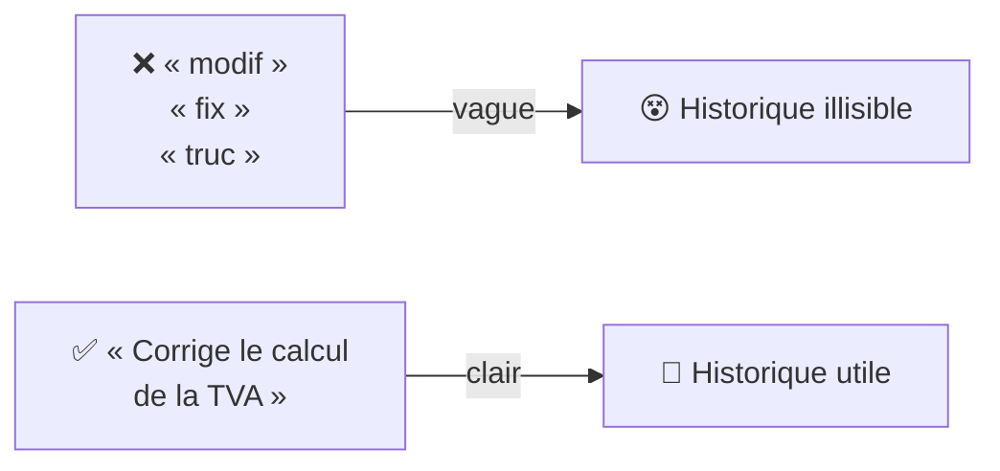
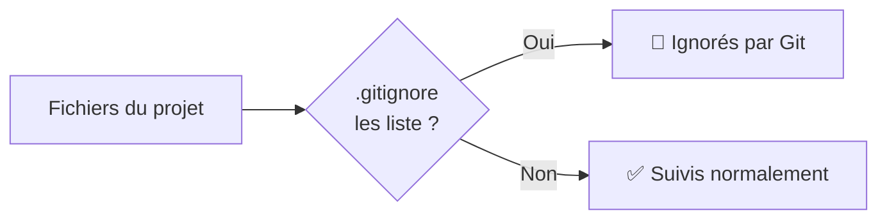
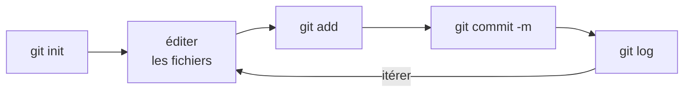

<a id="top"></a>

# 04 — Dépôt local et commits

## Table des matières

| # | Section |
|---|---|
| 1 | [Les trois zones de Git](#section-1) |
| 2 | [Initialiser un dépôt local](#section-2) |
| 3 | [Suivi des fichiers](#section-3) |
| 4 | [Créer un commit](#section-4) |
| 5 | [Bonnes pratiques de messages](#section-5) |
| 6 | [Le fichier .gitignore](#section-6) |
| 7 | [Quiz — Dépôt local et commits](#section-7) |
| 8 | [Pratique — Votre premier dépôt](#section-8) |
| 9 | [Synthèse](#section-9) |

---

<a id="section-1"></a>

<details>
<summary>1 — Les trois zones de Git</summary>

<br/>

Pour comprendre les commits, il faut d'abord visualiser les **trois zones** dans lesquelles Git fait transiter vos fichiers.



| Zone | Description | Commande pour y entrer |
|---|---|---|
| **Répertoire de travail** | Vos fichiers tels que vous les éditez | (édition directe) |
| **Zone de staging (index)** | Les changements que vous *préparez* à enregistrer | `git add` |
| **Dépôt local** | L'historique permanent des commits | `git commit` |

> _Analogie : préparer un colis. Le **répertoire de travail** est votre bureau en désordre ; la **zone de staging** est la boîte où vous placez ce que vous voulez envoyer ; le **commit** est le moment où vous scellez la boîte et l'archivez._

</details>

<p align="right"><a href="#top">↑ Retour en haut</a></p>

---

<a id="section-2"></a>

<details>
<summary>2 — Initialiser un dépôt local</summary>

<br/>

Pour transformer un dossier ordinaire en dépôt Git :

```bash
# Se placer dans le dossier du projet
cd mon-projet

# Initialiser le dépôt
git init
```

Cela crée un sous-dossier caché **`.git/`** qui contient tout l'historique et la configuration du dépôt.



```bash
# Vérifier l'état du dépôt fraîchement créé
git status
```

> _⚠️ Ne supprimez jamais le dossier `.git/` : il **contient tout l'historique**. Le supprimer revient à perdre le versionnement (mais pas vos fichiers actuels)._

**🔧 Mini-exercice —** Écrivez la commande qui transforme le dossier courant en dépôt Git, puis celle qui affiche son état.

<details>
<summary>✅ Voir une solution</summary>

```bash
git init
git status
```

</details>

</details>

<p align="right"><a href="#top">↑ Retour en haut</a></p>

---

<a id="section-3"></a>

<details>
<summary>3 — Suivi des fichiers</summary>

<br/>

Un fichier peut être **suivi** (*tracked*) ou **non suivi** (*untracked*) par Git.



```bash
# Préparer un fichier précis
git add fichier.txt

# Préparer tous les changements du dossier
git add .

# Voir l'état (suivi / non suivi / préparé)
git status
```

| Commande | Effet |
|---|---|
| `git add fichier.txt` | Prépare un fichier précis |
| `git add .` | Prépare tous les fichiers modifiés/nouveaux |
| `git restore --staged fichier.txt` | Retire un fichier de la zone de staging |
| `git status` | Affiche l'état de chaque fichier |

> _`git status` est votre meilleur ami : utilisez-le **avant et après** chaque `git add` pour voir exactement ce que Git s'apprête à enregistrer._

**🔧 Mini-exercice —** Vous venez de modifier `index.html` et `style.css`. Écrivez la commande qui prépare (stage) **uniquement** `index.html`.

<details>
<summary>✅ Voir une solution</summary>

```bash
git add index.html
```

</details>

</details>

<p align="right"><a href="#top">↑ Retour en haut</a></p>

---

<a id="section-4"></a>

<details>
<summary>4 — Créer un commit</summary>

<br/>

Un **commit** est un **instantané** (*snapshot*) de votre projet à un instant donné, accompagné d'un message qui explique le changement.

```bash
# Préparer puis enregistrer
git add .
git commit -m "Ajout de la page d'accueil"
```



Chaque commit possède :

| Élément | Description |
|---|---|
| Un **identifiant** (hash) | Ex. `a1b2c3d…` — unique |
| Un **auteur** | Votre nom + courriel (config de la leçon 03) |
| Une **date** | Horodatage du commit |
| Un **message** | La description du changement |
| Un **parent** | Le commit précédent (chaîne d'historique) |

```bash
# Voir l'historique des commits
git log
git log --oneline   # version compacte
```

> _Un bon commit est **atomique** : il fait une seule chose cohérente. Évitez le commit fourre-tout « plein de trucs » — préférez plusieurs petits commits clairs._

**🔧 Mini-exercice —** Préparez tous vos changements et créez un commit dont le message est « Ajoute la page de contact ».

<details>
<summary>✅ Voir une solution</summary>

```bash
git add .
git commit -m "Ajoute la page de contact"
```

</details>

</details>

<p align="right"><a href="#top">↑ Retour en haut</a></p>

---

<a id="section-5"></a>

<details>
<summary>5 — Bonnes pratiques de messages</summary>

<br/>

Le message de commit raconte **l'histoire du projet**. Un bon message fait gagner des heures à toute l'équipe (et à vous-même dans 6 mois).

### Règles de base

- Écrire à l'**impératif présent** : « Ajoute… », « Corrige… », « Supprime… ».
- Une **ligne de résumé** courte (≤ 50 caractères), puis un corps détaillé si besoin.
- Expliquer le **pourquoi**, pas seulement le quoi.



### Comparaison

| ❌ Mauvais message | ✅ Bon message |
|---|---|
| `update` | `Met à jour la dépendance Maven vers 3.9` |
| `fix bug` | `Corrige le crash au démarrage si config absente` |
| `wip` | `Ajoute la validation du formulaire de connexion` |

### Convention courante (Conventional Commits)

```
feat: ajoute l'authentification par jeton
fix: corrige la pagination des résultats
docs: complète le README d'installation
```

> _Astuce mnémotechnique : un bon message doit compléter la phrase « Si j'applique ce commit, il va… ». Exemple : « …**ajouter la page d'accueil** »._

</details>

<p align="right"><a href="#top">↑ Retour en haut</a></p>

---

<a id="section-6"></a>

<details>
<summary>6 — Le fichier .gitignore</summary>

<br/>

Certains fichiers **ne doivent jamais être versionnés** : fichiers temporaires, dépendances volumineuses, secrets, fichiers compilés. Le fichier **`.gitignore`** indique à Git de les ignorer.

```bash
# Exemple de contenu d'un fichier .gitignore
target/
node_modules/
*.log
.env
.DS_Store
```

| À ignorer | Pourquoi |
|---|---|
| `node_modules/`, `target/` | Reconstruits automatiquement, volumineux |
| `.env`, `*.key` | **Secrets** — jamais dans Git ! |
| `*.log`, `*.tmp` | Fichiers temporaires sans valeur |



> _⚠️ Règle d'or de sécurité : **ne jamais committer de mots de passe, clés API ou secrets**. Une fois dans l'historique Git, un secret y reste — même supprimé plus tard. Mettez `.env` dans `.gitignore` dès le départ._

**🔧 Mini-exercice —** Écrivez la ligne à ajouter dans un `.gitignore` pour empêcher Git de versionner le fichier de secrets `.env`.

<details>
<summary>✅ Voir une solution</summary>

```
.env
```

</details>

</details>

<p align="right"><a href="#top">↑ Retour en haut</a></p>

---

<a id="section-7"></a>

<details>
<summary>7 — Quiz — Dépôt local et commits</summary>

<br/>

**Question 1 :** Quelle commande transforme un dossier ordinaire en dépôt Git ?

a) `git start`

b) `git init`

c) `git new`

d) `git create`

<details>
<summary>💡 Voir la solution</summary>

✅ **Réponse : b)** — `git init` crée le sous-dossier `.git/` qui contient l'historique et fait du dossier un dépôt.

</details>

---

**Question 2 :** Quel est l'ordre correct des trois zones de Git ?

a) Dépôt → staging → répertoire de travail

b) Répertoire de travail → staging → dépôt local

c) Staging → dépôt → répertoire de travail

d) Répertoire de travail → dépôt → staging

<details>
<summary>💡 Voir la solution</summary>

✅ **Réponse : b)** — On édite (répertoire de travail), on prépare avec `git add` (staging), puis on enregistre avec `git commit` (dépôt local).

</details>

---

**Question 3 :** À quoi sert `git add` ?

a) À créer un commit

b) À préparer des changements dans la zone de staging

c) À supprimer un fichier

d) À envoyer le code sur GitHub

<details>
<summary>💡 Voir la solution</summary>

✅ **Réponse : b)** — `git add` déplace les changements du répertoire de travail vers la zone de staging, avant le commit.

</details>

---

**Question 4 :** Lequel est un bon message de commit ?

a) `truc`

b) `wip`

c) `Corrige le crash au démarrage si la config est absente`

d) `.`

<details>
<summary>💡 Voir la solution</summary>

✅ **Réponse : c)** — Il est clair, à l'impératif, et explique le changement. Les autres sont vagues et inutiles dans l'historique.

</details>

---

**Question 5 :** Pourquoi utiliser un `.gitignore` ?

a) Pour accélérer l'ordinateur

b) Pour empêcher Git de versionner certains fichiers (temporaires, secrets, dépendances)

c) Pour supprimer l'historique

d) Pour ignorer les commits

<details>
<summary>💡 Voir la solution</summary>

✅ **Réponse : b)** — `.gitignore` liste les fichiers que Git doit ignorer, notamment les secrets (`.env`) et les dossiers reconstructibles (`node_modules/`).

</details>

</details>

<p align="right"><a href="#top">↑ Retour en haut</a></p>

---

<a id="section-8"></a>

<details>
<summary>8 — Pratique — Votre premier dépôt</summary>

<br/>

### Consigne

Créez un dépôt local, ajoutez un fichier, ignorez un fichier secret, et faites deux commits propres.

---

### Correction — Suite de commandes attendue

```bash
# 1. Créer et entrer dans le dossier
mkdir mon-premier-depot
cd mon-premier-depot

# 2. Initialiser le dépôt
git init

# 3. Créer un fichier de contenu et un .gitignore
echo "# Mon projet" > README.md
echo ".env" > .gitignore
echo "SECRET=123" > .env        # ce fichier doit être ignoré

# 4. Vérifier l'état (.env ne doit PAS apparaître)
git status

# 5. Premier commit
git add README.md .gitignore
git commit -m "Initialise le projet avec README et gitignore"

# 6. Modifier puis second commit
echo "Description du projet" >> README.md
git add README.md
git commit -m "Complète la description dans le README"

# 7. Consulter l'historique
git log --oneline
```

**Résultat attendu :**

```
b2c3d4e Complète la description dans le README
a1b2c3d Initialise le projet avec README et gitignore
```

> _Vérifiez que `.env` **n'apparaît jamais** dans `git status` : c'est la preuve que votre `.gitignore` fonctionne et que votre secret est protégé._

</details>

<p align="right"><a href="#top">↑ Retour en haut</a></p>

---

<a id="section-9"></a>

<details>
<summary>9 — Synthèse</summary>

<br/>

#### Points à retenir

1. **Trois zones** : répertoire de travail → staging (`git add`) → dépôt local (`git commit`).
2. **`git init`** crée le dépôt (dossier `.git/`).
3. **Un commit** est un instantané + un message, relié au commit parent.
4. **Bons messages** : impératif, clairs, atomiques, expliquant le pourquoi.
5. **`.gitignore`** protège les secrets et exclut les fichiers inutiles.



#### La suite

Leçon **05 — Branches et historique** : travailler sur plusieurs versions en parallèle sans casser la version principale.

</details>

<p align="right"><a href="#top">↑ Retour en haut</a></p>

---

<p align="center">
  <em>Tous droits réservés. Toute reproduction, diffusion, utilisation ou adaptation de ce cours, en tout ou en partie, est strictement interdite sans l'autorisation écrite préalable de Dr. Haythem REHOUMA.</em>
</p>

<p align="center">
  <strong>Cours créé par Dr. Haythem REHOUMA — Développement et déploiement de solutions de données</strong>
</p>
