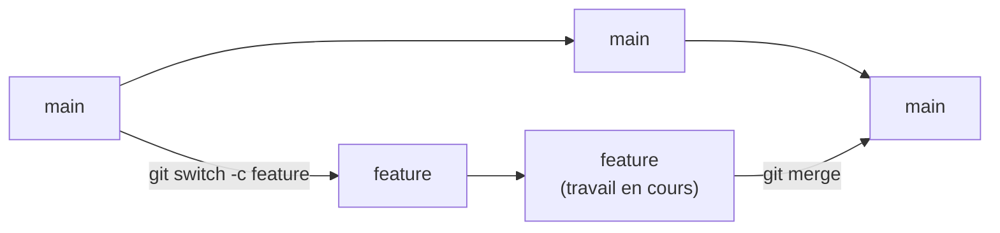
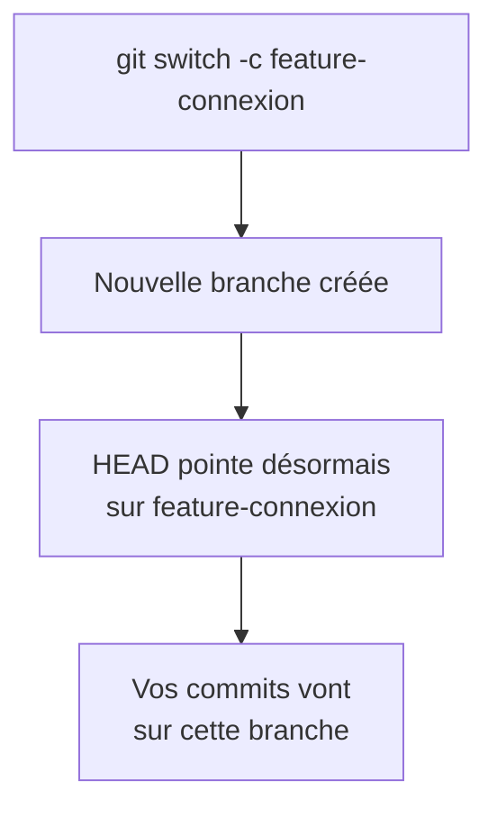
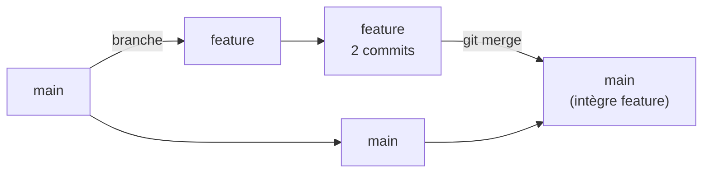
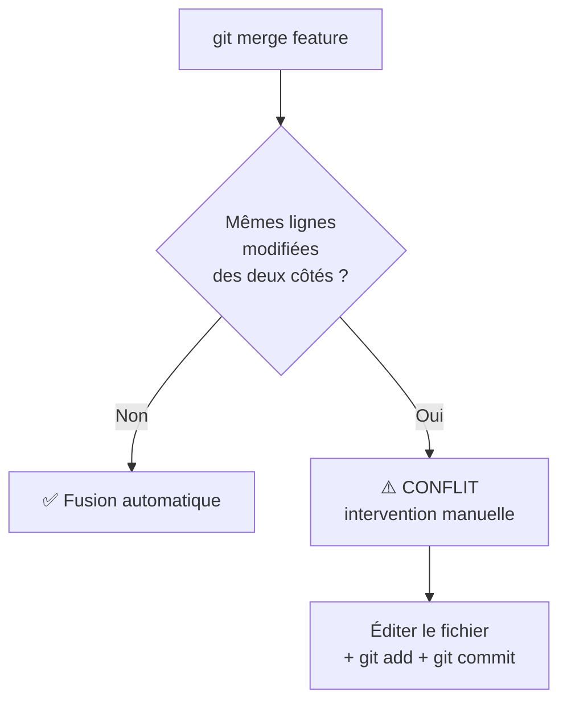
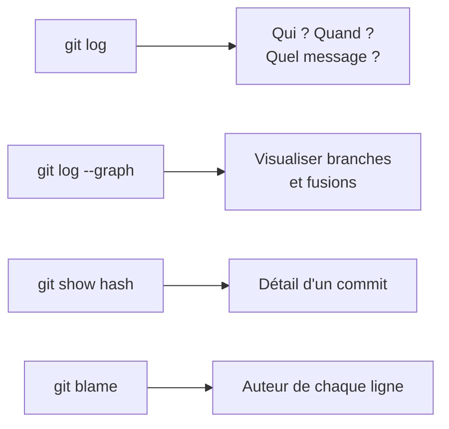
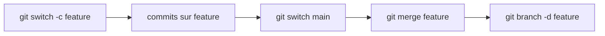

<a id="top"></a>

# 05 — Branches et historique

## Table des matières

| # | Section |
|---|---|
| 1 | [Pourquoi des branches ?](#section-1) |
| 2 | [Créer et changer de branche](#section-2) |
| 3 | [Fusionner une branche](#section-3) |
| 4 | [Gérer un conflit de fusion](#section-4) |
| 5 | [Consulter l'historique](#section-5) |
| 6 | [Quiz — Branches et historique](#section-6) |
| 7 | [Pratique — Une fonctionnalité sur sa branche](#section-7) |
| 8 | [Synthèse](#section-8) |

---

<a id="section-1"></a>

<details>
<summary>1 — Pourquoi des branches ?</summary>

<br/>

Une **branche** est une ligne de développement **indépendante**. Elle vous permet de travailler sur une nouvelle fonctionnalité **sans toucher** à la version principale (`main`), qui reste stable.



> _Analogie : un document partagé. Plutôt que d'éditer directement la version officielle (risque de tout casser), vous travaillez sur une **copie de travail** (la branche). Une fois satisfait, vous fusionnez vos changements dans l'original._

**Pourquoi c'est essentiel :**

- **Isolation** : un travail expérimental ne casse jamais la version stable.
- **Collaboration** : chacun travaille sur sa branche, sans se gêner.
- **Organisation** : une branche = une fonctionnalité ou un correctif.

| Branche typique | Rôle |
|---|---|
| `main` | Version stable, prête à livrer |
| `feature/...` | Nouvelle fonctionnalité en cours |
| `fix/...` | Correction de bug |

</details>

<p align="right"><a href="#top">↑ Retour en haut</a></p>

---

<a id="section-2"></a>

<details>
<summary>2 — Créer et changer de branche</summary>

<br/>

```bash
# Lister les branches (l'actuelle est marquée d'un *)
git branch

# Créer une branche
git branch feature-connexion

# Changer de branche
git switch feature-connexion

# Créer ET basculer en une seule commande (recommandé)
git switch -c feature-connexion
```



| Commande moderne | Ancienne équivalente | Effet |
|---|---|---|
| `git switch nom` | `git checkout nom` | Basculer sur une branche |
| `git switch -c nom` | `git checkout -b nom` | Créer et basculer |
| `git branch` | — | Lister les branches |
| `git branch -d nom` | — | Supprimer une branche fusionnée |

> _`git switch` est la commande **moderne** dédiée aux branches. `git checkout` fonctionne encore mais fait trop de choses à la fois — préférez `switch` pour les branches._

**🔧 Mini-exercice —** Écrivez la commande qui crée la branche `feature-login` **et** bascule dessus en une seule opération.

<details>
<summary>✅ Voir une solution</summary>

```bash
git switch -c feature-login
```

</details>

</details>

<p align="right"><a href="#top">↑ Retour en haut</a></p>

---

<a id="section-3"></a>

<details>
<summary>3 — Fusionner une branche</summary>

<br/>

**Fusionner** (*merge*), c'est intégrer les changements d'une branche dans une autre — typiquement, ramener votre fonctionnalité terminée dans `main`.

```bash
# 1. Se placer sur la branche qui va RECEVOIR les changements
git switch main

# 2. Fusionner la branche de fonctionnalité dedans
git merge feature-connexion
```



| Type de fusion | Quand ? | Résultat |
|---|---|---|
| **Fast-forward** | `main` n'a pas bougé depuis la branche | `main` avance simplement |
| **Merge commit** | `main` a aussi évolué | Un commit de fusion réunit les deux histoires |

```bash
# Après une fusion réussie, on peut supprimer la branche
git branch -d feature-connexion
```

> _Règle simple : on se place **sur la branche de destination** (`main`), puis on fusionne la branche **source** dedans. « Je suis sur main, j'aspire feature »._

**🔧 Mini-exercice —** Vous êtes sur `feature-login` et le travail est terminé. Écrivez les deux commandes pour fusionner cette branche dans `main`.

<details>
<summary>✅ Voir une solution</summary>

```bash
git switch main
git merge feature-login
```

</details>

</details>

<p align="right"><a href="#top">↑ Retour en haut</a></p>

---

<a id="section-4"></a>

<details>
<summary>4 — Gérer un conflit de fusion</summary>

<br/>

Un **conflit** survient quand deux branches ont modifié **la même ligne** d'un même fichier. Git ne peut pas choisir à votre place : il vous demande de trancher.



Git insère des marqueurs dans le fichier en conflit :

```
<<<<<<< HEAD
texte de la branche actuelle (main)
=======
texte de la branche fusionnée (feature)
>>>>>>> feature-connexion
```

**Pour résoudre :**

1. Ouvrir le fichier, **choisir** le bon contenu (ou combiner les deux).
2. **Supprimer** les marqueurs `<<<<<<<`, `=======`, `>>>>>>>`.
3. `git add fichier` puis `git commit` pour finaliser la fusion.

> _Un conflit n'est pas une erreur grave : c'est Git qui vous protège en refusant de deviner. Restez calme, lisez les deux versions, gardez la bonne._

**🔧 Mini-exercice —** Citez les trois marqueurs que Git insère dans un fichier en conflit et qu'il faut supprimer après résolution.

<details>
<summary>✅ Voir une solution</summary>

`<<<<<<<` , `=======` et `>>>>>>>`. Une fois le bon contenu choisi, on les supprime, puis on fait `git add` et `git commit`.

</details>

</details>

<p align="right"><a href="#top">↑ Retour en haut</a></p>

---

<a id="section-5"></a>

<details>
<summary>5 — Consulter l'historique</summary>

<br/>

```bash
# Historique complet
git log

# Version compacte (une ligne par commit)
git log --oneline

# Avec le graphe des branches et fusions
git log --oneline --graph --all

# Voir les modifications d'un commit
git show <hash>

# Voir qui a modifié chaque ligne d'un fichier
git blame fichier.txt
```



| Commande | Répond à la question |
|---|---|
| `git log` | Quelle est l'histoire du projet ? |
| `git log --oneline --graph --all` | Comment les branches se sont-elles ramifiées ? |
| `git show <hash>` | Qu'a changé exactement ce commit ? |
| `git blame fichier` | Qui a écrit cette ligne, et quand ? |

> _L'historique Git est une **machine à remonter le temps**. Bien utilisé (avec de bons messages de commit), il permet de comprendre *pourquoi* le code est dans son état actuel._

**🔧 Mini-exercice —** Écrivez la commande qui affiche l'historique de façon **compacte**, avec le **graphe** des branches et **toutes** les branches.

<details>
<summary>✅ Voir une solution</summary>

```bash
git log --oneline --graph --all
```

</details>

</details>

<p align="right"><a href="#top">↑ Retour en haut</a></p>

---

<a id="section-6"></a>

<details>
<summary>6 — Quiz — Branches et historique</summary>

<br/>

**Question 1 :** À quoi sert une branche ?

a) À supprimer l'historique

b) À développer de façon isolée sans toucher à la version principale

c) À se connecter à GitHub

d) À compiler le code

<details>
<summary>💡 Voir la solution</summary>

✅ **Réponse : b)** — Une branche est une ligne de développement indépendante : elle isole le travail en cours de la branche stable `main`.

</details>

---

**Question 2 :** Quelle commande crée une branche ET bascule dessus ?

a) `git branch nom`

b) `git switch -c nom`

c) `git merge nom`

d) `git log nom`

<details>
<summary>💡 Voir la solution</summary>

✅ **Réponse : b)** — `git switch -c nom` crée la branche et s'y positionne en une seule commande (équivalent moderne de `git checkout -b`).

</details>

---

**Question 3 :** Pour fusionner `feature` dans `main`, je dois d'abord…

a) Me placer sur `feature` puis faire `git merge main`

b) Me placer sur `main` puis faire `git merge feature`

c) Supprimer `main`

d) Faire `git init`

<details>
<summary>💡 Voir la solution</summary>

✅ **Réponse : b)** — On se positionne sur la branche de destination (`main`), puis on fusionne la branche source (`feature`) dedans.

</details>

---

**Question 4 :** Quand survient un conflit de fusion ?

a) Quand deux branches modifient la même ligne du même fichier

b) À chaque fusion, systématiquement

c) Quand on crée une branche

d) Quand on installe Git

<details>
<summary>💡 Voir la solution</summary>

✅ **Réponse : a)** — Git ne peut pas choisir entre deux modifications de la même ligne : il signale un conflit à résoudre manuellement.

</details>

---

**Question 5 :** Quelle commande montre l'historique avec le graphe des branches ?

a) `git status`

b) `git log --oneline --graph --all`

c) `git branch -d`

d) `git add .`

<details>
<summary>💡 Voir la solution</summary>

✅ **Réponse : b)** — `--graph --all` dessine la structure des branches et des fusions ; `--oneline` la rend compacte.

</details>

</details>

<p align="right"><a href="#top">↑ Retour en haut</a></p>

---

<a id="section-7"></a>

<details>
<summary>7 — Pratique — Une fonctionnalité sur sa branche</summary>

<br/>

### Consigne

Sur un dépôt existant, créez une branche, faites-y un commit, puis fusionnez-la dans `main` et consultez le graphe.

---

### Correction — Suite de commandes attendue

```bash
# 1. Partir de main à jour
git switch main

# 2. Créer et basculer sur une branche de fonctionnalité
git switch -c feature-titre

# 3. Travailler et committer sur la branche
echo "## Nouvelle section" >> README.md
git add README.md
git commit -m "Ajoute une nouvelle section au README"

# 4. Revenir sur main et fusionner
git switch main
git merge feature-titre

# 5. Nettoyer la branche fusionnée
git branch -d feature-titre

# 6. Visualiser l'historique
git log --oneline --graph --all
```

**Résultat attendu :** le commit de la branche apparaît bien dans l'historique de `main`, et `git branch` ne liste plus `feature-titre`.

> _Ce cycle — créer une branche, travailler, fusionner, supprimer — est le **flux de travail quotidien** d'un développeur. Vous le répéterez des centaines de fois._

</details>

<p align="right"><a href="#top">↑ Retour en haut</a></p>

---

<a id="section-8"></a>

<details>
<summary>8 — Synthèse</summary>

<br/>

#### Points à retenir

1. **Une branche = une ligne de développement isolée** ; `main` reste stable.
2. **`git switch -c nom`** crée et bascule sur une branche.
3. **Fusionner** : se placer sur la destination (`main`), puis `git merge source`.
4. **Un conflit** survient sur les mêmes lignes modifiées des deux côtés ; on le résout à la main.
5. **`git log --oneline --graph --all`** visualise l'histoire et les branches.



#### La suite

Leçon **06 — Dépôt distant** : partager votre travail en ligne et collaborer via un serveur Git (GitHub).

</details>

<p align="right"><a href="#top">↑ Retour en haut</a></p>

---

<p align="center">
  <em>Tous droits réservés. Toute reproduction, diffusion, utilisation ou adaptation de ce cours, en tout ou en partie, est strictement interdite sans l'autorisation écrite préalable de Dr. Haythem REHOUMA.</em>
</p>

<p align="center">
  <strong>Cours créé par Dr. Haythem REHOUMA — Développement et déploiement de solutions de données</strong>
</p>
