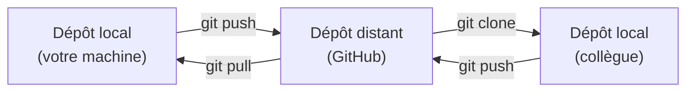
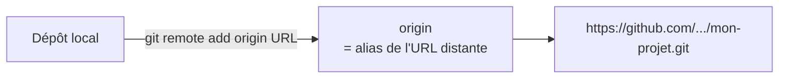
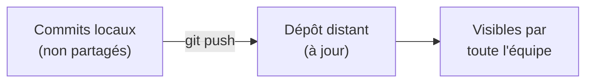
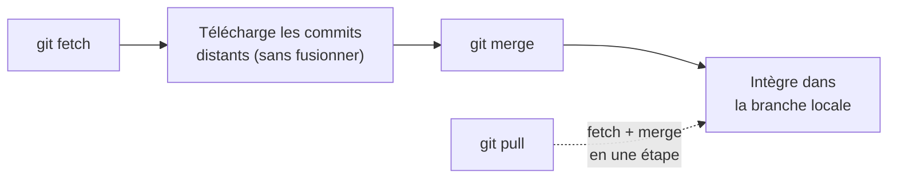
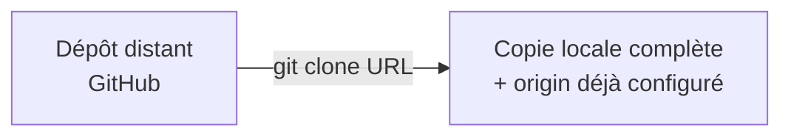
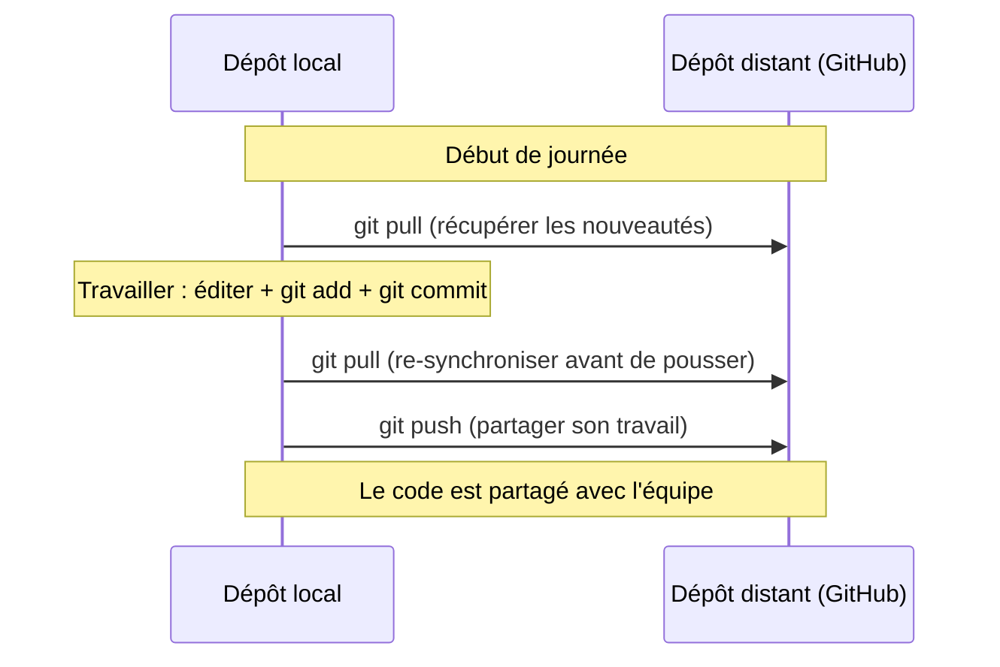
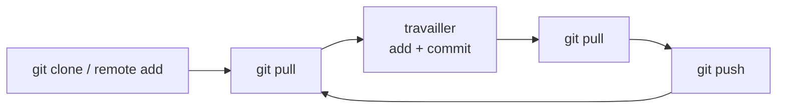

<a id="top"></a>

# 06 — Dépôt distant

## Table des matières

| # | Section |
|---|---|
| 1 | [Dépôt local vs dépôt distant](#section-1) |
| 2 | [Lier un dépôt distant](#section-2) |
| 3 | [Pousser les changements](#section-3) |
| 4 | [Récupérer les changements](#section-4) |
| 5 | [Cloner un dépôt](#section-5) |
| 6 | [Le flux collaboratif complet](#section-6) |
| 7 | [Quiz — Dépôt distant](#section-7) |
| 8 | [Pratique — Publier son dépôt sur GitHub](#section-8) |
| 9 | [Synthèse](#section-9) |

---

<a id="section-1"></a>

<details>
<summary>1 — Dépôt local vs dépôt distant</summary>

<br/>

Jusqu'ici, tout votre travail vivait **sur votre machine** (dépôt local). Un **dépôt distant** (*remote*) est une copie hébergée sur un serveur (GitHub, GitLab, Bitbucket…), accessible par toute l'équipe.



| | Dépôt local | Dépôt distant |
|---|---|---|
| **Où ?** | Votre ordinateur | Un serveur (GitHub…) |
| **Pour quoi ?** | Travailler, committer | Partager, sauvegarder, collaborer |
| **Accès** | Vous seul | Toute l'équipe |

> _Le dépôt distant joue trois rôles : **sauvegarde** (votre code survit à une panne disque), **partage** (l'équipe accède au même code) et **point de rencontre** (base de la collaboration et du CI/CD)._

</details>

<p align="right"><a href="#top">↑ Retour en haut</a></p>

---

<a id="section-2"></a>

<details>
<summary>2 — Lier un dépôt distant</summary>

<br/>

Pour connecter votre dépôt local à un dépôt distant, on lui ajoute une **référence** appelée par convention **`origin`**.

```bash
# Ajouter le dépôt distant nommé "origin"
git remote add origin https://github.com/utilisateur/mon-projet.git

# Vérifier les dépôts distants configurés
git remote -v
```



| Commande | Effet |
|---|---|
| `git remote add origin <url>` | Lie le local au distant (alias `origin`) |
| `git remote -v` | Liste les distants et leurs URL |
| `git remote remove origin` | Retire la liaison |

> _`origin` n'est qu'un **nom par convention** pour « le dépôt distant principal ». On pourrait l'appeler autrement, mais tout le monde utilise `origin` — gardez cette convention._

**🔧 Mini-exercice —** Écrivez la commande qui lie votre dépôt local au dépôt distant `https://github.com/moi/projet.git` sous l'alias `origin`.

<details>
<summary>✅ Voir une solution</summary>

```bash
git remote add origin https://github.com/moi/projet.git
```

</details>

</details>

<p align="right"><a href="#top">↑ Retour en haut</a></p>

---

<a id="section-3"></a>

<details>
<summary>3 — Pousser les changements</summary>

<br/>

**Pousser** (*push*), c'est envoyer vos commits locaux vers le dépôt distant.

```bash
# Premier push : on lie la branche locale à la branche distante avec -u
git push -u origin main

# Les fois suivantes, un simple push suffit
git push
```



| Commande | Quand l'utiliser |
|---|---|
| `git push -u origin main` | **Premier** push d'une branche (établit le suivi) |
| `git push` | Tous les push suivants |

> _L'option `-u` (ou `--set-upstream`) ne sert qu'une fois par branche : elle relie votre branche locale à sa jumelle distante. Ensuite, `git push` et `git pull` savent quoi faire tout seuls._

**🔧 Mini-exercice —** Écrivez la commande du **premier** push de la branche `main` vers `origin`, en établissant le suivi.

<details>
<summary>✅ Voir une solution</summary>

```bash
git push -u origin main
```

</details>

</details>

<p align="right"><a href="#top">↑ Retour en haut</a></p>

---

<a id="section-4"></a>

<details>
<summary>4 — Récupérer les changements</summary>

<br/>

Quand un collègue pousse du code, vous devez **récupérer** ses changements pour rester à jour.

```bash
# Récupérer ET fusionner les changements distants
git pull

# Récupérer SANS fusionner (pour inspecter d'abord)
git fetch
```



| Commande | Effet |
|---|---|
| `git fetch` | Télécharge les nouveautés distantes, **sans** modifier votre travail |
| `git merge` | Fusionne ce qui a été récupéré dans votre branche |
| `git pull` | **`fetch` + `merge`** en une seule commande |

> _Bonne habitude : faites `git pull` **avant de commencer à travailler** et **avant de pousser**. Cela évite la plupart des conflits, car vous partez toujours de la version la plus récente._

**🔧 Mini-exercice —** Quelle commande récupère les commits distants **sans** les fusionner dans votre branche, pour les inspecter d'abord ?

<details>
<summary>✅ Voir une solution</summary>

```bash
git fetch
```

</details>

</details>

<p align="right"><a href="#top">↑ Retour en haut</a></p>

---

<a id="section-5"></a>

<details>
<summary>5 — Cloner un dépôt</summary>

<br/>

**Cloner** (*clone*), c'est créer une copie locale complète d'un dépôt distant existant — typiquement pour rejoindre un projet.

```bash
# Cloner un dépôt (crée un dossier + télécharge tout l'historique)
git clone https://github.com/utilisateur/mon-projet.git

# Cloner dans un dossier au nom précis
git clone https://github.com/utilisateur/mon-projet.git mon-dossier
```



`git clone` fait **tout en une fois** :

1. Télécharge l'intégralité du dépôt (fichiers + historique).
2. Crée un dossier local.
3. Configure automatiquement `origin` vers l'URL clonée.

| `git init` + `remote add` | `git clone` |
|---|---|
| Pour publier un projet **existant en local** | Pour récupérer un projet **existant à distance** |

> _Résumé : on **clone** quand le projet existe déjà en ligne ; on fait **`init` + `remote add` + `push`** quand on part d'un projet local à publier._

**🔧 Mini-exercice —** Écrivez la commande qui clone le dépôt `https://github.com/moi/projet.git` dans un dossier local nommé `mon-dossier`.

<details>
<summary>✅ Voir une solution</summary>

```bash
git clone https://github.com/moi/projet.git mon-dossier
```

</details>

</details>

<p align="right"><a href="#top">↑ Retour en haut</a></p>

---

<a id="section-6"></a>

<details>
<summary>6 — Le flux collaboratif complet</summary>

<br/>

Voici le cycle quotidien complet du travail collaboratif avec un dépôt distant.



| Étape | Commande | But |
|---|---|---|
| 1 | `git pull` | Partir de la dernière version |
| 2 | `git add` + `git commit` | Enregistrer son travail localement |
| 3 | `git pull` | Récupérer ce qui a changé entre-temps |
| 4 | `git push` | Publier ses commits |

> _Ce flux **pull → travailler → commit → pull → push** est la routine de base. En entreprise, on y ajoute les *Pull Requests* et la revue de code — c'est l'objet du module 02 (Git avancé & GitHub)._

</details>

<p align="right"><a href="#top">↑ Retour en haut</a></p>

---

<a id="section-7"></a>

<details>
<summary>7 — Quiz — Dépôt distant</summary>

<br/>

**Question 1 :** Qu'est-ce qu'un dépôt distant ?

a) Une branche locale

b) Une copie du dépôt hébergée sur un serveur, accessible par l'équipe

c) Un fichier `.gitignore`

d) Un commit particulier

<details>
<summary>💡 Voir la solution</summary>

✅ **Réponse : b)** — Le dépôt distant (sur GitHub, par ex.) sert de sauvegarde, de point de partage et de base à la collaboration.

</details>

---

**Question 2 :** Que désigne habituellement `origin` ?

a) Le premier commit du projet

b) Le nom par convention du dépôt distant principal

c) La branche par défaut

d) Un type de conflit

<details>
<summary>💡 Voir la solution</summary>

✅ **Réponse : b)** — `origin` est l'alias conventionnel pour le dépôt distant principal lié au dépôt local.

</details>

---

**Question 3 :** Quelle commande envoie vos commits locaux vers le distant ?

a) `git pull`

b) `git push`

c) `git clone`

d) `git fetch`

<details>
<summary>💡 Voir la solution</summary>

✅ **Réponse : b)** — `git push` envoie les commits locaux vers le dépôt distant. `git pull`/`fetch` font l'inverse.

</details>

---

**Question 4 :** Quelle est la différence entre `git fetch` et `git pull` ?

a) Aucune, ce sont des synonymes

b) `fetch` télécharge sans fusionner ; `pull` télécharge **et** fusionne

c) `pull` supprime l'historique

d) `fetch` envoie les commits

<details>
<summary>💡 Voir la solution</summary>

✅ **Réponse : b)** — `git pull` = `git fetch` + `git merge`. `fetch` seul permet d'inspecter avant de fusionner.

</details>

---

**Question 5 :** Dans quel cas utilise-t-on `git clone` ?

a) Pour publier un projet local vide

b) Pour récupérer une copie complète d'un dépôt déjà existant à distance

c) Pour créer une branche

d) Pour résoudre un conflit

<details>
<summary>💡 Voir la solution</summary>

✅ **Réponse : b)** — `git clone` copie un dépôt distant existant en local et configure `origin` automatiquement.

</details>

</details>

<p align="right"><a href="#top">↑ Retour en haut</a></p>

---

<a id="section-8"></a>

<details>
<summary>8 — Pratique — Publier son dépôt sur GitHub</summary>

<br/>

### Consigne

Publiez le dépôt local créé à la leçon 04 sur GitHub, puis simulez une collaboration en le clonant ailleurs.

---

### Correction — Suite de commandes attendue

```bash
# --- Côté projet local existant ---

# 1. Créer un dépôt VIDE sur github.com (via l'interface web)
#    → on obtient une URL : https://github.com/vous/mon-premier-depot.git

# 2. Lier le local au distant
git remote add origin https://github.com/vous/mon-premier-depot.git
git remote -v

# 3. Pousser pour la première fois
git push -u origin main

# --- Simuler un collègue qui rejoint le projet ---

# 4. Cloner ailleurs (autre dossier)
cd ..
git clone https://github.com/vous/mon-premier-depot.git copie-collegue
cd copie-collegue

# 5. Modifier, committer, pousser
echo "Contribution du collègue" >> README.md
git add README.md
git commit -m "Ajoute une contribution"
git push

# --- Retour côté projet d'origine ---

# 6. Récupérer la contribution
cd ../mon-premier-depot
git pull
```

**Résultat attendu :** après le `git pull` final, le fichier `README.md` du projet d'origine contient la ligne ajoutée par le « collègue ». Le cycle **push / clone / push / pull** est bouclé.

> _Vous venez de réaliser une collaboration Git complète à vous tout seul. C'est exactement ce qui se passe en équipe, sauf que les deux copies sont sur des machines différentes._

</details>

<p align="right"><a href="#top">↑ Retour en haut</a></p>

---

<a id="section-9"></a>

<details>
<summary>9 — Synthèse</summary>

<br/>

#### Points à retenir

1. **Dépôt distant** = copie sur serveur (GitHub) : sauvegarde + partage + collaboration.
2. **`git remote add origin <url>`** lie le local au distant.
3. **`git push`** envoie ; **`git pull`** (= `fetch` + `merge`) reçoit.
4. **`git clone`** récupère un dépôt existant et configure `origin` automatiquement.
5. **Routine quotidienne** : `pull → travailler → commit → pull → push`.



#### La suite

Module **02 — Git avancé et GitHub** : Pull Requests, revue de code, gestion des conflits en équipe et workflows professionnels.

</details>

<p align="right"><a href="#top">↑ Retour en haut</a></p>

---

<p align="center">
  <em>Tous droits réservés. Toute reproduction, diffusion, utilisation ou adaptation de ce cours, en tout ou en partie, est strictement interdite sans l'autorisation écrite préalable de Dr. Haythem REHOUMA.</em>
</p>

<p align="center">
  <strong>Cours créé par Dr. Haythem REHOUMA — Développement et déploiement de solutions de données</strong>
</p>
