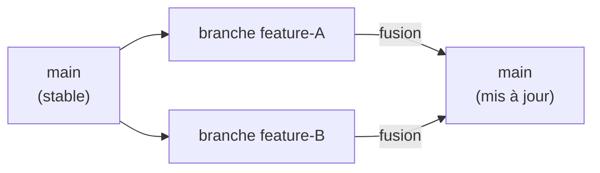
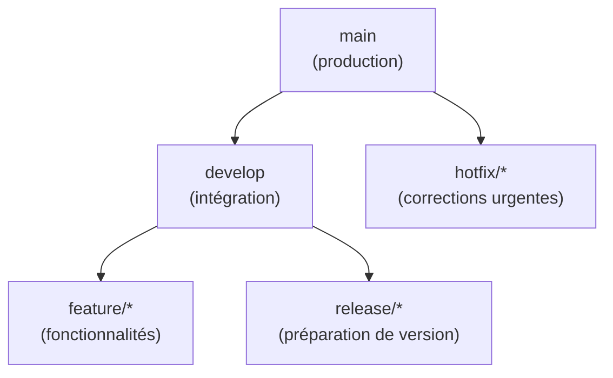
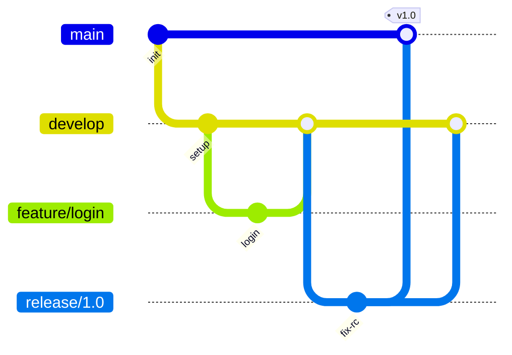
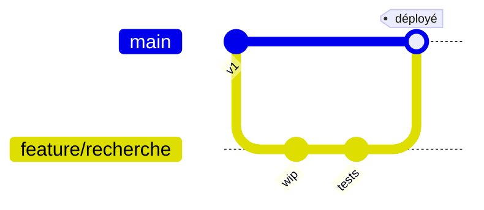
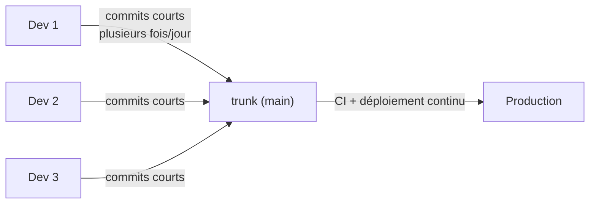
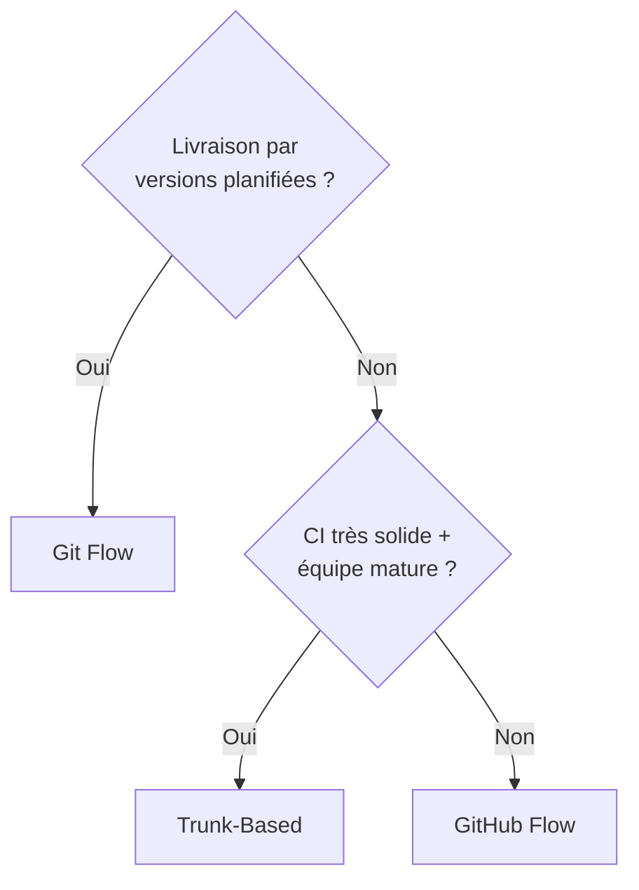
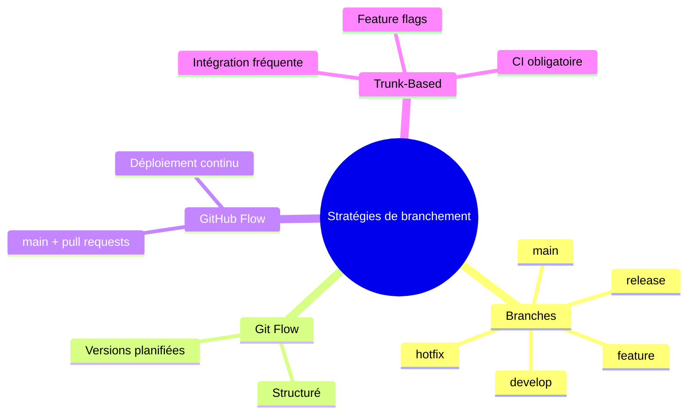

<a id="top"></a>

# 01 — Branches et stratégies de branchement

## Table des matières

| # | Section |
|---|---|
| 1 | [Pourquoi des branches ?](#section-1) |
| 2 | [Les types de branches](#section-2) |
| 3 | [Git Flow](#section-3) |
| 4 | [GitHub Flow](#section-4) |
| 5 | [Trunk-Based Development](#section-5) |
| 6 | [Comparer et choisir sa stratégie](#section-6) |
| 7 | [Quiz — Les stratégies de branchement](#section-7) |
| 8 | [Pratique — Mettre en place GitHub Flow](#section-8) |
| 9 | [Synthèse](#section-9) |

---

<a id="section-1"></a>

<details>
<summary>1 — Pourquoi des branches ?</summary>

<br/>

Une **branche** est une **ligne de développement indépendante**. Elle permet de travailler sur une nouvelle fonctionnalité ou une correction **sans toucher au code stable** que les autres utilisent.

> _Pense à une branche comme à un brouillon séparé. Tu peux y faire tous les essais que tu veux ; tant que tu n'as pas fusionné, le travail des autres n'est pas affecté._

Sans branches, toute l'équipe écrirait dans le même fichier en même temps : chaos garanti. Avec les branches, chacun avance dans son couloir, puis on rassemble proprement.



Les commandes de base déjà vues au module 01 :

```bash
# Créer une branche et basculer dessus
git switch -c feature/login

# Lister les branches
git branch

# Revenir sur main
git switch main
```

| Action | Commande moderne | Ancienne syntaxe |
|---|---|---|
| Créer + basculer | `git switch -c nom` | `git checkout -b nom` |
| Basculer | `git switch nom` | `git checkout nom` |
| Lister | `git branch` | `git branch` |
| Supprimer | `git branch -d nom` | `git branch -d nom` |

**🔧 Mini-exercice —** Écris la commande moderne pour créer une branche `feature/login` **et** basculer dessus en une seule fois.

<details>
<summary>✅ Voir une solution</summary>

`git switch -c feature/login` (équivalent à l'ancienne syntaxe `git checkout -b feature/login`).

</details>

</details>

<p align="right"><a href="#top">↑ Retour en haut</a></p>

---

<a id="section-2"></a>

<details>
<summary>2 — Les types de branches</summary>

<br/>

Dans une équipe, on ne crée pas des branches au hasard : on leur donne un **rôle** et un **nom conventionnel**. Voici les types les plus répandus.



| Type de branche | Préfixe usuel | Rôle | Durée de vie |
|---|---|---|---|
| **Principale** | `main` (ou `master`) | Code en production, toujours stable | Permanente |
| **Intégration** | `develop` | Réunit les fonctionnalités en cours | Permanente |
| **Fonctionnalité** | `feature/` | Développer une nouvelle fonctionnalité | Courte |
| **Version** | `release/` | Stabiliser avant une mise en production | Courte |
| **Correctif urgent** | `hotfix/` | Corriger un bug critique en prod | Très courte |

Exemples de noms réalistes :

```bash
feature/ajout-paiement-stripe
feature/dashboard-utilisateur
release/1.4.0
hotfix/correction-faille-login
```

> _Une bonne convention de nommage est de la documentation gratuite : rien qu'au nom de la branche, l'équipe sait de quoi il s'agit._

**🔧 Mini-exercice —** Tu dois corriger en urgence une faille de connexion en production. Quel **préfixe** de branche utilises-tu, et propose un nom complet.

<details>
<summary>✅ Voir une solution</summary>

Le préfixe `hotfix/` (correction urgente partant de `main`). Exemple : `hotfix/correction-faille-login`.

</details>

</details>

<p align="right"><a href="#top">↑ Retour en haut</a></p>

---

<a id="section-3"></a>

<details>
<summary>3 — Git Flow</summary>

<br/>

**Git Flow** est une stratégie **structurée** introduite par Vincent Driessen en 2010. Elle repose sur **deux branches permanentes** (`main` et `develop`) et **trois types de branches temporaires** (`feature`, `release`, `hotfix`).



**Le cycle typique :**

1. On part de `develop` pour créer une branche `feature/*`.
2. Une fois finie, la `feature` est fusionnée dans `develop`.
3. Quand assez de fonctionnalités sont prêtes, on crée une `release/*` pour stabiliser.
4. La `release` est fusionnée dans `main` (et taguée) **et** dans `develop`.
5. Un bug critique en prod ? On crée un `hotfix/*` depuis `main`, puis on le fusionne dans `main` et `develop`.

```bash
# Démarrer une fonctionnalité (sans l'extension git-flow)
git switch develop
git switch -c feature/panier

# ... travail + commits ...

git switch develop
git merge feature/panier
git branch -d feature/panier
```

| Avantages | Inconvénients |
|---|---|
| Très structuré, rôles clairs | Lourd, beaucoup de branches |
| Idéal pour des **versions planifiées** | Mal adapté au déploiement continu |
| Sépare nettement dev et prod | Fusions complexes, risque de conflits |

> _Git Flow brille pour des logiciels livrés par versions (apps mobiles, logiciels installés). Pour un site web déployé 10 fois par jour, il devient un frein._

</details>

<p align="right"><a href="#top">↑ Retour en haut</a></p>

---

<a id="section-4"></a>

<details>
<summary>4 — GitHub Flow</summary>

<br/>

**GitHub Flow** est une stratégie **simple et légère**, pensée pour le **déploiement continu**. Une seule branche permanente : `main`. Tout le reste passe par des branches `feature` courtes et des **pull requests**.



**Les règles d'or :**

1. `main` est **toujours déployable**.
2. Pour tout travail, on crée une branche descriptive depuis `main`.
3. On commit régulièrement et on ouvre une **pull request** (vue en leçon 03).
4. Après revue et tests verts, on **fusionne dans `main`**.
5. On **déploie immédiatement** `main`.

```bash
git switch main
git pull
git switch -c feature/filtre-recherche
# ... commits ...
git push -u origin feature/filtre-recherche
# → ouvrir une Pull Request sur GitHub
```

| Avantages | Inconvénients |
|---|---|
| Simple, peu de branches | Suppose une **bonne couverture de tests** |
| Parfait pour le web / SaaS | Moins adapté aux versions multiples à maintenir |
| Favorise les **petites livraisons fréquentes** | Demande de la discipline sur la qualité de `main` |

> _GitHub Flow est sans doute le meilleur point de départ pour une équipe moderne : assez de structure pour collaborer, assez de légèreté pour aller vite._

**🔧 Mini-exercice —** En GitHub Flow, écris les deux commandes pour partir d'un `main` à jour avant de créer ta branche de travail.

<details>
<summary>✅ Voir une solution</summary>

```bash
git switch main
git pull
```

Ensuite seulement : `git switch -c feature/...`.

</details>

</details>

<p align="right"><a href="#top">↑ Retour en haut</a></p>

---

<a id="section-5"></a>

<details>
<summary>5 — Trunk-Based Development</summary>

<br/>

Le **Trunk-Based Development** (développement sur le tronc) pousse la simplicité encore plus loin : tout le monde intègre son travail dans une **branche unique** (le *trunk*, c'est-à-dire `main`) **très fréquemment** — idéalement plusieurs fois par jour.



**Principes clés :**

- Les branches de fonctionnalité sont **minuscules** et vivent **moins d'une journée**.
- Les fonctionnalités non terminées sont cachées derrière des **feature flags** (drapeaux) plutôt que dans des branches longues.
- L'**intégration continue** (CI) est obligatoire : chaque commit déclenche build + tests.

```bash
# Cycle ultra-court
git switch main
git pull
# petite modification...
git commit -am "Ajout du bouton export"
git push      # intégré dans le tronc quelques minutes après
```

| Avantages | Inconvénients |
|---|---|
| Intégration continue véritable | Exige une **CI solide** et rapide |
| Évite les « merges d'enfer » | Demande beaucoup de discipline |
| Pratique des équipes très performantes (Google, etc.) | Feature flags à gérer |

> _Le pire ennemi des équipes Git, ce sont les branches qui vivent des semaines. Plus on intègre tard, plus la fusion est douloureuse. Le trunk-based résout ça en intégrant tôt et souvent._

**🔧 Mini-exercice —** En Trunk-Based, comment intègres-tu une fonctionnalité **non terminée** sans bloquer les autres ni créer une branche longue ?

<details>
<summary>✅ Voir une solution</summary>

On masque le code inachevé derrière un **feature flag** (drapeau de fonctionnalité) : il est intégré dans le tronc mais désactivé pour les utilisateurs.

</details>

</details>

<p align="right"><a href="#top">↑ Retour en haut</a></p>

---

<a id="section-6"></a>

<details>
<summary>6 — Comparer et choisir sa stratégie</summary>

<br/>

Il n'existe **pas de stratégie universelle** : le bon choix dépend du **type de produit**, de la **maturité de l'équipe** et de la **fréquence de déploiement**.

| Critère | Git Flow | GitHub Flow | Trunk-Based |
|---|---|---|---|
| Branches permanentes | 2 (`main` + `develop`) | 1 (`main`) | 1 (`main`) |
| Complexité | Élevée | Faible | Très faible |
| Fréquence de livraison | Par versions | Continue | Très continue |
| Durée des branches | Longue | Courte | Très courte (< 1 j) |
| Tests automatisés requis | Souhaitables | Importants | Indispensables |
| Cas idéal | Apps versionnées, mobile | Web / SaaS, équipe moyenne | Équipe mature, CI forte |



> _Conseil : la plupart des équipes devraient commencer par **GitHub Flow**. Il offre le meilleur compromis simplicité / sécurité. On migre vers le trunk-based quand la CI est mûre, ou vers Git Flow seulement si le produit impose des versions._

</details>

<p align="right"><a href="#top">↑ Retour en haut</a></p>

---

<a id="section-7"></a>

<details>
<summary>7 — Quiz — Les stratégies de branchement</summary>

<br/>

**Question 1 :** À quoi sert principalement une branche Git ?

a) À sauvegarder le dépôt sur le cloud

b) À travailler de façon isolée sans affecter le code stable

c) À compresser les fichiers

d) À supprimer l'historique

<details>
<summary>💡 Voir la solution</summary>

✅ **Réponse : b)** — Une branche est une ligne de développement indépendante qui isole le travail jusqu'à la fusion.

</details>

---

**Question 2 :** Combien de branches **permanentes** Git Flow utilise-t-il ?

a) Une seule (`main`)

b) Deux (`main` et `develop`)

c) Aucune

d) Une par développeur

<details>
<summary>💡 Voir la solution</summary>

✅ **Réponse : b)** — Git Flow repose sur deux branches permanentes : `main` (production) et `develop` (intégration).

</details>

---

**Question 3 :** Quelle stratégie est la plus adaptée à un site web déployé plusieurs fois par jour ?

a) Git Flow

b) GitHub Flow ou Trunk-Based

c) Aucune branche du tout

d) Une branche par année

<details>
<summary>💡 Voir la solution</summary>

✅ **Réponse : b)** — GitHub Flow (et plus encore le Trunk-Based) sont conçus pour le déploiement continu. Git Flow serait trop lourd.

</details>

---

**Question 4 :** Dans le Trunk-Based Development, comment cache-t-on une fonctionnalité non terminée ?

a) Dans une branche longue de plusieurs semaines

b) Avec un *feature flag* (drapeau de fonctionnalité)

c) En supprimant le code chaque soir

d) On ne peut pas, il faut tout finir d'un coup

<details>
<summary>💡 Voir la solution</summary>

✅ **Réponse : b)** — Les feature flags permettent d'intégrer du code inachevé sans l'activer pour les utilisateurs, évitant les branches longues.

</details>

---

**Question 5 :** Quel préfixe de branche utilise-t-on pour corriger un bug critique directement en production ?

a) `feature/`

b) `release/`

c) `hotfix/`

d) `develop/`

<details>
<summary>💡 Voir la solution</summary>

✅ **Réponse : c)** — Une branche `hotfix/` part de `main` pour corriger un bug urgent, puis est fusionnée dans `main` et `develop`.

</details>

</details>

<p align="right"><a href="#top">↑ Retour en haut</a></p>

---

<a id="section-8"></a>

<details>
<summary>8 — Pratique — Mettre en place GitHub Flow</summary>

<br/>

### Consigne

Vous travaillez sur un dépôt dont `main` est stable. On vous demande d'ajouter une page « À propos ». Mettez en œuvre le **GitHub Flow** :

1. Partez d'un `main` à jour.
2. Créez une branche de fonctionnalité bien nommée.
3. Faites un commit qui ajoute le fichier `apropos.html`.
4. Poussez la branche vers le dépôt distant pour préparer une pull request.
5. Listez vos branches pour vérifier.

---

### Correction

```bash
# 1. Partir d'un main à jour
git switch main
git pull origin main

# 2. Créer une branche descriptive
git switch -c feature/page-apropos

# 3. Créer le fichier puis le commiter
echo "<h1>À propos</h1>" > apropos.html
git add apropos.html
git commit -m "Ajout de la page À propos"

# 4. Pousser la branche vers le distant
git push -u origin feature/page-apropos

# 5. Vérifier les branches
git branch
```

**Résultat attendu :**

| Étape | Vérification |
|---|---|
| Branche créée | `git branch` affiche `* feature/page-apropos` |
| Commit présent | `git log --oneline -1` montre « Ajout de la page À propos » |
| Branche poussée | Git affiche `* [new branch] feature/page-apropos -> feature/page-apropos` |
| Suivi configuré | Le `-u` lie la branche locale à la branche distante |

```text
* feature/page-apropos
  main
```

> _Étape suivante logique : ouvrir une pull request sur GitHub pour faire relire et fusionner ce travail — c'est exactement l'objet de la leçon 03._

</details>

<p align="right"><a href="#top">↑ Retour en haut</a></p>

---

<a id="section-9"></a>

<details>
<summary>9 — Synthèse</summary>

<br/>

#### Points à retenir

1. **Une branche** isole le travail sans affecter le code stable.
2. **Types de branches** : `main`, `develop`, `feature/`, `release/`, `hotfix/` — chacun avec un rôle.
3. **Git Flow** : structuré, deux branches permanentes, idéal pour les versions planifiées.
4. **GitHub Flow** : simple, une branche `main` + pull requests, parfait pour le web.
5. **Trunk-Based** : intégration très fréquente sur le tronc, exige une CI solide.
6. **Le choix** dépend du produit, de l'équipe et de la fréquence de déploiement.



#### La suite

Maintenant que vous savez **organiser** vos branches, place à la leçon **02 — Merge et rebase** : comment **rassembler** proprement ces branches et résoudre les conflits.

</details>

<p align="right"><a href="#top">↑ Retour en haut</a></p>

---

<p align="center">
  <em>Tous droits réservés. Toute reproduction, diffusion, utilisation ou adaptation de ce cours, en tout ou en partie, est strictement interdite sans l'autorisation écrite préalable de Dr. Haythem REHOUMA.</em>
</p>

<p align="center">
  <strong>Cours créé par Dr. Haythem REHOUMA — Développement et déploiement de solutions de données</strong>
</p>
