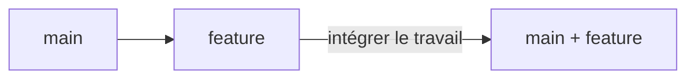
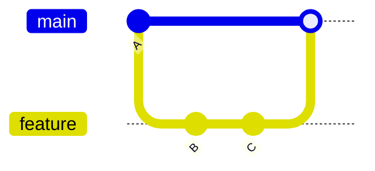
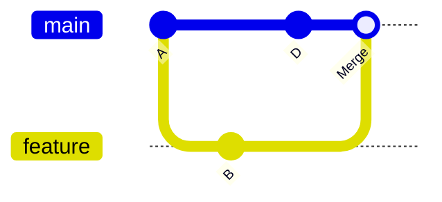
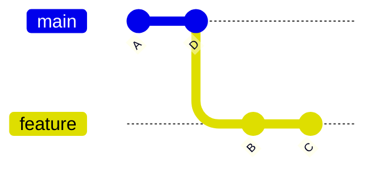
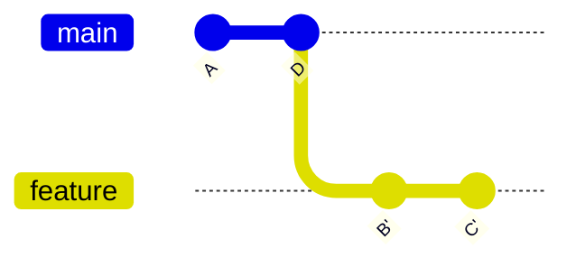
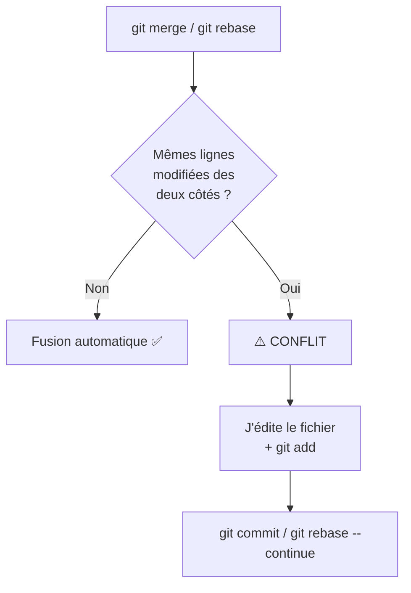
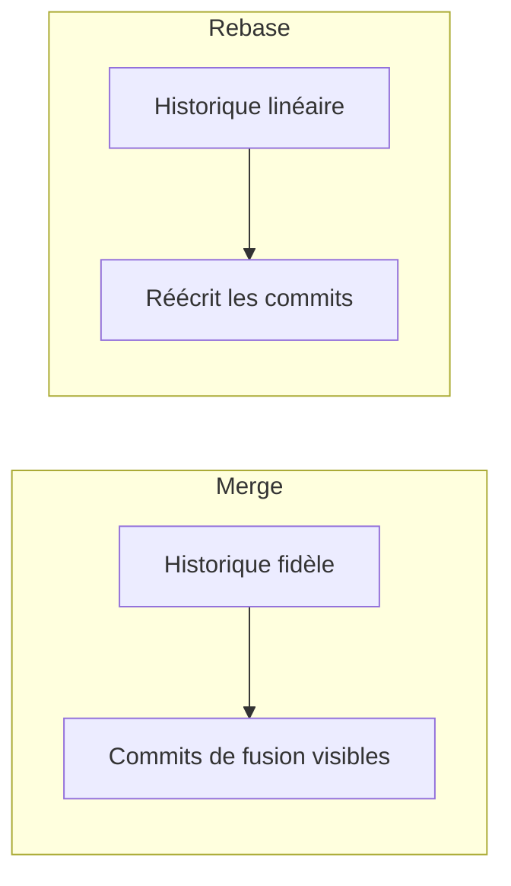
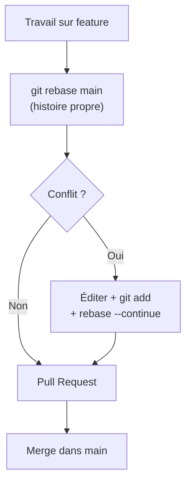

<a id="top"></a>

# 02 — Merge et rebase

## Table des matières

| # | Section |
|---|---|
| 1 | [Rassembler deux branches : le besoin](#section-1) |
| 2 | [La fusion (merge)](#section-2) |
| 3 | [Le rebasage (rebase)](#section-3) |
| 4 | [Résoudre les conflits](#section-4) |
| 5 | [Merge ou rebase : que choisir ?](#section-5) |
| 6 | [Quiz — Merge et rebase](#section-6) |
| 7 | [Pratique — Résoudre un conflit de fusion](#section-7) |
| 8 | [Synthèse](#section-8) |

---

<a id="section-1"></a>

<details>
<summary>1 — Rassembler deux branches : le besoin</summary>

<br/>

Vous avez travaillé sur une branche `feature`, le code est prêt. Il faut maintenant le **réintégrer dans `main`**. Git offre deux mécanismes pour cela : la **fusion** (`merge`) et le **rebasage** (`rebase`).



> _Les deux atteignent le même but — réunir le travail — mais avec une **forme d'historique différente**. C'est tout l'enjeu de cette leçon._

| Mécanisme | Idée en une phrase |
|---|---|
| **Merge** | On crée un commit qui **joint** les deux branches, en gardant leur histoire telle quelle. |
| **Rebase** | On **rejoue** les commits d'une branche par-dessus une autre, comme si on avait commencé plus tard. |

Avant toute intégration, on s'assure d'avoir la dernière version :

```bash
git switch main
git pull origin main
```

</details>

<p align="right"><a href="#top">↑ Retour en haut</a></p>

---

<a id="section-2"></a>

<details>
<summary>2 — La fusion (merge)</summary>

<br/>

La commande `git merge` **réunit** une branche dans une autre. Il existe deux cas.

**Cas 1 — Fusion rapide (*fast-forward*) :** si `main` n'a pas bougé depuis la création de la branche, Git avance simplement le pointeur. Aucun commit de fusion n'est créé.



**Cas 2 — Fusion à trois branches (*three-way merge*) :** si `main` a reçu de nouveaux commits entre-temps, Git crée un **commit de fusion** qui a **deux parents**.



```bash
# Se placer sur la branche cible, puis fusionner
git switch main
git merge feature/panier

# Forcer un commit de fusion même si fast-forward possible
git merge --no-ff feature/panier
```

| Option | Effet |
|---|---|
| `git merge feature` | Fusion (fast-forward si possible) |
| `git merge --no-ff feature` | Toujours créer un commit de fusion (trace la branche) |
| `git merge --abort` | Annuler une fusion en cours de conflit |

> _Le merge **préserve l'histoire réelle** : on voit quand et comment les branches se sont rejointes. C'est honnête, mais l'historique peut devenir touffu avec beaucoup de commits de fusion._

**🔧 Mini-exercice —** Tu veux fusionner `feature/panier` dans `main` en **forçant** la création d'un commit de fusion, même si un fast-forward serait possible. Écris la commande.

<details>
<summary>✅ Voir une solution</summary>

`git merge --no-ff feature/panier` — le `--no-ff` garde une trace explicite de la branche fusionnée.

</details>

</details>

<p align="right"><a href="#top">↑ Retour en haut</a></p>

---

<a id="section-3"></a>

<details>
<summary>3 — Le rebasage (rebase)</summary>

<br/>

Le `git rebase` **déplace** les commits de votre branche pour les **rejouer par-dessus** la pointe d'une autre branche. Résultat : un historique **linéaire**, comme si vous aviez commencé votre travail après les derniers commits de `main`.

**Avant le rebase :**



**Après `git rebase main` (les commits B et C sont rejoués après D) :**



```bash
# Sur la branche feature, rejouer par-dessus main
git switch feature/panier
git rebase main

# Puis fusion fast-forward propre dans main
git switch main
git merge feature/panier
```

| Avantage du rebase | Précaution |
|---|---|
| Historique **linéaire et lisible** | Réécrit les commits (nouveaux SHA) |
| Pas de commits de fusion parasites | **Ne jamais rebaser** une branche déjà poussée et partagée |
| Idéal avant une pull request | Conflits à régler commit par commit |

> ⚠️ **Règle d'or du rebase :** ne rebasez jamais des commits déjà publiés et utilisés par d'autres. Vous réécrivez l'histoire, ce qui casserait leurs dépôts. Le rebase est pour votre **travail local non partagé**.

**🔧 Mini-exercice —** Tu es sur ta branche `feature/panier`. Écris la commande pour rejouer tes commits par-dessus la pointe de `main` (historique linéaire).

<details>
<summary>✅ Voir une solution</summary>

`git rebase main` (en étant bien sur `feature/panier`).

</details>

</details>

<p align="right"><a href="#top">↑ Retour en haut</a></p>

---

<a id="section-4"></a>

<details>
<summary>4 — Résoudre les conflits</summary>

<br/>

Un **conflit** survient quand Git ne peut pas décider automatiquement : **deux branches ont modifié la même ligne** d'un même fichier. Git s'arrête et vous demande de trancher.



Git insère des **marqueurs de conflit** dans le fichier :

```text
<<<<<<< HEAD
prix = 10   # version de main
=======
prix = 12   # version de feature
>>>>>>> feature/panier
```

**La résolution pas à pas :**

1. Ouvrir le fichier et **choisir** (ou combiner) la bonne version.
2. **Supprimer** les marqueurs `<<<<<<<`, `=======`, `>>>>>>>`.
3. Marquer le fichier comme résolu avec `git add`.
4. Terminer l'opération.

```bash
# Voir les fichiers en conflit
git status

# Après édition manuelle
git add fichier-en-conflit.py

# Terminer un merge
git commit

# Terminer un rebase
git rebase --continue

# En cas de panique : tout annuler
git merge --abort      # ou : git rebase --abort
```

| Outil d'aide | Usage |
|---|---|
| `git status` | Lister les fichiers en conflit |
| `git diff` | Voir les différences conflictuelles |
| `git mergetool` | Lancer un outil graphique de résolution |
| VS Code | Boutons *Accept Current / Incoming / Both* |

> _Un conflit n'est pas une erreur : c'est Git qui, honnêtement, vous dit « je ne sais pas lequel garder, c'est ta décision ». Garder son calme et lire les marqueurs suffit dans 99 % des cas._

**🔧 Mini-exercice —** Tu as édité le fichier `app.py` pour résoudre un conflit survenu pendant un **rebase**. Quelles deux commandes terminent l'opération ?

<details>
<summary>✅ Voir une solution</summary>

```bash
git add app.py
git rebase --continue
```

(Pour un merge, ce serait `git add app.py` puis `git commit`.)

</details>

</details>

<p align="right"><a href="#top">↑ Retour en haut</a></p>

---

<a id="section-5"></a>

<details>
<summary>5 — Merge ou rebase : que choisir ?</summary>

<br/>

Les deux réunissent le travail, mais produisent un **historique différent**. Le choix est souvent une **convention d'équipe**.



| Aspect | Merge | Rebase |
|---|---|---|
| Historique | Fidèle, ramifié | Linéaire, propre |
| Commit de fusion | Oui (si non fast-forward) | Non |
| Réécrit l'histoire | Non | Oui (nouveaux SHA) |
| Sûr sur branche partagée | ✅ Oui | ❌ Non |
| Lisibilité du `log` | Plus dense | Plus claire |

**La pratique recommandée la plus courante :**

- **Rebase** votre branche locale sur `main` **avant** d'ouvrir une pull request → historique propre.
- **Merge** la pull request dans `main` → trace claire de l'intégration.

```bash
# 1. Nettoyer sa branche locale avant la PR
git switch feature/x
git rebase main

# 2. Une fois la PR approuvée, GitHub fait le merge
```

> _Phrase mnémotechnique : « **Rebase en privé, merge en public**. » On rebase ce qui est à soi, on merge ce qui est partagé._

</details>

<p align="right"><a href="#top">↑ Retour en haut</a></p>

---

<a id="section-6"></a>

<details>
<summary>6 — Quiz — Merge et rebase</summary>

<br/>

**Question 1 :** Que fait `git merge feature` depuis `main` quand `main` a aussi de nouveaux commits ?

a) Il supprime la branche feature

b) Il crée un commit de fusion à deux parents

c) Il efface l'historique

d) Il refuse toujours de fusionner

<details>
<summary>💡 Voir la solution</summary>

✅ **Réponse : b)** — C'est une fusion à trois branches : Git crée un commit de fusion qui réunit les deux histoires.

</details>

---

**Question 2 :** Quel est l'effet principal d'un `git rebase main` ?

a) Rejouer les commits de la branche par-dessus `main` pour un historique linéaire

b) Cloner le dépôt

c) Supprimer `main`

d) Créer une sauvegarde distante

<details>
<summary>💡 Voir la solution</summary>

✅ **Réponse : a)** — Le rebase déplace et rejoue vos commits au sommet de `main`, produisant une histoire linéaire.

</details>

---

**Question 3 :** Pourquoi ne faut-il pas rebaser une branche déjà poussée et partagée ?

a) Parce que c'est interdit par GitHub

b) Parce que cela réécrit les commits et casse les dépôts des autres

c) Parce que le rebase est plus lent

d) Parce qu'il efface `main`

<details>
<summary>💡 Voir la solution</summary>

✅ **Réponse : b)** — Le rebase crée de nouveaux SHA. Si d'autres ont déjà ces commits, leur historique devient incohérent.

</details>

---

**Question 4 :** Que représentent les marqueurs `<<<<<<<`, `=======`, `>>>>>>>` ?

a) Des commentaires de code

b) Une erreur de syntaxe Python

c) Les zones d'un conflit à résoudre manuellement

d) La fin d'un fichier

<details>
<summary>💡 Voir la solution</summary>

✅ **Réponse : c)** — Ce sont les marqueurs de conflit : au-dessus la version actuelle (HEAD), en dessous la version entrante. On choisit et on les supprime.

</details>

---

**Question 5 :** Comment annuler proprement une fusion bloquée par des conflits ?

a) `git delete`

b) `git merge --abort`

c) `git reset --cloud`

d) Supprimer le dossier `.git`

<details>
<summary>💡 Voir la solution</summary>

✅ **Réponse : b)** — `git merge --abort` (ou `git rebase --abort`) ramène le dépôt à son état d'avant l'opération.

</details>

</details>

<p align="right"><a href="#top">↑ Retour en haut</a></p>

---

<a id="section-7"></a>

<details>
<summary>7 — Pratique — Résoudre un conflit de fusion</summary>

<br/>

### Consigne

Deux branches modifient la **même ligne** d'un fichier `config.txt`. Reproduisez le conflit, puis résolvez-le en gardant **les deux informations combinées**.

1. Sur `main`, le fichier contient `port = 8080`.
2. Une branche `feature/ssl` change cette ligne en `port = 443`.
3. Pendant ce temps, `main` change la même ligne en `port = 9090`.
4. Fusionnez `feature/ssl` dans `main`, résolvez le conflit en gardant `port = 443` (HTTPS), puis terminez.

---

### Correction

```bash
# Préparation : créer le conflit
echo "port = 8080" > config.txt
git add config.txt
git commit -m "Config initiale"

git switch -c feature/ssl
echo "port = 443" > config.txt
git commit -am "Passage en HTTPS (port 443)"

git switch main
echo "port = 9090" > config.txt
git commit -am "Changement de port en 9090"

# Tentative de fusion → conflit
git merge feature/ssl
```

Git affiche alors :

```text
Auto-merging config.txt
CONFLICT (content): Merge conflict in config.txt
Automatic merge failed; fix conflicts and then commit the result.
```

Le fichier `config.txt` contient :

```text
<<<<<<< HEAD
port = 9090
=======
port = 443
>>>>>>> feature/ssl
```

On édite pour ne garder que la bonne valeur :

```bash
echo "port = 443" > config.txt   # on tranche en faveur de HTTPS

git add config.txt
git commit -m "Fusion feature/ssl : conservation du port 443"
```

**Résultat attendu :**

| Vérification | Commande | Sortie |
|---|---|---|
| Conflit résolu | `git status` | « nothing to commit, working tree clean » |
| Contenu final | `cat config.txt` | `port = 443` |
| Commit de fusion | `git log --oneline -1` | « Fusion feature/ssl : conservation du port 443 » |

> _Astuce : si vous vous trompez en plein conflit, `git merge --abort` vous rend votre dépôt intact. Aucun risque à expérimenter._

</details>

<p align="right"><a href="#top">↑ Retour en haut</a></p>

---

<a id="section-8"></a>

<details>
<summary>8 — Synthèse</summary>

<br/>

#### Points à retenir

1. **Merge et rebase** réunissent deux branches, mais produisent un historique différent.
2. **Merge** préserve l'histoire réelle ; il crée un commit de fusion à deux parents (sauf fast-forward).
3. **Rebase** rejoue les commits pour un historique **linéaire et propre**.
4. **Règle d'or** : rebase en privé, merge en public — ne jamais rebaser du code partagé.
5. **Un conflit** apparaît quand la même ligne est modifiée des deux côtés : on édite, on `add`, on termine.
6. **Bonne pratique** : rebaser sa branche avant la PR, puis merger la PR dans `main`.



#### La suite

Vous savez intégrer techniquement le code. La leçon **03 — Pull requests** montre comment **faire relire** ce travail avant de l'intégrer, au cœur de la collaboration sur GitHub.

</details>

<p align="right"><a href="#top">↑ Retour en haut</a></p>

---

<p align="center">
  <em>Tous droits réservés. Toute reproduction, diffusion, utilisation ou adaptation de ce cours, en tout ou en partie, est strictement interdite sans l'autorisation écrite préalable de Dr. Haythem REHOUMA.</em>
</p>

<p align="center">
  <strong>Cours créé par Dr. Haythem REHOUMA — Développement et déploiement de solutions de données</strong>
</p>
