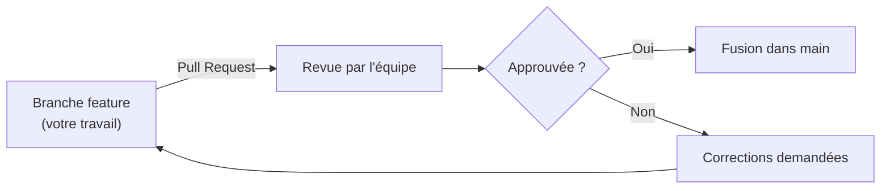
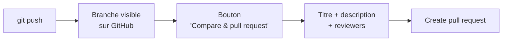
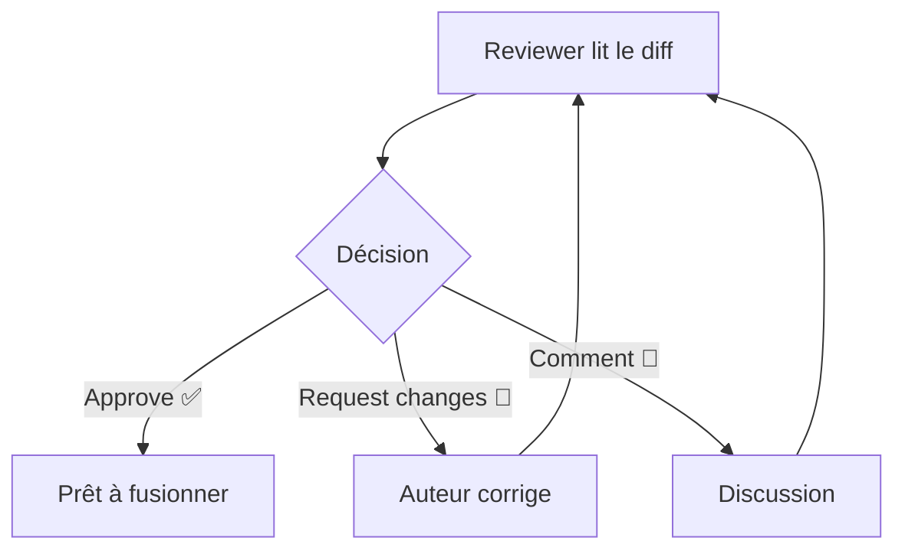
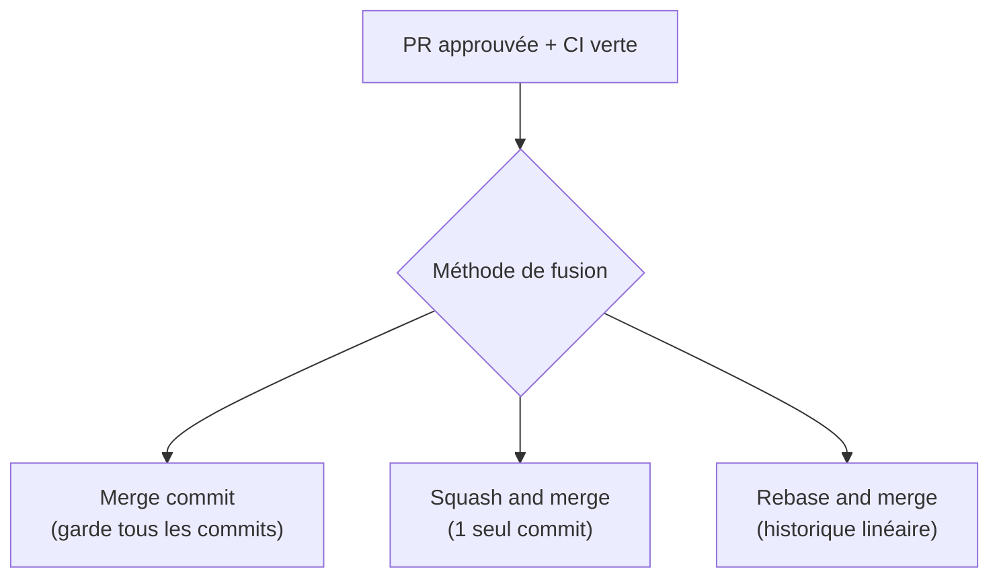
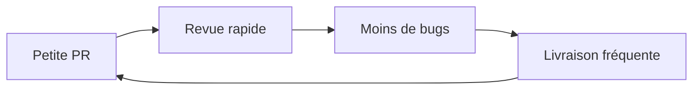
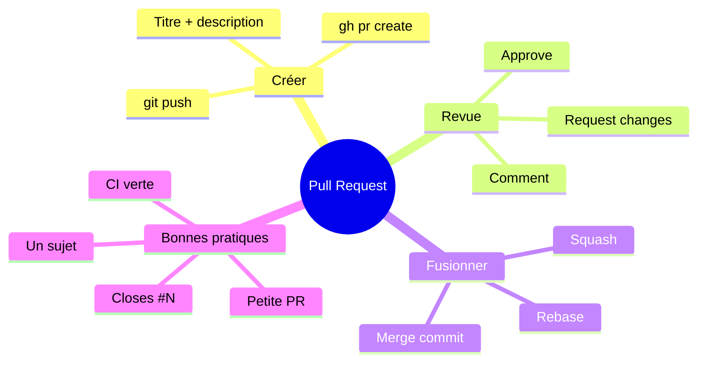

<a id="top"></a>

# 03 — Pull requests

## Table des matières

| # | Section |
|---|---|
| 1 | [Qu'est-ce qu'une pull request ?](#section-1) |
| 2 | [Créer une pull request](#section-2) |
| 3 | [La revue de code](#section-3) |
| 4 | [Fusionner une pull request](#section-4) |
| 5 | [Bonnes pratiques de PR](#section-5) |
| 6 | [Quiz — Les pull requests](#section-6) |
| 7 | [Pratique — Ouvrir et fusionner une PR](#section-7) |
| 8 | [Synthèse](#section-8) |

---

<a id="section-1"></a>

<details>
<summary>1 — Qu'est-ce qu'une pull request ?</summary>

<br/>

Une **pull request** (PR), aussi appelée *merge request* sur GitLab, est une **demande d'intégration** : « voici mon travail sur une branche, merci de le **relire** puis de le **fusionner** dans `main` ». C'est le **point de rencontre** entre le code et l'équipe.



> _Une PR n'est pas qu'un bouton « fusionner ». C'est un **espace de discussion** autour du code : commentaires, suggestions, tests automatiques, validation. C'est là que se joue la qualité._

| Une PR sert à… | Concrètement |
|---|---|
| **Faire relire** le code | Un collègue détecte bugs et améliorations |
| **Déclencher la CI** | Tests + build automatiques sur la branche |
| **Documenter** le changement | Titre + description expliquent le « pourquoi » |
| **Tracer** la décision | Qui a approuvé, quand, pourquoi |

</details>

<p align="right"><a href="#top">↑ Retour en haut</a></p>

---

<a id="section-2"></a>

<details>
<summary>2 — Créer une pull request</summary>

<br/>

Avant d'ouvrir une PR, il faut avoir **poussé sa branche** sur GitHub.



**Étape 1 — Pousser la branche :**

```bash
git switch feature/recherche
git push -u origin feature/recherche
```

**Étape 2 — Ouvrir la PR** (deux options) :

- **Sur l'interface GitHub** : un bandeau « Compare & pull request » apparaît ; on clique, on choisit la branche **de base** (`main`) et la branche **comparée** (`feature/recherche`).
- **En ligne de commande** avec GitHub CLI :

```bash
# Crée la PR sans quitter le terminal
gh pr create --base main --head feature/recherche \
  --title "Ajout de la recherche" \
  --body "Implémente la barre de recherche avec filtres."
```

**Une bonne description de PR contient :**

| Section | Contenu |
|---|---|
| **Quoi** | Ce que fait la PR en une phrase |
| **Pourquoi** | Le problème ou besoin résolu |
| **Comment tester** | Étapes pour vérifier |
| **Lien** | Numéro de l'issue liée (ex. `Closes #42`) |

> _Le titre et la description sont lus par des humains pressés. Soyez explicite : « Corrige le crash au login » vaut mille fois mieux que « fix bug »._

**🔧 Mini-exercice —** Depuis la branche courante `feature/recherche`, crée une pull request vers `main` avec `gh`, en donnant un titre clair.

<details>
<summary>✅ Voir une solution</summary>

```bash
gh pr create --base main --head feature/recherche \
  --title "Ajout de la recherche" --body "Implémente la barre de recherche."
```

</details>

</details>

<p align="right"><a href="#top">↑ Retour en haut</a></p>

---

<a id="section-3"></a>

<details>
<summary>3 — La revue de code</summary>

<br/>

La **revue de code** (*code review*) est le cœur de la PR : un ou plusieurs collègues lisent les modifications, posent des questions, suggèrent des améliorations et finissent par **approuver** ou **demander des changements**.



**Les trois verdicts possibles sur GitHub :**

| Verdict | Signification |
|---|---|
| **Approve** | Le code est bon, on peut fusionner |
| **Request changes** | Des corrections sont nécessaires avant fusion |
| **Comment** | Remarques sans bloquer ni approuver |

**Côté auteur**, après des commentaires, on corrige et on **repousse** : la PR se met à jour automatiquement.

```bash
# Corriger suite à la revue
git switch feature/recherche
# ... modifications ...
git commit -am "Prise en compte des retours de revue"
git push          # la PR se met à jour toute seule
```

**Ce qu'un bon reviewer regarde :**

- Le code **fait-il ce qu'il prétend** ? (logique correcte)
- Est-il **lisible** et **maintenable** ?
- Y a-t-il des **tests** ? La **CI passe-t-elle** au vert ?
- Des problèmes de **sécurité** ou de **performance** ?

> _La revue de code n'est pas un jugement de la personne, mais une **amélioration collective** du produit. On critique le code, jamais l'auteur. Et on souligne aussi ce qui est bien fait._

</details>

<p align="right"><a href="#top">↑ Retour en haut</a></p>

---

<a id="section-4"></a>

<details>
<summary>4 — Fusionner une pull request</summary>

<br/>

Une fois la PR **approuvée** et la **CI au vert**, on la fusionne. GitHub propose **trois méthodes**, qui changent la forme de l'historique.



| Méthode | Ce qu'elle fait | Quand l'utiliser |
|---|---|---|
| **Create a merge commit** | Crée un commit de fusion, garde tous les commits de la branche | Tracer la branche entière |
| **Squash and merge** | **Écrase** tous les commits en **un seul** propre | Historique `main` clair et concis |
| **Rebase and merge** | Rejoue les commits sur `main`, **sans** commit de fusion | Historique strictement linéaire |

```bash
# Fusionner depuis le terminal avec GitHub CLI
gh pr merge 42 --squash --delete-branch
```

**Après la fusion, on nettoie :**

```bash
# Supprimer la branche distante (souvent automatique)
git push origin --delete feature/recherche

# Mettre à jour son local
git switch main
git pull origin main

# Supprimer la branche locale
git branch -d feature/recherche
```

> _Le **squash and merge** est très populaire : une fonctionnalité = un commit propre dans `main`. L'historique devient une liste lisible de fonctionnalités, et non un fouillis de « wip », « fix typo », « oups »._

**🔧 Mini-exercice —** Avec `gh`, fusionne la PR numéro 42 en **squash** et supprime la branche dans la foulée. Écris la commande.

<details>
<summary>✅ Voir une solution</summary>

`gh pr merge 42 --squash --delete-branch`

</details>

</details>

<p align="right"><a href="#top">↑ Retour en haut</a></p>

---

<a id="section-5"></a>

<details>
<summary>5 — Bonnes pratiques de PR</summary>

<br/>

Une PR efficace est une PR **petite, claire et testée**. Voici les habitudes des équipes performantes.

| Bonne pratique | Pourquoi |
|---|---|
| **PR petites** (< 400 lignes) | Plus faciles et plus rapides à relire |
| **Une PR = un sujet** | Pas de mélange « feature + refactor + typo » |
| **Titre + description clairs** | Le reviewer comprend sans deviner |
| **Lier l'issue** (`Closes #N`) | Trace le besoin et ferme l'issue à la fusion |
| **CI verte avant de demander la revue** | On ne fait pas relire du code cassé |
| **Répondre à tous les commentaires** | Rien ne reste sans réponse |



```bash
# Lier automatiquement une issue dans la description
gh pr create --title "Ajout export CSV" \
  --body "Permet d'exporter les données en CSV. Closes #57"
```

> _Une PR de 1 000 lignes reçoit un « LGTM » (looks good to me) sans vraie relecture — personne n'a le courage de tout lire. Une PR de 50 lignes reçoit des retours précieux. **Petit = relu sérieusement.**_

**🔧 Mini-exercice —** Quel mot-clé ajoutes-tu dans la description d'une PR pour fermer automatiquement l'issue #57 lors de la fusion ?

<details>
<summary>✅ Voir une solution</summary>

`Closes #57` (les variantes `Fixes #57` ou `Resolves #57` fonctionnent aussi).

</details>

</details>

<p align="right"><a href="#top">↑ Retour en haut</a></p>

---

<a id="section-6"></a>

<details>
<summary>6 — Quiz — Les pull requests</summary>

<br/>

**Question 1 :** À quoi sert une pull request ?

a) À supprimer une branche

b) À demander la relecture et l'intégration d'une branche dans une autre

c) À installer Git

d) À cloner un dépôt

<details>
<summary>💡 Voir la solution</summary>

✅ **Réponse : b)** — Une PR demande la relecture du code d'une branche puis sa fusion (souvent dans `main`).

</details>

---

**Question 2 :** Que faut-il faire **avant** de pouvoir ouvrir une PR sur GitHub ?

a) Supprimer `main`

b) Pousser sa branche sur le dépôt distant (`git push`)

c) Fermer le terminal

d) Désactiver la CI

<details>
<summary>💡 Voir la solution</summary>

✅ **Réponse : b)** — La branche doit exister côté distant ; on la pousse avec `git push -u origin nom-de-branche`.

</details>

---

**Question 3 :** Que signifie « Request changes » lors d'une revue ?

a) Le code est approuvé

b) Des corrections sont nécessaires avant la fusion

c) La PR est supprimée

d) Un nouveau dépôt est créé

<details>
<summary>💡 Voir la solution</summary>

✅ **Réponse : b)** — Le reviewer demande des modifications ; l'auteur corrige et repousse, ce qui met à jour la PR.

</details>

---

**Question 4 :** Quelle méthode de fusion écrase tous les commits de la branche en un seul ?

a) Create a merge commit

b) Squash and merge

c) Rebase and merge

d) Cherry-pick

<details>
<summary>💡 Voir la solution</summary>

✅ **Réponse : b)** — *Squash and merge* condense tous les commits en un seul commit propre dans `main`.

</details>

---

**Question 5 :** Pourquoi privilégier de **petites** pull requests ?

a) Elles consomment moins de disque

b) Elles sont relues plus vite et plus sérieusement

c) GitHub les rend obligatoires

d) Elles évitent d'écrire des tests

<details>
<summary>💡 Voir la solution</summary>

✅ **Réponse : b)** — Une petite PR est relue attentivement et rapidement ; une énorme PR reçoit souvent un « LGTM » sans vraie relecture.

</details>

</details>

<p align="right"><a href="#top">↑ Retour en haut</a></p>

---

<a id="section-7"></a>

<details>
<summary>7 — Pratique — Ouvrir et fusionner une PR</summary>

<br/>

### Consigne

Vous avez terminé une fonctionnalité sur la branche `feature/footer`. Réalisez le cycle complet d'une pull request avec **GitHub CLI** (`gh`) :

1. Poussez la branche.
2. Ouvrez une PR vers `main` avec un titre clair et un lien d'issue (`Closes #12`).
3. Une fois approuvée, fusionnez-la en **squash** et supprimez la branche.
4. Mettez votre dépôt local à jour.

---

### Correction

```bash
# 1. Pousser la branche
git switch feature/footer
git push -u origin feature/footer

# 2. Ouvrir la pull request
gh pr create --base main --head feature/footer \
  --title "Ajout du pied de page du site" \
  --body "Ajoute un footer responsive avec liens et mentions légales. Closes #12"

# 3. Après approbation : fusion en squash + suppression de la branche
gh pr merge --squash --delete-branch

# 4. Mettre le local à jour
git switch main
git pull origin main
git branch -d feature/footer
```

**Résultat attendu :**

| Étape | Vérification |
|---|---|
| PR créée | `gh pr list` montre la PR ouverte vers `main` |
| Issue liée | La description contient `Closes #12` (fermera l'issue à la fusion) |
| Fusion squash | Un **seul** commit « Ajout du pied de page du site » apparaît dans `main` |
| Branche supprimée | `git branch` ne liste plus `feature/footer` |

```text
$ git log --oneline -1
a1b2c3d Ajout du pied de page du site (#13)
```

> _Le numéro entre parenthèses (`#13`) est ajouté automatiquement par GitHub : c'est le numéro de la PR. Cliquer dessus ramène à toute la discussion de revue. Traçabilité totale._

</details>

<p align="right"><a href="#top">↑ Retour en haut</a></p>

---

<a id="section-8"></a>

<details>
<summary>8 — Synthèse</summary>

<br/>

#### Points à retenir

1. **Une pull request** demande la relecture puis la fusion d'une branche : c'est un espace de discussion.
2. **Créer une PR** : pousser la branche, puis l'ouvrir via l'interface ou `gh pr create`.
3. **La revue de code** aboutit à *Approve*, *Request changes* ou *Comment* ; on critique le code, pas l'auteur.
4. **Trois méthodes de fusion** : merge commit, squash and merge, rebase and merge.
5. **Bonnes pratiques** : PR petites, un seul sujet, CI verte, issue liée.
6. **Après fusion** : supprimer la branche et mettre à jour son local.



#### La suite

Vous maîtrisez le cycle de contribution sur **votre** dépôt. La leçon **04 — Workflow collaboratif** ouvre la collaboration plus large : fork, clone, issues et bonnes pratiques d'équipe.

</details>

<p align="right"><a href="#top">↑ Retour en haut</a></p>

---

<p align="center">
  <em>Tous droits réservés. Toute reproduction, diffusion, utilisation ou adaptation de ce cours, en tout ou en partie, est strictement interdite sans l'autorisation écrite préalable de Dr. Haythem REHOUMA.</em>
</p>

<p align="center">
  <strong>Cours créé par Dr. Haythem REHOUMA — Développement et déploiement de solutions de données</strong>
</p>
