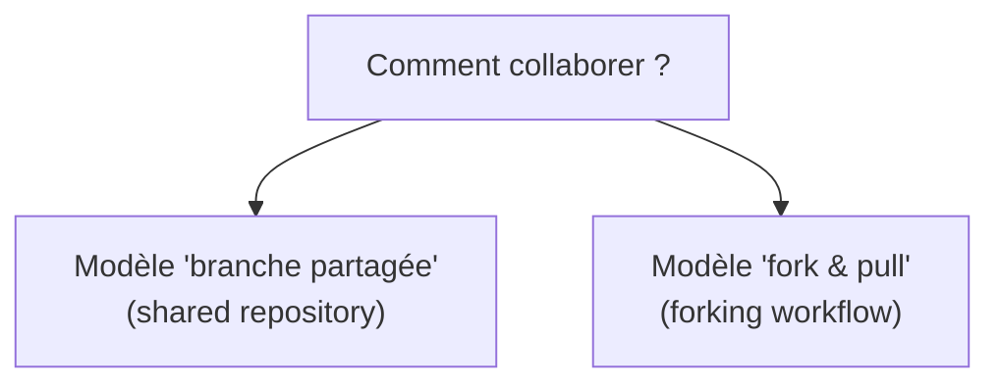
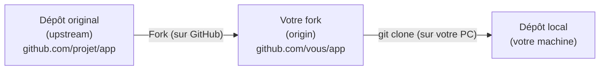
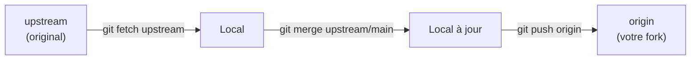
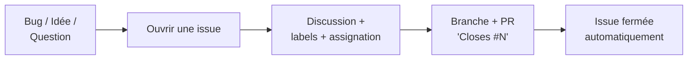
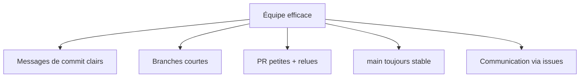
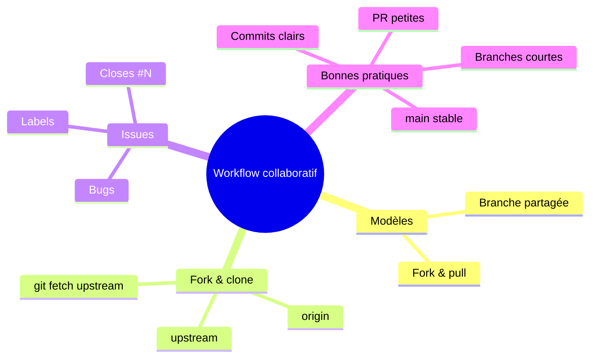

<a id="top"></a>

# 04 — Workflow collaboratif

## Table des matières

| # | Section |
|---|---|
| 1 | [Collaborer : deux modèles](#section-1) |
| 2 | [Fork et clone](#section-2) |
| 3 | [Synchroniser son fork (upstream)](#section-3) |
| 4 | [Les issues](#section-4) |
| 5 | [Bonnes pratiques d'équipe](#section-5) |
| 6 | [Quiz — Le workflow collaboratif](#section-6) |
| 7 | [Pratique — Contribuer via un fork](#section-7) |
| 8 | [Synthèse](#section-8) |

---

<a id="section-1"></a>

<details>
<summary>1 — Collaborer : deux modèles</summary>

<br/>

Pour travailler à plusieurs sur un dépôt, il existe **deux grands modèles** de collaboration. Le choix dépend surtout de **qui a le droit d'écrire** dans le dépôt.



| Modèle | Principe | Cas typique |
|---|---|---|
| **Branche partagée** | Tous les membres ont accès en écriture ; chacun crée ses branches dans **le même** dépôt | Équipe interne, entreprise |
| **Fork & pull** | On **copie** le dépôt sur son propre compte, on y travaille, puis on propose une PR vers l'original | Open source, contributeurs externes |

> _En entreprise, on utilise presque toujours la **branche partagée** (vu en leçons 01–03). Pour contribuer à un projet open source dont on n'est pas membre, on passe par le **fork**._

</details>

<p align="right"><a href="#top">↑ Retour en haut</a></p>

---

<a id="section-2"></a>

<details>
<summary>2 — Fork et clone</summary>

<br/>

Un **fork** est une **copie personnelle** d'un dépôt sur **votre** compte GitHub. Vous y avez tous les droits, sans toucher à l'original. Le **clone**, lui, télécharge un dépôt sur votre **machine locale**.



**Ne pas confondre :**

| Terme | Où ? | Action |
|---|---|---|
| **Fork** | Sur GitHub | Copie le dépôt sur votre compte |
| **Clone** | De GitHub vers votre PC | Télécharge le dépôt en local |
| **origin** | Votre fork distant | Là où vous poussez |
| **upstream** | Le dépôt original | La source que vous suivez |

```bash
# 1. Forker se fait via le bouton "Fork" sur GitHub (ou la CLI)
gh repo fork projet/app --clone

# Équivalent manuel après un fork :
# 2. Cloner SON fork
git clone https://github.com/vous/app.git
cd app

# 3. Vérifier le remote
git remote -v
# origin  https://github.com/vous/app.git (fetch/push)
```

> _Le fork est votre « bac à sable » : vous pouvez tout casser sans risque pour le projet original. Quand votre travail est prêt, une pull request le propose au mainteneur, qui décide de l'accepter._

**🔧 Mini-exercice —** Avec `gh`, forke le dépôt `projet/app` **et** clone-le sur ta machine en une seule commande.

<details>
<summary>✅ Voir une solution</summary>

`gh repo fork projet/app --clone`

</details>

</details>

<p align="right"><a href="#top">↑ Retour en haut</a></p>

---

<a id="section-3"></a>

<details>
<summary>3 — Synchroniser son fork (upstream)</summary>

<br/>

Pendant que vous travaillez, le **dépôt original évolue**. Votre fork ne se met **pas** à jour tout seul. Il faut ajouter un remote **`upstream`** pointant vers l'original, puis récupérer ses changements régulièrement.



```bash
# 1. Déclarer le dépôt original comme 'upstream'
git remote add upstream https://github.com/projet/app.git

# 2. Récupérer ses derniers changements
git fetch upstream

# 3. Mettre à jour son main local
git switch main
git merge upstream/main

# 4. Pousser dans son propre fork
git push origin main
```

| Remote | Rôle | Sens d'utilisation |
|---|---|---|
| `origin` | Votre fork | `push` votre travail |
| `upstream` | Dépôt original | `fetch` les mises à jour des autres |

> _Synchroniser tôt et souvent avec `upstream` évite que votre fork ne « dérive » du projet. Plus vous attendez, plus les conflits seront nombreux le jour de la PR._

**🔧 Mini-exercice —** Écris la commande pour déclarer le dépôt original `https://github.com/projet/app.git` comme remote `upstream`.

<details>
<summary>✅ Voir une solution</summary>

`git remote add upstream https://github.com/projet/app.git`

</details>

</details>

<p align="right"><a href="#top">↑ Retour en haut</a></p>

---

<a id="section-4"></a>

<details>
<summary>4 — Les issues</summary>

<br/>

Une **issue** est un **ticket** : un endroit pour signaler un bug, proposer une fonctionnalité ou poser une question. C'est le **système de suivi** d'un projet GitHub.



**Ce qu'on met dans une bonne issue de bug :**

| Élément | Exemple |
|---|---|
| **Titre clair** | « Crash au clic sur Exporter » |
| **Étapes pour reproduire** | 1. Ouvrir X, 2. cliquer Y… |
| **Comportement attendu** | « Le fichier se télécharge » |
| **Comportement observé** | « L'application se ferme » |
| **Environnement** | OS, navigateur, version |

```bash
# Créer une issue depuis le terminal
gh issue create --title "Crash au clic sur Exporter" \
  --body "Étapes : 1) ouvrir X 2) cliquer Exporter → l'app se ferme."

# Lister les issues ouvertes
gh issue list

# Lier une PR à une issue : dans la description de la PR
#   Closes #42   → ferme automatiquement l'issue #42 à la fusion
```

**Les labels** organisent les issues : `bug`, `enhancement`, `documentation`, `good first issue`, `help wanted`…

> _Les issues transforment le « il faudrait corriger ça un jour » en tâches **traçables et discutables**. Lier une PR avec `Closes #N` ferme l'issue automatiquement à la fusion : zéro oubli._

**🔧 Mini-exercice —** Avec `gh`, crée une issue intitulée « Crash au clic sur Exporter ».

<details>
<summary>✅ Voir une solution</summary>

`gh issue create --title "Crash au clic sur Exporter" --body "L'app se ferme au clic sur Exporter."`

</details>

</details>

<p align="right"><a href="#top">↑ Retour en haut</a></p>

---

<a id="section-5"></a>

<details>
<summary>5 — Bonnes pratiques d'équipe</summary>

<br/>

Au-delà des commandes, collaborer efficacement repose sur des **conventions partagées**. Voici celles qui font la différence.



| Bonne pratique | Concrètement |
|---|---|
| **Messages de commit clairs** | « Corrige le calcul de TVA », pas « update » |
| **Convention de nommage** | `feature/`, `fix/`, `docs/` pour les branches |
| **Branches courtes** | Intégrer tôt pour limiter les conflits |
| **PR petites et relues** | Relecture sérieuse, moins de bugs |
| **`main` toujours déployable** | On ne casse jamais la branche principale |
| **Un fichier `README` + `CONTRIBUTING`** | Documente comment contribuer |

**Le standard des « Conventional Commits »**, très répandu :

```bash
git commit -m "feat: ajout de l'export CSV"
git commit -m "fix: corrige le crash au login"
git commit -m "docs: mise à jour du README"
git commit -m "refactor: simplifie le service de paiement"
```

| Préfixe | Signification |
|---|---|
| `feat:` | Nouvelle fonctionnalité |
| `fix:` | Correction de bug |
| `docs:` | Documentation |
| `refactor:` | Réécriture sans changer le comportement |
| `test:` | Ajout ou modification de tests |

> _Une équipe qui partage des conventions n'a pas besoin de se concerter sans cesse : le code, les commits et les branches « parlent » la même langue. C'est ça, la fluidité collaborative._

**🔧 Mini-exercice —** Tu viens d'ajouter l'export CSV. Écris le message de commit au format **Conventional Commits**.

<details>
<summary>✅ Voir une solution</summary>

`git commit -m "feat: ajout de l'export CSV"` (préfixe `feat:` pour une nouvelle fonctionnalité).

</details>

</details>

<p align="right"><a href="#top">↑ Retour en haut</a></p>

---

<a id="section-6"></a>

<details>
<summary>6 — Quiz — Le workflow collaboratif</summary>

<br/>

**Question 1 :** Qu'est-ce qu'un fork ?

a) Une fusion de deux branches

b) Une copie personnelle d'un dépôt sur votre compte GitHub

c) Un type de conflit

d) Une suppression de l'historique

<details>
<summary>💡 Voir la solution</summary>

✅ **Réponse : b)** — Un fork copie le dépôt sur votre compte ; vous y travaillez librement sans toucher à l'original.

</details>

---

**Question 2 :** Quelle est la différence entre `origin` et `upstream` dans le modèle fork & pull ?

a) Aucune, ce sont des synonymes

b) `origin` est votre fork, `upstream` est le dépôt original

c) `origin` est local, `upstream` est sur votre disque

d) `upstream` sert à supprimer des branches

<details>
<summary>💡 Voir la solution</summary>

✅ **Réponse : b)** — On pousse vers `origin` (son fork) et on récupère les mises à jour depuis `upstream` (l'original).

</details>

---

**Question 3 :** À quoi sert une issue ?

a) À compiler le code

b) À signaler un bug, proposer une fonctionnalité ou discuter d'une tâche

c) À fusionner automatiquement les branches

d) À cloner un dépôt

<details>
<summary>💡 Voir la solution</summary>

✅ **Réponse : b)** — Une issue est un ticket de suivi : bug, idée, question, organisée par des labels.

</details>

---

**Question 4 :** Que fait `Closes #42` dans la description d'une pull request ?

a) Supprime le commit 42

b) Ferme automatiquement l'issue #42 quand la PR est fusionnée

c) Ouvre une nouvelle issue

d) Annule la PR

<details>
<summary>💡 Voir la solution</summary>

✅ **Réponse : b)** — Le mot-clé `Closes` (ou `Fixes`) lie la PR à l'issue et la ferme à la fusion.

</details>

---

**Question 5 :** Que signifie le préfixe de commit `fix:` dans les Conventional Commits ?

a) Une nouvelle fonctionnalité

b) Une correction de bug

c) De la documentation

d) Un test

<details>
<summary>💡 Voir la solution</summary>

✅ **Réponse : b)** — `fix:` indique une correction de bug ; `feat:` une fonctionnalité, `docs:` de la documentation.

</details>

</details>

<p align="right"><a href="#top">↑ Retour en haut</a></p>

---

<a id="section-7"></a>

<details>
<summary>7 — Pratique — Contribuer via un fork</summary>

<br/>

### Consigne

Vous voulez contribuer à un projet open source `projet/app` dont vous **n'êtes pas membre**. Réalisez le cycle complet du modèle **fork & pull** :

1. Forkez et clonez le dépôt.
2. Ajoutez le remote `upstream` et synchronisez votre `main`.
3. Créez une branche, faites un commit (corrigeant l'issue #8) et poussez-la dans votre fork.
4. Ouvrez une pull request **vers le dépôt original** en liant l'issue.

---

### Correction

```bash
# 1. Forker + cloner
gh repo fork projet/app --clone
cd app

# 2. Ajouter upstream et synchroniser
git remote add upstream https://github.com/projet/app.git
git fetch upstream
git switch main
git merge upstream/main
git push origin main

# 3. Brancher, commiter, pousser
git switch -c fix/correction-typo-readme
# ... correction du fichier README ...
git commit -am "fix: corrige une faute dans le README"
git push -u origin fix/correction-typo-readme

# 4. Ouvrir la PR vers le dépôt ORIGINAL
gh pr create --repo projet/app \
  --base main --head vous:fix/correction-typo-readme \
  --title "fix: faute de frappe dans le README" \
  --body "Corrige une coquille. Closes #8"
```

**Résultat attendu :**

| Étape | Vérification |
|---|---|
| Fork créé | Le dépôt apparaît sous `github.com/vous/app` |
| `upstream` ajouté | `git remote -v` liste `origin` **et** `upstream` |
| Branche poussée | La branche existe dans **votre** fork (`origin`) |
| PR ouverte | La PR cible `projet/app:main` depuis `vous:fix/...` |
| Issue liée | `Closes #8` fermera l'issue à la fusion par le mainteneur |

```text
$ git remote -v
origin    https://github.com/vous/app.git (push)
upstream  https://github.com/projet/app.git (fetch)
```

> _La PR part de **votre** branche (`vous:fix/...`) vers le `main` du **dépôt original**. Le mainteneur la relit et décide de fusionner : vous venez de contribuer à l'open source sans jamais avoir eu de droit d'écriture sur le projet._

</details>

<p align="right"><a href="#top">↑ Retour en haut</a></p>

---

<a id="section-8"></a>

<details>
<summary>8 — Synthèse</summary>

<br/>

#### Points à retenir

1. **Deux modèles** : branche partagée (équipe interne) et fork & pull (open source).
2. **Fork** = copie sur votre compte ; **clone** = copie sur votre machine.
3. **origin** = votre fork ; **upstream** = le dépôt original à synchroniser régulièrement.
4. **Les issues** tracent bugs, idées et tâches ; `Closes #N` lie et ferme à la fusion.
5. **Bonnes pratiques** : commits clairs, branches courtes, PR petites, `main` stable.
6. **Conventional Commits** (`feat:`, `fix:`, `docs:`…) standardisent les messages.



#### La suite

Ce module 02 est terminé : vous savez désormais brancher, fusionner, ouvrir des pull requests et collaborer à grande échelle. Le **module 03** poursuit le parcours DevOps avec l'**intégration continue (CI/CD)**, qui automatisera tests et déploiements à partir de ces mêmes pull requests.

</details>

<p align="right"><a href="#top">↑ Retour en haut</a></p>

---

<p align="center">
  <em>Tous droits réservés. Toute reproduction, diffusion, utilisation ou adaptation de ce cours, en tout ou en partie, est strictement interdite sans l'autorisation écrite préalable de Dr. Haythem REHOUMA.</em>
</p>

<p align="center">
  <strong>Cours créé par Dr. Haythem REHOUMA — Développement et déploiement de solutions de données</strong>
</p>
