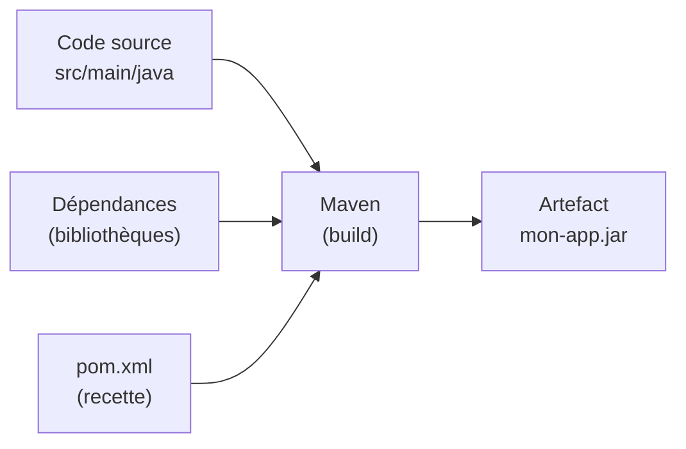
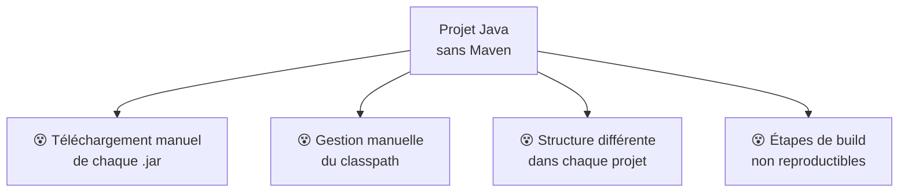
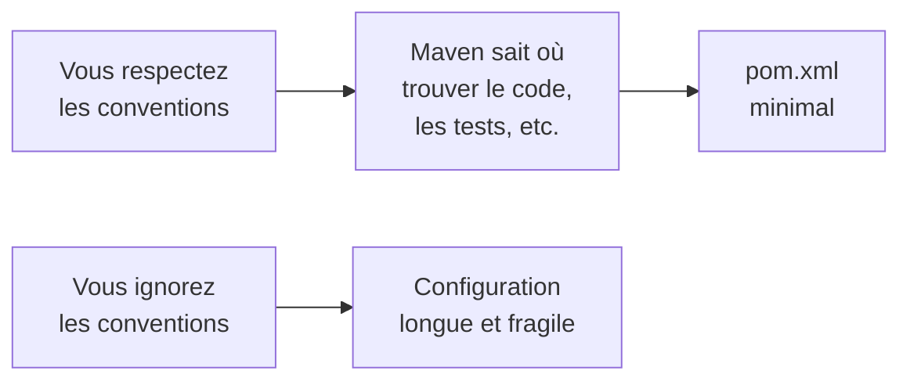
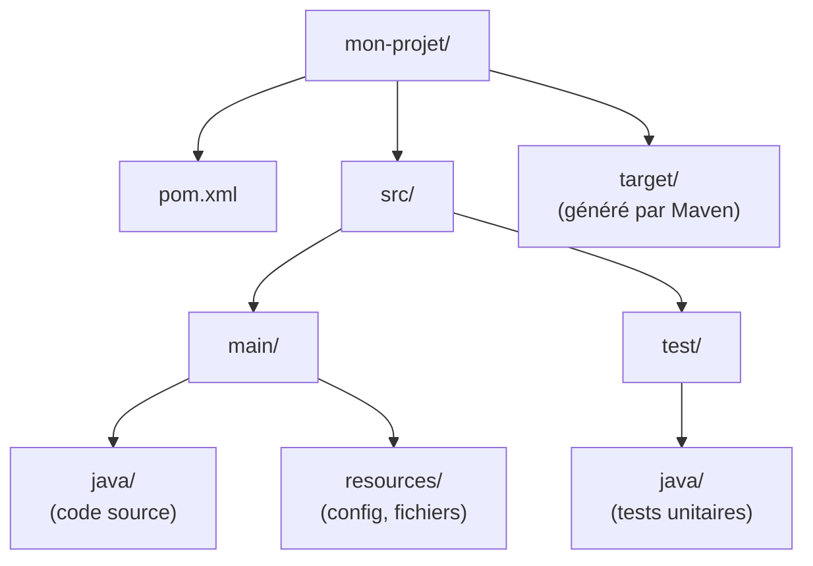
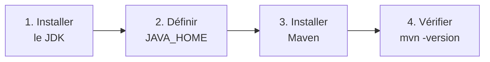
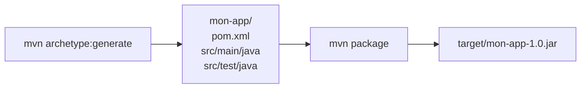
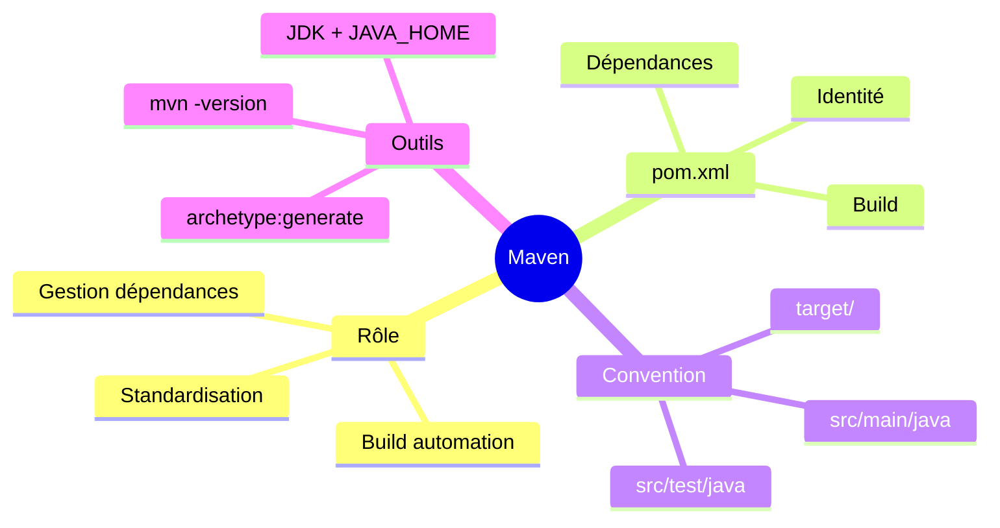

<a id="top"></a>

# 01 — Introduction à Maven

## Table des matières

| # | Section |
|---|---|
| 1 | [Qu'est-ce que Maven ?](#section-1) |
| 2 | [Le problème que Maven résout](#section-2) |
| 3 | [Convention plutôt que configuration](#section-3) |
| 4 | [Structure standard d'un projet Maven](#section-4) |
| 5 | [Installer Maven](#section-5) |
| 6 | [Vérifier l'installation et premier projet](#section-6) |
| 7 | [Quiz — Introduction à Maven](#section-7) |
| 8 | [Pratique — Créer et inspecter un projet](#section-8) |
| 9 | [Synthèse](#section-9) |

---

<a id="section-1"></a>

<details>
<summary>1 — Qu'est-ce que Maven ?</summary>

<br/>

**Apache Maven** est un outil d'**automatisation de construction** (*build automation*) pour les projets Java. Il prend votre code source et produit un livrable (un fichier `.jar` ou `.war`) en orchestrant toutes les étapes : compilation, tests, empaquetage, gestion des dépendances.

Concrètement, Maven répond à trois besoins fondamentaux :

| Besoin | Ce que fait Maven |
|---|---|
| **Construire** le projet | Compile le code et produit un artefact (`.jar`, `.war`) |
| **Gérer les dépendances** | Télécharge automatiquement les bibliothèques nécessaires |
| **Standardiser** | Impose une structure de projet identique partout |



Le cœur de Maven est un fichier unique, le **`pom.xml`** (*Project Object Model*), qui décrit le projet : son identité, ses dépendances et la façon de le construire. C'est la « recette » que Maven exécute.

> _Sans Maven, construire un projet Java signifie compiler à la main avec `javac`, télécharger chaque bibliothèque manuellement et gérer soi-même le classpath. Maven automatise tout cela à partir d'un seul fichier._

**🔧 Mini-exercice —** Cite les trois besoins fondamentaux auxquels Maven répond.

<details>
<summary>✅ Voir une solution</summary>

Construire le projet (compiler + produire un artefact `.jar`/`.war`), gérer les dépendances (télécharger les bibliothèques), et standardiser (imposer une structure de projet identique).

</details>

</details>

<p align="right"><a href="#top">↑ Retour en haut</a></p>

---

<a id="section-2"></a>

<details>
<summary>2 — Le problème que Maven résout</summary>

<br/>

Avant Maven, chaque projet Java était construit « à la main » ou avec des scripts maison. Cela posait plusieurs problèmes récurrents :



| Problème (sans Maven) | Solution (avec Maven) |
|---|---|
| Trouver et télécharger les `.jar` un par un | Déclaration dans le `pom.xml`, téléchargement automatique |
| Conflits de versions de bibliothèques | Résolution transitive automatique |
| « Ça compile chez moi mais pas chez toi » | Build reproductible et standardisé |
| Chaque projet rangé différemment | Structure de dossiers imposée |

L'idée maîtresse : un développeur qui rejoint un projet Maven sait **immédiatement** où se trouve le code, où sont les tests, et comment lancer la construction — peu importe l'entreprise ou le projet.

```bash
# Avec Maven, construire un projet inconnu se résume à :
mvn package
```

> _Maven transforme « comment construire ce projet ? » — une question qui prenait parfois des heures — en une seule commande universelle._

**🔧 Mini-exercice —** Écris la seule commande qui suffit à construire un projet Maven inconnu.

<details>
<summary>✅ Voir une solution</summary>

```bash
mvn package
```

</details>

</details>

<p align="right"><a href="#top">↑ Retour en haut</a></p>

---

<a id="section-3"></a>

<details>
<summary>3 — Convention plutôt que configuration</summary>

<br/>

Le principe central de Maven est **« convention plutôt que configuration »** (*convention over configuration*). Plutôt que de tout décrire explicitement, Maven part de **valeurs par défaut sensées**. Si vous respectez les conventions, vous n'avez presque rien à configurer.



Exemples de conventions par défaut :

| Élément | Emplacement attendu par défaut |
|---|---|
| Code source principal | `src/main/java` |
| Ressources principales | `src/main/resources` |
| Code de test | `src/test/java` |
| Artefact produit | `target/` |

Comparons les philosophies :

| Approche | Conséquence |
|---|---|
| **Tout configurer** | Flexible mais verbeux, sujet aux erreurs |
| **Convention par défaut** | Concis, cohérent entre projets, rapide à démarrer |

> _Vous pouvez toujours redéfinir les conventions si nécessaire, mais 95 % des projets se contentent des valeurs par défaut. Moins de configuration = moins de bugs._

</details>

<p align="right"><a href="#top">↑ Retour en haut</a></p>

---

<a id="section-4"></a>

<details>
<summary>4 — Structure standard d'un projet Maven</summary>

<br/>

Tout projet Maven suit la même arborescence. La connaître permet de naviguer instantanément dans n'importe quel projet.



Détail des dossiers :

| Chemin | Rôle |
|---|---|
| `pom.xml` | La recette du projet (à la racine) |
| `src/main/java` | Le code source de l'application |
| `src/main/resources` | Fichiers non-Java (`.properties`, `.xml`, images) |
| `src/test/java` | Les classes de tests unitaires |
| `src/test/resources` | Ressources utilisées par les tests |
| `target/` | Dossier de sortie : classes compilées et artefact final |

**🔧 Mini-exercice —** Dans quel dossier dois-tu placer une classe de test unitaire, et dans lequel un fichier `application.properties` ?

<details>
<summary>✅ Voir une solution</summary>

Le test unitaire va dans `src/test/java`, et `application.properties` dans `src/main/resources`.

</details>

```bash
# Arborescence typique vue en ligne de commande
mon-projet/
├── pom.xml
├── src/
│   ├── main/
│   │   ├── java/        # ex. com/exemple/App.java
│   │   └── resources/   # ex. application.properties
│   └── test/
│       └── java/        # ex. com/exemple/AppTest.java
└── target/              # généré : ne pas versionner (.gitignore)
```

> _⚠️ Le dossier `target/` est **régénéré** à chaque build. Ajoutez-le à votre `.gitignore` : on ne versionne jamais les artefacts compilés._

</details>

<p align="right"><a href="#top">↑ Retour en haut</a></p>

---

<a id="section-5"></a>

<details>
<summary>5 — Installer Maven</summary>

<br/>

Maven a besoin d'un **JDK** (Java Development Kit) déjà installé, car il s'appuie sur le compilateur `javac`. La variable `JAVA_HOME` doit pointer vers ce JDK.



Selon votre système :

| Système | Commande d'installation |
|---|---|
| **Windows** (avec Chocolatey) | `choco install maven` |
| **macOS** (avec Homebrew) | `brew install maven` |
| **Linux** (Debian/Ubuntu) | `sudo apt install maven` |

Installation manuelle (toutes plateformes) :

```bash
# 1. Vérifier d'abord que Java est présent
java -version
# Doit afficher une version 17+ par exemple

# 2. Définir JAVA_HOME (exemple Linux/macOS)
export JAVA_HOME=/usr/lib/jvm/java-17-openjdk

# 3. Télécharger Maven depuis maven.apache.org, décompresser,
#    puis ajouter le dossier bin/ au PATH
export PATH=$PATH:/opt/apache-maven-3.9.6/bin
```

> _Sur Windows, `JAVA_HOME` se règle dans « Variables d'environnement ». Sur Linux/macOS, ajoutez la ligne `export` à votre `~/.bashrc` ou `~/.zshrc` pour qu'elle soit permanente._

</details>

<p align="right"><a href="#top">↑ Retour en haut</a></p>

---

<a id="section-6"></a>

<details>
<summary>6 — Vérifier l'installation et premier projet</summary>

<br/>

Une fois Maven installé, on vérifie qu'il fonctionne et on génère un premier squelette de projet.

```bash
# Vérifier la version installée
mvn -version
```

Sortie typique :

```
Apache Maven 3.9.6
Maven home: /opt/apache-maven-3.9.6
Java version: 17.0.9, vendor: Eclipse Adoptium
```

Pour générer un projet vide respectant les conventions, on utilise un **archétype** (un gabarit) :

```bash
# Génère un projet « quickstart » standard
mvn archetype:generate \
  -DgroupId=com.exemple \
  -DartifactId=mon-app \
  -DarchetypeArtifactId=maven-archetype-quickstart \
  -DinteractiveMode=false
```



| Commande | Effet |
|---|---|
| `mvn -version` | Affiche la version de Maven et de Java |
| `mvn archetype:generate` | Génère un projet à partir d'un gabarit |
| `mvn package` | Construit l'artefact dans `target/` |

> _Le premier `mvn` est lent : Maven télécharge ses propres plugins dans un cache local (`~/.m2/repository`). Les builds suivants sont beaucoup plus rapides._

**🔧 Mini-exercice —** Écris la commande qui affiche la version de Maven installée (et celle de Java).

<details>
<summary>✅ Voir une solution</summary>

```bash
mvn -version
```

</details>

</details>

<p align="right"><a href="#top">↑ Retour en haut</a></p>

---

<a id="section-7"></a>

<details>
<summary>7 — Quiz — Introduction à Maven</summary>

<br/>

**Question 1 :** Que désigne le fichier `pom.xml` dans un projet Maven ?

a) Le code source principal de l'application

b) Le *Project Object Model* : la recette qui décrit le projet et son build

c) Le résultat compilé du projet

d) Un fichier de logs

<details>
<summary>💡 Voir la solution</summary>

✅ **Réponse : b)** — Le `pom.xml` (*Project Object Model*) décrit l'identité du projet, ses dépendances et la manière de le construire.

</details>

---

**Question 2 :** Où Maven s'attend-il à trouver le code source principal par défaut ?

a) `code/`

b) `target/main`

c) `src/main/java`

d) `java/source`

<details>
<summary>💡 Voir la solution</summary>

✅ **Réponse : c)** — Par convention, le code principal va dans `src/main/java`, et les tests dans `src/test/java`.

</details>

---

**Question 3 :** Que signifie « convention plutôt que configuration » ?

a) Il faut tout configurer explicitement

b) Maven utilise des valeurs par défaut sensées, réduisant la configuration nécessaire

c) On ne peut jamais changer le comportement de Maven

d) Maven n'a pas de fichier de configuration

<details>
<summary>💡 Voir la solution</summary>

✅ **Réponse : b)** — En respectant les conventions par défaut, le `pom.xml` reste minimal. On peut toujours redéfinir une convention si nécessaire.

</details>

---

**Question 4 :** Quel dossier est généré automatiquement par Maven et ne doit pas être versionné ?

a) `src/main/java`

b) `src/test/java`

c) `target/`

d) `resources/`

<details>
<summary>💡 Voir la solution</summary>

✅ **Réponse : c)** — `target/` contient les classes compilées et l'artefact ; il est régénéré à chaque build et doit figurer dans `.gitignore`.

</details>

---

**Question 5 :** De quoi Maven a-t-il besoin pour fonctionner ?

a) D'un serveur web

b) D'un JDK installé et de `JAVA_HOME` configuré

c) D'une base de données

d) De Node.js

<details>
<summary>💡 Voir la solution</summary>

✅ **Réponse : b)** — Maven s'appuie sur le compilateur `javac` du JDK ; `JAVA_HOME` doit pointer vers ce JDK.

</details>

</details>

<p align="right"><a href="#top">↑ Retour en haut</a></p>

---

<a id="section-8"></a>

<details>
<summary>8 — Pratique — Créer et inspecter un projet</summary>

<br/>

### Consigne

Vérifiez votre installation de Maven, générez un projet « quickstart » nommé `mon-app` dans le groupe `com.exemple`, puis construisez-le et repérez l'artefact produit.

---

### Correction — Suite de commandes attendue

```bash
# 1. Vérifier Maven et Java
mvn -version

# 2. Générer le projet à partir de l'archétype quickstart
mvn archetype:generate \
  -DgroupId=com.exemple \
  -DartifactId=mon-app \
  -DarchetypeArtifactId=maven-archetype-quickstart \
  -DinteractiveMode=false

# 3. Entrer dans le projet et inspecter la structure
cd mon-app
ls -R          # ou « tree » si disponible

# 4. Construire le projet
mvn package

# 5. Repérer l'artefact généré
ls target/
```

**Résultat attendu :**

```
target/
├── classes/
├── mon-app-1.0-SNAPSHOT.jar   <-- l'artefact produit
└── ...
BUILD SUCCESS
```

L'arborescence générée doit contenir :

```
mon-app/
├── pom.xml
└── src/
    ├── main/java/com/exemple/App.java
    └── test/java/com/exemple/AppTest.java
```

> _Si `mvn package` affiche `BUILD SUCCESS` et qu'un `.jar` apparaît dans `target/`, votre chaîne Maven est opérationnelle. Le suffixe `-SNAPSHOT` indique une version en cours de développement (voir leçon 02)._

</details>

<p align="right"><a href="#top">↑ Retour en haut</a></p>

---

<a id="section-9"></a>

<details>
<summary>9 — Synthèse</summary>

<br/>

#### Points à retenir

1. **Maven** est un outil d'automatisation de build pour Java : il compile, teste, empaquette et gère les dépendances.
2. Le **`pom.xml`** est la recette unique qui décrit le projet et son build.
3. **Convention plutôt que configuration** : des valeurs par défaut minimisent ce que vous devez écrire.
4. **Structure standard** : `src/main/java`, `src/test/java`, `src/main/resources`, sortie dans `target/`.
5. Maven nécessite un **JDK** et `JAVA_HOME` ; on vérifie avec `mvn -version`.



#### La suite

Leçon **02 — Le fichier pom.xml** : disséquer en détail la recette de Maven — coordonnées du projet, propriétés et héritage parent.

</details>

<p align="right"><a href="#top">↑ Retour en haut</a></p>

---

<p align="center">
  <em>Tous droits réservés. Toute reproduction, diffusion, utilisation ou adaptation de ce cours, en tout ou en partie, est strictement interdite sans l'autorisation écrite préalable de Dr. Haythem REHOUMA.</em>
</p>

<p align="center">
  <strong>Cours créé par Dr. Haythem REHOUMA — Développement et déploiement de solutions de données</strong>
</p>
