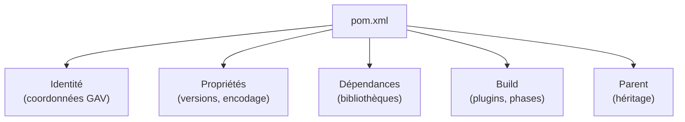
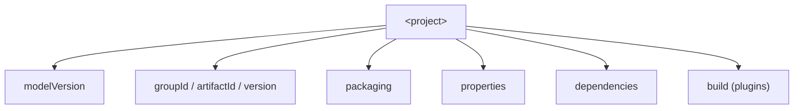
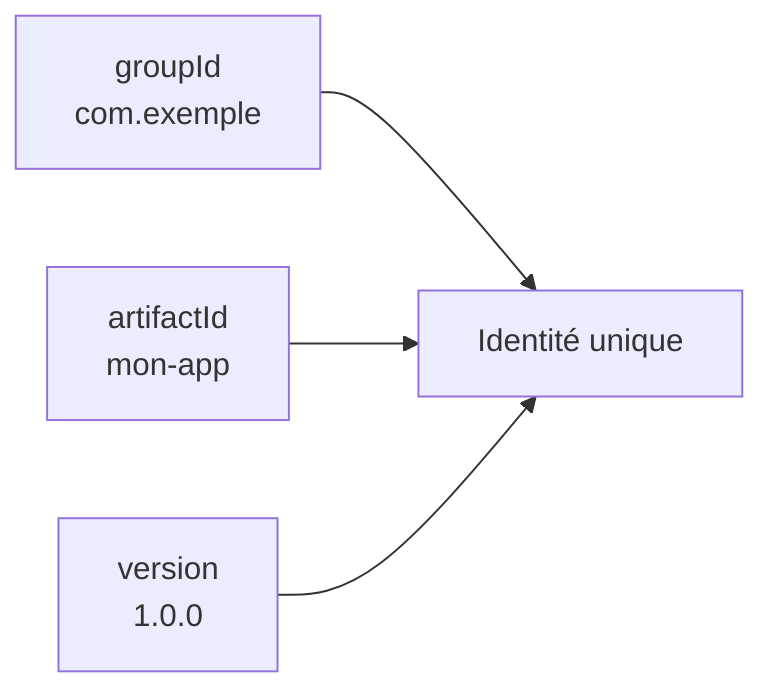
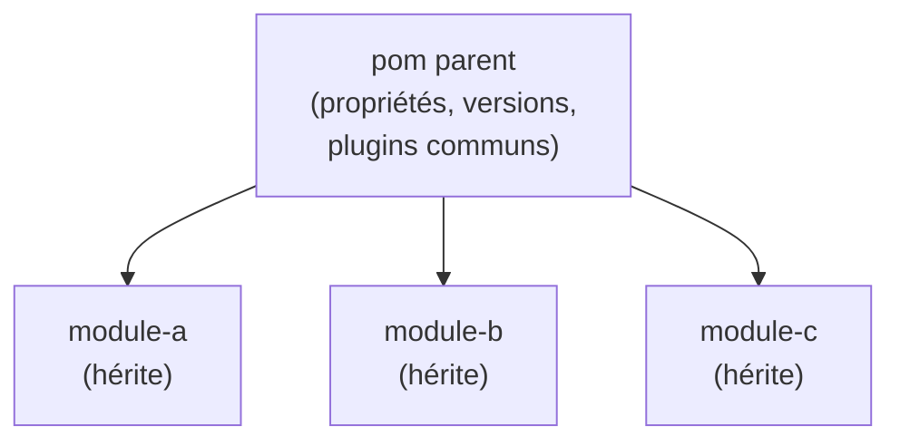
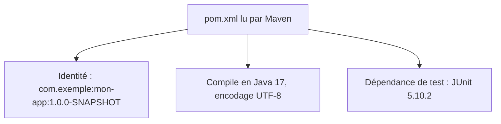
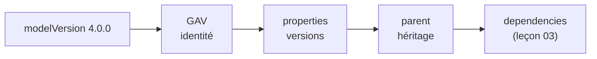

<a id="top"></a>

# 02 — Le fichier pom.xml

## Table des matières

| # | Section |
|---|---|
| 1 | [Le pom.xml, cœur du projet](#section-1) |
| 2 | [Structure générale du pom.xml](#section-2) |
| 3 | [Les coordonnées du projet (GAV)](#section-3) |
| 4 | [Les propriétés](#section-4) |
| 5 | [L'héritage parent](#section-5) |
| 6 | [Un pom.xml complet commenté](#section-6) |
| 7 | [Quiz — Le fichier pom.xml](#section-7) |
| 8 | [Pratique — Rédiger un pom.xml](#section-8) |
| 9 | [Synthèse](#section-9) |

---

<a id="section-1"></a>

<details>
<summary>1 — Le pom.xml, cœur du projet</summary>

<br/>

Le **`pom.xml`** (*Project Object Model*) est le fichier central de tout projet Maven. C'est un document **XML** qui décrit le projet : son identité, ses dépendances, ses propriétés et la façon de le construire.



Tout `pom.xml` commence par une racine `<project>` avec son espace de noms, et déclare obligatoirement la version du modèle :

```xml
<?xml version="1.0" encoding="UTF-8"?>
<project xmlns="http://maven.apache.org/POM/4.0.0"
         xmlns:xsi="http://www.w3.org/2001/XMLSchema-instance"
         xsi:schemaLocation="http://maven.apache.org/POM/4.0.0
                             http://maven.apache.org/xsd/maven-4.0.0.xsd">

    <modelVersion>4.0.0</modelVersion>

    <!-- Le reste de la configuration ici -->

</project>
```

> _`<modelVersion>4.0.0</modelVersion>` est obligatoire et vaut toujours `4.0.0` aujourd'hui : c'est la version du format de fichier `pom.xml`, pas la version de votre projet._

</details>

<p align="right"><a href="#top">↑ Retour en haut</a></p>

---

<a id="section-2"></a>

<details>
<summary>2 — Structure générale du pom.xml</summary>

<br/>

Un `pom.xml` se lit du haut vers le bas, par grands blocs. Voici l'organisation typique :

| Bloc | Rôle |
|---|---|
| `<modelVersion>` | Version du format (toujours `4.0.0`) |
| `<groupId>` / `<artifactId>` / `<version>` | Coordonnées (identité du projet) |
| `<packaging>` | Type d'artefact (`jar`, `war`, `pom`) |
| `<properties>` | Variables réutilisables (versions, encodage) |
| `<dependencies>` | Les bibliothèques utilisées (leçon 03) |
| `<build>` | Plugins et configuration de construction |



Le bloc `<packaging>` détermine le type de livrable :

| Valeur | Produit |
|---|---|
| `jar` | Bibliothèque ou application Java (défaut) |
| `war` | Application web déployable sur un serveur |
| `pom` | Projet « parent » sans code (agrégateur) |

> _Si vous omettez `<packaging>`, Maven choisit `jar` par défaut. Encore une fois : convention plutôt que configuration._

**🔧 Mini-exercice —** Écris la balise `<packaging>` pour produire une application web déployable sur Tomcat.

<details>
<summary>✅ Voir une solution</summary>

```xml
<packaging>war</packaging>
```

</details>

</details>

<p align="right"><a href="#top">↑ Retour en haut</a></p>

---

<a id="section-3"></a>

<details>
<summary>3 — Les coordonnées du projet (GAV)</summary>

<br/>

Tout projet Maven est identifié de façon **unique** par trois coordonnées, souvent abrégées **GAV** : *GroupId, ArtifactId, Version*.



```xml
<groupId>com.exemple</groupId>
<artifactId>mon-app</artifactId>
<version>1.0.0</version>
```

| Coordonnée | Signification | Convention |
|---|---|---|
| **groupId** | L'organisation / le projet | Nom de domaine inversé : `com.exemple` |
| **artifactId** | Le nom du module | Court, en minuscules : `mon-app` |
| **version** | La version courante | Numérique : `1.0.0`, ou `1.0.0-SNAPSHOT` |

Le suffixe **`-SNAPSHOT`** mérite une attention particulière :

| Version | Sens |
|---|---|
| `1.0.0-SNAPSHOT` | Version **en développement**, instable, mise à jour fréquemment |
| `1.0.0` | Version **publiée** (*release*), figée et immuable |

```bash
# Le nom de l'artefact produit combine artifactId + version
# Ex : mon-app-1.0.0-SNAPSHOT.jar
mvn package
```

> _La combinaison `groupId:artifactId:version` est l'« adresse postale » de votre projet dans l'écosystème Maven. C'est ainsi que d'autres projets pourront en dépendre._

**🔧 Mini-exercice —** Écris les trois balises GAV pour un projet `com.banque` nommé `gestion-comptes` en version de développement `1.0.0`.

<details>
<summary>✅ Voir une solution</summary>

```xml
<groupId>com.banque</groupId>
<artifactId>gestion-comptes</artifactId>
<version>1.0.0-SNAPSHOT</version>
```

</details>

</details>

<p align="right"><a href="#top">↑ Retour en haut</a></p>

---

<a id="section-4"></a>

<details>
<summary>4 — Les propriétés</summary>

<br/>

Le bloc **`<properties>`** définit des **variables réutilisables** dans tout le `pom.xml`. On y centralise les versions et les réglages pour éviter les répétitions.

```xml
<properties>
    <maven.compiler.source>17</maven.compiler.source>
    <maven.compiler.target>17</maven.compiler.target>
    <project.build.sourceEncoding>UTF-8</project.build.sourceEncoding>
    <junit.version>5.10.2</junit.version>
</properties>
```

On réutilise ensuite une propriété avec la syntaxe `${nom}` :

```xml
<dependency>
    <groupId>org.junit.jupiter</groupId>
    <artifactId>junit-jupiter</artifactId>
    <version>${junit.version}</version>   <!-- réutilise la propriété -->
    <scope>test</scope>
</dependency>
```



```mermaid
flowchart LR
    A["&lt;properties&gt;<br/>junit.version = 5.10.2"] --> B["Réutilisation<br/>$&#123;junit.version&#125;"]
    B --> C["Une seule version<br/>à mettre à jour"]
```

Propriétés courantes :

| Propriété | Rôle |
|---|---|
| `maven.compiler.source` / `target` | Version Java du code source et du bytecode |
| `project.build.sourceEncoding` | Encodage des fichiers (toujours `UTF-8`) |
| Propriétés personnalisées (`junit.version`…) | Centraliser les numéros de version |

> _Centraliser les versions dans `<properties>` est une bonne pratique : pour passer JUnit de 5.10 à 5.11, vous modifiez **un seul endroit** au lieu de chaque dépendance._

**🔧 Mini-exercice —** Définis une propriété `gson.version` valant `2.10.1`, puis montre comment la réutiliser dans une balise `<version>`.

<details>
<summary>✅ Voir une solution</summary>

```xml
<properties>
    <gson.version>2.10.1</gson.version>
</properties>
<!-- ... -->
<version>${gson.version}</version>
```

</details>

</details>

<p align="right"><a href="#top">↑ Retour en haut</a></p>

---

<a id="section-5"></a>

<details>
<summary>5 — L'héritage parent</summary>

<br/>

Un `pom.xml` peut **hériter** d'un autre `pom.xml` via le bloc **`<parent>`**. L'enfant récupère alors les propriétés, dépendances et configurations du parent. C'est le mécanisme qui permet de **factoriser** la configuration commune à plusieurs modules.



```xml
<parent>
    <groupId>org.springframework.boot</groupId>
    <artifactId>spring-boot-starter-parent</artifactId>
    <version>3.2.5</version>
    <relativePath/>   <!-- vide : aller chercher le parent dans le dépôt -->
</parent>
```

L'usage le plus connu est le **parent Spring Boot**, qui fixe les versions de dizaines de bibliothèques pour qu'elles soient compatibles entre elles. Grâce à lui, vous déclarez des dépendances **sans préciser leur version** :

```xml
<!-- Pas de <version> : elle est héritée du parent -->
<dependency>
    <groupId>org.springframework.boot</groupId>
    <artifactId>spring-boot-starter-web</artifactId>
</dependency>
```

| Avec héritage parent | Sans héritage parent |
|---|---|
| Versions cohérentes garanties | Risque de versions incompatibles |
| Moins de configuration répétée | Tout à redéclarer dans chaque module |

> _Le parent Spring Boot agit comme une « liste de courses validée » : il garantit que toutes vos bibliothèques s'entendent bien, sans que vous ayez à choisir chaque numéro de version à la main._

</details>

<p align="right"><a href="#top">↑ Retour en haut</a></p>

---

<a id="section-6"></a>

<details>
<summary>6 — Un pom.xml complet commenté</summary>

<br/>

Voici un `pom.xml` réaliste rassemblant tout ce qui précède : coordonnées, propriétés, parent optionnel et dépendances.

```xml
<?xml version="1.0" encoding="UTF-8"?>
<project xmlns="http://maven.apache.org/POM/4.0.0"
         xmlns:xsi="http://www.w3.org/2001/XMLSchema-instance"
         xsi:schemaLocation="http://maven.apache.org/POM/4.0.0
                             http://maven.apache.org/xsd/maven-4.0.0.xsd">

    <!-- Version du format de fichier -->
    <modelVersion>4.0.0</modelVersion>

    <!-- Coordonnées GAV : identité du projet -->
    <groupId>com.exemple</groupId>
    <artifactId>mon-app</artifactId>
    <version>1.0.0-SNAPSHOT</version>
    <packaging>jar</packaging>

    <!-- Variables réutilisables -->
    <properties>
        <maven.compiler.source>17</maven.compiler.source>
        <maven.compiler.target>17</maven.compiler.target>
        <project.build.sourceEncoding>UTF-8</project.build.sourceEncoding>
        <junit.version>5.10.2</junit.version>
    </properties>

    <!-- Bibliothèques utilisées -->
    <dependencies>
        <dependency>
            <groupId>org.junit.jupiter</groupId>
            <artifactId>junit-jupiter</artifactId>
            <version>${junit.version}</version>
            <scope>test</scope>
        </dependency>
    </dependencies>

</project>
```



On peut afficher le `pom.xml` « effectif » (avec tout l'héritage résolu) :

```bash
# Montre le pom complet, parent inclus
mvn help:effective-pom
```

> _La commande `mvn help:effective-pom` est précieuse pour comprendre ce que Maven « voit » réellement, y compris tout ce qui vient du parent._

**🔧 Mini-exercice —** Écris la commande qui affiche le `pom.xml` effectif, avec tout l'héritage du parent résolu.

<details>
<summary>✅ Voir une solution</summary>

```bash
mvn help:effective-pom
```

</details>

</details>

<p align="right"><a href="#top">↑ Retour en haut</a></p>

---

<a id="section-7"></a>

<details>
<summary>7 — Quiz — Le fichier pom.xml</summary>

<br/>

**Question 1 :** Que valent les trois coordonnées GAV ?

a) Group, Action, Value

b) GroupId, ArtifactId, Version

c) Git, Apache, Version

d) General, Application, Version

<details>
<summary>💡 Voir la solution</summary>

✅ **Réponse : b)** — GAV = `groupId`, `artifactId`, `version` : l'identité unique du projet.

</details>

---

**Question 2 :** Que signifie le suffixe `-SNAPSHOT` dans une version ?

a) Une version publiée et figée

b) Une version en développement, instable et mise à jour fréquemment

c) Une capture d'écran du projet

d) Une version obsolète

<details>
<summary>💡 Voir la solution</summary>

✅ **Réponse : b)** — `-SNAPSHOT` indique une version de développement. Une version sans ce suffixe est une *release* figée.

</details>

---

**Question 3 :** À quoi sert le bloc `<properties>` ?

a) À déclarer les dépendances

b) À définir des variables réutilisables (versions, encodage) avec `${...}`

c) À configurer le serveur web

d) À écrire le code Java

<details>
<summary>💡 Voir la solution</summary>

✅ **Réponse : b)** — Les propriétés centralisent des valeurs réutilisables via la syntaxe `${nom}`, évitant les répétitions.

</details>

---

**Question 4 :** Quel est l'avantage d'hériter d'un `<parent>` comme `spring-boot-starter-parent` ?

a) Cela supprime le besoin de code

b) Cela garantit des versions de bibliothèques cohérentes et réduit la configuration

c) Cela accélère le réseau

d) Cela chiffre le pom.xml

<details>
<summary>💡 Voir la solution</summary>

✅ **Réponse : b)** — Le parent fixe des versions compatibles entre elles ; on peut alors déclarer des dépendances sans préciser leur version.

</details>

---

**Question 5 :** Quelle valeur prend toujours `<modelVersion>` aujourd'hui ?

a) `1.0.0`

b) `3.9.6`

c) `4.0.0`

d) `17`

<details>
<summary>💡 Voir la solution</summary>

✅ **Réponse : c)** — `<modelVersion>4.0.0</modelVersion>` est la version du format de fichier `pom.xml`, obligatoire et invariable.

</details>

</details>

<p align="right"><a href="#top">↑ Retour en haut</a></p>

---

<a id="section-8"></a>

<details>
<summary>8 — Pratique — Rédiger un pom.xml</summary>

<br/>

### Consigne

Rédigez de zéro un `pom.xml` pour un projet identifié par `com.banque:gestion-comptes:1.0.0-SNAPSHOT`, empaqueté en `jar`, compilé en Java 17 avec encodage UTF-8, et centralisant la version de JUnit dans une propriété. Puis vérifiez-le.

---

### Correction — pom.xml attendu

```xml
<?xml version="1.0" encoding="UTF-8"?>
<project xmlns="http://maven.apache.org/POM/4.0.0"
         xmlns:xsi="http://www.w3.org/2001/XMLSchema-instance"
         xsi:schemaLocation="http://maven.apache.org/POM/4.0.0
                             http://maven.apache.org/xsd/maven-4.0.0.xsd">

    <modelVersion>4.0.0</modelVersion>

    <groupId>com.banque</groupId>
    <artifactId>gestion-comptes</artifactId>
    <version>1.0.0-SNAPSHOT</version>
    <packaging>jar</packaging>

    <properties>
        <maven.compiler.source>17</maven.compiler.source>
        <maven.compiler.target>17</maven.compiler.target>
        <project.build.sourceEncoding>UTF-8</project.build.sourceEncoding>
        <junit.version>5.10.2</junit.version>
    </properties>

    <dependencies>
        <dependency>
            <groupId>org.junit.jupiter</groupId>
            <artifactId>junit-jupiter</artifactId>
            <version>${junit.version}</version>
            <scope>test</scope>
        </dependency>
    </dependencies>

</project>
```

**Vérification :**

```bash
# Vérifie que le pom est valide et résoluble
mvn validate

# Affiche le pom effectif (parent et propriétés résolus)
mvn help:effective-pom
```

**Résultat attendu :**

```
[INFO] BUILD SUCCESS
```

> _Si `mvn validate` affiche `BUILD SUCCESS`, votre `pom.xml` est syntaxiquement correct et toutes ses coordonnées sont bien formées. Une erreur fréquente : oublier `<modelVersion>` ou mal fermer une balise XML._

</details>

<p align="right"><a href="#top">↑ Retour en haut</a></p>

---

<a id="section-9"></a>

<details>
<summary>9 — Synthèse</summary>

<br/>

#### Points à retenir

1. Le **`pom.xml`** est un fichier XML qui décrit identité, propriétés, dépendances et build.
2. Les **coordonnées GAV** (`groupId`, `artifactId`, `version`) identifient le projet de façon unique.
3. **`-SNAPSHOT`** = version en développement ; sans suffixe = version publiée figée.
4. Les **`<properties>`** centralisent des variables réutilisables via `${nom}`.
5. L'**héritage `<parent>`** factorise la configuration et garantit des versions cohérentes.



#### La suite

Leçon **03 — Gestion des dépendances** : déclarer des bibliothèques, comprendre les portées, les dépôts et la résolution transitive.

</details>

<p align="right"><a href="#top">↑ Retour en haut</a></p>

---

<p align="center">
  <em>Tous droits réservés. Toute reproduction, diffusion, utilisation ou adaptation de ce cours, en tout ou en partie, est strictement interdite sans l'autorisation écrite préalable de Dr. Haythem REHOUMA.</em>
</p>

<p align="center">
  <strong>Cours créé par Dr. Haythem REHOUMA — Développement et déploiement de solutions de données</strong>
</p>
