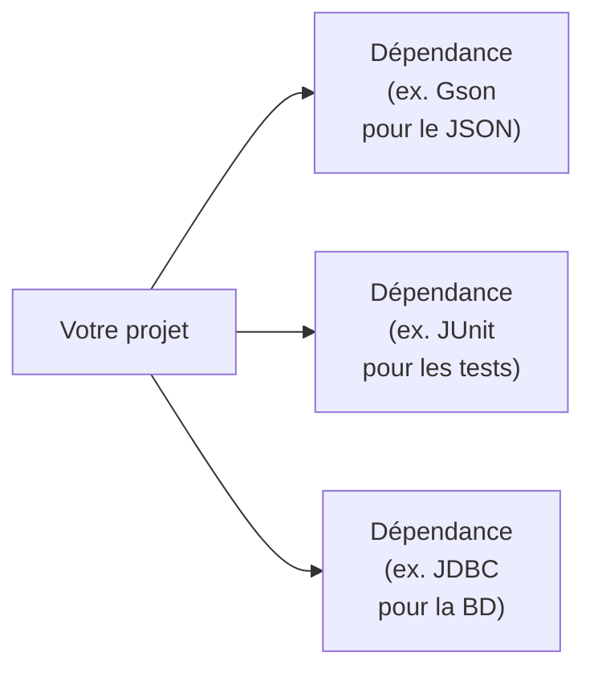
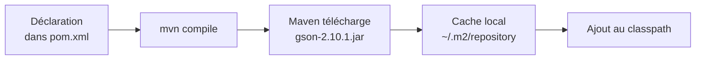
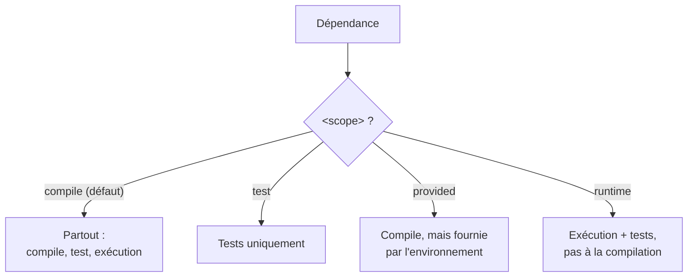
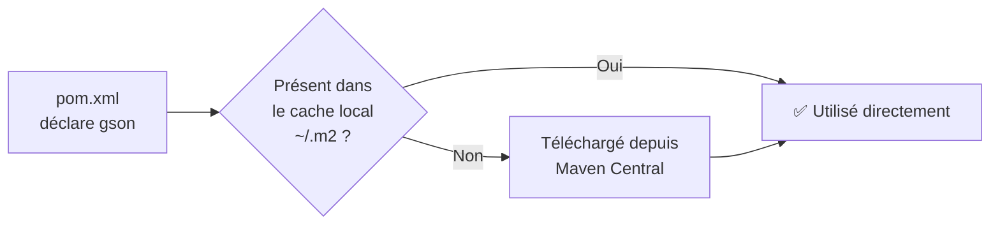
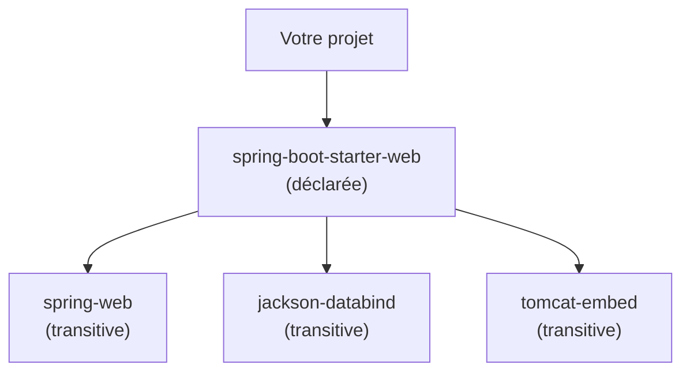
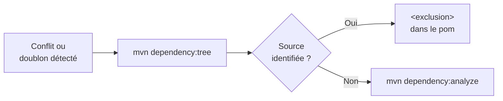
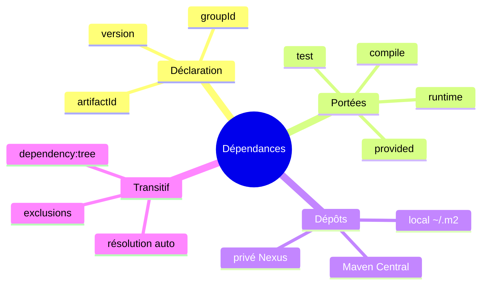

<a id="top"></a>

# 03 — Gestion des dépendances

## Table des matières

| # | Section |
|---|---|
| 1 | [Qu'est-ce qu'une dépendance ?](#section-1) |
| 2 | [Déclarer une dépendance](#section-2) |
| 3 | [Les portées (scopes)](#section-3) |
| 4 | [Les dépôts (repositories)](#section-4) |
| 5 | [La résolution transitive](#section-5) |
| 6 | [Diagnostiquer et exclure](#section-6) |
| 7 | [Quiz — Gestion des dépendances](#section-7) |
| 8 | [Pratique — Ajouter des dépendances](#section-8) |
| 9 | [Synthèse](#section-9) |

---

<a id="section-1"></a>

<details>
<summary>1 — Qu'est-ce qu'une dépendance ?</summary>

<br/>

Une **dépendance** est une bibliothèque externe dont votre projet a besoin pour compiler ou s'exécuter. Au lieu de réécrire du code (analyse JSON, accès base de données, tests…), on **réutilise** des bibliothèques éprouvées.



Maven gère ces dépendances **automatiquement** : vous les déclarez dans le `pom.xml`, et Maven les **télécharge** et les place sur le *classpath*.

| Sans Maven | Avec Maven |
|---|---|
| Télécharger chaque `.jar` à la main | Déclarer 3 lignes dans `pom.xml` |
| Gérer le classpath manuellement | Maven le construit automatiquement |
| Trouver les bibliothèques compatibles | Résolution transitive automatique |

> _Une dépendance est aussi identifiée par ses coordonnées GAV (`groupId:artifactId:version`), exactement comme votre propre projet. C'est ainsi que Maven sait quoi télécharger._

</details>

<p align="right"><a href="#top">↑ Retour en haut</a></p>

---

<a id="section-2"></a>

<details>
<summary>2 — Déclarer une dépendance</summary>

<br/>

Les dépendances se déclarent dans le bloc **`<dependencies>`** du `pom.xml`. Chaque dépendance est une balise `<dependency>` avec ses coordonnées GAV.

```xml
<dependencies>

    <!-- Bibliothèque Gson de Google pour manipuler du JSON -->
    <dependency>
        <groupId>com.google.code.gson</groupId>
        <artifactId>gson</artifactId>
        <version>2.10.1</version>
    </dependency>

</dependencies>
```



Pour trouver les bonnes coordonnées d'une bibliothèque, on consulte **Maven Central** (`search.maven.org`), qui fournit le bloc XML prêt à copier.

```bash
# Après ajout d'une dépendance, on déclenche le téléchargement
mvn compile

# Ou télécharger explicitement sans compiler
mvn dependency:resolve
```

| Élément | Rôle |
|---|---|
| `<groupId>` | L'organisation qui publie la bibliothèque |
| `<artifactId>` | Le nom de la bibliothèque |
| `<version>` | La version souhaitée |

> _Maven met les bibliothèques en cache dans `~/.m2/repository`. Une bibliothèque déjà téléchargée n'est jamais re-téléchargée : c'est pourquoi les builds suivants sont rapides._

**🔧 Mini-exercice —** Déclare la dépendance Gson (`com.google.code.gson:gson:2.10.1`) dans un bloc `<dependency>`.

<details>
<summary>✅ Voir une solution</summary>

```xml
<dependency>
    <groupId>com.google.code.gson</groupId>
    <artifactId>gson</artifactId>
    <version>2.10.1</version>
</dependency>
```

</details>

</details>

<p align="right"><a href="#top">↑ Retour en haut</a></p>

---

<a id="section-3"></a>

<details>
<summary>3 — Les portées (scopes)</summary>

<br/>

La **portée** (*scope*) d'une dépendance indique **quand** et **où** elle est disponible : à la compilation, aux tests, à l'exécution, ou fournie par l'environnement. On la précise avec `<scope>`.

```xml
<dependency>
    <groupId>org.junit.jupiter</groupId>
    <artifactId>junit-jupiter</artifactId>
    <version>5.10.2</version>
    <scope>test</scope>   <!-- disponible uniquement pour les tests -->
</dependency>
```



| Scope | Disponible à la compilation | Disponible aux tests | Disponible à l'exécution | Inclus dans l'artefact |
|---|---|---|---|---|
| `compile` (défaut) | ✅ | ✅ | ✅ | ✅ |
| `test` | ❌ | ✅ | ❌ | ❌ |
| `provided` | ✅ | ✅ | ❌ (fourni par le serveur) | ❌ |
| `runtime` | ❌ | ✅ | ✅ | ✅ |

Exemples concrets :

| Bibliothèque | Scope typique | Pourquoi |
|---|---|---|
| JUnit | `test` | Seulement utile pour exécuter les tests |
| API Servlet | `provided` | Le serveur (Tomcat) la fournit déjà |
| Pilote JDBC | `runtime` | Requis à l'exécution, pas à la compilation |
| Gson | `compile` | Utilisé partout dans le code |

> _Mettre JUnit en `compile` au lieu de `test` est une erreur fréquente : cela embarque inutilement la bibliothèque de test dans votre livrable final. Choisissez toujours le scope le plus restrictif qui convient._

**🔧 Mini-exercice —** Déclare une dépendance JUnit Jupiter (`5.10.2`) en portée test dans le `pom.xml`.

<details>
<summary>✅ Voir une solution</summary>

```xml
<dependency>
    <groupId>org.junit.jupiter</groupId>
    <artifactId>junit-jupiter</artifactId>
    <version>5.10.2</version>
    <scope>test</scope>
</dependency>
```

</details>

</details>

<p align="right"><a href="#top">↑ Retour en haut</a></p>

---

<a id="section-4"></a>

<details>
<summary>4 — Les dépôts (repositories)</summary>

<br/>

Maven télécharge les dépendances depuis des **dépôts** (*repositories*). Il existe trois niveaux :



| Type de dépôt | Description |
|---|---|
| **Dépôt local** | Cache sur votre machine : `~/.m2/repository` |
| **Maven Central** | Le dépôt public mondial, source par défaut |
| **Dépôt privé** | Serveur d'entreprise (Nexus, Artifactory) pour bibliothèques internes |

Pour ajouter un dépôt privé, on le déclare dans le `pom.xml` :

```xml
<repositories>
    <repository>
        <id>nexus-entreprise</id>
        <url>https://nexus.monentreprise.com/repository/maven-public/</url>
    </repository>
</repositories>
```

```bash
# Forcer la mise à jour des dépendances depuis les dépôts
mvn clean install -U

# Vider le cache d'une bibliothèque pour forcer son re-téléchargement
# (suppression manuelle du dossier correspondant dans ~/.m2)
```

| Cas | Dépôt utilisé |
|---|---|
| Bibliothèque open-source publique | Maven Central |
| Bibliothèque maison de l'entreprise | Dépôt privé (Nexus/Artifactory) |
| Bibliothèque déjà téléchargée | Cache local `~/.m2` |

> _Les entreprises utilisent souvent un dépôt privé comme **miroir** de Maven Central : cela accélère les téléchargements et permet de contrôler quelles bibliothèques sont autorisées._

</details>

<p align="right"><a href="#top">↑ Retour en haut</a></p>

---

<a id="section-5"></a>

<details>
<summary>5 — La résolution transitive</summary>

<br/>

Une dépendance peut elle-même dépendre d'autres bibliothèques : ce sont les **dépendances transitives**. Maven les télécharge **automatiquement** — vous n'avez pas à les lister.



Vous déclarez **une** dépendance, Maven en résout **des dizaines** :

```xml
<!-- Une seule déclaration... -->
<dependency>
    <groupId>org.springframework.boot</groupId>
    <artifactId>spring-boot-starter-web</artifactId>
    <version>3.2.5</version>
</dependency>
<!-- ...amène automatiquement spring-web, jackson, tomcat, etc. -->
```

Pour visualiser l'arbre complet :

```bash
# Affiche l'arbre des dépendances (directes + transitives)
mvn dependency:tree
```

Sortie typique :

```
com.exemple:mon-app:jar:1.0.0
+- org.springframework.boot:spring-boot-starter-web:jar:3.2.5:compile
|  +- org.springframework:spring-web:jar:6.1.6:compile
|  +- com.fasterxml.jackson.core:jackson-databind:jar:2.15.4:compile
|  \- org.apache.tomcat.embed:tomcat-embed-core:jar:10.1.20:compile
```

Quand deux chemins amènent **deux versions différentes** d'une même bibliothèque, Maven applique la règle du **« plus proche dans l'arbre »** (*nearest wins*) : la version la plus proche de votre projet l'emporte.

> _La résolution transitive est l'une des plus grandes forces de Maven : vous déclarez vos intentions de haut niveau, et Maven assemble tout le puzzle des dépendances pour vous._

**🔧 Mini-exercice —** Écris la commande qui affiche l'arbre complet des dépendances (directes et transitives).

<details>
<summary>✅ Voir une solution</summary>

```bash
mvn dependency:tree
```

</details>

</details>

<p align="right"><a href="#top">↑ Retour en haut</a></p>

---

<a id="section-6"></a>

<details>
<summary>6 — Diagnostiquer et exclure</summary>

<br/>

Parfois, une dépendance transitive pose problème (conflit de version, bibliothèque indésirable). Maven offre des outils pour diagnostiquer et corriger.



Pour **exclure** une dépendance transitive non désirée :

```xml
<dependency>
    <groupId>org.springframework.boot</groupId>
    <artifactId>spring-boot-starter-web</artifactId>
    <version>3.2.5</version>
    <exclusions>
        <exclusion>
            <groupId>org.apache.logging.log4j</groupId>
            <artifactId>log4j-to-slf4j</artifactId>
        </exclusion>
    </exclusions>
</dependency>
```

Commandes de diagnostic utiles :

| Commande | Rôle |
|---|---|
| `mvn dependency:tree` | Affiche l'arbre complet des dépendances |
| `mvn dependency:analyze` | Détecte les dépendances inutilisées ou manquantes |
| `mvn dependency:resolve` | Télécharge toutes les dépendances |

```bash
# Repérer les dépendances déclarées mais non utilisées,
# et celles utilisées mais non déclarées
mvn dependency:analyze
```

> _Avant d'exclure quoi que ce soit, lancez `mvn dependency:tree` pour comprendre **d'où** vient la dépendance problématique. On n'exclut jamais à l'aveugle._

**🔧 Mini-exercice —** Écris la commande qui repère les dépendances déclarées mais non utilisées (et inversement).

<details>
<summary>✅ Voir une solution</summary>

```bash
mvn dependency:analyze
```

</details>

</details>

<p align="right"><a href="#top">↑ Retour en haut</a></p>

---

<a id="section-7"></a>

<details>
<summary>7 — Quiz — Gestion des dépendances</summary>

<br/>

**Question 1 :** Où Maven met-il en cache les dépendances téléchargées ?

a) Dans `target/`

b) Dans `~/.m2/repository`

c) Dans `src/main/resources`

d) Sur le serveur web

<details>
<summary>💡 Voir la solution</summary>

✅ **Réponse : b)** — Le dépôt local `~/.m2/repository` sert de cache : une bibliothèque déjà téléchargée n'est pas re-téléchargée.

</details>

---

**Question 2 :** Quel scope convient à JUnit, une bibliothèque utilisée uniquement pour les tests ?

a) `compile`

b) `runtime`

c) `test`

d) `provided`

<details>
<summary>💡 Voir la solution</summary>

✅ **Réponse : c)** — Le scope `test` rend la dépendance disponible aux tests uniquement et l'exclut du livrable final.

</details>

---

**Question 3 :** Que sont les dépendances transitives ?

a) Des dépendances que l'on doit lister manuellement

b) Les dépendances de vos dépendances, résolues automatiquement par Maven

c) Des dépendances temporaires

d) Des dépendances de test

<details>
<summary>💡 Voir la solution</summary>

✅ **Réponse : b)** — Une dépendance déclarée amène ses propres dépendances ; Maven les télécharge automatiquement.

</details>

---

**Question 4 :** Quelle commande affiche l'arbre complet des dépendances ?

a) `mvn list`

b) `mvn dependency:tree`

c) `mvn show-deps`

d) `mvn package`

<details>
<summary>💡 Voir la solution</summary>

✅ **Réponse : b)** — `mvn dependency:tree` montre les dépendances directes et transitives, utile pour diagnostiquer les conflits.

</details>

---

**Question 5 :** Quel scope choisir pour l'API Servlet, fournie par le serveur Tomcat ?

a) `compile`

b) `test`

c) `provided`

d) `runtime`

<details>
<summary>💡 Voir la solution</summary>

✅ **Réponse : c)** — `provided` : la bibliothèque est nécessaire pour compiler, mais l'environnement d'exécution (le serveur) la fournit déjà.

</details>

</details>

<p align="right"><a href="#top">↑ Retour en haut</a></p>

---

<a id="section-8"></a>

<details>
<summary>8 — Pratique — Ajouter des dépendances</summary>

<br/>

### Consigne

Dans un projet existant, ajoutez deux dépendances : **Gson** (`com.google.code.gson:gson:2.10.1`) en portée compile pour manipuler du JSON, et **JUnit Jupiter** (`org.junit.jupiter:junit-jupiter:5.10.2`) en portée test. Puis vérifiez l'arbre des dépendances.

---

### Correction — Bloc `<dependencies>` attendu

```xml
<dependencies>

    <!-- Gson : utilisée partout dans le code (scope compile par défaut) -->
    <dependency>
        <groupId>com.google.code.gson</groupId>
        <artifactId>gson</artifactId>
        <version>2.10.1</version>
    </dependency>

    <!-- JUnit : tests uniquement -->
    <dependency>
        <groupId>org.junit.jupiter</groupId>
        <artifactId>junit-jupiter</artifactId>
        <version>5.10.2</version>
        <scope>test</scope>
    </dependency>

</dependencies>
```

**Vérification :**

```bash
# Télécharger et afficher l'arbre des dépendances
mvn dependency:tree
```

**Résultat attendu :**

```
com.exemple:mon-app:jar:1.0.0-SNAPSHOT
+- com.google.code.gson:gson:jar:2.10.1:compile
\- org.junit.jupiter:junit-jupiter:jar:5.10.2:test
   +- org.junit.jupiter:junit-jupiter-api:jar:5.10.2:test
   +- org.junit.jupiter:junit-jupiter-params:jar:5.10.2:test
   \- org.junit.jupiter:junit-jupiter-engine:jar:5.10.2:test
```

> _Remarquez que `junit-jupiter` amène automatiquement `-api`, `-params` et `-engine` : ce sont ses dépendances transitives. Vous n'avez déclaré qu'une ligne, Maven a résolu le reste._

</details>

<p align="right"><a href="#top">↑ Retour en haut</a></p>

---

<a id="section-9"></a>

<details>
<summary>9 — Synthèse</summary>

<br/>

#### Points à retenir

1. Une **dépendance** est une bibliothèque externe, identifiée par ses coordonnées GAV.
2. On la déclare dans `<dependencies>` ; Maven la **télécharge** et la met en cache dans `~/.m2`.
3. Les **portées** (`compile`, `test`, `provided`, `runtime`) contrôlent quand la dépendance est disponible.
4. Les **dépôts** : local (`~/.m2`), Maven Central (public), privé (Nexus/Artifactory).
5. La **résolution transitive** amène automatiquement les dépendances des dépendances ; `mvn dependency:tree` permet de l'inspecter.



#### La suite

Leçon **04 — Cycle de vie et phases** : comprendre les phases (`compile`, `test`, `package`, `install`, `deploy`) qui orchestrent la construction.

</details>

<p align="right"><a href="#top">↑ Retour en haut</a></p>

---

<p align="center">
  <em>Tous droits réservés. Toute reproduction, diffusion, utilisation ou adaptation de ce cours, en tout ou en partie, est strictement interdite sans l'autorisation écrite préalable de Dr. Haythem REHOUMA.</em>
</p>

<p align="center">
  <strong>Cours créé par Dr. Haythem REHOUMA — Développement et déploiement de solutions de données</strong>
</p>
