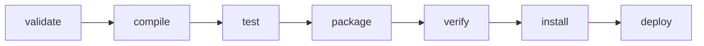
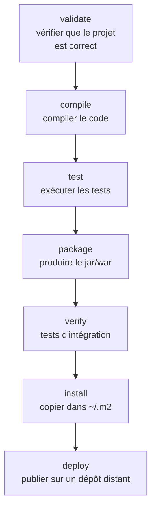
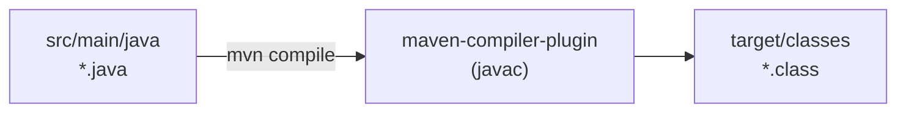
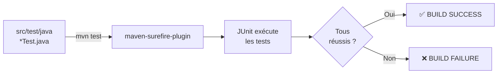
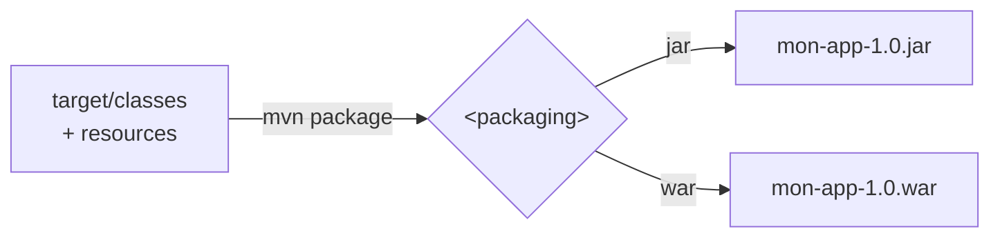
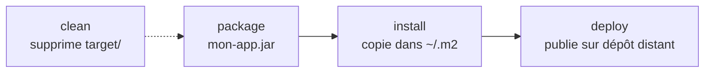
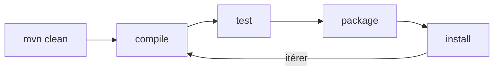

<a id="top"></a>

# 04 — Cycle de vie et phases

## Table des matières

| # | Section |
|---|---|
| 1 | [Le cycle de vie de build](#section-1) |
| 2 | [Les phases principales](#section-2) |
| 3 | [Compilation](#section-3) |
| 4 | [Les tests (JUnit + Surefire)](#section-4) |
| 5 | [Le packaging (jar / war)](#section-5) |
| 6 | [Install, deploy et clean](#section-6) |
| 7 | [Quiz — Cycle de vie et phases](#section-7) |
| 8 | [Pratique — Parcourir le cycle de vie](#section-8) |
| 9 | [Synthèse](#section-9) |

---

<a id="section-1"></a>

<details>
<summary>1 — Le cycle de vie de build</summary>

<br/>

Maven organise la construction d'un projet en un **cycle de vie** (*lifecycle*) : une suite ordonnée de **phases**. Quand vous demandez une phase, Maven exécute **toutes les phases précédentes** dans l'ordre.



C'est le principe le plus important à retenir :

> _Demander une phase exécute **automatiquement** toutes celles qui la précèdent. `mvn package` lance donc aussi `validate`, `compile` et `test`._

Maven possède en réalité trois cycles de vie :

| Cycle de vie | Rôle |
|---|---|
| **default** | Construire le projet (compile, test, package…) |
| **clean** | Nettoyer (supprimer `target/`) |
| **site** | Générer la documentation du projet |

```bash
# Exécuter une phase = exécuter tout jusqu'à elle
mvn package      # lance validate -> compile -> test -> package
```

**🔧 Mini-exercice —** Quelles phases s'exécutent quand tu lances `mvn package` ? Liste-les dans l'ordre.

<details>
<summary>✅ Voir une solution</summary>

`validate` → `compile` → `test` → `package` : demander une phase exécute automatiquement toutes celles qui la précèdent.

</details>

</details>

<p align="right"><a href="#top">↑ Retour en haut</a></p>

---

<a id="section-2"></a>

<details>
<summary>2 — Les phases principales</summary>

<br/>

Le cycle de vie **default** comporte de nombreuses phases ; voici les plus utilisées au quotidien :



| Phase | Ce qu'elle fait |
|---|---|
| `validate` | Vérifie que le projet est correct et que toute l'info nécessaire est présente |
| `compile` | Compile le code source (`src/main/java`) |
| `test` | Exécute les tests unitaires |
| `package` | Empaquette le code compilé (`.jar` ou `.war`) |
| `verify` | Lance les tests d'intégration et contrôles qualité |
| `install` | Installe l'artefact dans le dépôt local `~/.m2` |
| `deploy` | Publie l'artefact sur un dépôt distant partagé |

```bash
mvn validate    # vérifications de base
mvn compile     # + compilation
mvn test        # + tests unitaires
mvn package     # + création de l'artefact
mvn verify      # + tests d'intégration
mvn install     # + copie dans ~/.m2
mvn deploy      # + publication distante
```

> _Plus on avance dans la liste, plus Maven en fait. `mvn install` est le « couteau suisse » du développement local : il construit tout et rend l'artefact disponible pour vos autres projets sur la même machine._

</details>

<p align="right"><a href="#top">↑ Retour en haut</a></p>

---

<a id="section-3"></a>

<details>
<summary>3 — Compilation</summary>

<br/>

La phase **`compile`** transforme votre code Java (`src/main/java`) en *bytecode* (`.class`) placé dans `target/classes`. C'est le **plugin Compiler** qui s'en charge, en utilisant le `javac` du JDK.



La version de Java utilisée est définie par les propriétés vues en leçon 02 :

```xml
<properties>
    <maven.compiler.source>17</maven.compiler.source>
    <maven.compiler.target>17</maven.compiler.target>
</properties>
```

```bash
# Compiler le code principal
mvn compile

# Compiler le code de test également
mvn test-compile
```

**🔧 Mini-exercice —** Dans quel dossier le bytecode `.class` du code principal est-il déposé après `mvn compile` ?

<details>
<summary>✅ Voir une solution</summary>

Dans `target/classes` (par exemple `target/classes/com/exemple/App.class`).

</details>

| Propriété | Rôle |
|---|---|
| `maven.compiler.source` | Version du langage Java acceptée dans le code |
| `maven.compiler.target` | Version du bytecode généré |

Résultat dans `target/` :

```
target/
└── classes/
    └── com/exemple/App.class   <-- bytecode compilé
```

> _Si la compilation échoue (`BUILD FAILURE`), Maven s'arrête immédiatement : les phases suivantes (`test`, `package`) ne s'exécutent pas. On corrige toujours les erreurs de compilation en premier._

</details>

<p align="right"><a href="#top">↑ Retour en haut</a></p>

---

<a id="section-4"></a>

<details>
<summary>4 — Les tests (JUnit + Surefire)</summary>

<br/>

La phase **`test`** exécute les tests unitaires situés dans `src/test/java`. C'est le **plugin Surefire** qui les lance, généralement avec le framework **JUnit**.



Un test JUnit typique :

```java
import org.junit.jupiter.api.Test;
import static org.junit.jupiter.api.Assertions.assertEquals;

class CalculTest {
    @Test
    void additionDeDeuxNombres() {
        assertEquals(4, 2 + 2);
    }
}
```

```bash
# Exécuter tous les tests
mvn test

# Exécuter une seule classe de test
mvn test -Dtest=CalculTest

# Construire en SAUTANT les tests (à éviter, sauf cas précis)
mvn package -DskipTests
```

**🔧 Mini-exercice —** Écris la commande Maven qui empaquette le projet sans lancer les tests.

<details>
<summary>✅ Voir une solution</summary>

```bash
mvn package -DskipTests
```

</details>

| Élément | Rôle |
|---|---|
| **JUnit** | Le framework qui définit et vérifie les tests |
| **Surefire** | Le plugin Maven qui exécute les tests unitaires |
| **Failsafe** | Le plugin qui exécute les tests d'intégration (phase `verify`) |

> _⚠️ Si un seul test échoue, le build entier échoue (`BUILD FAILURE`) et le `package` n'est pas produit. C'est voulu : on ne livre pas un artefact dont les tests ne passent pas. Sauter les tests avec `-DskipTests` doit rester exceptionnel._

</details>

<p align="right"><a href="#top">↑ Retour en haut</a></p>

---

<a id="section-5"></a>

<details>
<summary>5 — Le packaging (jar / war)</summary>

<br/>

La phase **`package`** assemble le code compilé en un **artefact** livrable, déposé dans `target/`. Le type d'artefact dépend de la balise `<packaging>` du `pom.xml`.



| Packaging | Artefact | Usage |
|---|---|---|
| `jar` | `.jar` | Bibliothèque ou application Java autonome |
| `war` | `.war` | Application web déployée sur un serveur (Tomcat…) |
| `pom` | (aucun) | Projet parent/agrégateur, sans code |

```xml
<!-- Choix du type d'artefact -->
<packaging>jar</packaging>
```

```bash
# Produire l'artefact
mvn package

# Repérer le résultat
ls target/
```

Résultat :

```
target/
├── classes/
├── mon-app-1.0.0-SNAPSHOT.jar   <-- l'artefact livrable
└── ...
```

> _Le nom de l'artefact suit le motif `artifactId-version.packaging`. Exemple : `mon-app-1.0.0-SNAPSHOT.jar`. C'est ce fichier que vous distribuez ou déployez._

</details>

<p align="right"><a href="#top">↑ Retour en haut</a></p>

---

<a id="section-6"></a>

<details>
<summary>6 — Install, deploy et clean</summary>

<br/>

Après `package`, trois opérations complètent le cycle de vie.



| Commande | Effet |
|---|---|
| `mvn install` | Construit + copie l'artefact dans `~/.m2` (réutilisable localement) |
| `mvn deploy` | Construit + publie l'artefact sur un dépôt distant (Nexus/Artifactory) |
| `mvn clean` | Supprime le dossier `target/` (repart de zéro) |

La combinaison **`clean install`** est l'une des plus courantes : elle garantit un build totalement propre.

```bash
# Repartir de zéro et tout construire jusqu'à l'installation locale
mvn clean install

# Construire et publier sur le dépôt distant de l'équipe
mvn clean deploy
```

| Phase | Qui en a besoin ? |
|---|---|
| `install` | Développeur qui veut réutiliser l'artefact dans un autre projet local |
| `deploy` | Équipe / CI qui publie une version pour tout le monde |
| `clean` | Quiconque veut éviter les résidus d'un build précédent |

> _`mvn clean install` est le réflexe à adopter quand « ça ne marche plus sans raison » : le `clean` élimine d'éventuels fichiers compilés obsolètes dans `target/`._

**🔧 Mini-exercice —** Écris la commande qui repart d'un `target/` propre puis installe l'artefact dans le dépôt local `~/.m2`.

<details>
<summary>✅ Voir une solution</summary>

```bash
mvn clean install
```

</details>

</details>

<p align="right"><a href="#top">↑ Retour en haut</a></p>

---

<a id="section-7"></a>

<details>
<summary>7 — Quiz — Cycle de vie et phases</summary>

<br/>

**Question 1 :** Que se passe-t-il quand vous lancez `mvn package` ?

a) Seule la phase `package` s'exécute

b) Maven exécute aussi toutes les phases précédentes (`validate`, `compile`, `test`)

c) Maven publie l'artefact sur un dépôt distant

d) Maven supprime le dossier `target/`

<details>
<summary>💡 Voir la solution</summary>

✅ **Réponse : b)** — Demander une phase exécute toutes les phases précédentes dans l'ordre : `validate` → `compile` → `test` → `package`.

</details>

---

**Question 2 :** Quel plugin Maven exécute les tests unitaires ?

a) Compiler

b) Surefire

c) Shade

d) Jar

<details>
<summary>💡 Voir la solution</summary>

✅ **Réponse : b)** — Le plugin **Surefire** exécute les tests unitaires (avec JUnit) durant la phase `test`.

</details>

---

**Question 3 :** Que fait la phase `install` ?

a) Elle installe Maven sur la machine

b) Elle copie l'artefact dans le dépôt local `~/.m2`

c) Elle publie sur Maven Central

d) Elle supprime `target/`

<details>
<summary>💡 Voir la solution</summary>

✅ **Réponse : b)** — `install` copie l'artefact dans `~/.m2`, le rendant réutilisable par d'autres projets locaux.

</details>

---

**Question 4 :** Quelle balise détermine si le projet produit un `.jar` ou un `.war` ?

a) `<scope>`

b) `<version>`

c) `<packaging>`

d) `<artifactId>`

<details>
<summary>💡 Voir la solution</summary>

✅ **Réponse : c)** — `<packaging>jar</packaging>` ou `<packaging>war</packaging>` fixe le type d'artefact produit par `package`.

</details>

---

**Question 5 :** Que se passe-t-il pendant `mvn package` si un test unitaire échoue ?

a) L'artefact est quand même produit

b) Le build échoue (`BUILD FAILURE`) et l'artefact n'est pas produit

c) Maven ignore le test

d) Maven passe directement à `deploy`

<details>
<summary>💡 Voir la solution</summary>

✅ **Réponse : b)** — Un test en échec arrête le build ; le `package` n'est pas créé. C'est voulu : on ne livre pas un artefact dont les tests échouent.

</details>

</details>

<p align="right"><a href="#top">↑ Retour en haut</a></p>

---

<a id="section-8"></a>

<details>
<summary>8 — Pratique — Parcourir le cycle de vie</summary>

<br/>

### Consigne

Sur un projet Maven, parcourez le cycle de vie étape par étape : nettoyez, compilez, testez, empaquetez, puis installez localement. Observez à chaque étape ce que Maven produit dans `target/`.

---

### Correction — Suite de commandes attendue

```bash
# 1. Repartir de zéro : supprime target/
mvn clean

# 2. Compiler : produit target/classes
mvn compile
ls target/classes        # bytecode .class présent

# 3. Tester : Surefire exécute les tests JUnit
mvn test

# 4. Empaqueter : produit le .jar dans target/
mvn package
ls target/*.jar          # mon-app-1.0.0-SNAPSHOT.jar

# 5. Installer dans le dépôt local ~/.m2
mvn install

# Variante condensée la plus courante :
mvn clean install
```

**Résultat attendu :**

```
[INFO] --- compiler:compile --- (target/classes créé)
[INFO] --- surefire:test --- Tests run: 1, Failures: 0, Errors: 0
[INFO] --- jar:jar --- Building jar: target/mon-app-1.0.0-SNAPSHOT.jar
[INFO] --- install:install --- Installing ... to ~/.m2/repository/...
[INFO] BUILD SUCCESS
```

> _Observez l'ordre des lignes `[INFO]` : `compile`, puis `test`, puis `jar`, puis `install`. C'est la preuve visible que Maven enchaîne automatiquement les phases dans l'ordre du cycle de vie._

</details>

<p align="right"><a href="#top">↑ Retour en haut</a></p>

---

<a id="section-9"></a>

<details>
<summary>9 — Synthèse</summary>

<br/>

#### Points à retenir

1. Le **cycle de vie** est une suite ordonnée de phases ; demander une phase exécute **toutes les précédentes**.
2. Phases clés : `validate` → `compile` → `test` → `package` → `verify` → `install` → `deploy`.
3. **`compile`** (plugin Compiler) produit le bytecode dans `target/classes`.
4. **`test`** (plugin Surefire + JUnit) exécute les tests ; un échec stoppe le build.
5. **`package`** crée le `.jar`/`.war` ; **`install`** le copie dans `~/.m2` ; **`clean`** vide `target/`.



#### La suite

Vous maîtrisez désormais Maven : structure, `pom.xml`, dépendances et cycle de vie. Le **module 04** abordera la conteneurisation avec Docker, où vous empaquetterez ces artefacts Maven dans des images portables.

</details>

<p align="right"><a href="#top">↑ Retour en haut</a></p>

---

<p align="center">
  <em>Tous droits réservés. Toute reproduction, diffusion, utilisation ou adaptation de ce cours, en tout ou en partie, est strictement interdite sans l'autorisation écrite préalable de Dr. Haythem REHOUMA.</em>
</p>

<p align="center">
  <strong>Cours créé par Dr. Haythem REHOUMA — Développement et déploiement de solutions de données</strong>
</p>
