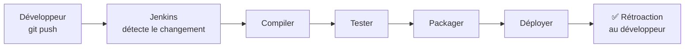
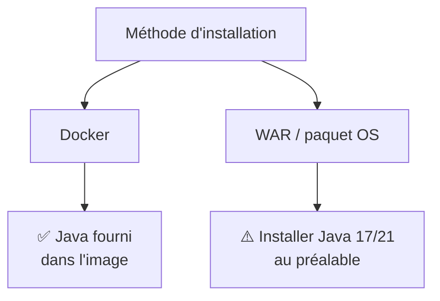
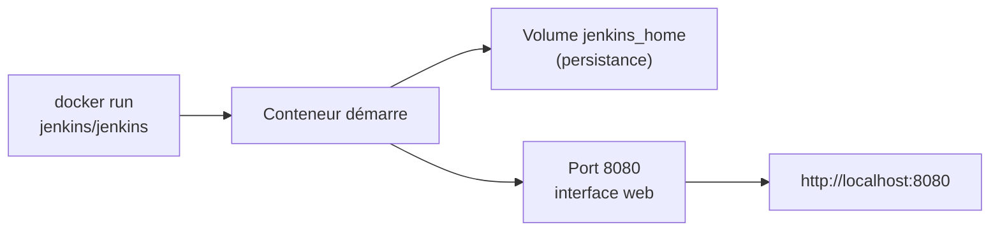
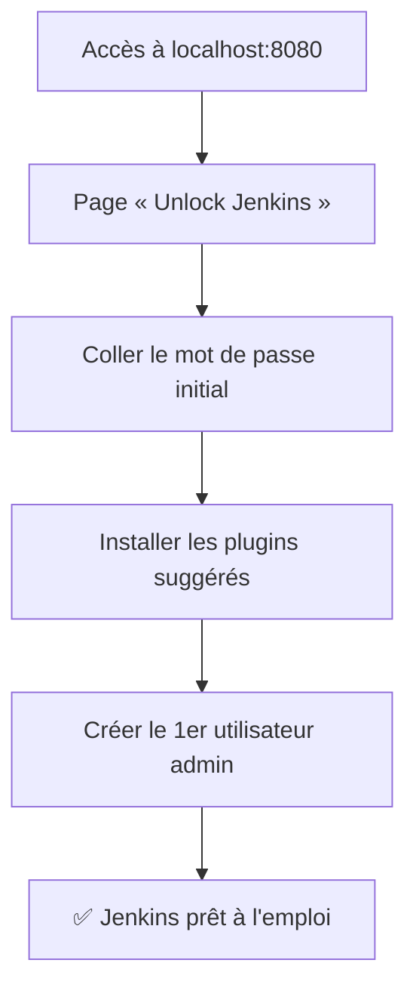
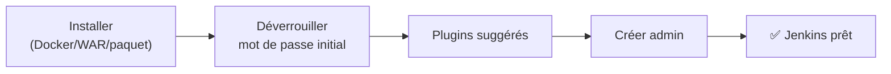

<a id="top"></a>

# 01 — Installation de Jenkins

## Table des matières

| # | Section |
|---|---|
| 1 | [Qu'est-ce que Jenkins ?](#section-1) |
| 2 | [Prérequis — Java](#section-2) |
| 3 | [Installation avec Docker (recommandé)](#section-3) |
| 4 | [Installation via le fichier WAR](#section-4) |
| 5 | [Installation via un paquet de l'OS](#section-5) |
| 6 | [Déverrouillage initial et assistant de configuration](#section-6) |
| 7 | [Quiz — Installation de Jenkins](#section-7) |
| 8 | [Pratique — Installer Jenkins avec Docker](#section-8) |
| 9 | [Synthèse](#section-9) |

---

<a id="section-1"></a>

<details>
<summary>1 — Qu'est-ce que Jenkins ?</summary>

<br/>

**Jenkins** est un **serveur d'automatisation open source** écrit en Java. Il sert de chef d'orchestre à l'**intégration continue** (*CI*) et à la **livraison/déploiement continus** (*CD*).

Concrètement, Jenkins surveille votre code, et à chaque changement il peut **compiler**, **tester**, **packager** et **déployer** votre application automatiquement — sans intervention humaine.

> _Sans serveur CI/CD, chaque développeur compile et teste « à la main » sur sa machine. Résultat : « ça marche chez moi », des régressions découvertes trop tard, des déploiements stressants. Jenkins automatise et standardise tout ce flux._



**Ce que Jenkins apporte :**

| Capacité | Description |
|---|---|
| **Automatisation** | Exécute des tâches (*jobs*) déclenchées par un événement ou une horloge |
| **Extensibilité** | Plus de 1800 plugins (Git, Docker, Maven, Slack…) |
| **Pipelines as Code** | Décrire le flux CI/CD dans un `Jenkinsfile` versionné |
| **Distribué** | Un nœud *contrôleur* + plusieurs *agents* pour répartir la charge |
| **Open source** | Gratuit, communauté énorme, mature depuis 2011 |

> _Jenkins se compose d'un **contrôleur** (le cerveau, l'interface web) et, optionnellement, d'**agents** (machines qui exécutent réellement les builds). Pour débuter, le contrôleur exécute tout lui-même._

</details>

<p align="right"><a href="#top">↑ Retour en haut</a></p>

---

<a id="section-2"></a>

<details>
<summary>2 — Prérequis — Java</summary>

<br/>

Jenkins est une application **Java** : elle a besoin d'un **JDK** (ou au minimum d'un JRE) compatible pour fonctionner. Les versions récentes de Jenkins exigent **Java 17 ou Java 21**.

```bash
# Vérifier la version de Java installée
java -version
# → openjdk version "17.0.10" 2024-01-16 (ou similaire)
```

**🔧 Mini-exercice —** Écris la commande qui installe le JDK 17 sur une machine Ubuntu.

<details>
<summary>✅ Voir une solution</summary>

`sudo apt update && sudo apt install -y openjdk-17-jdk`

</details>

### Installer Java (si absent)

```bash
# Debian / Ubuntu — Java 17 (Temurin / OpenJDK)
sudo apt update
sudo apt install -y openjdk-17-jdk

# Red Hat / Fedora
sudo dnf install -y java-17-openjdk
```

| Version de Jenkins | Java requis |
|---|---|
| Jenkins LTS récent (2.4xx+) | Java 17 ou 21 |
| Anciennes versions LTS | Java 11 |
| Versions obsolètes | Java 8 |

> _Si vous utilisez l'image Docker officielle `jenkins/jenkins`, Java est **déjà inclus** dans l'image. Vous n'avez alors rien à installer côté Java — c'est l'un des grands avantages de Docker._



</details>

<p align="right"><a href="#top">↑ Retour en haut</a></p>

---

<a id="section-3"></a>

<details>
<summary>3 — Installation avec Docker (recommandé)</summary>

<br/>

Docker est la méthode **la plus simple et la plus reproductible** : pas d'installation de Java ni de configuration système, et on peut tout supprimer proprement.

```bash
# Lancer Jenkins (image LTS officielle)
docker run --name jenkins \
  -p 8080:8080 \
  -p 50000:50000 \
  -v jenkins_home:/var/jenkins_home \
  jenkins/jenkins:lts-jdk17
```

| Option | Rôle |
|---|---|
| `--name jenkins` | Nomme le conteneur pour le retrouver facilement |
| `-p 8080:8080` | Expose l'**interface web** sur `http://localhost:8080` |
| `-p 50000:50000` | Port de communication contrôleur ↔ agents |
| `-v jenkins_home:/var/jenkins_home` | **Volume persistant** : conserve config, jobs, plugins |
| `jenkins/jenkins:lts-jdk17` | Image LTS (stable) avec Java 17 inclus |

> _Le volume `jenkins_home` est **crucial** : sans lui, tout votre travail (jobs, plugins, utilisateurs) disparaît dès que le conteneur est supprimé. C'est là que Jenkins stocke l'intégralité de son état._

**🔧 Mini-exercice —** Écris la commande Docker qui lance Jenkins en exposant uniquement le port 8080 (interface web) et nomme le conteneur `jenkins`.

<details>
<summary>✅ Voir une solution</summary>

`docker run --name jenkins -p 8080:8080 jenkins/jenkins:lts-jdk17`

</details>

### Version docker-compose (plus propre)

```yaml
# docker-compose.yml
services:
  jenkins:
    image: jenkins/jenkins:lts-jdk17
    container_name: jenkins
    ports:
      - "8080:8080"
      - "50000:50000"
    volumes:
      - jenkins_home:/var/jenkins_home
    restart: unless-stopped

volumes:
  jenkins_home:
```

```bash
# Démarrer en arrière-plan
docker compose up -d

# Suivre les journaux (pour voir le mot de passe initial)
docker compose logs -f jenkins
```



</details>

<p align="right"><a href="#top">↑ Retour en haut</a></p>

---

<a id="section-4"></a>

<details>
<summary>4 — Installation via le fichier WAR</summary>

<br/>

Jenkins est distribué comme un fichier **`jenkins.war`** (Web Application Archive). C'est la méthode **universelle** : elle fonctionne sur tout système ayant Java, sans gestionnaire de paquets ni Docker.

```bash
# 1. Télécharger le WAR (version LTS stable)
wget https://get.jenkins.io/war-stable/latest/jenkins.war

# 2. Lancer Jenkins (port 8080 par défaut)
java -jar jenkins.war

# 3. (optionnel) Choisir un autre port
java -jar jenkins.war --httpPort=9090
```

Au démarrage, Jenkins affiche dans le terminal son **mot de passe initial** entre deux lignes d'astérisques.

| Avantage | Inconvénient |
|---|---|
| Aucun outil supplémentaire requis | Pas de service système (s'arrête si on ferme le terminal) |
| Idéal pour tester rapidement | Mises à jour manuelles |
| Portable (un seul fichier) | Java à gérer soi-même |

> _Le WAR est parfait pour une démonstration ou un test local. Pour un serveur permanent, préférez Docker ou un paquet OS qui crée un **service** redémarrant automatiquement._

**🔧 Mini-exercice —** Écris la commande qui lance le fichier `jenkins.war` sur le port 9090 au lieu du port par défaut.

<details>
<summary>✅ Voir une solution</summary>

`java -jar jenkins.war --httpPort=9090`

</details>

</details>

<p align="right"><a href="#top">↑ Retour en haut</a></p>

---

<a id="section-5"></a>

<details>
<summary>5 — Installation via un paquet de l'OS</summary>

<br/>

Cette méthode installe Jenkins comme un **service système** géré par `systemd`, qui démarre automatiquement au boot.

### Debian / Ubuntu (dépôt APT)

```bash
# 1. Ajouter la clé du dépôt Jenkins
sudo wget -O /usr/share/keyrings/jenkins-keyring.asc \
  https://pkg.jenkins.io/debian-stable/jenkins.io-2023.key

# 2. Ajouter le dépôt
echo "deb [signed-by=/usr/share/keyrings/jenkins-keyring.asc] \
  https://pkg.jenkins.io/debian-stable binary/" \
  | sudo tee /etc/apt/sources.list.d/jenkins.list > /dev/null

# 3. Installer
sudo apt update
sudo apt install -y jenkins

# 4. Démarrer et activer le service
sudo systemctl start jenkins
sudo systemctl enable jenkins
sudo systemctl status jenkins
```

### Red Hat / Fedora (dépôt YUM/DNF)

```bash
sudo wget -O /etc/yum.repos.d/jenkins.repo \
  https://pkg.jenkins.io/redhat-stable/jenkins.repo
sudo rpm --import https://pkg.jenkins.io/redhat-stable/jenkins.io-2023.key
sudo dnf install -y jenkins
sudo systemctl enable --now jenkins
```

| Commande systemd | Effet |
|---|---|
| `systemctl start jenkins` | Démarre Jenkins maintenant |
| `systemctl enable jenkins` | Démarrage automatique au boot |
| `systemctl status jenkins` | État du service |
| `systemctl restart jenkins` | Redémarre (après changement de config) |

> _Avec cette méthode, le mot de passe initial se trouve dans un fichier sur le disque (voir section suivante), pas dans le terminal._

</details>

<p align="right"><a href="#top">↑ Retour en haut</a></p>

---

<a id="section-6"></a>

<details>
<summary>6 — Déverrouillage initial et assistant de configuration</summary>

<br/>

Au tout premier accès à `http://localhost:8080`, Jenkins est **verrouillé** pour des raisons de sécurité. Il faut prouver que vous avez accès au serveur en fournissant un **mot de passe administrateur initial** généré aléatoirement.



### Où trouver le mot de passe initial ?

```bash
# Installation par paquet (Linux)
sudo cat /var/lib/jenkins/secrets/initialAdminPassword

# Installation Docker
docker exec jenkins cat /var/jenkins_home/secrets/initialAdminPassword

# Installation WAR : affiché directement dans le terminal au démarrage
```

### Étapes de l'assistant

1. **Unlock Jenkins** — coller le mot de passe initial.
2. **Customize Jenkins** — choisir *Install suggested plugins* (recommandé pour débuter : Git, Pipeline, etc. installés d'office).
3. **Create First Admin User** — créer votre compte administrateur (nom, mot de passe, courriel). C'est ce compte que vous utiliserez ensuite, pas le mot de passe initial.
4. **Instance Configuration** — confirmer l'URL de Jenkins (ex. `http://localhost:8080/`).

> _Le mot de passe initial est à **usage unique** : il sert seulement à déverrouiller la première fois. Une fois votre compte admin créé, c'est lui qui prend le relais._

**🔧 Mini-exercice —** Dans une installation Docker, écris la commande qui lit le mot de passe administrateur initial.

<details>
<summary>✅ Voir une solution</summary>

`docker exec jenkins cat /var/jenkins_home/secrets/initialAdminPassword`

</details>

</details>

<p align="right"><a href="#top">↑ Retour en haut</a></p>

---

<a id="section-7"></a>

<details>
<summary>7 — Quiz — Installation de Jenkins</summary>

<br/>

**Question 1 :** Qu'est-ce que Jenkins ?

a) Un système de contrôle de version comme Git

b) Un serveur d'automatisation open source pour la CI/CD

c) Un langage de programmation

d) Une base de données

<details>
<summary>💡 Voir la solution</summary>

✅ **Réponse : b)** — Jenkins est un serveur d'automatisation écrit en Java qui orchestre l'intégration et la livraison continues (CI/CD).

</details>

---

**Question 2 :** Quelle technologie est un **prérequis** pour faire tourner Jenkins ?

a) Python

b) Node.js

c) Java (JDK 17 ou 21)

d) PHP

<details>
<summary>💡 Voir la solution</summary>

✅ **Réponse : c)** — Jenkins est une application Java ; elle nécessite un JDK compatible (17 ou 21 pour les versions récentes). L'image Docker l'inclut déjà.

</details>

---

**Question 3 :** Dans la commande Docker, à quoi sert `-v jenkins_home:/var/jenkins_home` ?

a) À ouvrir le port de l'interface web

b) À nommer le conteneur

c) À rendre persistantes la configuration, les jobs et les plugins

d) À limiter la mémoire utilisée

<details>
<summary>💡 Voir la solution</summary>

✅ **Réponse : c)** — Ce volume conserve l'état de Jenkins (`/var/jenkins_home`) même si le conteneur est supprimé. Sans lui, tout serait perdu.

</details>

---

**Question 4 :** Où trouve-t-on le mot de passe administrateur **initial** dans une installation Docker ?

a) Dans le fichier `docker-compose.yml`

b) Dans `/var/jenkins_home/secrets/initialAdminPassword`

c) Il est toujours `admin`

d) Dans la variable d'environnement `JENKINS_PASSWORD`

<details>
<summary>💡 Voir la solution</summary>

✅ **Réponse : b)** — On le lit avec `docker exec jenkins cat /var/jenkins_home/secrets/initialAdminPassword`. Il sert uniquement au déverrouillage initial.

</details>

---

**Question 5 :** Quel est l'avantage principal de l'installation par **paquet OS** (apt/dnf) ?

a) Elle n'a pas besoin de Java

b) Elle crée un service systemd qui démarre automatiquement au boot

c) Elle est plus rapide que Docker

d) Elle ne nécessite aucun déverrouillage

<details>
<summary>💡 Voir la solution</summary>

✅ **Réponse : b)** — Le paquet enregistre Jenkins comme service `systemd` (`systemctl enable jenkins`), ce qui le relance automatiquement après un redémarrage.

</details>

</details>

<p align="right"><a href="#top">↑ Retour en haut</a></p>

---

<a id="section-8"></a>

<details>
<summary>8 — Pratique — Installer Jenkins avec Docker</summary>

<br/>

### Consigne

1. Lancez Jenkins dans un conteneur Docker, avec persistance et port web exposé.
2. Récupérez le **mot de passe administrateur initial**.
3. Accédez à l'interface web et terminez l'assistant (plugins suggérés + compte admin).
4. Vérifiez que le conteneur tourne bien.

---

### Correction — Suite de commandes attendue

```bash
# 1. Démarrer Jenkins (en arrière-plan)
docker run -d --name jenkins \
  -p 8080:8080 \
  -p 50000:50000 \
  -v jenkins_home:/var/jenkins_home \
  jenkins/jenkins:lts-jdk17

# 2. Attendre ~30 s puis lire le mot de passe initial
docker exec jenkins cat /var/jenkins_home/secrets/initialAdminPassword
# → ex. 4f8c9a2b7d3e4f1a9c6b8d2e5a7f0c1b

# 3. Ouvrir http://localhost:8080 dans le navigateur
#    - Coller le mot de passe
#    - Cliquer « Install suggested plugins »
#    - Créer le compte admin

# 4. Vérifier l'état du conteneur
docker ps
```

**Résultat attendu de `docker ps` :**

```
CONTAINER ID   IMAGE                        STATUS         PORTS                              NAMES
a1b2c3d4e5f6   jenkins/jenkins:lts-jdk17    Up 2 minutes   0.0.0.0:8080->8080/tcp, 50000...   jenkins
```

> _Une fois l'assistant terminé, vous arrivez sur le **tableau de bord Jenkins**. Bravo : votre serveur d'automatisation est opérationnel. La leçon suivante porte sur sa configuration et sa sécurisation._

</details>

<p align="right"><a href="#top">↑ Retour en haut</a></p>

---

<a id="section-9"></a>

<details>
<summary>9 — Synthèse</summary>

<br/>

#### Points à retenir

1. **Jenkins** est un serveur d'automatisation open source en Java, cœur de la **CI/CD**.
2. **Prérequis** : Java 17 ou 21 (inclus dans l'image Docker).
3. **Trois méthodes** d'installation : **Docker** (recommandé), **WAR** (universel/portable), **paquet OS** (service systemd).
4. Au premier accès, Jenkins est **verrouillé** : il faut le **mot de passe initial** depuis `secrets/initialAdminPassword`.
5. L'assistant installe les **plugins suggérés** et crée le **compte administrateur**.



#### La suite

Leçon **02 — Configuration initiale** : sécuriser Jenkins (matrice d'autorisations, *realms*), gérer les utilisateurs et les rôles.

</details>

<p align="right"><a href="#top">↑ Retour en haut</a></p>

---

<p align="center">
  <em>Tous droits réservés. Toute reproduction, diffusion, utilisation ou adaptation de ce cours, en tout ou en partie, est strictement interdite sans l'autorisation écrite préalable de Dr. Haythem REHOUMA.</em>
</p>

<p align="center">
  <strong>Cours créé par Dr. Haythem REHOUMA — Développement et déploiement de solutions de données</strong>
</p>
