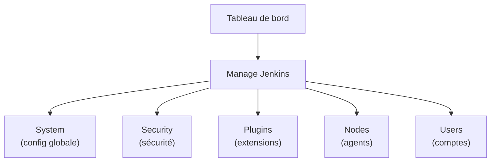
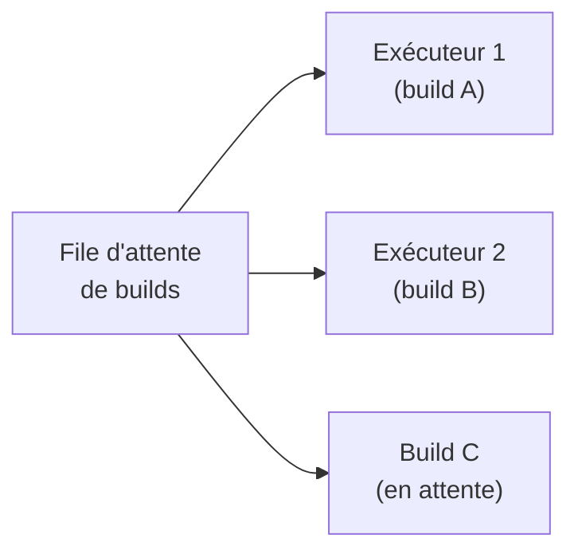
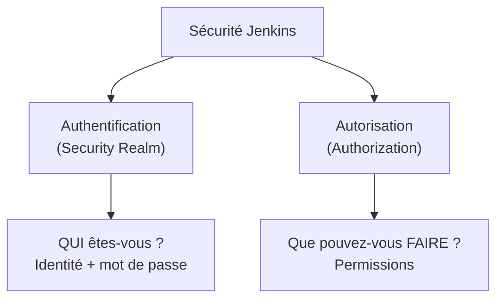
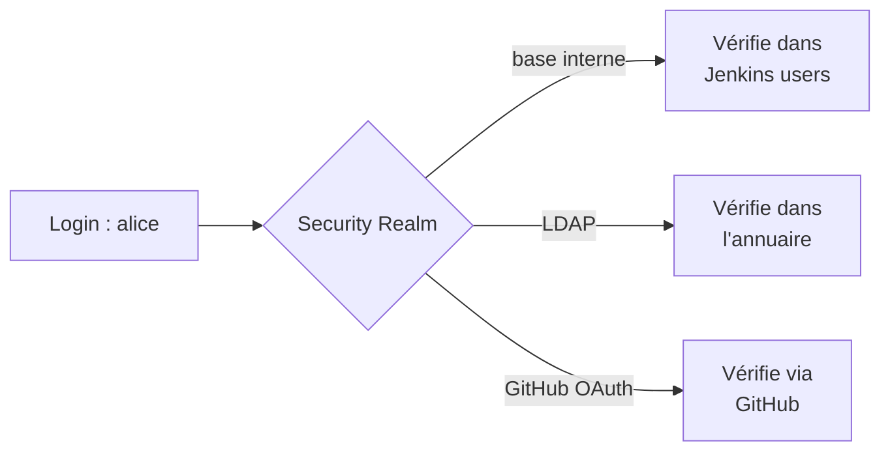
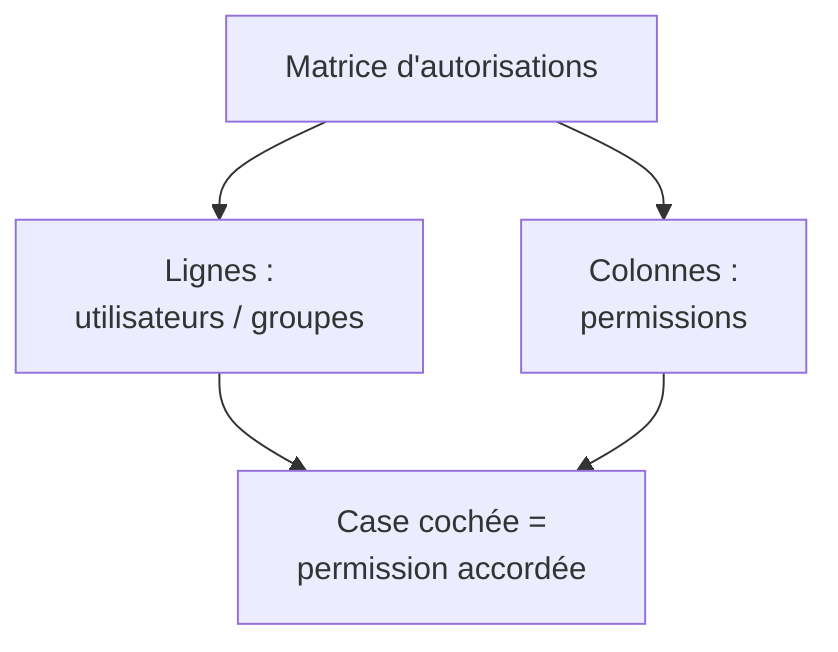
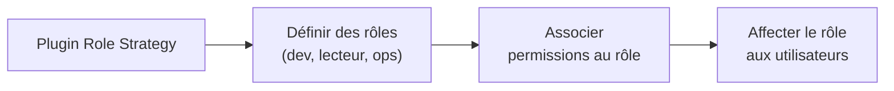
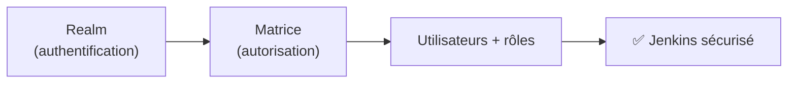

<a id="top"></a>

# 02 — Configuration initiale et sécurité

## Table des matières

| # | Section |
|---|---|
| 1 | [Le tableau de bord et « Manage Jenkins »](#section-1) |
| 2 | [Configuration système de base](#section-2) |
| 3 | [Le modèle de sécurité de Jenkins](#section-3) |
| 4 | [Les realms — d'où viennent les utilisateurs ?](#section-4) |
| 5 | [La matrice d'autorisations](#section-5) |
| 6 | [Créer des utilisateurs et des rôles](#section-6) |
| 7 | [Quiz — Configuration et sécurité](#section-7) |
| 8 | [Pratique — Sécuriser Jenkins avec une matrice](#section-8) |
| 9 | [Synthèse](#section-9) |

---

<a id="section-1"></a>

<details>
<summary>1 — Le tableau de bord et « Manage Jenkins »</summary>

<br/>

Après l'assistant, vous arrivez sur le **tableau de bord**. Toute la configuration passe par le menu **Manage Jenkins** (Administrer Jenkins).



| Entrée du menu | Rôle |
|---|---|
| **System** | Nom système, URL, variables d'environnement globales |
| **Security** | Realm d'authentification, autorisations |
| **Plugins** | Installer / mettre à jour / supprimer des extensions |
| **Nodes and Clouds** | Gérer les agents de build |
| **Users** | Comptes de la base interne |
| **Tools** | Chemins vers JDK, Git, Maven… |

> _« Manage Jenkins » est le centre de contrôle. Si une option de configuration existe, elle s'y trouve. Prenez l'habitude d'y chercher en premier._

**🔧 Mini-exercice —** Dans quelle entrée du menu « Manage Jenkins » va-t-on pour changer l'URL publique de Jenkins ?

<details>
<summary>✅ Voir une solution</summary>

Dans **System** (Manage Jenkins → System), au champ « Jenkins URL ».

</details>

</details>

<p align="right"><a href="#top">↑ Retour en haut</a></p>

---

<a id="section-2"></a>

<details>
<summary>2 — Configuration système de base</summary>

<br/>

Dans **Manage Jenkins → System**, on règle les paramètres globaux.

| Paramètre | Description |
|---|---|
| **Jenkins URL** | URL publique (utilisée dans les courriels, les webhooks) |
| **System Admin e-mail address** | Expéditeur des notifications |
| **# of executors** | Nombre de builds simultanés sur le contrôleur |
| **Quiet period** | Délai d'attente avant de lancer un build |
| **Global properties** | Variables d'environnement partagées |

### Les exécuteurs (executors)

Un **exécuteur** est un « créneau » de build. Avec 2 exécuteurs, Jenkins peut lancer 2 jobs en parallèle.



> _Sur un serveur de production, évitez d'exécuter des builds directement sur le **contrôleur** : réglez ses exécuteurs à 0 et déléguez le travail à des **agents**. Le contrôleur doit rester réactif pour l'interface et l'ordonnancement._

**🔧 Mini-exercice —** Combien de builds peuvent s'exécuter en parallèle si le nombre d'exécuteurs est réglé à 3 ?

<details>
<summary>✅ Voir une solution</summary>

3 builds simultanés : chaque exécuteur est un « créneau » de build. Le 4ᵉ build attend en file.

</details>

</details>

<p align="right"><a href="#top">↑ Retour en haut</a></p>

---

<a id="section-3"></a>

<details>
<summary>3 — Le modèle de sécurité de Jenkins</summary>

<br/>

La sécurité de Jenkins repose sur **deux questions distinctes** :



| Concept | Question | Configuré par |
|---|---|---|
| **Authentification** | « Qui es-tu ? » | Le **Security Realm** |
| **Autorisation** | « Qu'as-tu le droit de faire ? » | La stratégie d'**autorisation** (ex. matrice) |

> _Ne confondez jamais les deux. Le *realm* vérifie l'identité (login). L'*autorisation* décide des permissions (lire, construire, administrer…). Les deux se règlent dans **Manage Jenkins → Security**._

> _Par défaut après l'assistant, Jenkins active « Logged-in users can do anything » : tout utilisateur connecté est admin. C'est commode pour débuter mais **dangereux en équipe** — d'où la matrice (section 5)._

</details>

<p align="right"><a href="#top">↑ Retour en haut</a></p>

---

<a id="section-4"></a>

<details>
<summary>4 — Les realms — d'où viennent les utilisateurs ?</summary>

<br/>

Le **Security Realm** définit la **source des identités** : où Jenkins va vérifier les mots de passe.

| Realm | Source des comptes | Usage typique |
|---|---|---|
| **Jenkins' own user database** | Base interne de Jenkins | Petites équipes, démarrage |
| **LDAP** | Annuaire LDAP/Active Directory | Entreprise |
| **Active Directory** | AD Microsoft | Environnement Windows |
| **GitHub / OAuth** | Compte GitHub | Équipes sur GitHub |
| **Unix user/group database** | Comptes du système hôte | Serveur Unix dédié |



> _Pour ce cours, on utilise « **Jenkins' own user database** » : les comptes vivent dans Jenkins. En entreprise, on branche LDAP/AD pour centraliser et réutiliser les comptes existants._

**🔧 Mini-exercice —** Quel realm choisir pour qu'une entreprise réutilise les comptes de son Active Directory Microsoft ?

<details>
<summary>✅ Voir une solution</summary>

Le realm **Active Directory** (ou **LDAP**), qui vérifie les identités dans l'annuaire existant.

</details>

</details>

<p align="right"><a href="#top">↑ Retour en haut</a></p>

---

<a id="section-5"></a>

<details>
<summary>5 — La matrice d'autorisations</summary>

<br/>

La **Matrix-based security** (sécurité par matrice) est la stratégie d'autorisation la plus claire pour des permissions fines. C'est un **tableau** : lignes = utilisateurs/groupes, colonnes = permissions.



### Exemple de matrice

| Utilisateur | Overall/Read | Job/Build | Job/Configure | Overall/Administer |
|---|:---:|:---:|:---:|:---:|
| `admin` | ✅ | ✅ | ✅ | ✅ |
| `dev` | ✅ | ✅ | ✅ | ❌ |
| `lecteur` | ✅ | ❌ | ❌ | ❌ |
| `anonymous` | ❌ | ❌ | ❌ | ❌ |

### Catégories de permissions

| Catégorie | Exemples |
|---|---|
| **Overall** | Read, Administer |
| **Job** | Build, Configure, Create, Delete, Read |
| **Run** | Delete, Update |
| **Credentials** | Create, Update, View |
| **Agent** | Configure, Connect, Disconnect |

> _Variante recommandée : « **Project-based Matrix Authorization** » qui permet, en plus, des permissions **par projet/job**. La règle d'or : donner le **minimum** de droits nécessaires (principe du moindre privilège)._

> _⚠️ Avant d'appliquer une matrice, assurez-vous d'**accorder explicitement `Overall/Administer` à votre compte admin**. Sinon vous risquez de vous verrouiller hors de Jenkins !_

**🔧 Mini-exercice —** Dans la matrice, quelles permissions faut-il cocher pour un compte `lecteur` qui doit voir les jobs mais ne jamais les lancer ?

<details>
<summary>✅ Voir une solution</summary>

Cocher **Overall/Read** et **Job/Read** uniquement ; laisser **Job/Build** et **Overall/Administer** décochés.

</details>

</details>

<p align="right"><a href="#top">↑ Retour en haut</a></p>

---

<a id="section-6"></a>

<details>
<summary>6 — Créer des utilisateurs et des rôles</summary>

<br/>

### Créer un utilisateur (base interne)

**Manage Jenkins → Users → Create User** : renseignez identifiant, mot de passe, nom complet et courriel.

### Notion de rôle

La matrice de base attribue des permissions **par utilisateur**. Pour gérer des **rôles** réutilisables (`développeur`, `lecteur`, `opérateur`), on installe le plugin **Role-based Authorization Strategy**.



| Sans plugin (matrice native) | Avec plugin Role Strategy |
|---|---|
| Permissions par utilisateur | Permissions par **rôle** |
| Devient vite illisible | Reste lisible à grande échelle |
| Pas de rôles par dossier | Rôles globaux **et** par projet/pattern |

> _Pour 3-4 personnes, la matrice native suffit. Dès qu'une équipe grandit, les **rôles** évitent de recocher des dizaines de cases à chaque nouvel arrivant : on lui attribue simplement le rôle `développeur`._

</details>

<p align="right"><a href="#top">↑ Retour en haut</a></p>

---

<a id="section-7"></a>

<details>
<summary>7 — Quiz — Configuration et sécurité</summary>

<br/>

**Question 1 :** Dans Jenkins, que définit le **Security Realm** ?

a) Les permissions de chaque utilisateur

b) La source d'authentification (où vérifier les identités)

c) Le nombre d'exécuteurs

d) L'URL de Jenkins

<details>
<summary>💡 Voir la solution</summary>

✅ **Réponse : b)** — Le realm répond à « qui es-tu ? » : base interne, LDAP, AD, OAuth… Les permissions, elles, relèvent de l'autorisation.

</details>

---

**Question 2 :** Quelle est la différence entre authentification et autorisation ?

a) Aucune, ce sont des synonymes

b) L'authentification vérifie l'identité, l'autorisation décide des permissions

c) L'autorisation vérifie le mot de passe

d) L'authentification gère les plugins

<details>
<summary>💡 Voir la solution</summary>

✅ **Réponse : b)** — Authentification = « qui es-tu ? » ; autorisation = « qu'as-tu le droit de faire ? ».

</details>

---

**Question 3 :** Dans une matrice d'autorisations, que représentent les colonnes ?

a) Les utilisateurs

b) Les jobs

c) Les permissions

d) Les plugins

<details>
<summary>💡 Voir la solution</summary>

✅ **Réponse : c)** — Lignes = utilisateurs/groupes, colonnes = permissions ; une case cochée accorde la permission.

</details>

---

**Question 4 :** Quel risque y a-t-il en activant une matrice sans se donner `Overall/Administer` ?

a) Aucun

b) Les builds deviennent plus lents

c) On peut se verrouiller hors de l'administration de Jenkins

d) Les plugins se désinstallent

<details>
<summary>💡 Voir la solution</summary>

✅ **Réponse : c)** — Sans la permission d'administration accordée à votre compte, plus personne ne peut administrer Jenkins.

</details>

---

**Question 5 :** Quel plugin permet de gérer des **rôles** réutilisables ?

a) Git plugin

b) Role-based Authorization Strategy

c) Blue Ocean

d) Pipeline

<details>
<summary>💡 Voir la solution</summary>

✅ **Réponse : b)** — Ce plugin remplace les permissions par utilisateur par des rôles (dev, ops, lecteur…) plus faciles à gérer.

</details>

</details>

<p align="right"><a href="#top">↑ Retour en haut</a></p>

---

<a id="section-8"></a>

<details>
<summary>8 — Pratique — Sécuriser Jenkins avec une matrice</summary>

<br/>

### Consigne

1. Activer le realm « Jenkins' own user database ».
2. Créer deux utilisateurs : `dev` et `lecteur`.
3. Passer la stratégie d'autorisation en **Matrix-based security**.
4. Accorder à `admin` tous les droits, à `dev` la lecture + le build, à `lecteur` la lecture seule.
5. Vérifier en se connectant avec chaque compte.

---

### Correction — Étapes attendues

```text
1. Manage Jenkins → Security
   - Security Realm : « Jenkins' own user database »
   - (laisser « Allow users to sign up » DÉCOCHÉ)

2. Manage Jenkins → Users → Create User
   - id: dev      / mot de passe / courriel
   - id: lecteur  / mot de passe / courriel

3. Manage Jenkins → Security → Authorization
   - Choisir « Matrix-based security »
```

**Matrice à configurer :**

| Utilisateur | Overall/Read | Job/Read | Job/Build | Overall/Administer |
|---|:---:|:---:|:---:|:---:|
| `admin`   | ✅ | ✅ | ✅ | ✅ |
| `dev`     | ✅ | ✅ | ✅ | ❌ |
| `lecteur` | ✅ | ✅ | ❌ | ❌ |
| `anonymous` | ❌ | ❌ | ❌ | ❌ |

```text
4. Save
5. Se déconnecter, puis tester :
   - lecteur : voit les jobs mais le bouton « Build » est absent
   - dev     : peut lancer des builds, mais pas « Manage Jenkins »
   - admin   : accès complet
```

**Résultat attendu :**

```
✅ lecteur connecté → lecture seule (pas de bouton Build)
✅ dev connecté     → peut builder, pas administrer
✅ admin connecté   → accès total
```

> _Vous venez d'appliquer le **principe du moindre privilège** : chacun a juste ce dont il a besoin. C'est la base d'un Jenkins partagé et sûr._

</details>

<p align="right"><a href="#top">↑ Retour en haut</a></p>

---

<a id="section-9"></a>

<details>
<summary>9 — Synthèse</summary>

<br/>

#### Points à retenir

1. Toute la configuration passe par **Manage Jenkins**.
2. La sécurité se divise en **authentification** (Security Realm) et **autorisation** (permissions).
3. Le **realm** définit la source des identités : base interne, LDAP, AD, OAuth…
4. La **matrice d'autorisations** croise utilisateurs (lignes) et permissions (colonnes).
5. Toujours se donner `Overall/Administer` avant d'appliquer une matrice ; appliquer le **moindre privilège**.
6. Le plugin **Role-based Authorization Strategy** introduit des **rôles** réutilisables.



#### La suite

Leçon **03 — Plugins essentiels** : le système d'extensions et les plugins incontournables (Git, Pipeline, Maven, Blue Ocean, Credentials).

</details>

<p align="right"><a href="#top">↑ Retour en haut</a></p>

---

<p align="center">
  <em>Tous droits réservés. Toute reproduction, diffusion, utilisation ou adaptation de ce cours, en tout ou en partie, est strictement interdite sans l'autorisation écrite préalable de Dr. Haythem REHOUMA.</em>
</p>

<p align="center">
  <strong>Cours créé par Dr. Haythem REHOUMA — Développement et déploiement de solutions de données</strong>
</p>
