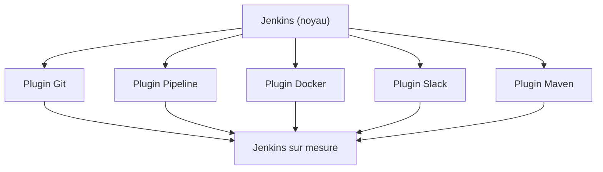
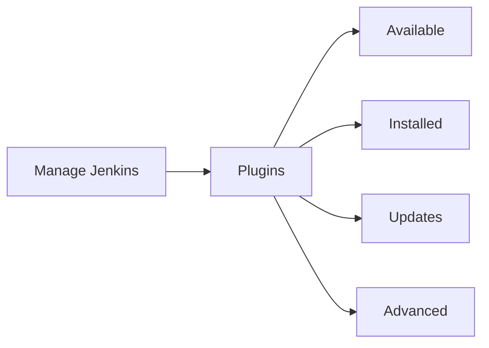
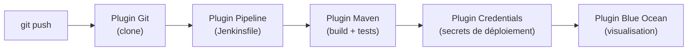
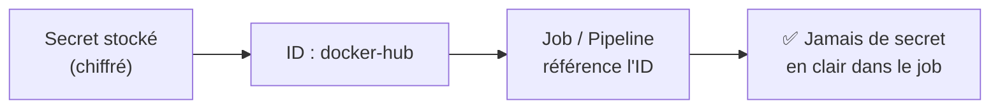
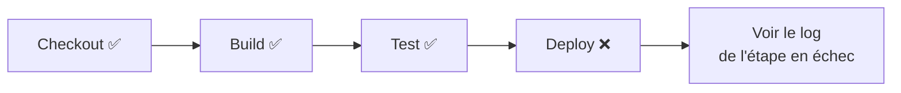
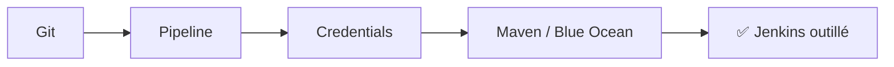

<a id="top"></a>

# 03 — Plugins essentiels

## Table des matières

| # | Section |
|---|---|
| 1 | [Le système de plugins de Jenkins](#section-1) |
| 2 | [Le gestionnaire de plugins](#section-2) |
| 3 | [Installer, mettre à jour et supprimer un plugin](#section-3) |
| 4 | [Les plugins essentiels](#section-4) |
| 5 | [Zoom — Credentials et Pipeline](#section-5) |
| 6 | [Blue Ocean — l'interface moderne](#section-6) |
| 7 | [Installer des plugins « as code »](#section-7) |
| 8 | [Quiz — Plugins](#section-8) |
| 9 | [Pratique — Installer et vérifier des plugins](#section-9) |
| 10 | [Synthèse](#section-10) |

---

<a id="section-1"></a>

<details>
<summary>1 — Le système de plugins de Jenkins</summary>

<br/>

Jenkins est volontairement **minimaliste à l'installation**. Sa puissance vient de son **écosystème de plugins** : plus de **1800 extensions** qui ajoutent des intégrations (Git, Docker, Slack, Kubernetes…) et des fonctionnalités.



| Sans plugins | Avec plugins |
|---|---|
| Noyau d'automatisation brut | Intégrations clé en main |
| Pas de support Git natif riche | `git clone`, webhooks, etc. |
| Pas de pipelines déclaratifs | `Jenkinsfile`, Blue Ocean |

> _Presque tout dans Jenkins est un plugin — même le support de Git et des Pipelines. Les « plugins suggérés » de l'assistant en installent déjà les plus utiles. On en ajoute d'autres au besoin._

</details>

<p align="right"><a href="#top">↑ Retour en haut</a></p>

---

<a id="section-2"></a>

<details>
<summary>2 — Le gestionnaire de plugins</summary>

<br/>

On gère les plugins via **Manage Jenkins → Plugins**. Quatre onglets :

| Onglet | Rôle |
|---|---|
| **Available plugins** | Catalogue des plugins installables |
| **Installed plugins** | Plugins déjà présents (activer/désactiver/supprimer) |
| **Updates** | Mises à jour disponibles |
| **Advanced settings** | Proxy, téléversement manuel d'un `.hpi` |



> _Pensez à consulter régulièrement l'onglet **Updates** : les mises à jour corrigent des failles de sécurité. Mais en production, testez d'abord sur un Jenkins de pré-production._

**🔧 Mini-exercice —** Dans quel onglet du gestionnaire de plugins téléverse-t-on manuellement un fichier `.hpi` ?

<details>
<summary>✅ Voir une solution</summary>

Dans l'onglet **Advanced settings** (Advanced).

</details>

</details>

<p align="right"><a href="#top">↑ Retour en haut</a></p>

---

<a id="section-3"></a>

<details>
<summary>3 — Installer, mettre à jour et supprimer un plugin</summary>

<br/>

### Via l'interface

1. **Manage Jenkins → Plugins → Available plugins**.
2. Rechercher (ex. « Docker »), cocher, **Install**.
3. Cocher « Restart Jenkins when installation is complete » si demandé.

### Via la ligne de commande (Jenkins CLI)

```bash
# Lister les plugins installés
java -jar jenkins-cli.jar -s http://localhost:8080/ list-plugins

# Installer un plugin
java -jar jenkins-cli.jar -s http://localhost:8080/ install-plugin git

# Redémarrer Jenkins (pour activer)
java -jar jenkins-cli.jar -s http://localhost:8080/ safe-restart
```

| Action | Conseil |
|---|---|
| **Installer** | Souvent un redémarrage nécessaire |
| **Mettre à jour** | Sauvegarder `JENKINS_HOME` avant en prod |
| **Supprimer** | Vérifier qu'aucun job n'en dépend |

> _Certains plugins requièrent un **redémarrage** pour s'activer. Utilisez « **Safe restart** » : Jenkins attend la fin des builds en cours avant de redémarrer._

**🔧 Mini-exercice —** Écris la commande Jenkins CLI qui installe le plugin `git`.

<details>
<summary>✅ Voir une solution</summary>

`java -jar jenkins-cli.jar -s http://localhost:8080/ install-plugin git`

</details>

</details>

<p align="right"><a href="#top">↑ Retour en haut</a></p>

---

<a id="section-4"></a>

<details>
<summary>4 — Les plugins essentiels</summary>

<br/>

Voici la boîte à outils de base de tout utilisateur Jenkins.

| Plugin | Rôle |
|---|---|
| **Git** | Cloner des dépôts Git, lire les branches/tags, déclencher sur push |
| **Pipeline** | Définir des pipelines via un `Jenkinsfile` (déclaratif/scripté) |
| **Maven Integration** | Builds Java avec Maven, rapports de tests |
| **Credentials** | Stocker secrets (mots de passe, clés SSH, tokens) en sécurité |
| **Blue Ocean** | Interface visuelle moderne pour les pipelines |
| **Pipeline: Stage View** | Visualiser les étapes d'un pipeline |
| **Workspace Cleanup** | Nettoyer l'espace de travail entre les builds |
| **Email Extension** | Notifications par courriel personnalisables |



> _Pour la plupart des projets, **Git + Pipeline + Credentials** forment le trio indispensable. Maven s'ajoute pour Java, Blue Ocean pour le confort visuel._

</details>

<p align="right"><a href="#top">↑ Retour en haut</a></p>

---

<a id="section-5"></a>

<details>
<summary>5 — Zoom — Credentials et Pipeline</summary>

<br/>

### Le plugin Credentials

Il stocke les **secrets** de façon chiffrée et évite de les écrire en clair dans les jobs. On y ajoute mots de passe, clés SSH, tokens d'API, certificats.

| Type de credential | Exemple d'usage |
|---|---|
| **Username with password** | Accès à un dépôt privé, à Docker Hub |
| **SSH Username with private key** | Déploiement par SSH |
| **Secret text** | Token d'API (GitHub, Slack…) |
| **Secret file** | Fichier `kubeconfig`, clé `.json` |



### Le plugin Pipeline (Jenkinsfile)

Il permet de décrire tout le flux CI/CD **en code**, versionné avec le projet.

```groovy
// Jenkinsfile — pipeline déclaratif
pipeline {
    agent any
    stages {
        stage('Checkout') {
            steps { git 'https://github.com/exemple/projet.git' }
        }
        stage('Build') {
            steps { sh 'mvn -B clean package' }
        }
        stage('Test') {
            steps { sh 'mvn test' }
        }
    }
    post {
        success { echo '✅ Pipeline réussi' }
        failure { echo '❌ Pipeline en échec' }
    }
}
```

> _Référencer un secret par son **ID** plutôt que sa valeur : `withCredentials([usernamePassword(credentialsId: 'docker-hub', ...)])`. Le secret n'apparaît jamais dans la console ni dans le `Jenkinsfile`._

**🔧 Mini-exercice —** Quel **type** de credential choisir pour stocker un token d'API GitHub à utiliser dans un job ?

<details>
<summary>✅ Voir une solution</summary>

Le type **Secret text** : il convient pour un token d'API (GitHub, Slack…).

</details>

</details>

<p align="right"><a href="#top">↑ Retour en haut</a></p>

---

<a id="section-6"></a>

<details>
<summary>6 — Blue Ocean — l'interface moderne</summary>

<br/>

**Blue Ocean** est une interface graphique repensée pour les **pipelines**. Elle affiche chaque étape (*stage*) sous forme visuelle, facilite le diagnostic des échecs et propose un éditeur de pipeline.



| Interface classique | Blue Ocean |
|---|---|
| Logs texte bruts | Vue par étapes, colorée |
| Diagnostic plus lent | Clic sur l'étape rouge → log direct |
| Pas d'éditeur visuel | Éditeur de pipeline intégré |

> _Blue Ocean ne remplace pas l'interface classique : il s'ajoute par-dessus. Pratique pour présenter un pipeline ou repérer rapidement quelle étape a échoué._

</details>

<p align="right"><a href="#top">↑ Retour en haut</a></p>

---

<a id="section-7"></a>

<details>
<summary>7 — Installer des plugins « as code »</summary>

<br/>

Pour reproduire un Jenkins à l'identique (Docker, équipe), on liste les plugins dans un fichier `plugins.txt` et on construit une image personnalisée.

```text
# plugins.txt
git:latest
workflow-aggregator:latest
matrix-auth:latest
credentials:latest
blueocean:latest
maven-plugin:latest
```

```dockerfile
# Dockerfile — Jenkins avec plugins pré-installés
FROM jenkins/jenkins:lts-jdk17
COPY plugins.txt /usr/share/jenkins/ref/plugins.txt
RUN jenkins-plugin-cli --plugin-file /usr/share/jenkins/ref/plugins.txt
```

```bash
# Construire et lancer l'image
docker build -t mon-jenkins .
docker run -d -p 8080:8080 -v jenkins_home:/var/jenkins_home mon-jenkins
```

> _Cette approche « **Infrastructure as Code** » garantit que tout le monde a exactement les mêmes plugins. Fini le « il me manque un plugin » : tout est décrit dans `plugins.txt`._

**🔧 Mini-exercice —** Écris la ligne à ajouter dans `plugins.txt` pour installer la dernière version du plugin Blue Ocean.

<details>
<summary>✅ Voir une solution</summary>

`blueocean:latest`

</details>

</details>

<p align="right"><a href="#top">↑ Retour en haut</a></p>

---

<a id="section-8"></a>

<details>
<summary>8 — Quiz — Plugins</summary>

<br/>

**Question 1 :** Pourquoi Jenkins est-il aussi extensible ?

a) Parce qu'il est écrit en Python

b) Grâce à son système de plugins (plus de 1800 extensions)

c) Parce qu'il intègre tout par défaut

d) Parce qu'il est payant

<details>
<summary>💡 Voir la solution</summary>

✅ **Réponse : b)** — Le noyau est minimal ; ce sont les plugins qui ajoutent intégrations et fonctionnalités.

</details>

---

**Question 2 :** Quel plugin sert à stocker les secrets (mots de passe, tokens) de façon sécurisée ?

a) Git

b) Maven

c) Credentials

d) Blue Ocean

<details>
<summary>💡 Voir la solution</summary>

✅ **Réponse : c)** — Le plugin Credentials chiffre les secrets et permet de les référencer par un ID, sans jamais les écrire en clair.

</details>

---

**Question 3 :** Quel plugin permet d'écrire un `Jenkinsfile` (pipeline as code) ?

a) Pipeline

b) Workspace Cleanup

c) Email Extension

d) Role Strategy

<details>
<summary>💡 Voir la solution</summary>

✅ **Réponse : a)** — Le plugin Pipeline (suite `workflow-aggregator`) permet de décrire le flux CI/CD dans un `Jenkinsfile` versionné.

</details>

---

**Question 4 :** Que propose Blue Ocean ?

a) Une base de données pour Jenkins

b) Une interface visuelle moderne pour les pipelines

c) Un nouveau langage de script

d) Un serveur d'agents

<details>
<summary>💡 Voir la solution</summary>

✅ **Réponse : b)** — Blue Ocean affiche les pipelines étape par étape et facilite le diagnostic des échecs.

</details>

---

**Question 5 :** Pourquoi utiliser un fichier `plugins.txt` avec Docker ?

a) Pour accélérer les builds

b) Pour reproduire à l'identique l'ensemble des plugins (Infrastructure as Code)

c) Pour supprimer Java

d) Pour désactiver la sécurité

<details>
<summary>💡 Voir la solution</summary>

✅ **Réponse : b)** — `plugins.txt` décrit les plugins requis ; l'image construite est reproductible pour toute l'équipe.

</details>

</details>

<p align="right"><a href="#top">↑ Retour en haut</a></p>

---

<a id="section-9"></a>

<details>
<summary>9 — Pratique — Installer et vérifier des plugins</summary>

<br/>

### Consigne

1. Installer les plugins **Git**, **Pipeline** et **Credentials** (s'ils ne le sont pas déjà).
2. Vérifier leur présence dans « Installed plugins ».
3. Ajouter un **credential** de type « Username with password » avec l'ID `docker-hub`.
4. Confirmer que le credential apparaît dans le magasin.

---

### Correction — Étapes attendues

```text
1. Manage Jenkins → Plugins → Available plugins
   - Rechercher « Git » → cocher → Install
   - Rechercher « Pipeline » → cocher → Install
   - Rechercher « Credentials » → cocher → Install
   - (Cocher « Restart when installation is complete »)

2. Manage Jenkins → Plugins → Installed plugins
   - Vérifier la présence de Git, Pipeline, Credentials

3. Manage Jenkins → Credentials → System → Global credentials
   - Add Credentials
     Kind : Username with password
     Username : mon-compte-docker
     Password : ********
     ID : docker-hub
   - Create
```

**Résultat attendu :**

```
✅ Git, Pipeline, Credentials → listés dans « Installed plugins »
✅ Credential « docker-hub » visible dans Global credentials
```

> _Le credential `docker-hub` est maintenant réutilisable par n'importe quel job/pipeline via son ID, sans jamais exposer le mot de passe. Vous êtes prêt à créer votre premier job (leçon 04)._

</details>

<p align="right"><a href="#top">↑ Retour en haut</a></p>

---

<a id="section-10"></a>

<details>
<summary>10 — Synthèse</summary>

<br/>

#### Points à retenir

1. Le noyau Jenkins est minimal ; sa puissance vient des **plugins** (1800+).
2. On les gère dans **Manage Jenkins → Plugins** (Available / Installed / Updates).
3. Les essentiels : **Git**, **Pipeline**, **Maven**, **Credentials**, **Blue Ocean**.
4. **Credentials** stocke les secrets de façon chiffrée, référencés par **ID**.
5. **Blue Ocean** offre une vue visuelle des pipelines.
6. Un fichier **`plugins.txt`** + Dockerfile rend l'installation reproductible (as code).



#### La suite

Leçon **04 — Premier job** : créer, configurer, exécuter un job *freestyle* et consulter ses résultats (console, historique des builds).

</details>

<p align="right"><a href="#top">↑ Retour en haut</a></p>

---

<p align="center">
  <em>Tous droits réservés. Toute reproduction, diffusion, utilisation ou adaptation de ce cours, en tout ou en partie, est strictement interdite sans l'autorisation écrite préalable de Dr. Haythem REHOUMA.</em>
</p>

<p align="center">
  <strong>Cours créé par Dr. Haythem REHOUMA — Développement et déploiement de solutions de données</strong>
</p>
