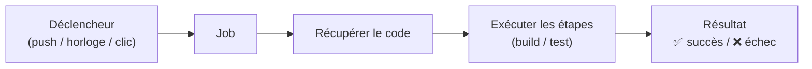
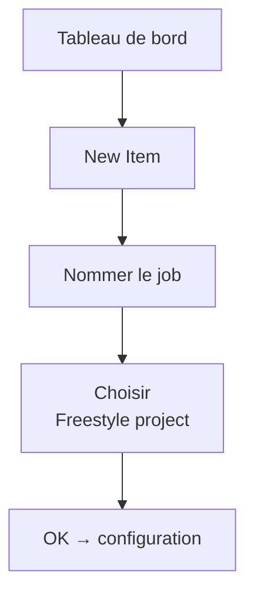
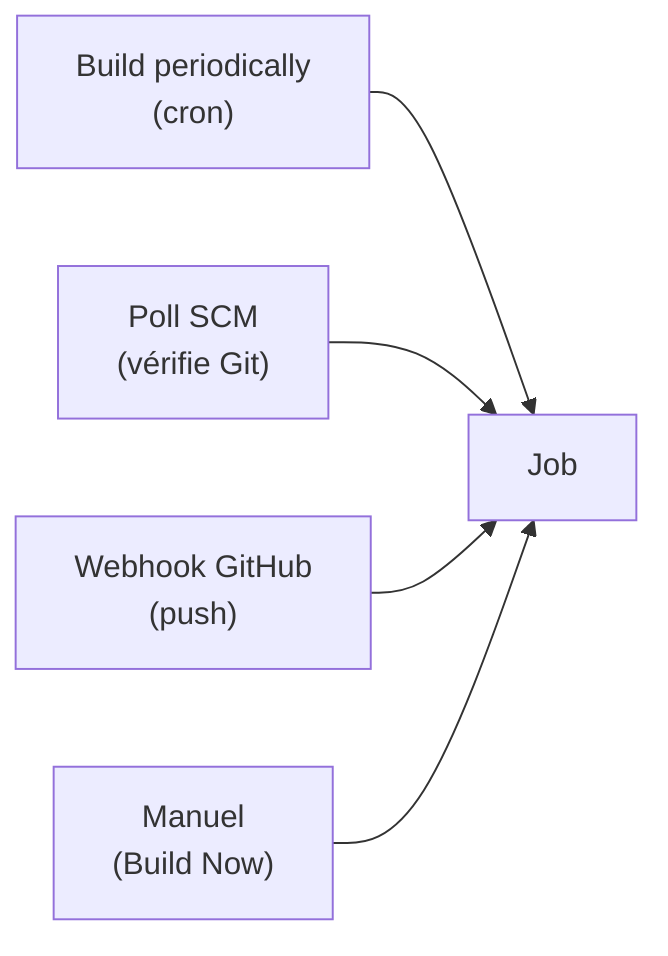
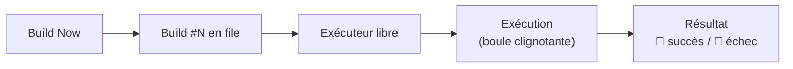
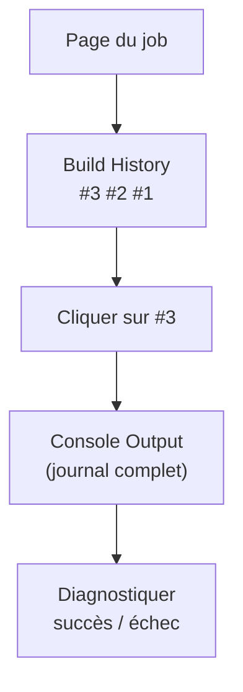
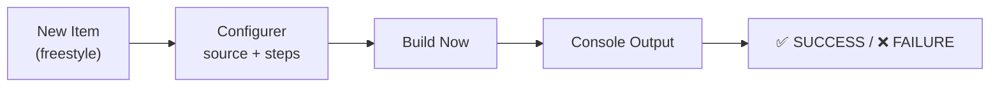

<a id="top"></a>

# 04 — Premier job

## Table des matières

| # | Section |
|---|---|
| 1 | [Qu'est-ce qu'un job Jenkins ?](#section-1) |
| 2 | [Créer un job freestyle](#section-2) |
| 3 | [Configurer le job — source et build](#section-3) |
| 4 | [Les déclencheurs (triggers)](#section-4) |
| 5 | [Exécuter le job (Build Now)](#section-5) |
| 6 | [Consulter les résultats — console et historique](#section-6) |
| 7 | [Quiz — Premier job](#section-7) |
| 8 | [Pratique — Créer et exécuter un job](#section-8) |
| 9 | [Synthèse](#section-9) |

---

<a id="section-1"></a>

<details>
<summary>1 — Qu'est-ce qu'un job Jenkins ?</summary>

<br/>

Un **job** (aussi appelé *project*) est une **tâche d'automatisation** configurée dans Jenkins. C'est l'unité de base : il décrit *quoi* exécuter, *quand* et *comment*.



| Type de job | Description |
|---|---|
| **Freestyle project** | Configuration par formulaire web ; idéal pour débuter |
| **Pipeline** | Défini par un `Jenkinsfile` (code) ; pour des flux avancés |
| **Multibranch Pipeline** | Un pipeline par branche Git, automatiquement |
| **Folder** | Regroupe et organise des jobs |

> _On commence par un job **freestyle** : tout se configure par clics, sans écrire de code. C'est parfait pour comprendre les concepts avant de passer aux pipelines._

**🔧 Mini-exercice —** Quel type de job choisir pour créer automatiquement un pipeline par branche Git ?

<details>
<summary>✅ Voir une solution</summary>

Le type **Multibranch Pipeline** : il génère un pipeline par branche du dépôt.

</details>

</details>

<p align="right"><a href="#top">↑ Retour en haut</a></p>

---

<a id="section-2"></a>

<details>
<summary>2 — Créer un job freestyle</summary>

<br/>

Depuis le tableau de bord :

1. Cliquer **New Item** (Nouvel élément).
2. Saisir un **nom** (ex. `mon-premier-job`).
3. Choisir **Freestyle project**.
4. Cliquer **OK** → on arrive sur la page de configuration.



> _Évitez les espaces et caractères spéciaux dans le nom du job : ils deviennent le nom d'un dossier sur le disque (`JENKINS_HOME/jobs/<nom>`). Préférez des tirets : `build-application`._

</details>

<p align="right"><a href="#top">↑ Retour en haut</a></p>

---

<a id="section-3"></a>

<details>
<summary>3 — Configurer le job — source et build</summary>

<br/>

La page de configuration d'un job freestyle est découpée en sections.

| Section | Rôle |
|---|---|
| **General** | Description, options générales |
| **Source Code Management** | Dépôt Git à cloner |
| **Build Triggers** | Quand lancer le build |
| **Build Environment** | Préparation de l'espace de travail |
| **Build Steps** | Les actions à exécuter |
| **Post-build Actions** | Notifications, archivage d'artefacts |

### Source Code Management (Git)

- Cocher **Git**.
- **Repository URL** : `https://github.com/exemple/projet.git`.
- **Credentials** : sélectionner le credential adéquat si dépôt privé.
- **Branch** : `*/main`.

### Build Steps — exemple

Ajouter une étape **Execute shell** (Linux/macOS) :

```bash
echo "=== Début du build ==="
echo "Branche : $GIT_BRANCH"
echo "Numéro de build : $BUILD_NUMBER"
ls -la
echo "=== Build terminé ==="
```

Ou une étape **Execute Windows batch command** :

```bat
echo Build numero %BUILD_NUMBER%
dir
```

> _Jenkins injecte des **variables d'environnement** utiles : `$BUILD_NUMBER`, `$JOB_NAME`, `$WORKSPACE`, `$GIT_BRANCH`… On les utilise dans les scripts de build._

**🔧 Mini-exercice —** Écris une ligne `Execute shell` qui affiche le nom du job et le numéro du build courant.

<details>
<summary>✅ Voir une solution</summary>

`echo "$JOB_NAME #$BUILD_NUMBER"`

</details>

</details>

<p align="right"><a href="#top">↑ Retour en haut</a></p>

---

<a id="section-4"></a>

<details>
<summary>4 — Les déclencheurs (triggers)</summary>

<br/>

Un job peut être lancé de plusieurs façons.

| Déclencheur | Quand le build se lance |
|---|---|
| **Manuel (Build Now)** | Sur clic de l'utilisateur |
| **Build periodically** | Selon une horloge (syntaxe cron) |
| **Poll SCM** | Jenkins interroge Git à intervalle régulier |
| **GitHub hook trigger** | À chaque `git push` (webhook) |



### Syntaxe cron de Jenkins

```text
# MINUTE HEURE JOUR_MOIS MOIS JOUR_SEMAINE
H 2 * * *      # tous les jours vers 2 h du matin
H/15 * * * *   # toutes les 15 minutes
H 8 * * 1-5    # vers 8 h, du lundi au vendredi
```

> _Le `H` (« hash ») répartit les déclenchements pour éviter que tous les jobs partent à la même seconde. `H/15` = toutes les 15 min, mais décalé selon le job. Toujours préférer `H` à un chiffre fixe._

**🔧 Mini-exercice —** Écris l'expression cron Jenkins qui lance le job toutes les heures (en répartissant la minute de déclenchement).

<details>
<summary>✅ Voir une solution</summary>

`H * * * *` — le `H` choisit une minute fixe mais répartie pour ce job.

</details>

</details>

<p align="right"><a href="#top">↑ Retour en haut</a></p>

---

<a id="section-5"></a>

<details>
<summary>5 — Exécuter le job (Build Now)</summary>

<br/>

Pour lancer le job manuellement : sur la page du job, cliquer **Build Now** (Lancer un build).



### La « boule météo » et le statut

| Indicateur | Signification |
|---|---|
| 🔵 Boule bleue | Dernier build **réussi** |
| 🔴 Boule rouge | Dernier build **échoué** |
| 🟡 Boule jaune | Build **instable** (tests en échec) |
| ⚪ Boule grise | Jamais lancé / désactivé |
| ☀️ Soleil (météo) | Historique récent **stable** |
| 🌩️ Orage (météo) | Beaucoup d'**échecs** récents |

> _La « météo » (icône soleil/nuage/orage) résume la **tendance** des derniers builds, pas seulement le dernier. Un orage signale un job fragile à investiguer._

</details>

<p align="right"><a href="#top">↑ Retour en haut</a></p>

---

<a id="section-6"></a>

<details>
<summary>6 — Consulter les résultats — console et historique</summary>

<br/>

### Build History (historique des builds)

À gauche de la page du job, **Build History** liste tous les builds, du plus récent au plus ancien (`#1`, `#2`, `#3`…). Chaque entrée porte sa boule de statut, l'heure et la durée.



### Console Output (sortie console)

C'est **le** journal à lire en priorité : la sortie complète de l'exécution, ligne par ligne.

```text
Started by user admin
Running on Jenkins in /var/jenkins_home/workspace/mon-premier-job
[mon-premier-job] $ /bin/sh -xe /tmp/jenkins123.sh
+ echo === Début du build ===
=== Début du build ===
+ echo Numéro de build : 3
Numéro de build : 3
+ ls -la
total 8
drwxr-xr-x 2 jenkins jenkins 4096 ...
+ echo === Build terminé ===
=== Build terminé ===
Finished: SUCCESS
```

| Fin de console | Signification |
|---|---|
| `Finished: SUCCESS` | ✅ Build réussi |
| `Finished: FAILURE` | ❌ Une commande a renvoyé une erreur |
| `Finished: UNSTABLE` | 🟡 Tests en échec mais build terminé |
| `Finished: ABORTED` | ⚪ Interrompu manuellement ou par timeout |

> _Devant un échec, le réflexe est toujours le même : ouvrir le **Console Output** du build rouge et **lire la dernière commande** avant l'erreur. La cause y est presque toujours._

**🔧 Mini-exercice —** Quelle ligne finale du Console Output indique qu'un build s'est terminé avec succès ?

<details>
<summary>✅ Voir une solution</summary>

`Finished: SUCCESS`

</details>

</details>

<p align="right"><a href="#top">↑ Retour en haut</a></p>

---

<a id="section-7"></a>

<details>
<summary>7 — Quiz — Premier job</summary>

<br/>

**Question 1 :** Quel type de job se configure entièrement par formulaire web, sans code ?

a) Pipeline

b) Multibranch Pipeline

c) Freestyle project

d) Folder

<details>
<summary>💡 Voir la solution</summary>

✅ **Réponse : c)** — Le job *freestyle* se configure par clics ; idéal pour débuter avant les pipelines (Jenkinsfile).

</details>

---

**Question 2 :** Quelle action lance un job manuellement ?

a) Build Now

b) New Item

c) Manage Jenkins

d) Poll SCM

<details>
<summary>💡 Voir la solution</summary>

✅ **Réponse : a)** — « Build Now » met le job en file d'attente et l'exécute dès qu'un exécuteur est libre.

</details>

---

**Question 3 :** Où lit-on le journal détaillé d'un build pour diagnostiquer un échec ?

a) Dans Manage Plugins

b) Dans le Console Output du build

c) Dans le fichier `docker-compose.yml`

d) Dans la matrice d'autorisations

<details>
<summary>💡 Voir la solution</summary>

✅ **Réponse : b)** — Le « Console Output » contient la sortie complète ligne par ligne, jusqu'à `Finished: SUCCESS/FAILURE`.

</details>

---

**Question 4 :** Que signifie une boule **rouge** dans l'historique des builds ?

a) Le build est en cours

b) Le dernier build a échoué

c) Le job est désactivé

d) Le build est instable

<details>
<summary>💡 Voir la solution</summary>

✅ **Réponse : b)** — Rouge = échec (`FAILURE`). Le jaune indique « instable », le bleu « succès », le gris « jamais lancé/désactivé ».

</details>

---

**Question 5 :** Pourquoi utiliser `H` dans la syntaxe cron de « Build periodically » ?

a) Pour désactiver le job

b) Pour répartir les déclenchements et éviter les pics simultanés

c) Pour exécuter le job toutes les heures pile

d) Pour ignorer les week-ends

<details>
<summary>💡 Voir la solution</summary>

✅ **Réponse : b)** — `H` (hash) décale le déclenchement par job afin que tous ne partent pas à la même seconde, lissant la charge.

</details>

</details>

<p align="right"><a href="#top">↑ Retour en haut</a></p>

---

<a id="section-8"></a>

<details>
<summary>8 — Pratique — Créer et exécuter un job</summary>

<br/>

### Consigne

1. Créer un job freestyle nommé `hello-jenkins`.
2. Ajouter une étape **Execute shell** qui affiche un message et le numéro de build.
3. Lancer le job avec **Build Now**.
4. Ouvrir le **Console Output** du build et vérifier qu'il se termine en `SUCCESS`.

---

### Correction — Étapes attendues

```text
1. Tableau de bord → New Item
   - Nom : hello-jenkins
   - Type : Freestyle project → OK

2. Section « Build Steps » → Add build step → Execute shell
```

```bash
echo "Bonjour depuis Jenkins !"
echo "Job   : $JOB_NAME"
echo "Build : #$BUILD_NUMBER"
echo "Workspace : $WORKSPACE"
date
```

```text
3. Save
4. Page du job → Build Now
5. Build History → cliquer sur #1 → Console Output
```

**Résultat attendu (Console Output) :**

```text
Started by user admin
[hello-jenkins] $ /bin/sh -xe /tmp/jenkins...sh
+ echo Bonjour depuis Jenkins !
Bonjour depuis Jenkins !
+ echo Job : hello-jenkins
Job : hello-jenkins
+ echo Build : #1
Build : #1
+ date
Mon Jun  9 10:00:00 UTC 2026
Finished: SUCCESS
```

> _Boule **bleue** + `Finished: SUCCESS` = votre premier job fonctionne. Vous maîtrisez maintenant le cycle complet : créer → configurer → exécuter → consulter. C'est exactement ce socle qui sous-tend tout pipeline CI/CD._

</details>

<p align="right"><a href="#top">↑ Retour en haut</a></p>

---

<a id="section-9"></a>

<details>
<summary>9 — Synthèse</summary>

<br/>

#### Points à retenir

1. Un **job** est l'unité d'automatisation ; le **freestyle** se configure sans code.
2. On le crée via **New Item**, puis on configure source (Git), étapes de build et déclencheurs.
3. Les **triggers** : manuel, périodique (cron `H`), Poll SCM, webhook GitHub.
4. **Build Now** lance le job ; la **boule** indique le statut (bleu/rouge/jaune).
5. Le **Build History** liste les builds ; le **Console Output** donne le journal détaillé.
6. Devant un échec, lire le Console Output et la dernière commande avant l'erreur.



#### La suite

Avec un Jenkins installé, configuré, outillé en plugins et capable d'exécuter des jobs, vous avez toutes les bases pour construire de véritables **pipelines CI/CD** (`Jenkinsfile`) — l'objet des modules suivants.

</details>

<p align="right"><a href="#top">↑ Retour en haut</a></p>

---

<p align="center">
  <em>Tous droits réservés. Toute reproduction, diffusion, utilisation ou adaptation de ce cours, en tout ou en partie, est strictement interdite sans l'autorisation écrite préalable de Dr. Haythem REHOUMA.</em>
</p>

<p align="center">
  <strong>Cours créé par Dr. Haythem REHOUMA — Développement et déploiement de solutions de données</strong>
</p>
