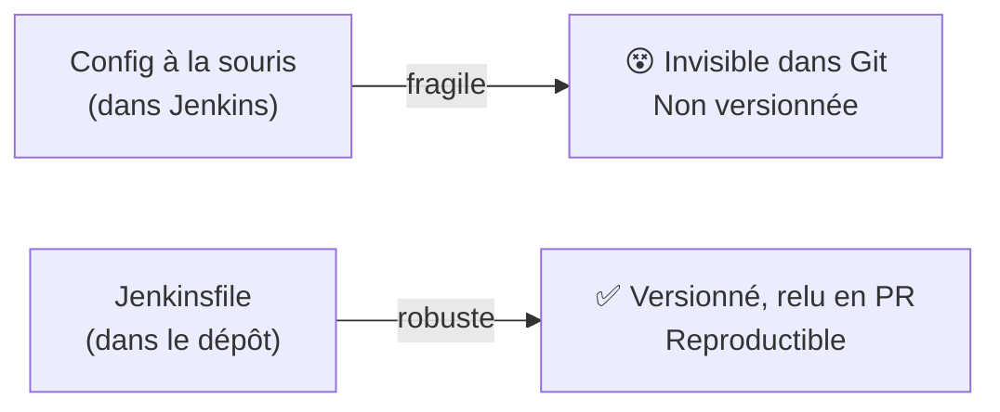
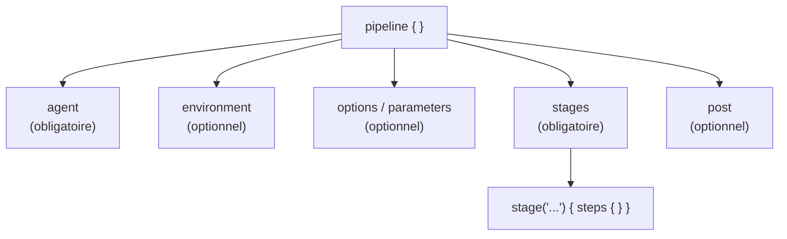
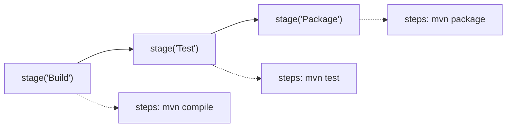
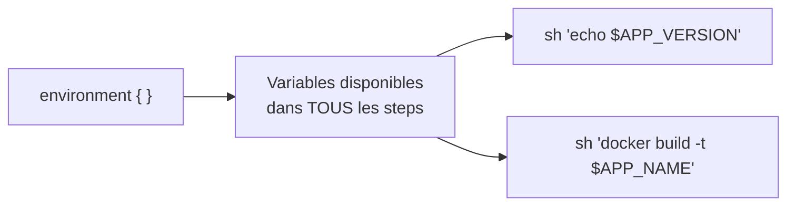
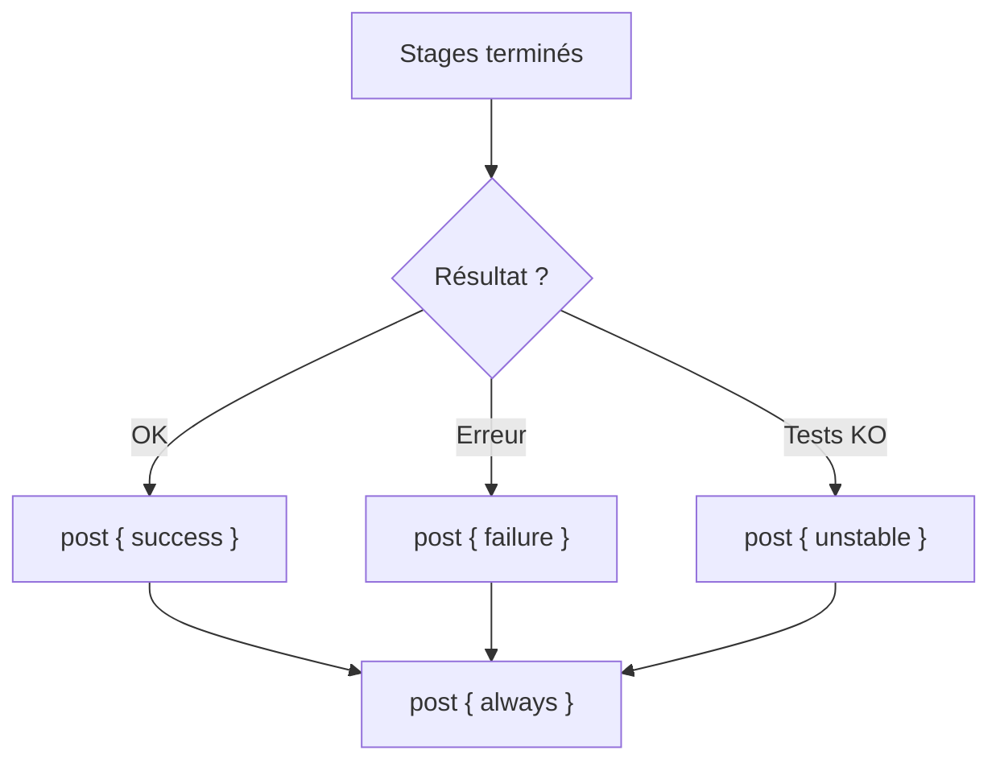
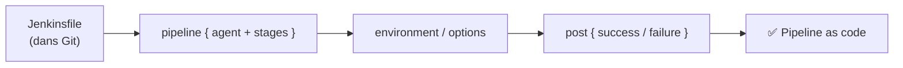

<a id="top"></a>

# 01 — Jenkinsfile déclaratif : le pipeline as code

## Table des matières

| # | Section |
|---|---|
| 1 | [Pourquoi un pipeline as code ?](#section-1) |
| 2 | [La structure d'un pipeline déclaratif](#section-2) |
| 3 | [Le bloc `agent`](#section-3) |
| 4 | [`stages` et `steps`](#section-4) |
| 5 | [La directive `environment`](#section-5) |
| 6 | [Les directives `options` et `parameters`](#section-6) |
| 7 | [Le bloc `post`](#section-7) |
| 8 | [Quiz — Jenkinsfile déclaratif](#section-8) |
| 9 | [Pratique — Écrire son premier Jenkinsfile](#section-9) |
| 10 | [Synthèse](#section-10) |

---

<a id="section-1"></a>

<details>
<summary>1 — Pourquoi un pipeline as code ?</summary>

<br/>

Avant Jenkins 2.0, on configurait les chaînes de build **à la souris**, écran par écran, dans l'interface web. Le problème : cette configuration vivait dans la base de données de Jenkins, **invisible** dans le dépôt Git, impossible à relire ou à versionner.

Le **pipeline as code** renverse cette logique : la définition complète du pipeline tient dans un fichier nommé **`Jenkinsfile`**, placé **à la racine du dépôt**, à côté du code source.



| Critère | Config UI (avant) | Jenkinsfile (pipeline as code) |
|---|---|---|
| Versionné dans Git | Non | Oui |
| Relu en revue de code | Non | Oui |
| Reproductible | Difficile | Oui |
| Historique des changements | Aucun | `git log` |

> _Le Jenkinsfile suit le code : si vous créez une branche, la branche embarque sa propre version du pipeline. Le build évolue **avec** le projet, jamais à côté._

Il existe deux syntaxes : la syntaxe **scriptée** (Groovy pur) et la syntaxe **déclarative**. Ce cours se concentre sur la **déclarative**, plus lisible, mieux structurée et recommandée pour la majorité des projets.

</details>

<p align="right"><a href="#top">↑ Retour en haut</a></p>

---

<a id="section-2"></a>

<details>
<summary>2 — La structure d'un pipeline déclaratif</summary>

<br/>

Tout pipeline déclaratif est enfermé dans un bloc **`pipeline { }`**. À l'intérieur, l'ordre et la hiérarchie des blocs sont imposés.

```groovy
pipeline {
    agent any                 // OÙ s'exécute le pipeline

    environment {             // variables partagées
        APP_VERSION = '1.0.0'
    }

    options {                 // comportements globaux
        timeout(time: 30, unit: 'MINUTES')
    }

    stages {                  // LES ÉTAPES (obligatoire)
        stage('Build') {
            steps {
                echo 'Compilation en cours...'
            }
        }
    }

    post {                    // actions de fin
        always {
            echo 'Pipeline terminé.'
        }
    }
}
```



| Bloc | Obligatoire ? | Rôle |
|---|---|---|
| `agent` | Oui | Où (quelle machine/conteneur) tourne le pipeline |
| `stages` | Oui | Contient les étapes (`stage`) |
| `steps` | Oui (dans chaque `stage`) | Les commandes concrètes |
| `environment` | Non | Variables d'environnement |
| `options` | Non | Comportements globaux (timeout, retry…) |
| `post` | Non | Actions de fin (succès, échec…) |

> _Deux blocs sont **obligatoires** : `agent` et `stages`. Sans eux, Jenkins refuse de valider le Jenkinsfile._

**🔧 Mini-exercice —** Écris le squelette minimal d'un pipeline déclaratif valide (uniquement les deux blocs obligatoires), avec un seul stage `Build` qui affiche un message.

<details>
<summary>✅ Voir une solution</summary>

```groovy
pipeline {
    agent any
    stages {
        stage('Build') {
            steps { echo 'Compilation...' }
        }
    }
}
```

</details>

</details>

<p align="right"><a href="#top">↑ Retour en haut</a></p>

---

<a id="section-3"></a>

<details>
<summary>3 — Le bloc `agent`</summary>

<br/>

Le bloc **`agent`** indique **où** s'exécute le pipeline : sur le contrôleur, sur un nœud (*node*) particulier, ou dans un conteneur Docker.

```groovy
pipeline {
    agent any          // n'importe quel agent disponible
    stages {
        stage('Test') {
            steps { sh 'echo Hello' }
        }
    }
}
```

| Forme | Signification |
|---|---|
| `agent any` | N'importe quel agent libre |
| `agent none` | Aucun agent global ; chaque `stage` choisit le sien |
| `agent { label 'linux' }` | Un agent portant l'étiquette `linux` |
| `agent { docker { image 'maven:3.9' } }` | Dans un conteneur Docker |

L'usage de Docker garantit un environnement **propre et identique** à chaque build :

```groovy
pipeline {
    agent {
        docker {
            image 'maven:3.9-eclipse-temurin-17'
            args '-v $HOME/.m2:/root/.m2'   // cache Maven réutilisé
        }
    }
    stages {
        stage('Build') {
            steps { sh 'mvn -B clean package' }
        }
    }
}
```

> _Avec `agent none` au niveau global, vous pouvez faire tourner chaque `stage` sur un agent différent : un agent Linux pour les tests, un agent Windows pour un build .NET, par exemple._

**🔧 Mini-exercice —** Écris un bloc `agent` qui fait tourner le pipeline dans un conteneur Docker `maven:3.9-eclipse-temurin-17`.

<details>
<summary>✅ Voir une solution</summary>

```groovy
agent {
    docker { image 'maven:3.9-eclipse-temurin-17' }
}
```

</details>

</details>

<p align="right"><a href="#top">↑ Retour en haut</a></p>

---

<a id="section-4"></a>

<details>
<summary>4 — `stages` et `steps`</summary>

<br/>

Le bloc **`stages`** contient une suite de **`stage`**, chacun représentant une **phase logique** du pipeline (Build, Test, Déploiement…). Chaque `stage` contient un bloc **`steps`** avec les commandes à exécuter.

```groovy
pipeline {
    agent any
    stages {
        stage('Build') {
            steps {
                sh 'mvn -B clean compile'
            }
        }
        stage('Test') {
            steps {
                sh 'mvn test'
            }
        }
        stage('Package') {
            steps {
                sh 'mvn package -DskipTests'
            }
        }
    }
}
```



**Steps courants :**

| Step | Rôle |
|---|---|
| `sh '...'` | Exécute une commande shell (Linux/macOS) |
| `bat '...'` | Exécute une commande batch (Windows) |
| `echo '...'` | Affiche un message dans le log |
| `checkout scm` | Récupère le code du dépôt |
| `archiveArtifacts` | Conserve un fichier produit (ex. `.jar`) |
| `junit` | Publie les rapports de tests |

**Exécution parallèle** — plusieurs `stage` peuvent tourner en même temps :

```groovy
stage('Tests') {
    parallel {
        stage('Tests unitaires')   { steps { sh 'mvn test' } }
        stage('Analyse qualité')   { steps { sh 'mvn verify -Psonar' } }
    }
}
```

> _Un `stage` regroupe une intention métier (« je compile », « je teste »), tandis qu'un `step` est une action technique unitaire. Bien découper ses stages rend le rapport de build immédiatement lisible._

**🔧 Mini-exercice —** Écris un stage `Package` qui exécute `mvn package` en sautant les tests.

<details>
<summary>✅ Voir une solution</summary>

```groovy
stage('Package') {
    steps {
        sh 'mvn -B package -DskipTests'
    }
}
```

</details>

</details>

<p align="right"><a href="#top">↑ Retour en haut</a></p>

---

<a id="section-5"></a>

<details>
<summary>5 — La directive `environment`</summary>

<br/>

Le bloc **`environment`** définit des **variables d'environnement** accessibles dans tous les `steps`. Pratique pour centraliser une version, un nom d'image ou un secret.

```groovy
pipeline {
    agent any
    environment {
        APP_NAME    = 'mon-api'
        APP_VERSION = '2.3.0'
        // Secret stocké dans les Credentials Jenkins
        DOCKER_PWD  = credentials('docker-hub-password')
    }
    stages {
        stage('Build') {
            steps {
                sh 'echo "Build de $APP_NAME version $APP_VERSION"'
            }
        }
    }
}
```

| Source de variable | Exemple | Usage |
|---|---|---|
| Valeur littérale | `APP_VERSION = '2.3.0'` | Constante du build |
| Secret Jenkins | `credentials('id-secret')` | Mot de passe, token |
| Variable intégrée | `${env.BUILD_NUMBER}` | Numéro du build courant |



> _N'écrivez **jamais** un mot de passe en clair dans le Jenkinsfile. Utilisez `credentials('...')` : Jenkins injecte le secret au moment du build et le **masque** automatiquement dans les logs._

</details>

<p align="right"><a href="#top">↑ Retour en haut</a></p>

---

<a id="section-6"></a>

<details>
<summary>6 — Les directives `options` et `parameters`</summary>

<br/>

### `options` — comportements globaux

```groovy
pipeline {
    agent any
    options {
        timeout(time: 20, unit: 'MINUTES')   // abandon si trop long
        retry(2)                              // 2 tentatives en cas d'échec
        timestamps()                          // horodatage dans les logs
        disableConcurrentBuilds()             // un seul build à la fois
        buildDiscarder(logRotator(numToKeepStr: '10'))  // garder 10 builds
    }
    stages {
        stage('Build') { steps { sh 'mvn package' } }
    }
}
```

| Option | Effet |
|---|---|
| `timeout(...)` | Abandonne le build au-delà d'une durée |
| `retry(n)` | Relance jusqu'à `n` fois en cas d'erreur |
| `timestamps()` | Préfixe chaque ligne de log par l'heure |
| `disableConcurrentBuilds()` | Empêche deux builds simultanés |
| `buildDiscarder(...)` | Limite l'historique conservé |

### `parameters` — saisies au lancement

```groovy
pipeline {
    agent any
    parameters {
        string(name: 'BRANCHE', defaultValue: 'main', description: 'Branche à construire')
        choice(name: 'ENV', choices: ['dev', 'staging', 'prod'], description: 'Cible de déploiement')
        booleanParam(name: 'SKIP_TESTS', defaultValue: false, description: 'Sauter les tests ?')
    }
    stages {
        stage('Info') {
            steps {
                echo "Branche : ${params.BRANCHE} — Env : ${params.ENV}"
            }
        }
    }
}
```

> _Un pipeline avec `parameters` affiche un bouton « Build with Parameters » : l'utilisateur saisit ses choix avant le lancement. Idéal pour choisir l'environnement de déploiement (dev / prod)._

</details>

<p align="right"><a href="#top">↑ Retour en haut</a></p>

---

<a id="section-7"></a>

<details>
<summary>7 — Le bloc `post`</summary>

<br/>

Le bloc **`post`** définit des actions exécutées **après** les stages, selon le résultat du build. C'est là qu'on place les notifications, le nettoyage ou l'archivage.

```groovy
pipeline {
    agent any
    stages {
        stage('Build') { steps { sh 'mvn package' } }
    }
    post {
        always {
            echo 'Nettoyage de l\'espace de travail...'
            cleanWs()
        }
        success {
            echo '✅ Build réussi !'
        }
        failure {
            echo '❌ Build en échec — notification envoyée.'
            // mail to: 'equipe@exemple.com', subject: 'Build KO'
        }
        unstable {
            echo '⚠️ Build instable (tests en échec).'
        }
    }
}
```



| Condition `post` | Quand elle se déclenche |
|---|---|
| `always` | Toujours, quel que soit le résultat |
| `success` | Build réussi |
| `failure` | Build en échec |
| `unstable` | Tests en échec (build « instable ») |
| `changed` | Le résultat diffère du build précédent |

> _Le bloc `always` est parfait pour le nettoyage (`cleanWs()`) ou la publication des rapports, car il s'exécute même si le build a planté._

**🔧 Mini-exercice —** Écris un bloc `post` qui affiche « Build OK » en cas de succès et nettoie toujours le workspace.

<details>
<summary>✅ Voir une solution</summary>

```groovy
post {
    success { echo 'Build OK' }
    always  { cleanWs() }
}
```

</details>

</details>

<p align="right"><a href="#top">↑ Retour en haut</a></p>

---

<a id="section-8"></a>

<details>
<summary>8 — Quiz — Jenkinsfile déclaratif</summary>

<br/>

**Question 1 :** Où doit se trouver le fichier `Jenkinsfile` ?

a) Dans le dossier d'installation de Jenkins

b) À la racine du dépôt Git, avec le code source

c) Dans la base de données de Jenkins

d) Dans le dossier `/tmp` de l'agent

<details>
<summary>💡 Voir la solution</summary>

✅ **Réponse : b)** — Le `Jenkinsfile` vit à la racine du dépôt, versionné avec le code. C'est tout l'intérêt du *pipeline as code*.

</details>

---

**Question 2 :** Quels sont les deux blocs **obligatoires** d'un pipeline déclaratif ?

a) `environment` et `post`

b) `options` et `parameters`

c) `agent` et `stages`

d) `steps` et `tools`

<details>
<summary>💡 Voir la solution</summary>

✅ **Réponse : c)** — `agent` (où) et `stages` (quoi) sont obligatoires. Sans eux, le Jenkinsfile n'est pas valide.

</details>

---

**Question 3 :** Comment injecter un mot de passe stocké dans Jenkins sans l'écrire en clair ?

a) `password('...')`

b) `secret('...')`

c) `credentials('...')`

d) `vault('...')`

<details>
<summary>💡 Voir la solution</summary>

✅ **Réponse : c)** — `credentials('id')` récupère un secret et le **masque** dans les logs. On ne met jamais de mot de passe en clair.

</details>

---

**Question 4 :** Quel bloc `post` s'exécute **toujours**, quel que soit le résultat ?

a) `success`

b) `failure`

c) `always`

d) `changed`

<details>
<summary>💡 Voir la solution</summary>

✅ **Réponse : c)** — `always` s'exécute dans tous les cas. Idéal pour le nettoyage et la publication des rapports.

</details>

---

**Question 5 :** À quoi sert `timeout(time: 20, unit: 'MINUTES')` dans `options` ?

a) À attendre 20 minutes avant de démarrer

b) À abandonner le build s'il dépasse 20 minutes

c) À relancer le build toutes les 20 minutes

d) À conserver 20 builds dans l'historique

<details>
<summary>💡 Voir la solution</summary>

✅ **Réponse : b)** — `timeout` fixe une durée maximale ; au-delà, Jenkins interrompt le build pour éviter qu'il ne bloque un agent.

</details>

</details>

<p align="right"><a href="#top">↑ Retour en haut</a></p>

---

<a id="section-9"></a>

<details>
<summary>9 — Pratique — Écrire son premier Jenkinsfile</summary>

<br/>

### Consigne

Rédigez un `Jenkinsfile` déclaratif qui :

1. S'exécute sur **n'importe quel agent**.
2. Définit une variable d'environnement `APP_VERSION = '1.0.0'`.
3. Fixe un **timeout global de 15 minutes**.
4. Contient trois stages : **Build**, **Test**, **Package** (commandes Maven).
5. Dans le bloc `post`, affiche un message en cas de **succès** et un autre en cas d'**échec**, et nettoie toujours l'espace de travail.

---

### Correction — Jenkinsfile complet attendu

```groovy
pipeline {
    agent any

    environment {
        APP_VERSION = '1.0.0'
    }

    options {
        timeout(time: 15, unit: 'MINUTES')
        timestamps()
    }

    stages {
        stage('Build') {
            steps {
                echo "Build de l'application version ${APP_VERSION}"
                sh 'mvn -B clean compile'
            }
        }
        stage('Test') {
            steps {
                sh 'mvn test'
            }
        }
        stage('Package') {
            steps {
                sh 'mvn package -DskipTests'
            }
        }
    }

    post {
        always {
            echo 'Nettoyage du workspace.'
            cleanWs()
        }
        success {
            echo "✅ Version ${APP_VERSION} construite avec succès."
        }
        failure {
            echo '❌ Échec du build — vérifiez les logs.'
        }
    }
}
```

**Résultat attendu dans Jenkins :**

```
[Pipeline] Start of Pipeline
[Pipeline] stage (Build)
[Build] + mvn -B clean compile
[Build] BUILD SUCCESS
[Pipeline] stage (Test)
[Test] + mvn test
[Test] Tests run: 12, Failures: 0
[Pipeline] stage (Package)
[Package] + mvn package -DskipTests
[Package] Building jar: target/mon-api-1.0.0.jar
[Pipeline] post
✅ Version 1.0.0 construite avec succès.
Nettoyage du workspace.
Finished: SUCCESS
```

> _Si les trois stages s'affichent en vert et que la mention « Finished: SUCCESS » apparaît, votre pipeline est correct. Vous pouvez maintenant le connecter à un vrai dépôt (leçon 02)._

</details>

<p align="right"><a href="#top">↑ Retour en haut</a></p>

---

<a id="section-10"></a>

<details>
<summary>10 — Synthèse</summary>

<br/>

#### Points à retenir

1. Le **pipeline as code** vit dans un **`Jenkinsfile`** versionné à la racine du dépôt.
2. La syntaxe **déclarative** s'organise autour de `pipeline { }`.
3. Deux blocs **obligatoires** : **`agent`** (où) et **`stages`** (quoi).
4. **`environment`** centralise les variables ; **`credentials('...')`** protège les secrets.
5. **`options`** règle le comportement global ; **`parameters`** demande des saisies au lancement.
6. **`post`** déclenche des actions de fin selon le résultat (`success`, `failure`, `always`…).



#### La suite

Leçon **02 — Pipeline CI/CD avec Git et Maven** : connecter le pipeline à un vrai dépôt, builder avec Maven et archiver les artefacts produits.

</details>

<p align="right"><a href="#top">↑ Retour en haut</a></p>

---

<p align="center">
  <em>Tous droits réservés. Toute reproduction, diffusion, utilisation ou adaptation de ce cours, en tout ou en partie, est strictement interdite sans l'autorisation écrite préalable de Dr. Haythem REHOUMA.</em>
</p>

<p align="center">
  <strong>Cours créé par Dr. Haythem REHOUMA — Développement et déploiement de solutions de données</strong>
</p>
