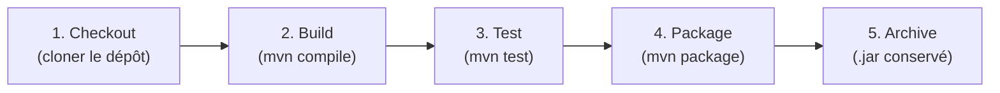
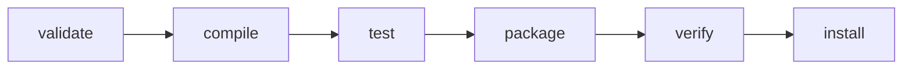
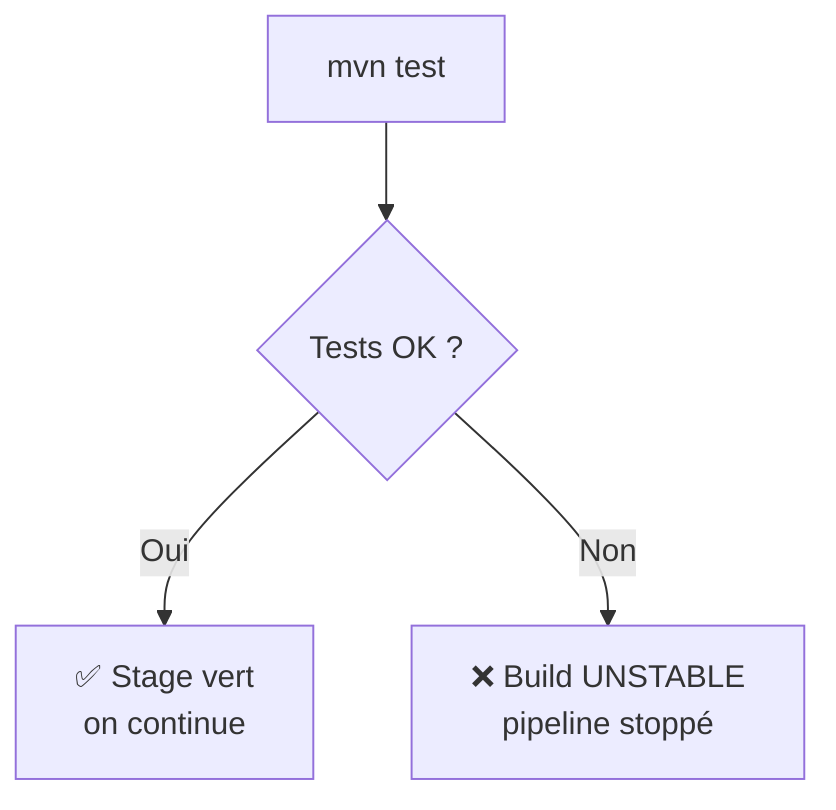
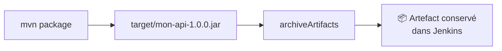
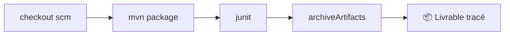

<a id="top"></a>

# 02 — Pipeline CI/CD avec Git et Maven

## Table des matières

| # | Section |
|---|---|
| 1 | [Le pipeline CI/CD vu d'ensemble](#section-1) |
| 2 | [Cloner le dépôt avec `checkout scm`](#section-2) |
| 3 | [Build Maven : `mvn package`](#section-3) |
| 4 | [Lancer les tests automatisés](#section-4) |
| 5 | [Publier les rapports de tests (JUnit)](#section-5) |
| 6 | [Archiver les artefacts](#section-6) |
| 7 | [Un pipeline complet de bout en bout](#section-7) |
| 8 | [Quiz — Pipeline Git et Maven](#section-8) |
| 9 | [Pratique — Pipeline Maven complet](#section-9) |
| 10 | [Synthèse](#section-10) |

---

<a id="section-1"></a>

<details>
<summary>1 — Le pipeline CI/CD vu d'ensemble</summary>

<br/>

Un pipeline **CI/CD** (*Continuous Integration / Continuous Delivery*) enchaîne automatiquement les étapes qui mènent du **code source** à un **artefact livrable**. Pour un projet Java/Maven typique, le flux est :



| Étape | Commande Maven | Produit |
|---|---|---|
| Récupérer le code | `checkout scm` | Sources dans le workspace |
| Compiler | `mvn compile` | Classes `.class` |
| Tester | `mvn test` | Rapports JUnit |
| Empaqueter | `mvn package` | Un `.jar` ou `.war` |
| Archiver | `archiveArtifacts` | Artefact conservé dans Jenkins |

> _L'intégration continue repose sur une idée simple : à chaque `push`, on **reconstruit et on reteste tout**. Un défaut est détecté en minutes, pas en jours._

</details>

<p align="right"><a href="#top">↑ Retour en haut</a></p>

---

<a id="section-2"></a>

<details>
<summary>2 — Cloner le dépôt avec `checkout scm`</summary>

<br/>

Quand le pipeline est défini par un `Jenkinsfile` du dépôt, Jenkins connaît déjà l'URL et la branche. Le step **`checkout scm`** récupère exactement la version qui a déclenché le build.

```groovy
pipeline {
    agent any
    stages {
        stage('Checkout') {
            steps {
                checkout scm
                sh 'ls -la'   // vérifier que les fichiers sont là
            }
        }
    }
}
```

Pour cloner un dépôt **explicitement** (URL et branche en dur) :

```groovy
stage('Checkout') {
    steps {
        git branch: 'main',
            url: 'https://github.com/exemple/mon-api.git'
    }
}
```

Avec un dépôt privé, on référence des **credentials** :

```groovy
stage('Checkout') {
    steps {
        git branch: 'main',
            url: 'https://github.com/exemple/api-privee.git',
            credentialsId: 'github-token'
    }
}
```

| Méthode | Quand l'utiliser |
|---|---|
| `checkout scm` | Jenkinsfile dans le dépôt (cas standard) |
| `git url: '...'` | Cloner un dépôt précis depuis le pipeline |
| `credentialsId: '...'` | Dépôt privé nécessitant une authentification |

> _Préférez toujours `checkout scm` : il récupère le bon commit (celui qui a déclenché le build), même sur une branche secondaire ou une *pull request*._

**🔧 Mini-exercice —** Écris un stage `Checkout` qui clone explicitement la branche `main` du dépôt `https://github.com/exemple/mon-api.git`.

<details>
<summary>✅ Voir une solution</summary>

```groovy
stage('Checkout') {
    steps {
        git branch: 'main', url: 'https://github.com/exemple/mon-api.git'
    }
}
```

</details>

</details>

<p align="right"><a href="#top">↑ Retour en haut</a></p>

---

<a id="section-3"></a>

<details>
<summary>3 — Build Maven : `mvn package`</summary>

<br/>

**Maven** est l'outil de build standard de l'écosystème Java. Son cycle de vie enchaîne des phases ; chaque phase déclenche les précédentes.



| Phase Maven | Action |
|---|---|
| `compile` | Compile le code source (`src/main`) |
| `test` | Compile et lance les tests (`src/test`) |
| `package` | Produit le `.jar`/`.war` dans `target/` |
| `verify` | Lance les tests d'intégration |
| `install` | Installe l'artefact dans le dépôt local `~/.m2` |

Le stage de build dans le Jenkinsfile :

```groovy
stage('Build') {
    steps {
        // -B = mode batch (pas de couleurs, logs propres pour le CI)
        sh 'mvn -B clean package'
    }
}
```

L'option **`-B`** (*batch mode*) est essentielle en CI : elle désactive l'interactivité et produit des logs lisibles. **`clean`** efface le dossier `target/` avant de reconstruire, garantissant un build propre.

> _`mvn package` déclenche automatiquement `compile` **et** `test`. Pour empaqueter sans rejouer les tests (par exemple après un stage de test séparé), ajoutez `-DskipTests`._

**🔧 Mini-exercice —** Écris un stage `Build` qui exécute `mvn clean package` en mode batch.

<details>
<summary>✅ Voir une solution</summary>

```groovy
stage('Build') {
    steps {
        sh 'mvn -B clean package'
    }
}
```

</details>

</details>

<p align="right"><a href="#top">↑ Retour en haut</a></p>

---

<a id="section-4"></a>

<details>
<summary>4 — Lancer les tests automatisés</summary>

<br/>

Les tests sont le cœur de l'intégration continue : un build qui passe **sans** tester ne prouve rien. Avec Maven, les tests unitaires (JUnit) tournent en phase `test`.

```groovy
stage('Test') {
    steps {
        sh 'mvn -B test'
    }
}
```

Exemple de test JUnit dans le projet :

```java
import org.junit.jupiter.api.Test;
import static org.junit.jupiter.api.Assertions.*;

class CalculatriceTest {
    @Test
    void additionner_deux_nombres() {
        Calculatrice c = new Calculatrice();
        assertEquals(5, c.additionner(2, 3));
    }
}
```

Sortie typique dans le log Jenkins :

```
[Test] -------------------------------------------------------
[Test]  T E S T S
[Test] -------------------------------------------------------
[Test] Running com.exemple.CalculatriceTest
[Test] Tests run: 4, Failures: 0, Errors: 0, Skipped: 0
[Test] BUILD SUCCESS
```



> _Si un test échoue, Maven retourne un code d'erreur ≠ 0. Jenkins marque alors le stage en rouge et **interrompt** le pipeline : inutile d'empaqueter du code cassé._

</details>

<p align="right"><a href="#top">↑ Retour en haut</a></p>

---

<a id="section-5"></a>

<details>
<summary>5 — Publier les rapports de tests (JUnit)</summary>

<br/>

Maven écrit les résultats de tests au format XML dans `target/surefire-reports/`. Le step **`junit`** les publie dans l'interface Jenkins, avec graphiques de tendance.

```groovy
stage('Test') {
    steps {
        sh 'mvn -B test'
    }
    post {
        always {
            // Publier même si des tests ont échoué
            junit 'target/surefire-reports/*.xml'
        }
    }
}
```

| Élément | Détail |
|---|---|
| Chemin | `target/surefire-reports/*.xml` |
| Plugin requis | JUnit Plugin |
| Bloc recommandé | `post { always { ... } }` |
| Bénéfice | Tendances, détail des échecs, durées |

> _Placez `junit` dans `post { always }` : ainsi les rapports sont publiés **même quand des tests échouent** — c'est précisément à ce moment qu'on en a le plus besoin._

**🔧 Mini-exercice —** Ajoute à un stage `Test` un bloc `post { always }` qui publie les rapports JUnit de Surefire.

<details>
<summary>✅ Voir une solution</summary>

```groovy
post {
    always {
        junit 'target/surefire-reports/*.xml'
    }
}
```

</details>

</details>

<p align="right"><a href="#top">↑ Retour en haut</a></p>

---

<a id="section-6"></a>

<details>
<summary>6 — Archiver les artefacts</summary>

<br/>

Le `.jar` produit par `mvn package` est l'**artefact** livrable. Le step **`archiveArtifacts`** le conserve dans Jenkins, téléchargeable depuis la page du build.

```groovy
stage('Archive') {
    steps {
        archiveArtifacts artifacts: 'target/*.jar',
                         fingerprint: true
    }
}
```



| Paramètre | Rôle |
|---|---|
| `artifacts: 'target/*.jar'` | Motif des fichiers à conserver |
| `fingerprint: true` | Empreinte unique pour traçabilité |
| `allowEmptyArchive: true` | N'échoue pas si aucun fichier trouvé |
| `onlyIfSuccessful: true` | Archive seulement si le build a réussi |

> _Le `fingerprint` permet de retrouver **dans quel build** un artefact précis a été produit, et **où** il a été utilisé ensuite. Indispensable pour la traçabilité des livraisons._

**🔧 Mini-exercice —** Écris un step qui archive tous les `.jar` du dossier `target/` avec la traçabilité activée.

<details>
<summary>✅ Voir une solution</summary>

```groovy
archiveArtifacts artifacts: 'target/*.jar', fingerprint: true
```

</details>

</details>

<p align="right"><a href="#top">↑ Retour en haut</a></p>

---

<a id="section-7"></a>

<details>
<summary>7 — Un pipeline complet de bout en bout</summary>

<br/>

Assemblons toutes les briques en un Jenkinsfile cohérent :

```groovy
pipeline {
    agent {
        docker { image 'maven:3.9-eclipse-temurin-17' }
    }

    options {
        timeout(time: 20, unit: 'MINUTES')
        timestamps()
    }

    stages {
        stage('Checkout') {
            steps {
                checkout scm
            }
        }

        stage('Build') {
            steps {
                sh 'mvn -B clean compile'
            }
        }

        stage('Test') {
            steps {
                sh 'mvn -B test'
            }
            post {
                always {
                    junit 'target/surefire-reports/*.xml'
                }
            }
        }

        stage('Package') {
            steps {
                sh 'mvn -B package -DskipTests'
            }
        }

        stage('Archive') {
            steps {
                archiveArtifacts artifacts: 'target/*.jar', fingerprint: true
            }
        }
    }

    post {
        success { echo '✅ Artefact prêt à être déployé.' }
        failure { echo '❌ Pipeline en échec.' }
    }
}
```

> _Ce pipeline est **idempotent** : `clean` repart de zéro à chaque fois. Le même `push` produit toujours le même résultat — c'est la définition de l'intégration continue fiable._

</details>

<p align="right"><a href="#top">↑ Retour en haut</a></p>

---

<a id="section-8"></a>

<details>
<summary>8 — Quiz — Pipeline Git et Maven</summary>

<br/>

**Question 1 :** Que fait `checkout scm` ?

a) Il compile le code

b) Il récupère le commit du dépôt qui a déclenché le build

c) Il archive le `.jar`

d) Il lance les tests

<details>
<summary>💡 Voir la solution</summary>

✅ **Réponse : b)** — `checkout scm` clone le dépôt à la bonne version (celle qui a déclenché le build), branche et commit inclus.

</details>

---

**Question 2 :** Pourquoi utilise-t-on `mvn -B` en CI ?

a) Pour builder plus vite

b) Pour activer les tests d'intégration

c) Pour le mode batch : pas d'interactivité, logs propres

d) Pour ignorer les erreurs

<details>
<summary>💡 Voir la solution</summary>

✅ **Réponse : c)** — `-B` (*batch mode*) désactive l'interactivité et la couleur, produisant des logs lisibles adaptés à un serveur CI.

</details>

---

**Question 3 :** Quelle phase Maven produit le `.jar` dans `target/` ?

a) `compile`

b) `validate`

c) `test`

d) `package`

<details>
<summary>💡 Voir la solution</summary>

✅ **Réponse : d)** — `package` empaquette le code compilé en `.jar`/`.war`. Elle déclenche au passage `compile` et `test`.

</details>

---

**Question 4 :** Où placer idéalement le step `junit` ?

a) Dans `post { always }` du stage de test

b) Avant `checkout scm`

c) Dans le bloc `environment`

d) Dans `options`

<details>
<summary>💡 Voir la solution</summary>

✅ **Réponse : a)** — Dans `post { always }`, les rapports sont publiés même quand des tests échouent — le moment où ils sont les plus utiles.

</details>

---

**Question 5 :** À quoi sert `fingerprint: true` dans `archiveArtifacts` ?

a) À chiffrer l'artefact

b) À tracer dans quel build l'artefact a été produit et utilisé

c) À compresser le fichier

d) À supprimer l'artefact après le build

<details>
<summary>💡 Voir la solution</summary>

✅ **Réponse : b)** — Le `fingerprint` est une empreinte unique qui assure la traçabilité de l'artefact à travers les builds.

</details>

</details>

<p align="right"><a href="#top">↑ Retour en haut</a></p>

---

<a id="section-9"></a>

<details>
<summary>9 — Pratique — Pipeline Maven complet</summary>

<br/>

### Consigne

Écrivez un `Jenkinsfile` qui, pour un projet Java/Maven :

1. Récupère le code avec `checkout scm`.
2. Compile avec `mvn -B clean compile`.
3. Lance les tests et **publie les rapports JUnit** (même en cas d'échec).
4. Empaquette avec `mvn package -DskipTests`.
5. **Archive** le `.jar` produit avec traçabilité (`fingerprint`).
6. Affiche un message de succès ou d'échec dans `post`.

---

### Correction — Jenkinsfile complet attendu

```groovy
pipeline {
    agent any

    options {
        timeout(time: 20, unit: 'MINUTES')
    }

    stages {
        stage('Checkout') {
            steps {
                checkout scm
            }
        }

        stage('Build') {
            steps {
                sh 'mvn -B clean compile'
            }
        }

        stage('Test') {
            steps {
                sh 'mvn -B test'
            }
            post {
                always {
                    junit 'target/surefire-reports/*.xml'
                }
            }
        }

        stage('Package') {
            steps {
                sh 'mvn -B package -DskipTests'
            }
        }

        stage('Archive') {
            steps {
                archiveArtifacts artifacts: 'target/*.jar', fingerprint: true
            }
        }
    }

    post {
        success { echo '✅ Pipeline réussi — artefact archivé.' }
        failure { echo '❌ Pipeline en échec — voir les logs.' }
    }
}
```

**Résultat attendu :**

```
✔ Checkout   (3 s)
✔ Build      (18 s)
✔ Test       (12 s)   Tests run: 14, Failures: 0
✔ Package    (9 s)    Building jar: target/mon-api-1.0.0.jar
✔ Archive    (1 s)    Archiving artifacts: target/mon-api-1.0.0.jar
✅ Pipeline réussi — artefact archivé.
Finished: SUCCESS
```

> _Cinq stages verts, un rapport de tests publié et un `.jar` téléchargeable depuis la page du build : c'est un pipeline d'intégration continue complet et professionnel._

</details>

<p align="right"><a href="#top">↑ Retour en haut</a></p>

---

<a id="section-10"></a>

<details>
<summary>10 — Synthèse</summary>

<br/>

#### Points à retenir

1. Un pipeline CI/CD enchaîne **checkout → build → test → package → archive**.
2. **`checkout scm`** récupère le bon commit du dépôt.
3. **`mvn -B clean package`** : mode batch, build propre, génère le `.jar`.
4. Les tests (`mvn test`) sont **bloquants** : un échec stoppe le pipeline.
5. **`junit`** dans `post { always }` publie les rapports même en cas d'échec.
6. **`archiveArtifacts ... fingerprint: true`** conserve et trace l'artefact livrable.



#### La suite

Leçon **03 — Déclencheurs** : faire démarrer le pipeline automatiquement via webhooks GitHub, polling SCM, builds périodiques et chaînes upstream/downstream.

</details>

<p align="right"><a href="#top">↑ Retour en haut</a></p>

---

<p align="center">
  <em>Tous droits réservés. Toute reproduction, diffusion, utilisation ou adaptation de ce cours, en tout ou en partie, est strictement interdite sans l'autorisation écrite préalable de Dr. Haythem REHOUMA.</em>
</p>

<p align="center">
  <strong>Cours créé par Dr. Haythem REHOUMA — Développement et déploiement de solutions de données</strong>
</p>
