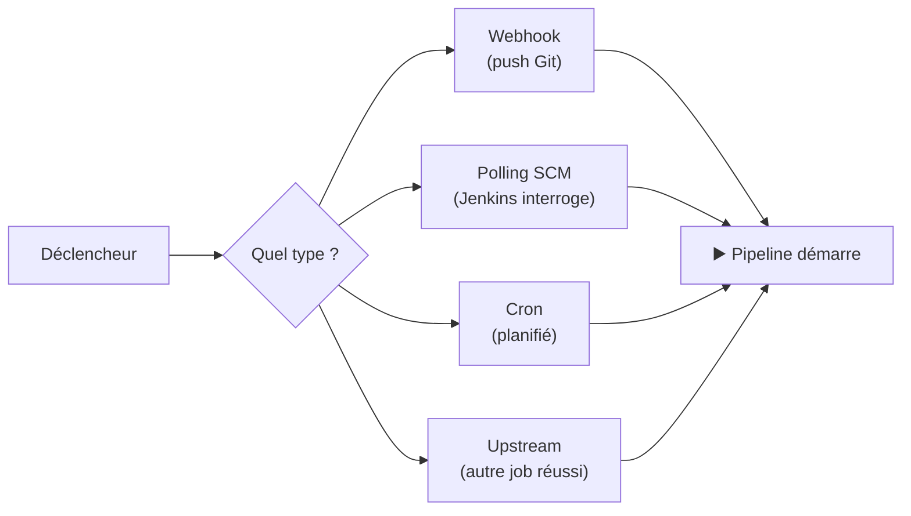
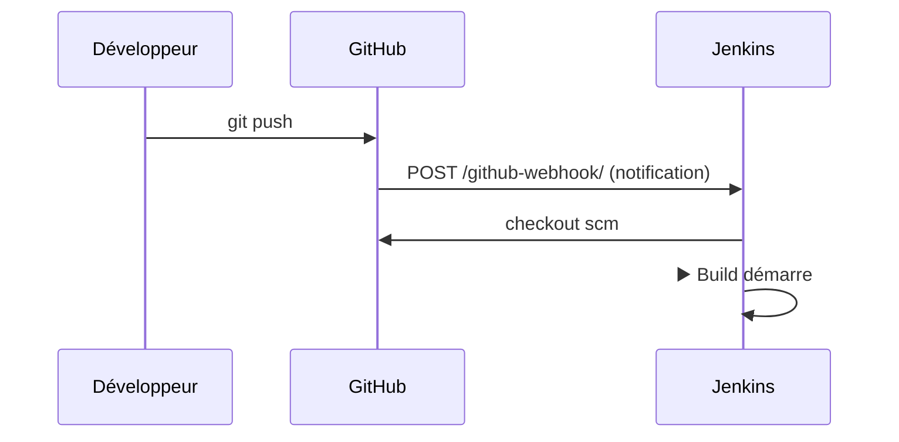
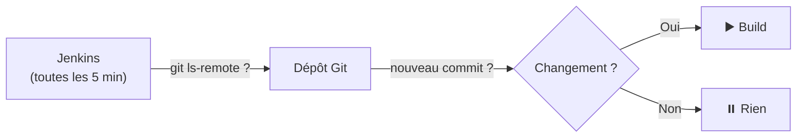
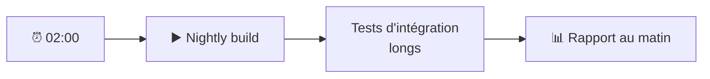
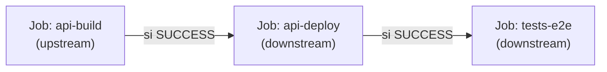
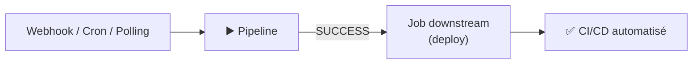

<a id="top"></a>

# 03 — Déclencheurs : automatiser le démarrage du pipeline

## Table des matières

| # | Section |
|---|---|
| 1 | [Pourquoi des déclencheurs ?](#section-1) |
| 2 | [Webhooks GitHub (le standard moderne)](#section-2) |
| 3 | [Polling SCM](#section-3) |
| 4 | [Build périodique (cron)](#section-4) |
| 5 | [La syntaxe cron de Jenkins](#section-5) |
| 6 | [Chaînes upstream / downstream](#section-6) |
| 7 | [Quiz — Déclencheurs](#section-7) |
| 8 | [Pratique — Configurer les déclencheurs](#section-8) |
| 9 | [Synthèse](#section-9) |

---

<a id="section-1"></a>

<details>
<summary>1 — Pourquoi des déclencheurs ?</summary>

<br/>

Un pipeline qu'on lance **à la main** n'apporte qu'une partie de la valeur de l'intégration continue. Le vrai gain vient de l'**automatisation du démarrage** : le build part **tout seul** dès qu'un événement le justifie.



| Déclencheur | Événement source | Réactivité |
|---|---|---|
| Webhook | `push` / *pull request* sur GitHub | Immédiate |
| Polling SCM | Jenkins interroge le dépôt | Selon l'intervalle |
| Cron | Horaire planifié | Planifiée |
| Upstream/downstream | Fin d'un autre job | À la fin du job amont |

> _La règle d'or du DevOps : « si vous le faites plus d'une fois à la main, automatisez-le ». Lancer un build manuellement à chaque `push` est exactement ce genre de tâche à éliminer._

</details>

<p align="right"><a href="#top">↑ Retour en haut</a></p>

---

<a id="section-2"></a>

<details>
<summary>2 — Webhooks GitHub (le standard moderne)</summary>

<br/>

Un **webhook** est une notification **poussée** : dès qu'un `push` arrive sur GitHub, GitHub envoie une requête HTTP à Jenkins, qui démarre le build **instantanément**. C'est la méthode la plus efficace.



**Côté Jenkinsfile**, on déclare le déclencheur :

```groovy
pipeline {
    agent any
    triggers {
        githubPush()   // démarre à chaque push GitHub
    }
    stages {
        stage('Build') {
            steps { sh 'mvn -B clean package' }
        }
    }
}
```

**Côté GitHub**, on configure le webhook : `Settings → Webhooks → Add webhook`

| Champ | Valeur |
|---|---|
| Payload URL | `https://mon-jenkins.exemple.com/github-webhook/` |
| Content type | `application/json` |
| Événements | *Just the push event* (ou *Pull requests*) |

> _Le webhook est **instantané** et ne génère aucun trafic inutile : rien ne se passe tant qu'il n'y a pas de `push`. C'est l'opposé exact du polling, qui interroge en permanence._

**🔧 Mini-exercice —** Ajoute un bloc `triggers` qui fait démarrer le pipeline à chaque `push` GitHub.

<details>
<summary>✅ Voir une solution</summary>

```groovy
triggers {
    githubPush()
}
```

</details>

</details>

<p align="right"><a href="#top">↑ Retour en haut</a></p>

---

<a id="section-3"></a>

<details>
<summary>3 — Polling SCM</summary>

<br/>

Le **polling SCM** inverse la logique : c'est **Jenkins** qui interroge périodiquement le dépôt pour détecter des changements. S'il y a du nouveau, il lance le build.

```groovy
pipeline {
    agent any
    triggers {
        // Vérifie le dépôt toutes les 5 minutes
        pollSCM('H/5 * * * *')
    }
    stages {
        stage('Build') {
            steps { sh 'mvn -B clean package' }
        }
    }
}
```



| Critère | Webhook | Polling SCM |
|---|---|---|
| Initiative | GitHub pousse | Jenkins interroge |
| Réactivité | Immédiate | Selon l'intervalle |
| Charge réseau | Nulle au repos | Requêtes régulières |
| Quand l'utiliser | Cas standard | Si webhook impossible (pare-feu) |

> _Le polling est un **plan B** : utile quand Jenkins est derrière un pare-feu et n'est pas joignable depuis GitHub. Sinon, le webhook est toujours préférable._

**🔧 Mini-exercice —** Écris un déclencheur `pollSCM` qui interroge le dépôt toutes les 10 minutes.

<details>
<summary>✅ Voir une solution</summary>

```groovy
triggers {
    pollSCM('H/10 * * * *')
}
```

</details>

</details>

<p align="right"><a href="#top">↑ Retour en haut</a></p>

---

<a id="section-4"></a>

<details>
<summary>4 — Build périodique (cron)</summary>

<br/>

Le **build périodique** lance le pipeline à heure fixe, **indépendamment** de tout changement de code. Idéal pour les builds nocturnes (*nightly builds*), les rapports planifiés ou les tests de non-régression complets.

```groovy
pipeline {
    agent any
    triggers {
        // Tous les jours à 2 h du matin
        cron('0 2 * * *')
    }
    stages {
        stage('Tests complets') {
            steps { sh 'mvn -B verify -Pintegration-tests' }
        }
    }
}
```

| Usage | Expression cron |
|---|---|
| Build nocturne (2 h) | `0 2 * * *` |
| Toutes les heures | `0 * * * *` |
| Chaque lundi à 8 h | `0 8 * * 1` |
| Toutes les 15 min | `H/15 * * * *` |



> _Différence clé : le **cron** se déclenche **par l'horloge**, le **polling** se déclenche **par un changement de code**. Le cron tourne même si personne n'a rien modifié._

**🔧 Mini-exercice —** Ajoute un déclencheur cron qui lance le pipeline chaque nuit à minuit.

<details>
<summary>✅ Voir une solution</summary>

```groovy
triggers {
    cron('0 0 * * *')
}
```

</details>

</details>

<p align="right"><a href="#top">↑ Retour en haut</a></p>

---

<a id="section-5"></a>

<details>
<summary>5 — La syntaxe cron de Jenkins</summary>

<br/>

Jenkins utilise une syntaxe cron à **cinq champs**, avec un opérateur spécial **`H`** (*hash*).

```
┌───────────── minute        (0-59)
│ ┌───────────── heure        (0-23)
│ │ ┌───────────── jour du mois (1-31)
│ │ │ ┌───────────── mois         (1-12)
│ │ │ │ ┌───────────── jour semaine (0-7, 0 et 7 = dimanche)
│ │ │ │ │
* * * * *
```

| Champ | Plage | Exemple |
|---|---|---|
| Minute | 0–59 | `30` = à la 30e minute |
| Heure | 0–23 | `14` = 14 h |
| Jour du mois | 1–31 | `1` = le 1er |
| Mois | 1–12 | `6` = juin |
| Jour de la semaine | 0–7 | `1` = lundi |

L'opérateur **`H`** répartit la charge : `H 2 * * *` choisit une minute **aléatoire mais stable** entre 0 et 59 à 2 h, pour éviter que tous les jobs partent à `02:00:00` pile.

```groovy
triggers {
    // H = minute hachée → évite les pics de charge
    cron('H 2 * * 1-5')   // jours ouvrés, vers 2 h
}
```

> _Préférez `H 2 * * *` à `0 2 * * *` : si 200 jobs sont planifiés à 2 h, `0` les fait tous démarrer simultanément (surcharge), tandis que `H` les étale dans l'heure._

**🔧 Mini-exercice —** Écris une expression cron qui lance le pipeline chaque lundi à 8 h, en utilisant `H` pour la minute.

<details>
<summary>✅ Voir une solution</summary>

```groovy
cron('H 8 * * 1')   // lundi vers 8 h, minute répartie
```

</details>

</details>

<p align="right"><a href="#top">↑ Retour en haut</a></p>

---

<a id="section-6"></a>

<details>
<summary>6 — Chaînes upstream / downstream</summary>

<br/>

On peut **enchaîner** des pipelines : un job **downstream** (aval) démarre quand un job **upstream** (amont) réussit. Utile pour séparer build et déploiement, ou pour orchestrer plusieurs projets dépendants.



**Déclencheur upstream** dans le job aval :

```groovy
pipeline {
    agent any
    triggers {
        // Démarre quand 'api-build' réussit
        upstream(upstreamProjects: 'api-build',
                 threshold: hudson.model.Result.SUCCESS)
    }
    stages {
        stage('Deploy') {
            steps { sh './deploy.sh' }
        }
    }
}
```

**Lancer explicitement un job aval** depuis le pipeline amont :

```groovy
stage('Déclencher le déploiement') {
    steps {
        build job: 'api-deploy', wait: false
    }
}
```

| Terme | Sens | Exemple |
|---|---|---|
| Upstream | Job **amont** (qui précède) | `api-build` |
| Downstream | Job **aval** (déclenché ensuite) | `api-deploy` |
| `threshold` | Condition de déclenchement | `SUCCESS` |

> _Les chaînes upstream/downstream permettent de découper un grand pipeline en jobs réutilisables : un même job `tests-e2e` peut être déclenché par plusieurs projets amont._

</details>

<p align="right"><a href="#top">↑ Retour en haut</a></p>

---

<a id="section-7"></a>

<details>
<summary>7 — Quiz — Déclencheurs</summary>

<br/>

**Question 1 :** Quel déclencheur démarre le build **instantanément** après un `push` ?

a) `pollSCM`

b) `cron`

c) `githubPush()` (webhook)

d) `upstream`

<details>
<summary>💡 Voir la solution</summary>

✅ **Réponse : c)** — Le webhook GitHub pousse une notification immédiate à Jenkins dès le `push`. Réactivité instantanée, zéro trafic au repos.

</details>

---

**Question 2 :** Quelle est la différence entre webhook et polling SCM ?

a) Aucune, ce sont des synonymes

b) Le webhook est poussé par GitHub ; le polling est tiré par Jenkins

c) Le polling est plus rapide que le webhook

d) Le webhook ne fonctionne qu'avec Maven

<details>
<summary>💡 Voir la solution</summary>

✅ **Réponse : b)** — Avec le webhook, GitHub **pousse** la notification ; avec le polling, Jenkins **interroge** périodiquement le dépôt.

</details>

---

**Question 3 :** Que fait l'expression cron `0 2 * * *` ?

a) Toutes les 2 minutes

b) Tous les jours à 2 h du matin

c) Le 2 de chaque mois

d) Deux fois par jour

<details>
<summary>💡 Voir la solution</summary>

✅ **Réponse : b)** — Minute 0, heure 2, tous les jours/mois/jours de semaine → chaque jour à 02:00.

</details>

---

**Question 4 :** Pourquoi préférer `H 2 * * *` à `0 2 * * *` ?

a) C'est plus rapide

b) `H` répartit le démarrage dans l'heure pour éviter les pics de charge

c) `H` signifie « haute priorité »

d) Les deux sont identiques

<details>
<summary>💡 Voir la solution</summary>

✅ **Réponse : b)** — `H` (*hash*) choisit une minute stable mais répartie, évitant que tous les jobs partent à la même seconde.

</details>

---

**Question 5 :** Un job `api-deploy` qui démarre après le succès de `api-build` est :

a) Un job upstream de `api-build`

b) Un job downstream de `api-build`

c) Un webhook

d) Un build périodique

<details>
<summary>💡 Voir la solution</summary>

✅ **Réponse : b)** — `api-deploy` est en **aval** (downstream) : il est déclenché par le succès de `api-build`, qui est en **amont** (upstream).

</details>

</details>

<p align="right"><a href="#top">↑ Retour en haut</a></p>

---

<a id="section-8"></a>

<details>
<summary>8 — Pratique — Configurer les déclencheurs</summary>

<br/>

### Consigne

Écrivez un `Jenkinsfile` qui combine **plusieurs déclencheurs** :

1. Démarre à chaque **push GitHub** (webhook).
2. Lance aussi un **build nocturne** réparti vers 2 h, du lundi au vendredi.
3. À la fin, **déclenche** un job aval nommé `api-deploy` (sans attendre sa fin), uniquement en cas de succès.
4. Le pipeline contient un stage Build (`mvn package`).

---

### Correction — Jenkinsfile complet attendu

```groovy
pipeline {
    agent any

    triggers {
        githubPush()              // 1. webhook : à chaque push
        cron('H 2 * * 1-5')       // 2. nightly réparti, jours ouvrés
    }

    stages {
        stage('Build') {
            steps {
                checkout scm
                sh 'mvn -B clean package'
            }
        }
    }

    post {
        success {
            echo '✅ Build réussi — déclenchement du déploiement.'
            // 3. job aval, sans bloquer le pipeline courant
            build job: 'api-deploy', wait: false
        }
        failure {
            echo '❌ Build en échec — déploiement non déclenché.'
        }
    }
}
```

**Résultat attendu :**

```
Started by GitHub push by jdupont
✔ Build   (22 s)   Building jar: target/api-1.0.0.jar
✅ Build réussi — déclenchement du déploiement.
Scheduling project: api-deploy
Finished: SUCCESS
```

> _Le pipeline réagit désormais à trois situations : un `push` (webhook), l'horloge (cron nocturne), et enchaîne automatiquement sur `api-deploy` en cas de succès. C'est une orchestration CI/CD complète._

</details>

<p align="right"><a href="#top">↑ Retour en haut</a></p>

---

<a id="section-9"></a>

<details>
<summary>9 — Synthèse</summary>

<br/>

#### Points à retenir

1. Un **déclencheur** lance le pipeline automatiquement, sans intervention manuelle.
2. Le **webhook** (`githubPush()`) est instantané : GitHub pousse la notification au `push`.
3. Le **polling SCM** (`pollSCM`) est un plan B : Jenkins interroge le dépôt à intervalle régulier.
4. Le **cron** (`cron('H 2 * * *')`) déclenche par l'horloge — idéal pour les builds nocturnes.
5. L'opérateur **`H`** répartit la charge et évite les démarrages simultanés.
6. Les chaînes **upstream/downstream** enchaînent des jobs (build → deploy → tests).



#### La suite

Leçon **04 — Visualisation du pipeline** : suivre l'exécution avec Stage View et Blue Ocean, lire le statut des stages, les logs et les indicateurs de durée et d'échec.

</details>

<p align="right"><a href="#top">↑ Retour en haut</a></p>

---

<p align="center">
  <em>Tous droits réservés. Toute reproduction, diffusion, utilisation ou adaptation de ce cours, en tout ou en partie, est strictement interdite sans l'autorisation écrite préalable de Dr. Haythem REHOUMA.</em>
</p>

<p align="center">
  <strong>Cours créé par Dr. Haythem REHOUMA — Développement et déploiement de solutions de données</strong>
</p>
