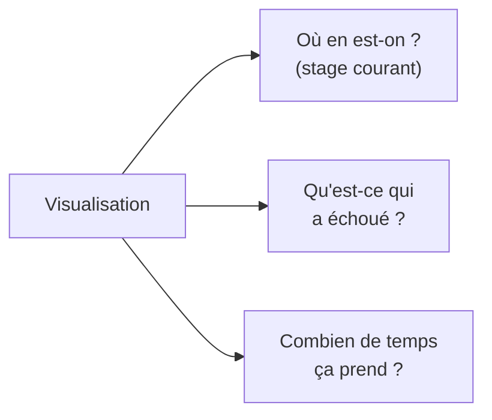
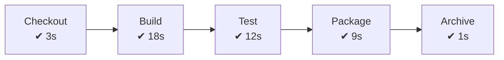
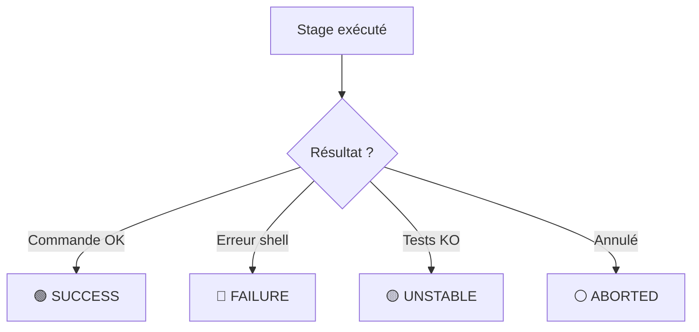
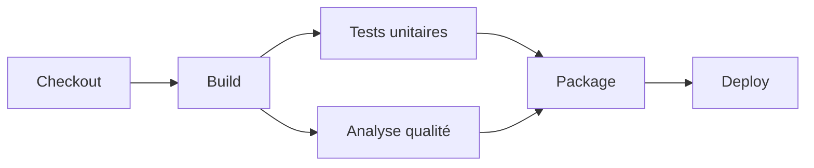
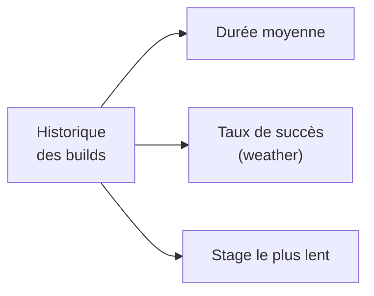
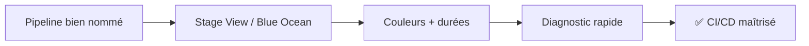

<a id="top"></a>

# 04 — Visualisation du pipeline : Stage View et Blue Ocean

## Table des matières

| # | Section |
|---|---|
| 1 | [Pourquoi visualiser un pipeline ?](#section-1) |
| 2 | [Stage View : la vue par étapes](#section-2) |
| 3 | [Statut et couleurs des stages](#section-3) |
| 4 | [Lire les logs d'un stage](#section-4) |
| 5 | [Blue Ocean : l'interface moderne](#section-5) |
| 6 | [Durées, tendances et détection d'échec](#section-6) |
| 7 | [Quiz — Visualisation](#section-7) |
| 8 | [Pratique — Pipeline lisible et diagnostiquable](#section-8) |
| 9 | [Synthèse](#section-9) |

---

<a id="section-1"></a>

<details>
<summary>1 — Pourquoi visualiser un pipeline ?</summary>

<br/>

Un pipeline qui tourne sans qu'on puisse **voir où il en est** est une boîte noire. La visualisation répond à trois questions essentielles :



| Question | Outil de réponse |
|---|---|
| Quel stage tourne maintenant ? | Stage View / Blue Ocean |
| Quel stage a échoué et pourquoi ? | Logs du stage |
| Le build ralentit-il ? | Indicateurs de durée |
| Le projet est-il stable ? | Graphe de tendances |

> _Un bon pipeline ne se contente pas de fonctionner : il **raconte** son exécution. Dès qu'un build échoue, on doit pouvoir pointer le stage fautif en quelques secondes._

</details>

<p align="right"><a href="#top">↑ Retour en haut</a></p>

---

<a id="section-2"></a>

<details>
<summary>2 — Stage View : la vue par étapes</summary>

<br/>

La **Stage View** est la vue intégrée à Jenkins. Elle affiche une **grille** : chaque colonne est un `stage`, chaque ligne un build récent. On y lit l'historique des dernières exécutions d'un coup d'œil.

```
              Checkout   Build    Test     Package   Archive
  #42  ✔ 3s      ✔ 18s    ✔ 12s    ✔ 9s      ✔ 1s     ← SUCCESS
  #41  ✔ 3s      ✔ 17s    ✘ 14s    --        --        ← FAILED (Test)
  #40  ✔ 4s      ✔ 19s    ✔ 11s    ✔ 10s     ✔ 1s     ← SUCCESS
```

Le **nom** affiché vient directement de votre Jenkinsfile : soignez vos `stage('...')`.

```groovy
stages {
    stage('Checkout')  { steps { checkout scm } }
    stage('Build')     { steps { sh 'mvn -B compile' } }
    stage('Test')      { steps { sh 'mvn -B test' } }
    stage('Package')   { steps { sh 'mvn -B package -DskipTests' } }
    stage('Archive')   { steps { archiveArtifacts 'target/*.jar' } }
}
```



> _Chaque cellule de la Stage View affiche la **durée** du stage. Si une colonne se met soudain à clignoter en rouge, vous savez instantanément quel stage investiguer._

**🔧 Mini-exercice —** Renomme un stage générique en un nom clair lisible dans la Stage View : écris un stage nommé `Déploiement staging` qui lance `./deploy.sh staging`.

<details>
<summary>✅ Voir une solution</summary>

```groovy
stage('Déploiement staging') {
    steps { sh './deploy.sh staging' }
}
```

</details>

</details>

<p align="right"><a href="#top">↑ Retour en haut</a></p>

---

<a id="section-3"></a>

<details>
<summary>3 — Statut et couleurs des stages</summary>

<br/>

Jenkins code le résultat de chaque stage et de chaque build par une **couleur** et une **icône**.

| Couleur | Statut | Signification |
|---|---|---|
| 🟢 Vert | SUCCESS | Tout s'est bien passé |
| 🔴 Rouge | FAILURE | Une commande a échoué |
| 🟡 Jaune | UNSTABLE | Build OK mais tests en échec |
| ⚪ Gris | ABORTED / NOT_BUILT | Annulé ou non exécuté |
| 🔵 Bleu (clignotant) | IN_PROGRESS | En cours d'exécution |



La distinction **FAILURE vs UNSTABLE** est importante :

- **FAILURE** (rouge) : une commande a renvoyé un code d'erreur (compilation cassée, script planté). Le pipeline **s'arrête**.
- **UNSTABLE** (jaune) : le build a fini, mais des tests ont échoué (publiés via `junit`). On peut choisir de continuer ou non.

> _Un stage jaune (UNSTABLE) signale « ça compile, mais des tests sont rouges ». Un stage rouge (FAILURE) signale « ça ne s'est même pas terminé ». Ne les confondez pas en diagnostic._

**🔧 Mini-exercice —** Écris un bloc `post` qui affiche un message différent pour les statuts `failure` (rouge) et `unstable` (jaune).

<details>
<summary>✅ Voir une solution</summary>

```groovy
post {
    failure  { echo '🔴 Une commande a échoué.' }
    unstable { echo '🟡 Des tests sont en échec.' }
}
```

</details>

</details>

<p align="right"><a href="#top">↑ Retour en haut</a></p>

---

<a id="section-4"></a>

<details>
<summary>4 — Lire les logs d'un stage</summary>

<br/>

Quand un stage échoue, le diagnostic se fait dans les **logs**. Dans la Stage View, un clic sur une cellule rouge ouvre le log **de ce stage uniquement** — bien plus rapide que parcourir tout le log console.

Exemple de log d'un stage Test en échec :

```
[Test] + mvn -B test
[Test] -------------------------------------------------------
[Test]  T E S T S
[Test] -------------------------------------------------------
[Test] Running com.exemple.PanierTest
[Test] Tests run: 5, Failures: 1, Errors: 0, Skipped: 0
[Test]
[Test] FAILED: ajouterArticle_augmenteLeTotal
[Test]   expected: <30.0> but was: <25.0>
[Test] BUILD FAILURE
```

Pour rendre vos logs plus lisibles, ajoutez des repères avec `echo` et activez l'horodatage :

```groovy
pipeline {
    agent any
    options { timestamps() }   // chaque ligne préfixée par l'heure
    stages {
        stage('Test') {
            steps {
                echo '=== Lancement des tests unitaires ==='
                sh 'mvn -B test'
                echo '=== Tests terminés ==='
            }
        }
    }
}
```

| Technique | Bénéfice |
|---|---|
| `timestamps()` | Mesurer où le temps est passé |
| `echo` de repères | Délimiter visuellement les étapes |
| Clic sur cellule | Voir le log d'un seul stage |
| `ansiColor('xterm')` | Couleurs préservées dans le log |

> _Astuce de diagnostic : la dernière ligne avant `BUILD FAILURE` indique presque toujours la cause réelle de l'échec. Remontez le log à partir de là._

**🔧 Mini-exercice —** Active l'horodatage des logs et encadre l'exécution des tests par deux `echo` repères dans un stage `Test`.

<details>
<summary>✅ Voir une solution</summary>

```groovy
options { timestamps() }
// ...
stage('Test') {
    steps {
        echo '=== Début des tests ==='
        sh 'mvn -B test'
        echo '=== Fin des tests ==='
    }
}
```

</details>

</details>

<p align="right"><a href="#top">↑ Retour en haut</a></p>

---

<a id="section-5"></a>

<details>
<summary>5 — Blue Ocean : l'interface moderne</summary>

<br/>

**Blue Ocean** est une interface alternative de Jenkins, pensée pour les pipelines. Elle affiche un **diagramme horizontal** clair, avec les stages parallèles côte à côte et une navigation fluide dans les logs.



| Atout de Blue Ocean | Détail |
|---|---|
| Diagramme visuel | Stages et parallélismes représentés graphiquement |
| Logs par étape | Clic sur un stage → ses logs filtrés |
| Vue des branches | Statut de chaque branche / PR |
| Éditeur visuel | Création de pipeline à la souris (puis export Jenkinsfile) |

On y accède via le bouton **« Open Blue Ocean »** dans le menu de gauche, ou directement par l'URL `https://mon-jenkins/blue/`.

Les stages **parallèles** (vus en leçon 01) y sont particulièrement lisibles :

```groovy
stage('Vérifications') {
    parallel {
        stage('Tests unitaires') { steps { sh 'mvn test' } }
        stage('Analyse qualité') { steps { sh 'mvn verify -Psonar' } }
    }
}
```

> _Blue Ocean ne remplace pas la Stage View : c'est une **vue alternative** sur le même pipeline. Beaucoup d'équipes l'utilisent pour le suivi quotidien grâce à sa lisibilité supérieure._

**🔧 Mini-exercice —** Écris un stage `Vérifications` qui lance en parallèle les tests unitaires et l'analyse qualité (lisible côte à côte dans Blue Ocean).

<details>
<summary>✅ Voir une solution</summary>

```groovy
stage('Vérifications') {
    parallel {
        stage('Tests unitaires') { steps { sh 'mvn -B test' } }
        stage('Analyse qualité') { steps { sh 'mvn -B verify -Psonar' } }
    }
}
```

</details>

</details>

<p align="right"><a href="#top">↑ Retour en haut</a></p>

---

<a id="section-6"></a>

<details>
<summary>6 — Durées, tendances et détection d'échec</summary>

<br/>

Au-delà du build courant, Jenkins agrège des **indicateurs** sur l'historique : durée moyenne, tendance de succès, stages les plus lents.



| Indicateur | Où le lire | À quoi il sert |
|---|---|---|
| Durée par stage | Stage View / Blue Ocean | Repérer un ralentissement |
| Tendance (météo ☀️🌧️) | Page du job | Santé globale du projet |
| Graphe de tests | Plugin JUnit | Évolution du nombre de tests/échecs |
| « Build Time Trend » | Menu du job | Évolution de la durée totale |

L'icône **« météo »** résume la stabilité : ☀️ (builds récents OK) à 🌧️ (échecs fréquents). Un projet sain doit afficher du soleil.

Pour exploiter ces données, instrumentez le pipeline :

```groovy
post {
    always {
        junit 'target/surefire-reports/*.xml'   // alimente le graphe de tests
    }
    failure {
        echo "Build #${env.BUILD_NUMBER} en échec — voir la Stage View."
    }
}
```

> _Surveillez la **tendance de durée** : un pipeline qui passe lentement de 4 à 12 minutes signale souvent un test qui grossit ou un cache mal configuré. La visualisation transforme cette dérive invisible en alerte visible._

</details>

<p align="right"><a href="#top">↑ Retour en haut</a></p>

---

<a id="section-7"></a>

<details>
<summary>7 — Quiz — Visualisation</summary>

<br/>

**Question 1 :** Que représente une colonne dans la Stage View ?

a) Un build complet

b) Un `stage` du pipeline

c) Un agent Jenkins

d) Une branche Git

<details>
<summary>💡 Voir la solution</summary>

✅ **Réponse : b)** — Chaque colonne correspond à un `stage` ; chaque ligne, à un build récent. Le nom vient de votre `stage('...')`.

</details>

---

**Question 2 :** Quelle est la différence entre un stage 🔴 FAILURE et un stage 🟡 UNSTABLE ?

a) Aucune

b) FAILURE = commande en erreur (arrêt) ; UNSTABLE = tests en échec

c) UNSTABLE est plus grave que FAILURE

d) UNSTABLE concerne le réseau

<details>
<summary>💡 Voir la solution</summary>

✅ **Réponse : b)** — FAILURE = une commande a renvoyé une erreur, le pipeline s'arrête. UNSTABLE = le build a fini mais des tests sont rouges.

</details>

---

**Question 3 :** Qu'est-ce que Blue Ocean ?

a) Un plugin de notification email

b) Une interface moderne de visualisation des pipelines

c) Un outil de build remplaçant Maven

d) Un système de stockage d'artefacts

<details>
<summary>💡 Voir la solution</summary>

✅ **Réponse : b)** — Blue Ocean est une interface alternative, plus visuelle, pour suivre les pipelines (diagramme horizontal, logs par stage).

</details>

---

**Question 4 :** Que fait `options { timestamps() }` pour la visualisation ?

a) Affiche l'heure devant chaque ligne de log

b) Accélère le build

c) Archive les logs

d) Envoie une notification

<details>
<summary>💡 Voir la solution</summary>

✅ **Réponse : a)** — `timestamps()` horodate chaque ligne, ce qui permet de mesurer où le temps est consommé dans un stage.

</details>

---

**Question 5 :** Que signale l'icône « météo » 🌧️ d'un job ?

a) Que le serveur est en panne

b) Que les builds récents échouent souvent (santé dégradée)

c) Qu'il pleut au datacenter

d) Que le build est en cours

<details>
<summary>💡 Voir la solution</summary>

✅ **Réponse : b)** — La météo résume la stabilité récente : ☀️ = builds sains, 🌧️ = échecs fréquents à investiguer.

</details>

</details>

<p align="right"><a href="#top">↑ Retour en haut</a></p>

---

<a id="section-8"></a>

<details>
<summary>8 — Pratique — Pipeline lisible et diagnostiquable</summary>

<br/>

### Consigne

Écrivez un `Jenkinsfile` **optimisé pour la visualisation** :

1. Active l'**horodatage** des logs.
2. Découpe le travail en stages **clairement nommés** (Checkout, Build, Vérifications).
3. Le stage « Vérifications » lance **en parallèle** les tests unitaires et l'analyse qualité.
4. Publie les rapports **JUnit** pour alimenter le graphe de tendances.
5. Dans `post`, distingue les messages **succès / instable / échec**.

---

### Correction — Jenkinsfile complet attendu

```groovy
pipeline {
    agent any

    options {
        timestamps()
        timeout(time: 20, unit: 'MINUTES')
    }

    stages {
        stage('Checkout') {
            steps {
                checkout scm
            }
        }

        stage('Build') {
            steps {
                echo '=== Compilation ==='
                sh 'mvn -B clean compile'
            }
        }

        stage('Vérifications') {
            parallel {
                stage('Tests unitaires') {
                    steps { sh 'mvn -B test' }
                    post {
                        always {
                            junit 'target/surefire-reports/*.xml'
                        }
                    }
                }
                stage('Analyse qualité') {
                    steps { sh 'mvn -B verify -Psonar -DskipTests' }
                }
            }
        }

        stage('Package') {
            steps {
                sh 'mvn -B package -DskipTests'
                archiveArtifacts artifacts: 'target/*.jar', fingerprint: true
            }
        }
    }

    post {
        success  { echo '🟢 Pipeline vert — tout est OK.' }
        unstable { echo '🟡 Pipeline instable — des tests ont échoué.' }
        failure  { echo '🔴 Pipeline rouge — une commande a échoué.' }
    }
}
```

**Résultat attendu dans la Stage View :**

```
              Checkout   Build    Vérifications        Package
                                  ┌ Tests unitaires ┐
  #18  ✔ 3s      ✔ 17s    │ ✔ 12s  │ ✔ 9s         │  ✔ 8s   🟢 SUCCESS
                                  └ Analyse qualité ┘
```

> _Dans Blue Ocean, le stage « Vérifications » s'affiche avec ses deux branches parallèles côte à côte. En cas d'échec d'un seul des deux, vous voyez immédiatement lequel — c'est tout le bénéfice d'un pipeline pensé pour la visualisation._

</details>

<p align="right"><a href="#top">↑ Retour en haut</a></p>

---

<a id="section-9"></a>

<details>
<summary>9 — Synthèse</summary>

<br/>

#### Points à retenir

1. La **Stage View** affiche une grille stages × builds, avec durées et couleurs.
2. Les couleurs codent le statut : 🟢 SUCCESS, 🔴 FAILURE, 🟡 UNSTABLE, ⚪ ABORTED.
3. **FAILURE** = commande en erreur (arrêt) ; **UNSTABLE** = tests rouges (build fini).
4. Cliquer un stage ouvre **ses** logs ; `timestamps()` aide à localiser les lenteurs.
5. **Blue Ocean** offre une vue moderne, idéale pour les stages parallèles.
6. Les **tendances** (durée, météo, graphe de tests) révèlent les dérives invisibles.



#### La suite

Vous maîtrisez désormais le cycle complet : Jenkinsfile déclaratif, pipeline Git/Maven, déclencheurs automatiques et visualisation. Le module suivant aborde le **déploiement** des artefacts produits (conteneurs, environnements cibles).

</details>

<p align="right"><a href="#top">↑ Retour en haut</a></p>

---

<p align="center">
  <em>Tous droits réservés. Toute reproduction, diffusion, utilisation ou adaptation de ce cours, en tout ou en partie, est strictement interdite sans l'autorisation écrite préalable de Dr. Haythem REHOUMA.</em>
</p>

<p align="center">
  <strong>Cours créé par Dr. Haythem REHOUMA — Développement et déploiement de solutions de données</strong>
</p>
