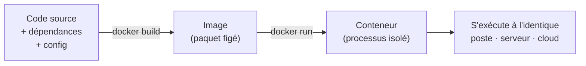
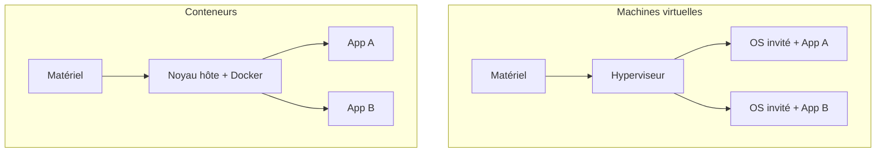
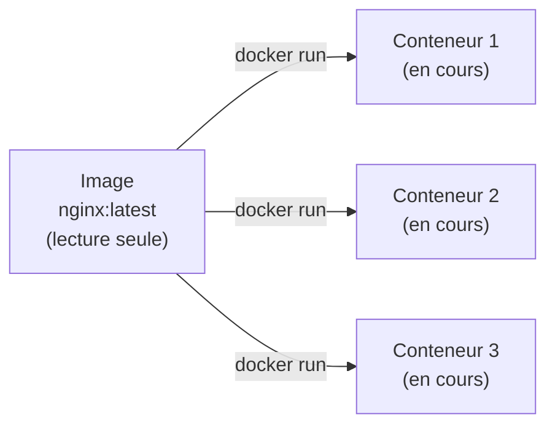
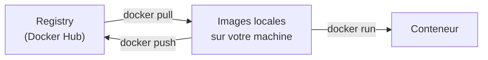
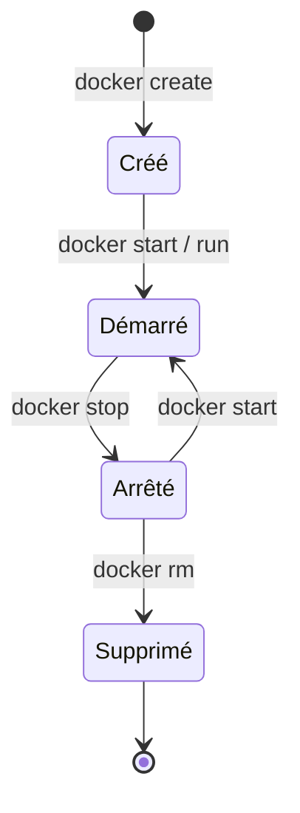
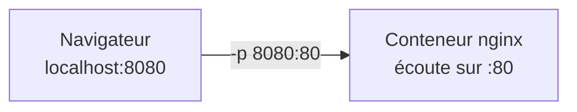
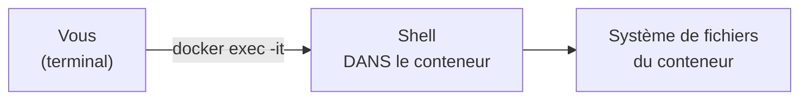
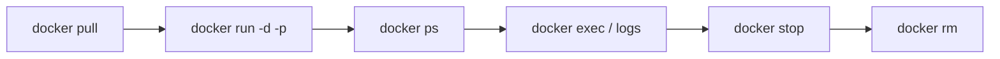

<a id="top"></a>

# 01 — Images et conteneurs

## Table des matières

| # | Section |
|---|---|
| 1 | [Le problème que Docker résout](#section-1) |
| 2 | [Conteneurs vs machines virtuelles](#section-2) |
| 3 | [Image vs conteneur](#section-3) |
| 4 | [Le registry (Docker Hub)](#section-4) |
| 5 | [Cycle de vie d'un conteneur](#section-5) |
| 6 | [Les commandes de base](#section-6) |
| 7 | [Entrer dans un conteneur avec exec](#section-7) |
| 8 | [Quiz — Images et conteneurs](#section-8) |
| 9 | [Pratique — Premier conteneur](#section-9) |
| 10 | [Synthèse](#section-10) |

---

<a id="section-1"></a>

<details>
<summary>1 — Le problème que Docker résout</summary>

<br/>

La phrase la plus célèbre du déploiement logiciel est : **« Pourtant, ça marche sur ma machine ! »**. Une application dépend d'une version précise de Python, d'une bibliothèque système, d'une variable d'environnement… et ce qui fonctionne sur le poste du développeur **plante** sur le serveur de production.

**Docker** résout ce problème en empaquetant l'application **et tout son environnement** (dépendances, configuration, système de fichiers minimal) dans une unité portable : le **conteneur**. Ce paquet s'exécute **à l'identique** partout où Docker est installé.



| Sans Docker | Avec Docker |
|---|---|
| « Ça marche sur ma machine » | Ça marche partout pareil |
| Installation manuelle des dépendances | Tout est dans l'image |
| Conflits entre versions de bibliothèques | Chaque conteneur isolé |
| Déploiement long et fragile | `docker run` en quelques secondes |

> _Docker ne « virtualise » pas un ordinateur entier : il **isole un processus** et lui donne son propre système de fichiers. C'est cette légèreté qui fait toute sa puissance._

</details>

<p align="right"><a href="#top">↑ Retour en haut</a></p>

---

<a id="section-2"></a>

<details>
<summary>2 — Conteneurs vs machines virtuelles</summary>

<br/>

On confond souvent **conteneur** et **machine virtuelle (VM)**. Les deux isolent des applications, mais à des niveaux très différents.

Une **VM** émule un ordinateur complet : elle embarque un **système d'exploitation invité** entier au-dessus d'un hyperviseur. Un **conteneur** partage le **noyau** de l'hôte et n'embarque que ce qui est nécessaire à l'application.



| Critère | Machine virtuelle | Conteneur |
|---|---|---|
| Isolation | OS invité complet | Processus + noyau partagé |
| Taille | Plusieurs Go | Quelques Mo à centaines de Mo |
| Démarrage | Dizaines de secondes | Quelques millisecondes |
| Densité (par serveur) | Quelques VM | Des dizaines/centaines |
| Surcharge (overhead) | Élevée | Très faible |

> _Règle simple : la VM virtualise le **matériel**, le conteneur virtualise le **système d'exploitation**. C'est pourquoi un conteneur démarre quasi instantanément._

</details>

<p align="right"><a href="#top">↑ Retour en haut</a></p>

---

<a id="section-3"></a>

<details>
<summary>3 — Image vs conteneur</summary>

<br/>

C'est **la** distinction fondamentale de Docker.

- Une **image** est un **modèle figé**, en lecture seule : un instantané du système de fichiers + des métadonnées (commande à lancer, ports, variables…).
- Un **conteneur** est une **instance vivante** d'une image : un processus en cours d'exécution, avec une fine couche modifiable par-dessus l'image.



L'analogie classique en programmation :

| Concept Docker | Équivalent objet |
|---|---|
| **Image** | Une **classe** |
| **Conteneur** | Une **instance** (objet) de cette classe |

À partir d'**une seule image**, on peut lancer **autant de conteneurs** que l'on veut, tous identiques au départ.

> _Une autre analogie : l'image est la **recette de cuisine** (toujours la même), le conteneur est le **plat cuisiné** (on en prépare plusieurs à partir de la même recette)._

</details>

<p align="right"><a href="#top">↑ Retour en haut</a></p>

---

<a id="section-4"></a>

<details>
<summary>4 — Le registry (Docker Hub)</summary>

<br/>

Un **registry** est un dépôt distant d'images, comme GitHub l'est pour le code. Le registry public par défaut est **Docker Hub**.



Le nom complet d'une image suit le format `dépôt/nom:tag` :

| Nom d'image | Signification |
|---|---|
| `nginx` | Image officielle `nginx`, tag `latest` implicite |
| `nginx:1.27` | Version `1.27` précise |
| `python:3.12-slim` | Python 3.12, variante allégée |
| `monorg/monapp:v2` | Image privée d'une organisation |

```bash
# Télécharger une image depuis le registry
docker pull nginx:1.27

# Lister les images présentes localement
docker images
```

> _⚠️ Évitez le tag `latest` en production : il « bouge » dans le temps. Épinglez toujours une **version précise** (ex. `nginx:1.27`) pour des déploiements reproductibles._

**🔧 Mini-exercice —** Écris la commande qui télécharge l'image officielle `redis` en version `7.2` précise (pas `latest`).

<details>
<summary>✅ Voir une solution</summary>

```bash
docker pull redis:7.2
```

</details>

</details>

<p align="right"><a href="#top">↑ Retour en haut</a></p>

---

<a id="section-5"></a>

<details>
<summary>5 — Cycle de vie d'un conteneur</summary>

<br/>

Un conteneur passe par plusieurs **états** au cours de sa vie. Les comprendre évite bien des confusions (« mon conteneur a disparu ! »).



| Action | Commande | Effet |
|---|---|---|
| Créer + démarrer | `docker run` | Crée un conteneur **et** le lance |
| Arrêter | `docker stop` | Stoppe proprement (le conteneur **reste**) |
| Redémarrer | `docker start` | Relance un conteneur arrêté |
| Supprimer | `docker rm` | Détruit définitivement le conteneur arrêté |

Un point crucial : **arrêter** un conteneur ne le **supprime pas**. Il reste listé par `docker ps -a` jusqu'à un `docker rm`.

> _Astuce : `docker run --rm …` supprime automatiquement le conteneur dès qu'il s'arrête. Idéal pour les tâches ponctuelles qui ne doivent pas s'accumuler._

**🔧 Mini-exercice —** Tu as un conteneur arrêté nommé `vieux-test`. Écris les deux commandes pour vérifier qu'il est bien arrêté, puis le supprimer définitivement.

<details>
<summary>✅ Voir une solution</summary>

```bash
docker ps -a        # le conteneur apparaît avec le statut "Exited"
docker rm vieux-test
```

</details>

</details>

<p align="right"><a href="#top">↑ Retour en haut</a></p>

---

<a id="section-6"></a>

<details>
<summary>6 — Les commandes de base</summary>

<br/>

Voici la boîte à outils quotidienne. Maîtrisez ces commandes et vous êtes opérationnel.

```bash
# Télécharger une image
docker pull nginx:1.27

# Lister les images locales
docker images

# Lancer un conteneur en arrière-plan (-d), avec un nom et un mappage de port
docker run -d --name mon-web -p 8080:80 nginx:1.27

# Lister les conteneurs EN COURS
docker ps

# Lister TOUS les conteneurs (y compris arrêtés)
docker ps -a

# Arrêter un conteneur (par nom ou id)
docker stop mon-web

# Supprimer un conteneur arrêté
docker rm mon-web

# Supprimer une image locale
docker rmi nginx:1.27
```

Le **mappage de port** `-p HÔTE:CONTENEUR` est essentiel :



| Option de `docker run` | Rôle |
|---|---|
| `-d` | Détaché (arrière-plan) |
| `--name X` | Nomme le conteneur |
| `-p 8080:80` | Mappe le port hôte 8080 → port conteneur 80 |
| `-e CLE=valeur` | Définit une variable d'environnement |
| `--rm` | Supprime le conteneur à l'arrêt |

> _Sans `-p`, l'application tourne dans le conteneur mais **reste inaccessible** depuis l'extérieur. Le port mapping est le « pont » entre l'hôte et le conteneur._

**🔧 Mini-exercice —** Écris la commande qui lance un conteneur `nginx:1.27` en arrière-plan, nommé `site`, accessible sur le port **8080** de la machine.

<details>
<summary>✅ Voir une solution</summary>

```bash
docker run -d --name site -p 8080:80 nginx:1.27
```

</details>

</details>

<p align="right"><a href="#top">↑ Retour en haut</a></p>

---

<a id="section-7"></a>

<details>
<summary>7 — Entrer dans un conteneur avec exec</summary>

<br/>

Pour **déboguer** ou inspecter un conteneur en cours, on y ouvre un shell avec `docker exec`.

```bash
# Ouvrir un shell interactif dans un conteneur en cours
docker exec -it mon-web bash

# Si bash n'existe pas (images légères), essayer sh
docker exec -it mon-web sh

# Exécuter une commande unique sans entrer dans le conteneur
docker exec mon-web ls /usr/share/nginx/html

# Voir les logs (sortie standard) d'un conteneur
docker logs mon-web

# Suivre les logs en temps réel
docker logs -f mon-web
```

Les options `-it` se décomposent en :

| Option | Signification |
|---|---|
| `-i` | Interactif (garde l'entrée standard ouverte) |
| `-t` | Alloue un pseudo-terminal (TTY) |



> _⚠️ Toute modification faite « à la main » via `exec` est **perdue** quand le conteneur est supprimé. Pour des changements durables, modifiez l'**image** (Dockerfile) ou utilisez un **volume** — sujets des leçons 02 et 03._

</details>

<p align="right"><a href="#top">↑ Retour en haut</a></p>

---

<a id="section-8"></a>

<details>
<summary>8 — Quiz — Images et conteneurs</summary>

<br/>

**Question 1 :** Quelle est la principale différence entre un conteneur et une machine virtuelle ?

a) Le conteneur est toujours plus lent

b) Le conteneur partage le noyau de l'hôte, la VM embarque un OS complet

c) La VM ne peut pas exécuter d'applications

d) Il n'y a aucune différence

<details>
<summary>💡 Voir la solution</summary>

✅ **Réponse : b)** — Le conteneur partage le noyau de la machine hôte et n'isole qu'un processus ; la VM virtualise un ordinateur entier avec son propre OS invité. D'où la légèreté et la rapidité des conteneurs.

</details>

---

**Question 2 :** Quel est le rapport entre une image et un conteneur ?

a) Ce sont deux mots pour la même chose

b) L'image est une instance vivante du conteneur

c) Le conteneur est une instance en cours d'exécution d'une image

d) L'image s'exécute, le conteneur est figé

<details>
<summary>💡 Voir la solution</summary>

✅ **Réponse : c)** — L'image est un modèle figé en lecture seule (comme une classe) ; le conteneur est une instance vivante de cette image (comme un objet). Une image peut produire plusieurs conteneurs.

</details>

---

**Question 3 :** Que fait `docker run -d -p 8080:80 nginx` ?

a) Construit une image nginx

b) Lance un conteneur nginx en arrière-plan, accessible sur le port 8080 de l'hôte

c) Supprime le conteneur nginx

d) Affiche les logs de nginx

<details>
<summary>💡 Voir la solution</summary>

✅ **Réponse : b)** — `-d` détache (arrière-plan), `-p 8080:80` mappe le port hôte 8080 sur le port 80 du conteneur. On accède au site via `localhost:8080`.

</details>

---

**Question 4 :** Après un `docker stop mon-web`, que se passe-t-il ?

a) Le conteneur est supprimé définitivement

b) Le conteneur est arrêté mais reste listé par `docker ps -a`

c) L'image est supprimée

d) Le conteneur redémarre automatiquement

<details>
<summary>💡 Voir la solution</summary>

✅ **Réponse : b)** — `docker stop` arrête le conteneur sans le détruire. Il faut `docker rm` pour le supprimer définitivement.

</details>

---

**Question 5 :** À quoi sert `docker exec -it mon-web bash` ?

a) À construire une image

b) À télécharger une image

c) À ouvrir un shell interactif à l'intérieur d'un conteneur en cours

d) À supprimer le conteneur

<details>
<summary>💡 Voir la solution</summary>

✅ **Réponse : c)** — `exec -it … bash` ouvre un terminal interactif dans un conteneur déjà en exécution, très utile pour le débogage.

</details>

</details>

<p align="right"><a href="#top">↑ Retour en haut</a></p>

---

<a id="section-9"></a>

<details>
<summary>9 — Pratique — Premier conteneur</summary>

<br/>

### Consigne

Téléchargez l'image officielle `nginx`, lancez un conteneur web nommé `tp-web` accessible sur le port **8080** de votre machine, vérifiez qu'il tourne, consultez ses logs, entrez dedans pour modifier la page d'accueil, puis nettoyez tout.

---

### Correction — Suite de commandes attendue

```bash
# 1. Télécharger l'image (version épinglée)
docker pull nginx:1.27

# 2. Lancer le conteneur en arrière-plan sur le port 8080
docker run -d --name tp-web -p 8080:80 nginx:1.27

# 3. Vérifier qu'il est bien en cours d'exécution
docker ps

# 4. Tester dans le navigateur : http://localhost:8080
#    -> page "Welcome to nginx!"

# 5. Consulter les logs (requêtes reçues)
docker logs tp-web

# 6. Entrer dans le conteneur et modifier la page d'accueil
docker exec -it tp-web bash
echo "<h1>Bonjour depuis mon conteneur !</h1>" > /usr/share/nginx/html/index.html
exit
#    -> rafraîchir http://localhost:8080 : le message apparaît

# 7. Nettoyer : arrêter puis supprimer le conteneur
docker stop tp-web
docker rm tp-web

# 8. Vérifier qu'il n'apparaît plus
docker ps -a
```

**Résultat attendu :**

```
# docker ps (étape 3)
CONTAINER ID   IMAGE         PORTS                  NAMES
a1b2c3d4e5f6   nginx:1.27    0.0.0.0:8080->80/tcp   tp-web
```

> _Notez bien : la modification de l'`index.html` faite à l'étape 6 est **perdue** dès le `docker rm` de l'étape 7. Pour la conserver, il faudrait un Dockerfile (leçon 02) ou un volume (leçon 03)._

</details>

<p align="right"><a href="#top">↑ Retour en haut</a></p>

---

<a id="section-10"></a>

<details>
<summary>10 — Synthèse</summary>

<br/>

#### Points à retenir

1. **Docker** empaquette application + environnement → fini le « ça marche sur ma machine ».
2. Le **conteneur** partage le noyau de l'hôte (léger, rapide) ; la **VM** embarque un OS complet (lourd).
3. **Image = modèle figé** (classe) ; **conteneur = instance vivante** (objet). Une image → N conteneurs.
4. Le **registry** (Docker Hub) stocke les images : `docker pull` pour récupérer, `docker push` pour publier.
5. Commandes clés : `run`, `ps`, `stop`, `rm`, `pull`, `images`, `exec`, `logs`.
6. Le **mappage de port** `-p hôte:conteneur` rend l'application accessible de l'extérieur.



#### La suite

Leçon **02 — Dockerfile** : au lieu de modifier un conteneur à la main, on va **fabriquer nos propres images** de façon reproductible avec un fichier de recette : le `Dockerfile`.

</details>

<p align="right"><a href="#top">↑ Retour en haut</a></p>

---

<p align="center">
  <em>Tous droits réservés. Toute reproduction, diffusion, utilisation ou adaptation de ce cours, en tout ou en partie, est strictement interdite sans l'autorisation écrite préalable de Dr. Haythem REHOUMA.</em>
</p>

<p align="center">
  <strong>Cours créé par Dr. Haythem REHOUMA — Développement et déploiement de solutions de données</strong>
</p>
