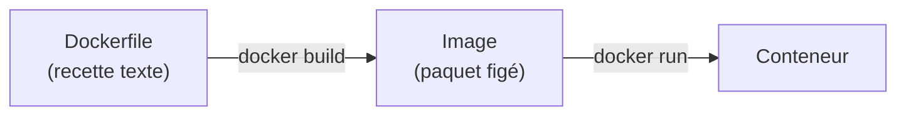
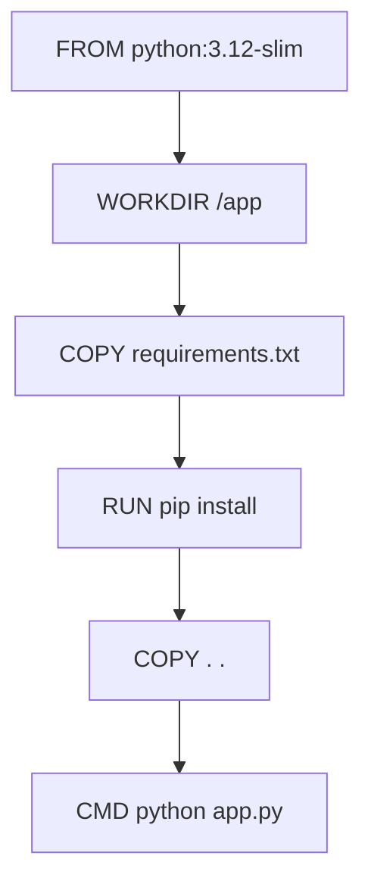
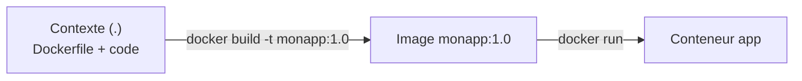
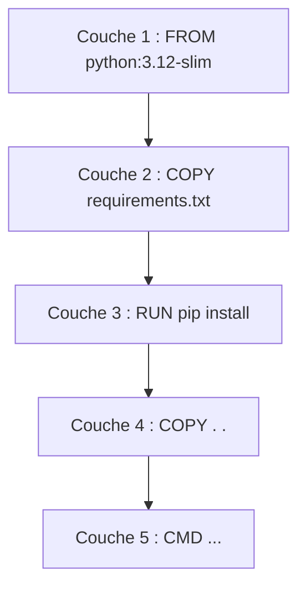
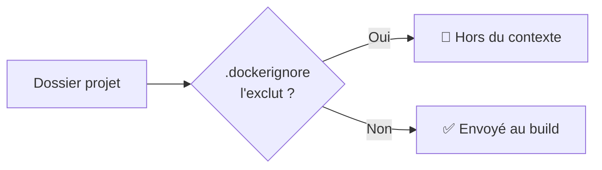
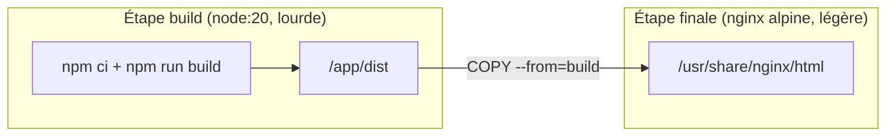
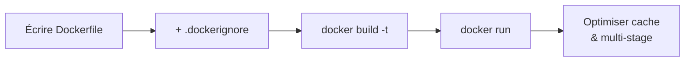

<a id="top"></a>

# 02 — Dockerfile

## Table des matières

| # | Section |
|---|---|
| 1 | [Qu'est-ce qu'un Dockerfile ?](#section-1) |
| 2 | [Les instructions de base](#section-2) |
| 3 | [CMD vs ENTRYPOINT](#section-3) |
| 4 | [Construire une image avec docker build](#section-4) |
| 5 | [Le système de couches (layers)](#section-5) |
| 6 | [Le fichier .dockerignore](#section-6) |
| 7 | [Construction multi-étapes (multi-stage)](#section-7) |
| 8 | [Quiz — Dockerfile](#section-8) |
| 9 | [Pratique — Image d'une app Python](#section-9) |
| 10 | [Synthèse](#section-10) |

---

<a id="section-1"></a>

<details>
<summary>1 — Qu'est-ce qu'un Dockerfile ?</summary>

<br/>

Dans la leçon 01, on a modifié un conteneur **à la main**. Le problème : c'est manuel, non reproductible et perdu au `docker rm`. La solution est de décrire la construction de l'image dans un fichier texte : le **`Dockerfile`**.

Un `Dockerfile` est une **recette** : une liste d'instructions que Docker exécute **dans l'ordre** pour fabriquer une image.



```dockerfile
# Un Dockerfile minimal
FROM nginx:1.27
COPY index.html /usr/share/nginx/html/index.html
```

| Avantage | Pourquoi |
|---|---|
| **Reproductible** | La même recette = la même image, partout |
| **Versionnable** | Le `Dockerfile` se met dans Git |
| **Documenté** | La recette **est** la documentation de l'environnement |
| **Automatisable** | Intégrable dans une chaîne CI/CD |

> _Le `Dockerfile` transforme « j'ai bricolé un serveur » en « voici la recette exacte de mon serveur ». C'est le cœur de l'**infrastructure as code**._

</details>

<p align="right"><a href="#top">↑ Retour en haut</a></p>

---

<a id="section-2"></a>

<details>
<summary>2 — Les instructions de base</summary>

<br/>

Voici les instructions que l'on retrouve dans 90 % des Dockerfiles.

| Instruction | Rôle |
|---|---|
| `FROM` | Image de base de départ (**obligatoire**, en premier) |
| `WORKDIR` | Définit le répertoire de travail |
| `COPY` | Copie des fichiers de l'hôte vers l'image |
| `RUN` | Exécute une commande **au moment du build** |
| `EXPOSE` | Documente le port écouté par l'application |
| `ENV` | Définit une variable d'environnement |
| `CMD` | Commande lancée au démarrage du **conteneur** |
| `ENTRYPOINT` | Programme principal (souvent combiné à `CMD`) |

```dockerfile
# Image de base
FROM python:3.12-slim

# Répertoire de travail dans l'image
WORKDIR /app

# Copier d'abord les dépendances (optimise le cache, voir section 5)
COPY requirements.txt .
RUN pip install --no-cache-dir -r requirements.txt

# Copier le reste du code
COPY . .

# Documenter le port et définir une variable d'env
EXPOSE 8000
ENV APP_ENV=production

# Commande de démarrage du conteneur
CMD ["python", "app.py"]
```



> _Différence clé à mémoriser : `RUN` s'exécute **pendant le build** (pour préparer l'image), tandis que `CMD` s'exécute **au lancement** du conteneur._

**🔧 Mini-exercice —** Ajoute, à un Dockerfile partant de `python:3.12-slim`, l'instruction qui copie le fichier local `app.py` dans le répertoire de travail de l'image.

<details>
<summary>✅ Voir une solution</summary>

```dockerfile
COPY app.py .
```

</details>

</details>

<p align="right"><a href="#top">↑ Retour en haut</a></p>

---

<a id="section-3"></a>

<details>
<summary>3 — CMD vs ENTRYPOINT</summary>

<br/>

Ces deux instructions définissent **ce qui s'exécute au démarrage**, mais avec une nuance importante.

- **`CMD`** : commande **par défaut**, facilement **remplaçable** au `docker run`.
- **`ENTRYPOINT`** : programme **fixe** ; les arguments du `docker run` lui sont **ajoutés**.

```dockerfile
# Variante CMD : remplaçable
FROM ubuntu:24.04
CMD ["echo", "Bonjour par défaut"]
```

```bash
docker run mon-image                 # affiche : Bonjour par défaut
docker run mon-image echo "Salut"    # affiche : Salut  (CMD remplacé)
```

```dockerfile
# Variante ENTRYPOINT + CMD : programme fixe + arguments par défaut
FROM ubuntu:24.04
ENTRYPOINT ["echo"]
CMD ["Bonjour par défaut"]
```

```bash
docker run mon-image                 # affiche : Bonjour par défaut
docker run mon-image "Salut"         # affiche : Salut  (argument passé à echo)
```

| | `CMD` | `ENTRYPOINT` |
|---|---|---|
| Rôle | Commande par défaut | Programme fixe |
| Remplaçable au `run` ? | Oui (entièrement) | Non (seuls les args changent) |
| Usage typique | Conteneur applicatif simple | Conteneur « outil » (CLI) |

> _Bonne combinaison : `ENTRYPOINT` pour l'exécutable fixe, `CMD` pour ses arguments par défaut. On obtient un conteneur qui se comporte comme une vraie commande._

**🔧 Mini-exercice —** Écris les deux instructions qui font qu'un conteneur exécute toujours `ping` avec, par défaut, l'argument `localhost` (remplaçable au `docker run`).

<details>
<summary>✅ Voir une solution</summary>

```dockerfile
ENTRYPOINT ["ping"]
CMD ["localhost"]
```

</details>

</details>

<p align="right"><a href="#top">↑ Retour en haut</a></p>

---

<a id="section-4"></a>

<details>
<summary>4 — Construire une image avec docker build</summary>

<br/>

On transforme le `Dockerfile` en image avec **`docker build`**.

```bash
# Construire une image taguée "monapp:1.0" depuis le dossier courant (.)
docker build -t monapp:1.0 .

# Vérifier la présence de l'image
docker images

# Lancer un conteneur depuis l'image fraîchement construite
docker run -d -p 8000:8000 --name app monapp:1.0
```

Le `.` final est le **contexte de build** : le dossier dont le contenu est envoyé au moteur Docker.



| Option de `docker build` | Rôle |
|---|---|
| `-t nom:tag` | Nomme et tague l'image |
| `-f chemin/Dockerfile` | Spécifie un Dockerfile non standard |
| `.` | Définit le contexte (dossier de build) |
| `--no-cache` | Reconstruit sans utiliser le cache |

> _⚠️ Le contexte (`.`) est **envoyé en entier** au démon Docker. Si votre dossier contient `node_modules/` ou des Go de données, le build devient très lent — d'où l'importance du `.dockerignore` (section 6)._

**🔧 Mini-exercice —** Écris la commande qui construit, depuis le dossier courant, une image taguée `monsite:2.0` **sans utiliser le cache**.

<details>
<summary>✅ Voir une solution</summary>

```bash
docker build --no-cache -t monsite:2.0 .
```

</details>

</details>

<p align="right"><a href="#top">↑ Retour en haut</a></p>

---

<a id="section-5"></a>

<details>
<summary>5 — Le système de couches (layers)</summary>

<br/>

Chaque instruction du `Dockerfile` crée une **couche** (*layer*) empilée. Docker **met en cache** chaque couche : si une instruction et son contexte n'ont pas changé, Docker **réutilise** la couche au lieu de la reconstruire.



**Conséquence pratique majeure** : ordonnez les instructions de la **moins** changeante à la **plus** changeante.

```dockerfile
# ✅ BON ordre : dépendances avant le code
FROM python:3.12-slim
WORKDIR /app
COPY requirements.txt .          # change rarement
RUN pip install -r requirements.txt   # cache réutilisé tant que requirements.txt est inchangé
COPY . .                          # change souvent
CMD ["python", "app.py"]
```

```dockerfile
# ❌ MAUVAIS ordre : tout copié d'un coup
FROM python:3.12-slim
WORKDIR /app
COPY . .                          # le moindre changement de code...
RUN pip install -r requirements.txt   # ...invalide le cache et réinstalle TOUT
CMD ["python", "app.py"]
```

| Bon ordonnancement | Mauvais ordonnancement |
|---|---|
| `pip install` mis en cache | `pip install` rejoué à chaque build |
| Builds rapides | Builds lents |

> _Règle d'or : **copiez et installez les dépendances en premier**, le code applicatif en dernier. Vous gagnez des minutes à chaque reconstruction._

</details>

<p align="right"><a href="#top">↑ Retour en haut</a></p>

---

<a id="section-6"></a>

<details>
<summary>6 — Le fichier .dockerignore</summary>

<br/>

Comme `.gitignore` pour Git, le **`.dockerignore`** exclut des fichiers du **contexte de build**. Cela accélère le build et évite d'embarquer des fichiers inutiles ou sensibles dans l'image.

```bash
# Exemple de .dockerignore
.git
node_modules
__pycache__
*.log
.env
Dockerfile
README.md
```

| À ignorer | Pourquoi |
|---|---|
| `.git`, `node_modules`, `__pycache__` | Volumineux, reconstructibles |
| `.env`, `*.key` | **Secrets** — jamais dans une image ! |
| `*.log`, fichiers temporaires | Inutiles dans l'image |



> _⚠️ Sans `.dockerignore`, un `.env` peut se retrouver **copié dans l'image** via `COPY . .` et ainsi fuiter vos secrets à quiconque récupère l'image. Toujours exclure `.env` !_

</details>

<p align="right"><a href="#top">↑ Retour en haut</a></p>

---

<a id="section-7"></a>

<details>
<summary>7 — Construction multi-étapes (multi-stage)</summary>

<br/>

Pour compiler une application, on a besoin d'outils (compilateurs, SDK) **lourds** — mais ces outils sont **inutiles** dans l'image finale. Le **multi-stage build** sépare l'étape de **construction** de l'étape d'**exécution** pour produire une image finale **minimale**.

```dockerfile
# ---- Étape 1 : build (image lourde avec les outils) ----
FROM node:20 AS build
WORKDIR /app
COPY package*.json ./
RUN npm ci
COPY . .
RUN npm run build          # produit /app/dist

# ---- Étape 2 : exécution (image légère, seulement le résultat) ----
FROM nginx:1.27-alpine
COPY --from=build /app/dist /usr/share/nginx/html
EXPOSE 80
```



| | Sans multi-stage | Avec multi-stage |
|---|---|---|
| Taille finale | ~1 Go (Node + outils) | ~50 Mo (nginx + dist) |
| Outils de build dans l'image | Oui (inutiles) | Non |
| Surface d'attaque | Plus grande | Réduite |

> _Le mot-clé `AS build` nomme une étape ; `COPY --from=build` récupère uniquement le résultat utile. L'image finale ne contient **ni** Node **ni** les sources : juste l'app compilée._

</details>

<p align="right"><a href="#top">↑ Retour en haut</a></p>

---

<a id="section-8"></a>

<details>
<summary>8 — Quiz — Dockerfile</summary>

<br/>

**Question 1 :** Quelle instruction doit obligatoirement apparaître en premier dans un Dockerfile ?

a) `RUN`

b) `CMD`

c) `FROM`

d) `COPY`

<details>
<summary>💡 Voir la solution</summary>

✅ **Réponse : c)** — `FROM` définit l'image de base et doit être la première instruction (hors directives `ARG` éventuelles). Tout part de cette base.

</details>

---

**Question 2 :** Quelle est la différence entre `RUN` et `CMD` ?

a) Aucune

b) `RUN` s'exécute au build, `CMD` au démarrage du conteneur

c) `CMD` s'exécute au build, `RUN` au démarrage

d) Les deux s'exécutent au démarrage

<details>
<summary>💡 Voir la solution</summary>

✅ **Réponse : b)** — `RUN` exécute des commandes pendant la construction de l'image (ex. installer des paquets). `CMD` définit la commande lancée quand le conteneur démarre.

</details>

---

**Question 3 :** Pourquoi copier `requirements.txt` et faire `pip install` AVANT de copier tout le code ?

a) C'est obligatoire syntaxiquement

b) Pour profiter du cache de couches et éviter de réinstaller les dépendances à chaque changement de code

c) Parce que pip ne fonctionne pas autrement

d) Pour réduire le nombre de fichiers

<details>
<summary>💡 Voir la solution</summary>

✅ **Réponse : b)** — Les dépendances changent rarement ; en les installant avant de copier le code, Docker réutilise la couche `pip install` du cache tant que `requirements.txt` est inchangé. Builds bien plus rapides.

</details>

---

**Question 4 :** À quoi sert un build multi-étapes (multi-stage) ?

a) À construire plusieurs images en parallèle

b) À séparer la construction de l'exécution pour obtenir une image finale légère sans les outils de build

c) À multiplier les conteneurs

d) À éviter d'écrire un Dockerfile

<details>
<summary>💡 Voir la solution</summary>

✅ **Réponse : b)** — On compile dans une étape lourde, puis on copie seulement le résultat (`COPY --from=...`) dans une étape finale minimale. L'image de production reste petite et sûre.

</details>

---

**Question 5 :** Que fait le fichier `.dockerignore` ?

a) Il ignore les conteneurs arrêtés

b) Il exclut des fichiers du contexte de build (ex. `.git`, `.env`, `node_modules`)

c) Il supprime des images

d) Il liste les ports à exposer

<details>
<summary>💡 Voir la solution</summary>

✅ **Réponse : b)** — `.dockerignore` empêche certains fichiers d'être envoyés au build et copiés dans l'image. Il accélère le build et protège les secrets (`.env`).

</details>

</details>

<p align="right"><a href="#top">↑ Retour en haut</a></p>

---

<a id="section-9"></a>

<details>
<summary>9 — Pratique — Image d'une app Python</summary>

<br/>

### Consigne

Vous disposez d'une petite application Flask. Écrivez le `Dockerfile` (avec ordonnancement optimisé du cache) et le `.dockerignore`, construisez l'image `mon-api:1.0`, puis lancez-la sur le port **5000**.

Fichiers fournis :

```python
# app.py
from flask import Flask
app = Flask(__name__)

@app.route("/")
def accueil():
    return "Bonjour depuis mon conteneur Flask !"

if __name__ == "__main__":
    app.run(host="0.0.0.0", port=5000)
```

```text
# requirements.txt
flask==3.0.0
```

---

### Correction — Fichiers et commandes attendus

```dockerfile
# Dockerfile
FROM python:3.12-slim

WORKDIR /app

# Dépendances d'abord (cache optimisé)
COPY requirements.txt .
RUN pip install --no-cache-dir -r requirements.txt

# Puis le code
COPY . .

EXPOSE 5000
CMD ["python", "app.py"]
```

```text
# .dockerignore
.git
__pycache__
*.pyc
.env
venv
```

```bash
# Construire l'image
docker build -t mon-api:1.0 .

# Lancer le conteneur
docker run -d --name api -p 5000:5000 mon-api:1.0

# Vérifier
docker ps
```

**Résultat attendu :** en ouvrant `http://localhost:5000`, le navigateur affiche :

```
Bonjour depuis mon conteneur Flask !
```

> _Vérifiez que `COPY requirements.txt` précède `COPY . .`. Modifiez ensuite une ligne de `app.py` et relancez `docker build` : la couche `pip install` doit être marquée `CACHED`, preuve que votre ordonnancement est correct._

</details>

<p align="right"><a href="#top">↑ Retour en haut</a></p>

---

<a id="section-10"></a>

<details>
<summary>10 — Synthèse</summary>

<br/>

#### Points à retenir

1. Le **Dockerfile** est la recette reproductible d'une image (`docker build -t nom:tag .`).
2. Instructions clés : `FROM`, `WORKDIR`, `COPY`, `RUN`, `EXPOSE`, `ENV`, `CMD`, `ENTRYPOINT`.
3. **`RUN`** s'exécute au build ; **`CMD`/`ENTRYPOINT`** au démarrage du conteneur.
4. Chaque instruction crée une **couche** mise en cache → copier les **dépendances avant le code**.
5. Le **`.dockerignore`** allège le contexte et protège les secrets.
6. Le **multi-stage** produit des images finales **minimales** (sans outils de build).



#### La suite

Leçon **03 — Volumes et réseaux** : nos données disparaissent encore quand le conteneur est supprimé. On va apprendre à les **persister** (volumes) et à faire **communiquer** plusieurs conteneurs entre eux (réseaux + docker-compose).

</details>

<p align="right"><a href="#top">↑ Retour en haut</a></p>

---

<p align="center">
  <em>Tous droits réservés. Toute reproduction, diffusion, utilisation ou adaptation de ce cours, en tout ou en partie, est strictement interdite sans l'autorisation écrite préalable de Dr. Haythem REHOUMA.</em>
</p>

<p align="center">
  <strong>Cours créé par Dr. Haythem REHOUMA — Développement et déploiement de solutions de données</strong>
</p>
