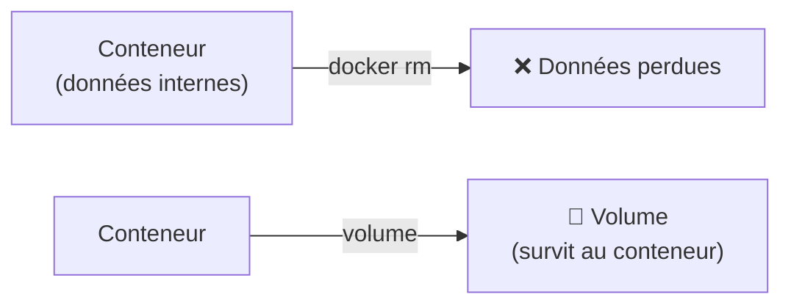
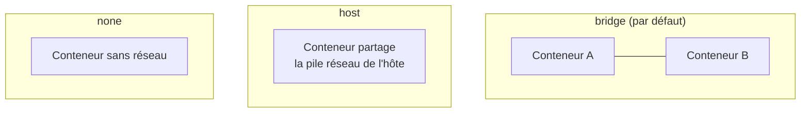
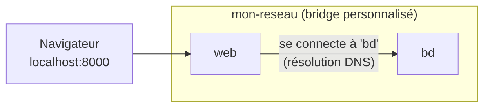
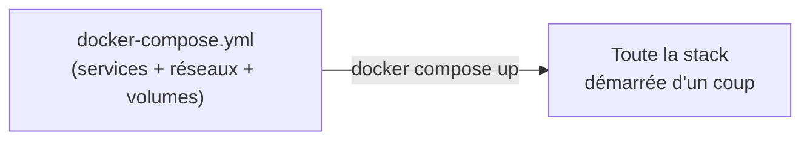
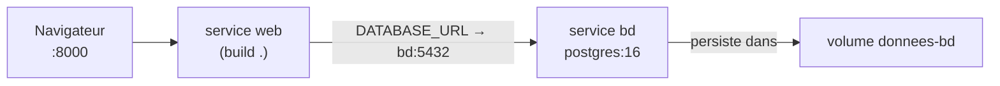
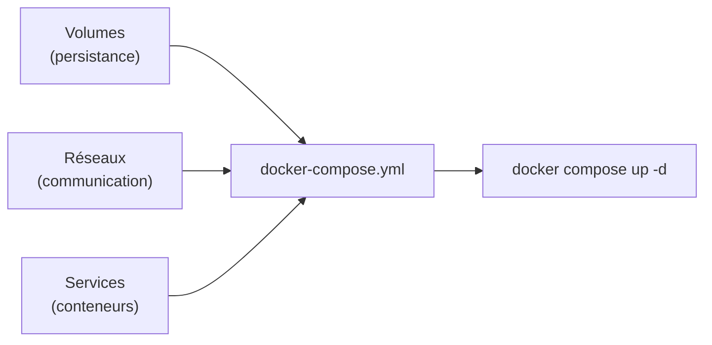

<a id="top"></a>

# 03 — Volumes et réseaux

## Table des matières

| # | Section |
|---|---|
| 1 | [Le problème de la persistance](#section-1) |
| 2 | [Les volumes Docker](#section-2) |
| 3 | [Les bind mounts](#section-3) |
| 4 | [Les réseaux Docker](#section-4) |
| 5 | [Créer un réseau personnalisé](#section-5) |
| 6 | [Docker Compose : tout déclarer](#section-6) |
| 7 | [Un compose complet : web + base de données](#section-7) |
| 8 | [Quiz — Volumes et réseaux](#section-8) |
| 9 | [Pratique — App + base persistante](#section-9) |
| 10 | [Synthèse](#section-10) |

---

<a id="section-1"></a>

<details>
<summary>1 — Le problème de la persistance</summary>

<br/>

Un conteneur est **éphémère**. Tout ce qu'il écrit dans son système de fichiers disparaît à sa suppression. Imaginez une base de données : si vous faites `docker rm`, **toutes les données sont perdues**.



La solution : stocker les données **en dehors** de la couche éphémère du conteneur, grâce à deux mécanismes :

| Mécanisme | Stockage | Usage typique |
|---|---|---|
| **Volume** | Géré par Docker | Données de production (BD, uploads) |
| **Bind mount** | Dossier de l'hôte | Développement (code en direct) |

> _Règle mentale : le **conteneur** est jetable, les **données** ne le sont pas. On sépare donc toujours les deux._

</details>

<p align="right"><a href="#top">↑ Retour en haut</a></p>

---

<a id="section-2"></a>

<details>
<summary>2 — Les volumes Docker</summary>

<br/>

Un **volume** est un espace de stockage **géré par Docker**, indépendant du cycle de vie des conteneurs. C'est la méthode **recommandée** pour persister des données.

```bash
# Créer un volume nommé
docker volume create donnees-bd

# Lister les volumes
docker volume ls

# Lancer un conteneur en montant le volume sur un dossier interne
docker run -d --name bd \
  -v donnees-bd:/var/lib/postgresql/data \
  -e POSTGRES_PASSWORD=secret \
  postgres:16

# Inspecter un volume
docker volume inspect donnees-bd

# Supprimer un volume (le conteneur ne doit plus l'utiliser)
docker volume rm donnees-bd
```


La syntaxe est `-v NOM_VOLUME:CHEMIN_DANS_LE_CONTENEUR`. Même après suppression du conteneur, on peut **rebrancher** le volume sur un nouveau conteneur et retrouver toutes les données.

> _Les volumes sont stockés dans une zone gérée par Docker (`/var/lib/docker/volumes/…`). Ne les manipulez pas à la main : passez toujours par les commandes `docker volume`._

**🔧 Mini-exercice —** Écris la commande qui lance un conteneur `postgres:16` en montant un volume nommé `pgdata` sur `/var/lib/postgresql/data`.

<details>
<summary>✅ Voir une solution</summary>

```bash
docker run -d --name bd -v pgdata:/var/lib/postgresql/data -e POSTGRES_PASSWORD=secret postgres:16
```

</details>

</details>

<p align="right"><a href="#top">↑ Retour en haut</a></p>

---

<a id="section-3"></a>

<details>
<summary>3 — Les bind mounts</summary>

<br/>

Un **bind mount** monte un **dossier réel de l'hôte** dans le conteneur. Toute modification d'un côté est visible de l'autre **instantanément** — idéal en développement.

```bash
# Monter le dossier courant de l'hôte dans /app du conteneur
docker run -d --name dev \
  -v "$(pwd)":/app \
  -p 8000:8000 \
  monapp:dev
```


| | Volume | Bind mount |
|---|---|---|
| Géré par | Docker | Vous (chemin hôte) |
| Portabilité | Élevée | Faible (dépend du chemin) |
| Usage | Production | Développement |
| Édition en direct du code | Non | Oui |

> _En développement, le bind mount permet d'éditer le code dans votre éditeur habituel et de voir l'effet **sans reconstruire** l'image. En production, on préfère les **volumes** (plus robustes et portables)._

</details>

<p align="right"><a href="#top">↑ Retour en haut</a></p>

---

<a id="section-4"></a>

<details>
<summary>4 — Les réseaux Docker</summary>

<br/>

Par défaut, chaque conteneur est isolé. Pour qu'ils **communiquent**, Docker fournit des **réseaux**. Trois pilotes principaux :



| Pilote | Description | Quand l'utiliser |
|---|---|---|
| **bridge** | Réseau privé virtuel (défaut) | Cas général, conteneurs sur un même hôte |
| **host** | Le conteneur utilise directement le réseau de l'hôte | Performance maximale, pas d'isolation réseau |
| **none** | Aucun réseau | Isolation totale |

```bash
# Lister les réseaux
docker network ls

# Inspecter le réseau bridge par défaut
docker network inspect bridge
```

> _Point essentiel : sur le réseau bridge **par défaut**, les conteneurs ne peuvent se joindre que par adresse IP. Pour communiquer **par nom**, il faut créer un réseau **personnalisé** (section suivante)._

</details>

<p align="right"><a href="#top">↑ Retour en haut</a></p>

---

<a id="section-5"></a>

<details>
<summary>5 — Créer un réseau personnalisé</summary>

<br/>

Sur un réseau **bridge personnalisé**, Docker fournit une **résolution DNS interne** : un conteneur peut joindre un autre **par son nom**. C'est la base de toute application multi-conteneurs.

```bash
# 1. Créer un réseau personnalisé
docker network create mon-reseau

# 2. Lancer une base de données sur ce réseau
docker run -d --name bd --network mon-reseau \
  -e POSTGRES_PASSWORD=secret postgres:16

# 3. Lancer l'app sur le même réseau
docker run -d --name web --network mon-reseau -p 8000:8000 monapp:1.0

# 4. Depuis "web", on joint la base simplement par son nom "bd"
docker exec -it web ping bd
```



| Réseau bridge par défaut | Réseau bridge personnalisé |
|---|---|
| Communication par IP seulement | Communication **par nom** (DNS) |
| Tous les conteneurs mélangés | Isolation par projet |
| Déconseillé en pratique | **Recommandé** |

> _Dans l'app `web`, la chaîne de connexion à la base devient simplement `postgresql://bd:5432/...` : on utilise le **nom du conteneur** comme nom d'hôte. C'est tout l'intérêt du réseau personnalisé._

**🔧 Mini-exercice —** Écris la commande qui crée un réseau bridge personnalisé nommé `appnet`.

<details>
<summary>✅ Voir une solution</summary>

```bash
docker network create appnet
```

</details>

</details>

<p align="right"><a href="#top">↑ Retour en haut</a></p>

---

<a id="section-6"></a>

<details>
<summary>6 — Docker Compose : tout déclarer</summary>

<br/>

Lancer 3 conteneurs à la main (avec réseaux, volumes, variables…) devient vite ingérable. **Docker Compose** permet de **tout décrire** dans un fichier `docker-compose.yml` et de tout lancer d'une commande.



```yaml
# docker-compose.yml minimal
services:
  web:
    image: nginx:1.27
    ports:
      - "8080:80"
```

```bash
# Démarrer toute la stack en arrière-plan
docker compose up -d

# Voir l'état des services
docker compose ps

# Suivre les logs de tous les services
docker compose logs -f

# Tout arrêter et supprimer (les volumes nommés sont conservés)
docker compose down
```

| Commande | Effet |
|---|---|
| `docker compose up -d` | Construit/démarre tous les services |
| `docker compose down` | Arrête et supprime conteneurs + réseau |
| `docker compose ps` | Liste les services de la stack |
| `docker compose logs -f` | Suit les logs agrégés |

> _Compose crée **automatiquement** un réseau personnalisé pour la stack : les services s'y joignent **par leur nom** sans configuration supplémentaire. C'est gratuit !_

**🔧 Mini-exercice —** Écris la commande qui arrête et supprime toute la stack décrite dans `docker-compose.yml` (conteneurs + réseau).

<details>
<summary>✅ Voir une solution</summary>

```bash
docker compose down
```

</details>

</details>

<p align="right"><a href="#top">↑ Retour en haut</a></p>

---

<a id="section-7"></a>

<details>
<summary>7 — Un compose complet : web + base de données</summary>

<br/>

Voici une stack réaliste : une application web qui parle à une base PostgreSQL, avec un **volume** pour la persistance et un réseau implicite pour la communication.

```yaml
# docker-compose.yml
services:
  web:
    build: .                 # construit depuis le Dockerfile local
    ports:
      - "8000:8000"
    environment:
      DATABASE_URL: "postgresql://app:secret@bd:5432/appdb"
    depends_on:
      - bd                   # démarre la base avant le web

  bd:
    image: postgres:16
    environment:
      POSTGRES_USER: app
      POSTGRES_PASSWORD: secret
      POSTGRES_DB: appdb
    volumes:
      - donnees-bd:/var/lib/postgresql/data   # persistance

volumes:
  donnees-bd:                # volume nommé géré par Docker
```



| Élément du fichier | Rôle |
|---|---|
| `build: .` | Construit l'image web depuis le Dockerfile |
| `environment` | Variables d'environnement du conteneur |
| `depends_on` | Ordre de démarrage |
| `volumes:` (clé racine) | Déclare le volume nommé persistant |

```bash
docker compose up -d        # tout démarre : réseau + volume + 2 services
```

> _Notez `bd:5432` dans `DATABASE_URL` : le service web joint la base **par son nom de service**, grâce au réseau créé automatiquement par Compose. Et `donnees-bd` survit aux `docker compose down`._

</details>

<p align="right"><a href="#top">↑ Retour en haut</a></p>

---

<a id="section-8"></a>

<details>
<summary>8 — Quiz — Volumes et réseaux</summary>

<br/>

**Question 1 :** Que deviennent les données écrites dans le système de fichiers d'un conteneur après un `docker rm` (sans volume) ?

a) Elles sont conservées automatiquement

b) Elles sont définitivement perdues

c) Elles passent dans une image

d) Elles vont sur Docker Hub

<details>
<summary>💡 Voir la solution</summary>

✅ **Réponse : b)** — La couche d'écriture du conteneur est éphémère. Sans volume ni bind mount, supprimer le conteneur efface ses données. D'où l'usage des volumes pour les bases de données.

</details>

---

**Question 2 :** Quelle est la différence principale entre un volume et un bind mount ?

a) Aucune

b) Le volume est géré par Docker ; le bind mount pointe vers un dossier de l'hôte

c) Le bind mount est plus sûr en production

d) Le volume ne persiste pas

<details>
<summary>💡 Voir la solution</summary>

✅ **Réponse : b)** — Le volume est géré et stocké par Docker (recommandé en production) ; le bind mount monte un dossier précis de l'hôte (pratique en développement pour éditer le code en direct).

</details>

---

**Question 3 :** Pourquoi créer un réseau bridge personnalisé plutôt que d'utiliser le bridge par défaut ?

a) Pour aller plus vite

b) Parce qu'il offre la résolution DNS : les conteneurs se joignent par leur nom

c) Parce que le bridge par défaut n'existe pas

d) Pour économiser de la mémoire

<details>
<summary>💡 Voir la solution</summary>

✅ **Réponse : b)** — Sur un réseau personnalisé, Docker fournit un DNS interne : un conteneur peut joindre un autre par son nom (ex. `bd`), au lieu de devoir connaître son adresse IP.

</details>

---

**Question 4 :** Que fait `docker compose up -d` ?

a) Supprime tous les conteneurs

b) Construit/démarre tous les services décrits dans docker-compose.yml en arrière-plan

c) Met à jour Docker

d) Affiche les logs uniquement

<details>
<summary>💡 Voir la solution</summary>

✅ **Réponse : b)** — Compose lit `docker-compose.yml`, crée le réseau et les volumes nécessaires, puis démarre tous les services. `-d` les lance en arrière-plan.

</details>

---

**Question 5 :** Dans un docker-compose, comment le service `web` joint-il la base `bd` ?

a) Par son adresse IP fixe

b) Par le nom du service `bd` (grâce au réseau créé par Compose)

c) Via Internet

d) Ce n'est pas possible

<details>
<summary>💡 Voir la solution</summary>

✅ **Réponse : b)** — Compose place les services sur un réseau commun avec DNS interne ; `web` utilise simplement `bd` comme nom d'hôte (ex. `bd:5432`).

</details>

</details>

<p align="right"><a href="#top">↑ Retour en haut</a></p>

---

<a id="section-9"></a>

<details>
<summary>9 — Pratique — App + base persistante</summary>

<br/>

### Consigne

Avec Docker Compose, déployez une stack composée d'une base **PostgreSQL** (données persistées dans un volume) et d'un outil d'administration **Adminer** accessible sur le port **8080**. Vérifiez que les données survivent à un `docker compose down` suivi d'un `up`.

---

### Correction — Fichier et commandes attendus

```yaml
# docker-compose.yml
services:
  bd:
    image: postgres:16
    environment:
      POSTGRES_USER: app
      POSTGRES_PASSWORD: secret
      POSTGRES_DB: appdb
    volumes:
      - donnees-bd:/var/lib/postgresql/data

  adminer:
    image: adminer:latest
    ports:
      - "8080:8080"
    depends_on:
      - bd

volumes:
  donnees-bd:
```

```bash
# 1. Démarrer la stack
docker compose up -d

# 2. Ouvrir Adminer : http://localhost:8080
#    Système: PostgreSQL | Serveur: bd | Utilisateur: app
#    Mot de passe: secret | Base: appdb
#    -> créer une table, insérer une ligne

# 3. Tout arrêter (le volume nommé est conservé)
docker compose down

# 4. Relancer
docker compose up -d

# 5. Rouvrir Adminer : la table et la ligne sont TOUJOURS là
```

**Résultat attendu :**

```
# docker compose ps (étape 1)
NAME             IMAGE             STATUS         PORTS
projet-bd-1      postgres:16       Up             5432/tcp
projet-adminer-1 adminer:latest    Up             0.0.0.0:8080->8080/tcp
```

> _La preuve du succès : après `down` puis `up`, vos données sont **intactes**. C'est le volume `donnees-bd` qui les a préservées. Pour tout effacer, il faudrait `docker compose down -v` (le `-v` supprime les volumes)._

</details>

<p align="right"><a href="#top">↑ Retour en haut</a></p>

---

<a id="section-10"></a>

<details>
<summary>10 — Synthèse</summary>

<br/>

#### Points à retenir

1. Un conteneur est **éphémère** : sans volume, ses données disparaissent au `docker rm`.
2. Le **volume** (géré par Docker) persiste les données de production : `-v nom:/chemin`.
3. Le **bind mount** monte un dossier de l'hôte : idéal en développement.
4. Les **réseaux** font communiquer les conteneurs ; le bridge **personnalisé** ajoute la résolution **par nom**.
5. **Docker Compose** décrit toute la stack (services, réseaux, volumes) dans `docker-compose.yml`.
6. Compose crée un réseau automatique : les services se joignent **par leur nom de service**.



#### La suite

Leçon **04 — Nginx : reverse proxy et load balancer** : on placera un **Nginx** devant nos conteneurs pour router le trafic, masquer l'architecture interne et **répartir la charge** entre plusieurs instances.

</details>

<p align="right"><a href="#top">↑ Retour en haut</a></p>

---

<p align="center">
  <em>Tous droits réservés. Toute reproduction, diffusion, utilisation ou adaptation de ce cours, en tout ou en partie, est strictement interdite sans l'autorisation écrite préalable de Dr. Haythem REHOUMA.</em>
</p>

<p align="center">
  <strong>Cours créé par Dr. Haythem REHOUMA — Développement et déploiement de solutions de données</strong>
</p>
