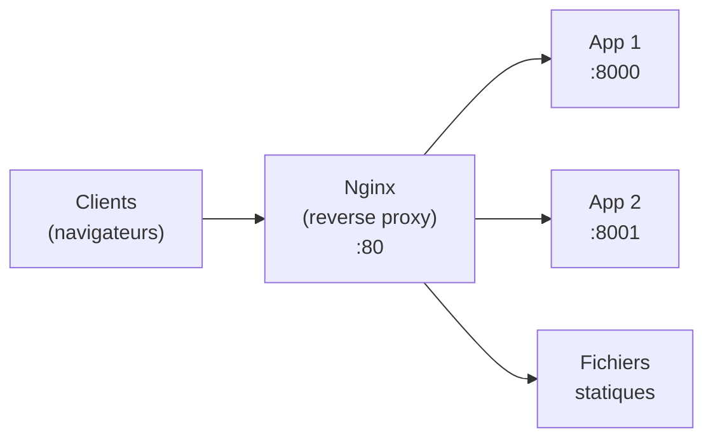
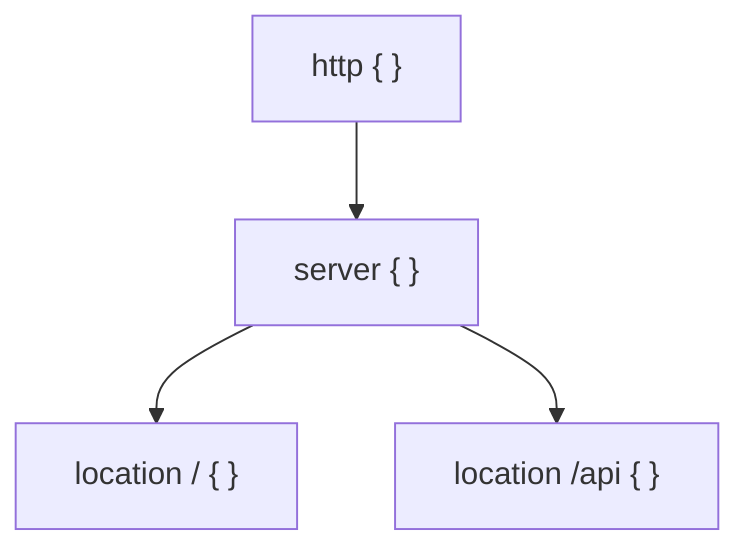
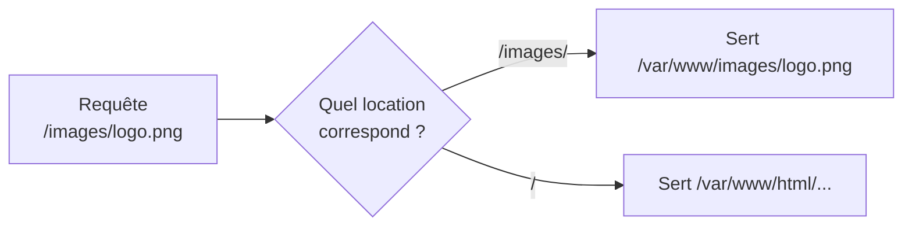
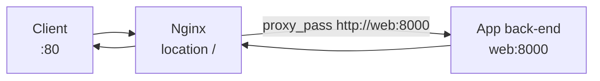
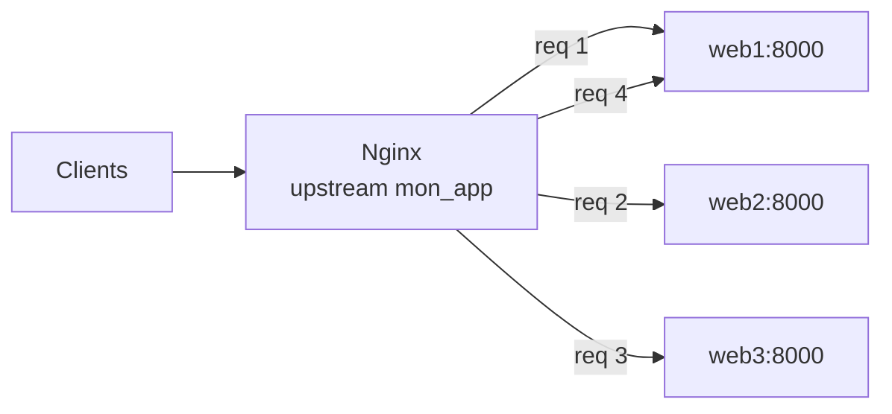
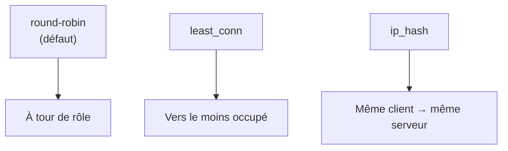
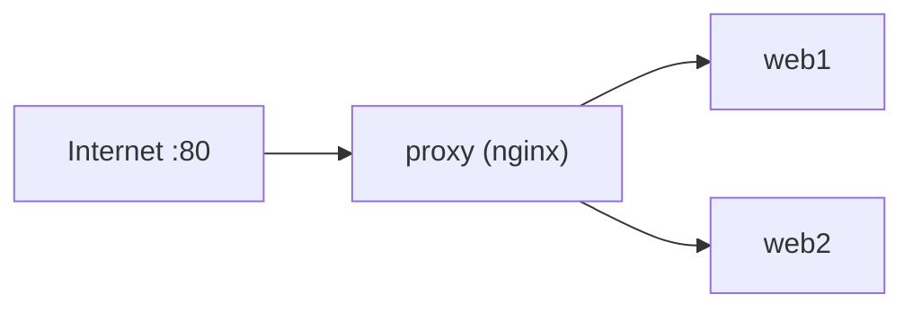
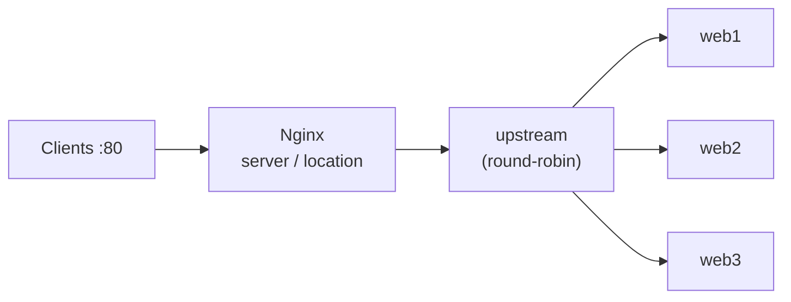

<a id="top"></a>

# 04 — Nginx : reverse proxy et répartition de charge

## Table des matières

| # | Section |
|---|---|
| 1 | [Qu'est-ce qu'un reverse proxy ?](#section-1) |
| 2 | [Anatomie d'un fichier nginx.conf](#section-2) |
| 3 | [Le bloc server et location](#section-3) |
| 4 | [proxy_pass : transférer vers une app](#section-4) |
| 5 | [Répartition de charge avec upstream](#section-5) |
| 6 | [Algorithmes de répartition](#section-6) |
| 7 | [Nginx en conteneur (Docker)](#section-7) |
| 8 | [Quiz — Nginx reverse proxy](#section-8) |
| 9 | [Pratique — Load balancer sur 3 instances](#section-9) |
| 10 | [Synthèse](#section-10) |

---

<a id="section-1"></a>

<details>
<summary>1 — Qu'est-ce qu'un reverse proxy ?</summary>

<br/>

Un **reverse proxy** est un serveur placé **devant** vos applications. Il reçoit toutes les requêtes des clients et les **transfère** aux bons services en interne. Le client ne voit **que** le proxy ; il ignore tout de l'architecture derrière.



| Bénéfice du reverse proxy | Détail |
|---|---|
| **Point d'entrée unique** | Un seul port public (80/443) |
| **Masquage** | L'architecture interne reste cachée |
| **Terminaison TLS** | Le HTTPS est géré au niveau du proxy |
| **Répartition de charge** | Distribue le trafic sur plusieurs instances |
| **Cache & compression** | Améliore les performances |

> _À ne pas confondre : un **proxy classique** (forward proxy) agit pour le **client** (sortie vers Internet). Un **reverse proxy** agit pour le **serveur** (entrée vers vos apps). Nginx est l'outil de référence pour ce rôle._

</details>

<p align="right"><a href="#top">↑ Retour en haut</a></p>

---

<a id="section-2"></a>

<details>
<summary>2 — Anatomie d'un fichier nginx.conf</summary>

<br/>

La configuration de Nginx s'organise en **blocs** imbriqués (appelés *contextes*), délimités par des accolades `{ }` et terminés par `;`.



```nginx
# nginx.conf simplifié
http {
    server {
        listen 80;
        server_name exemple.local;

        location / {
            root /usr/share/nginx/html;
            index index.html;
        }
    }
}
```

| Bloc | Rôle |
|---|---|
| `http { }` | Contexte global HTTP |
| `server { }` | Un site virtuel (un port, un domaine) |
| `location { }` | Une route/chemin d'URL |
| `upstream { }` | Un groupe de serveurs back-end (section 5) |

> _Chaque directive se termine par un point-virgule `;`. L'oubli d'un `;` est l'erreur de syntaxe la plus fréquente — testez toujours avec `nginx -t` avant de recharger._

**🔧 Mini-exercice —** Écris un bloc `server` minimal qui écoute sur le port **80** pour le domaine `demo.local`.

<details>
<summary>✅ Voir une solution</summary>

```nginx
server {
    listen 80;
    server_name demo.local;
}
```

</details>

</details>

<p align="right"><a href="#top">↑ Retour en haut</a></p>

---

<a id="section-3"></a>

<details>
<summary>3 — Le bloc server et location</summary>

<br/>

Le bloc **`server`** définit **comment** Nginx écoute (port, nom de domaine). Le bloc **`location`** décide **quoi faire** selon le chemin de l'URL.

```nginx
server {
    listen 80;
    server_name monsite.local;

    # Page d'accueil et fichiers statiques
    location / {
        root /var/www/html;
        index index.html;
    }

    # Tout ce qui commence par /images/
    location /images/ {
        root /var/www;
    }

    # Une route exacte
    location = /sante {
        return 200 "OK\n";
    }
}
```



| Syntaxe `location` | Correspondance |
|---|---|
| `location /` | Préfixe : tout chemin (défaut) |
| `location /api/` | Préfixe : chemins commençant par `/api/` |
| `location = /sante` | Exacte : uniquement `/sante` |

> _Nginx choisit le `location` le plus **spécifique** qui correspond. Une correspondance exacte (`=`) l'emporte sur un préfixe. Comprendre cette priorité évite bien des surprises de routage._

</details>

<p align="right"><a href="#top">↑ Retour en haut</a></p>

---

<a id="section-4"></a>

<details>
<summary>4 — proxy_pass : transférer vers une app</summary>

<br/>

La directive **`proxy_pass`** transfère la requête vers une application back-end (un autre conteneur, un autre port). C'est le cœur du rôle de reverse proxy.

```nginx
server {
    listen 80;
    server_name monsite.local;

    location / {
        # Transfère vers l'app qui écoute sur le conteneur "web", port 8000
        proxy_pass http://web:8000;

        # En-têtes recommandés pour que l'app connaisse le vrai client
        proxy_set_header Host $host;
        proxy_set_header X-Real-IP $remote_addr;
        proxy_set_header X-Forwarded-For $proxy_add_x_forwarded_for;
        proxy_set_header X-Forwarded-Proto $scheme;
    }
}
```



| Directive | Rôle |
|---|---|
| `proxy_pass http://web:8000` | Cible back-end (nom de conteneur + port) |
| `proxy_set_header Host` | Transmet le domaine demandé |
| `proxy_set_header X-Real-IP` | Transmet l'IP réelle du client |
| `proxy_set_header X-Forwarded-For` | Chaîne des proxys traversés |

> _Sans les `proxy_set_header`, l'application back-end croit que toutes les requêtes viennent de Nginx (et non du vrai client). Ces en-têtes restaurent l'information d'origine — essentiel pour les logs et la sécurité._

**🔧 Mini-exercice —** Écris un bloc `location /api/` qui transfère les requêtes vers un back-end nommé `api` écoutant sur le port `5000`.

<details>
<summary>✅ Voir une solution</summary>

```nginx
location /api/ {
    proxy_pass http://api:5000;
}
```

</details>

</details>

<p align="right"><a href="#top">↑ Retour en haut</a></p>

---

<a id="section-5"></a>

<details>
<summary>5 — Répartition de charge avec upstream</summary>

<br/>

Quand une seule instance ne suffit plus, on en lance **plusieurs** et on demande à Nginx de **répartir** le trafic entre elles. Le bloc **`upstream`** déclare le groupe de serveurs.

```nginx
# Groupe de back-ends
upstream mon_app {
    server web1:8000;
    server web2:8000;
    server web3:8000;
}

server {
    listen 80;

    location / {
        proxy_pass http://mon_app;     # pointe vers le groupe
        proxy_set_header Host $host;
    }
}
```



| Avantage | Détail |
|---|---|
| **Scalabilité** | Ajouter une ligne `server` = plus de capacité |
| **Haute disponibilité** | Si une instance tombe, les autres répondent |
| **Maintenance** | Mettre à jour une instance à la fois |

> _On parle de **mise à l'échelle horizontale** : plutôt qu'un gros serveur, on multiplie les petites instances identiques derrière le load balancer. C'est le modèle dominant du web moderne._

</details>

<p align="right"><a href="#top">↑ Retour en haut</a></p>

---

<a id="section-6"></a>

<details>
<summary>6 — Algorithmes de répartition</summary>

<br/>

Nginx propose plusieurs **stratégies** pour choisir vers quelle instance envoyer chaque requête.

```nginx
# 1. Round-robin (défaut) : à tour de rôle
upstream app_rr {
    server web1:8000;
    server web2:8000;
}

# 2. Least connections : vers l'instance la moins chargée
upstream app_lc {
    least_conn;
    server web1:8000;
    server web2:8000;
}

# 3. IP hash : un même client va toujours sur la même instance
upstream app_ih {
    ip_hash;
    server web1:8000;
    server web2:8000;
}

# 4. Pondération : web1 reçoit 2x plus de trafic
upstream app_w {
    server web1:8000 weight=2;
    server web2:8000 weight=1;
}
```



| Algorithme | Quand l'utiliser |
|---|---|
| **round-robin** | Cas général, instances équivalentes |
| **least_conn** | Requêtes de durées très variables |
| **ip_hash** | Sessions « collantes » (même utilisateur) |
| **weight** | Serveurs de puissances différentes |

> _Par défaut, c'est le **round-robin**. C'est suffisant dans la majorité des cas. Passez à `least_conn` si certaines requêtes sont beaucoup plus longues que d'autres, ou à `ip_hash` si l'app exige qu'un utilisateur reste sur la même instance._

**🔧 Mini-exercice —** Écris un bloc `upstream` nommé `app` qui répartit le trafic sur `web1:8000` et `web2:8000` en envoyant un même client toujours sur la même instance.

<details>
<summary>✅ Voir une solution</summary>

```nginx
upstream app {
    ip_hash;
    server web1:8000;
    server web2:8000;
}
```

</details>

</details>

<p align="right"><a href="#top">↑ Retour en haut</a></p>

---

<a id="section-7"></a>

<details>
<summary>7 — Nginx en conteneur (Docker)</summary>

<br/>

On déploie Nginx comme un conteneur, en lui **montant** sa configuration depuis l'hôte.

```bash
# Tester la syntaxe de la conf
docker run --rm -v "$(pwd)/nginx.conf":/etc/nginx/nginx.conf:ro nginx:1.27 nginx -t

# Lancer Nginx avec notre conf
docker run -d --name proxy \
  -p 80:80 \
  -v "$(pwd)/nginx.conf":/etc/nginx/nginx.conf:ro \
  --network mon-reseau \
  nginx:1.27

# Recharger la conf sans couper le service (après modification)
docker exec proxy nginx -s reload
```

Mieux : tout déclarer dans un `docker-compose.yml` :

```yaml
services:
  proxy:
    image: nginx:1.27
    ports:
      - "80:80"
    volumes:
      - ./nginx.conf:/etc/nginx/nginx.conf:ro
    depends_on:
      - web1
      - web2

  web1:
    image: monapp:1.0
  web2:
    image: monapp:1.0
```



> _Le `:ro` (read-only) protège votre fichier de conf contre toute écriture par le conteneur. Et `nginx -t` valide **toujours** la syntaxe avant un `reload` : ne rechargez jamais une conf non testée en production._

**🔧 Mini-exercice —** Tu viens de modifier `nginx.conf`. Écris la commande qui recharge la conf du conteneur `proxy` **sans couper** le service.

<details>
<summary>✅ Voir une solution</summary>

```bash
docker exec proxy nginx -s reload
```

</details>

</details>

<p align="right"><a href="#top">↑ Retour en haut</a></p>

---

<a id="section-8"></a>

<details>
<summary>8 — Quiz — Nginx reverse proxy</summary>

<br/>

**Question 1 :** Quel est le rôle d'un reverse proxy ?

a) Naviguer sur Internet à la place du client

b) Recevoir les requêtes des clients et les transférer aux applications back-end

c) Compiler du code

d) Stocker une base de données

<details>
<summary>💡 Voir la solution</summary>

✅ **Réponse : b)** — Le reverse proxy est le point d'entrée unique : il reçoit le trafic et le distribue aux services internes, qui restent masqués du client.

</details>

---

**Question 2 :** Quelle directive transfère une requête vers une application back-end ?

a) `root`

b) `listen`

c) `proxy_pass`

d) `server_name`

<details>
<summary>💡 Voir la solution</summary>

✅ **Réponse : c)** — `proxy_pass http://web:8000;` transfère la requête vers l'application cible. C'est la directive centrale du reverse proxy.

</details>

---

**Question 3 :** À quoi sert le bloc `upstream` ?

a) À définir le port d'écoute

b) À déclarer un groupe de serveurs back-end pour la répartition de charge

c) À servir des fichiers statiques

d) À activer le HTTPS

<details>
<summary>💡 Voir la solution</summary>

✅ **Réponse : b)** — `upstream` regroupe plusieurs serveurs ; `proxy_pass http://mon_groupe;` répartit alors le trafic entre eux.

</details>

---

**Question 4 :** Quel est l'algorithme de répartition par défaut de Nginx ?

a) least_conn

b) ip_hash

c) round-robin (à tour de rôle)

d) random

<details>
<summary>💡 Voir la solution</summary>

✅ **Réponse : c)** — Par défaut, Nginx distribue les requêtes à tour de rôle (round-robin) entre les serveurs de l'`upstream`.

</details>

---

**Question 5 :** Pourquoi ajouter `proxy_set_header X-Real-IP $remote_addr;` ?

a) Pour accélérer Nginx

b) Pour transmettre l'adresse IP réelle du client au back-end

c) Pour activer le cache

d) Pour chiffrer la connexion

<details>
<summary>💡 Voir la solution</summary>

✅ **Réponse : b)** — Sans cet en-tête, le back-end ne voit que l'IP de Nginx. `X-Real-IP` lui transmet l'IP d'origine du client, utile pour les logs et la sécurité.

</details>

</details>

<p align="right"><a href="#top">↑ Retour en haut</a></p>

---

<a id="section-9"></a>

<details>
<summary>9 — Pratique — Load balancer sur 3 instances</summary>

<br/>

### Consigne

Déployez avec Docker Compose un Nginx en reverse proxy qui répartit le trafic (round-robin) sur **3 instances** d'une même application web. Vérifiez, en rechargeant la page, que les requêtes touchent des instances différentes.

---

### Correction — Fichiers et commandes attendus

```nginx
# nginx.conf
events {}

http {
    upstream mon_app {
        server web1:8000;
        server web2:8000;
        server web3:8000;
    }

    server {
        listen 80;

        location / {
            proxy_pass http://mon_app;
            proxy_set_header Host $host;
            proxy_set_header X-Real-IP $remote_addr;
        }
    }
}
```

```yaml
# docker-compose.yml
services:
  proxy:
    image: nginx:1.27
    ports:
      - "80:80"
    volumes:
      - ./nginx.conf:/etc/nginx/nginx.conf:ro
    depends_on:
      - web1
      - web2
      - web3

  web1:
    image: hashicorp/http-echo
    command: ["-text=Je suis web1"]
  web2:
    image: hashicorp/http-echo
    command: ["-text=Je suis web2"]
  web3:
    image: hashicorp/http-echo
    command: ["-text=Je suis web3"]
```

> _Remarque : `hashicorp/http-echo` écoute par défaut sur le port **5678**. Pour cet exercice, alignez l'`upstream` sur ce port (`server web1:5678;` …) ou ajoutez `command: ["-listen=:8000", "-text=..."]`. L'idée pédagogique reste la même : chaque instance répond son propre nom._

```bash
# Démarrer la stack
docker compose up -d

# Tester plusieurs fois : les réponses alternent (round-robin)
curl http://localhost
curl http://localhost
curl http://localhost
```

**Résultat attendu :**

```
Je suis web1
Je suis web2
Je suis web3
```

> _L'alternance des réponses prouve que le round-robin fonctionne : chaque requête est routée vers une instance différente, à tour de rôle._

</details>

<p align="right"><a href="#top">↑ Retour en haut</a></p>

---

<a id="section-10"></a>

<details>
<summary>10 — Synthèse</summary>

<br/>

#### Points à retenir

1. Un **reverse proxy** est le point d'entrée unique qui transfère le trafic aux apps internes.
2. La conf Nginx s'organise en blocs : `http` → `server` → `location` (et `upstream`).
3. **`proxy_pass`** transfère vers un back-end ; les `proxy_set_header` transmettent l'info client.
4. Le bloc **`upstream`** + `proxy_pass` réalise la **répartition de charge**.
5. Algorithmes : **round-robin** (défaut), `least_conn`, `ip_hash`, `weight`.
6. En Docker, on **monte** `nginx.conf` (`:ro`) et on valide avec **`nginx -t`** avant `reload`.



#### La suite

Leçon **05 — Docker Swarm** : Compose orchestre un seul hôte. Pour répartir des conteneurs sur **plusieurs machines**, avec scaling et auto-réparation, on passe à l'orchestration : **Docker Swarm**.

</details>

<p align="right"><a href="#top">↑ Retour en haut</a></p>

---

<p align="center">
  <em>Tous droits réservés. Toute reproduction, diffusion, utilisation ou adaptation de ce cours, en tout ou en partie, est strictement interdite sans l'autorisation écrite préalable de Dr. Haythem REHOUMA.</em>
</p>

<p align="center">
  <strong>Cours créé par Dr. Haythem REHOUMA — Développement et déploiement de solutions de données</strong>
</p>
