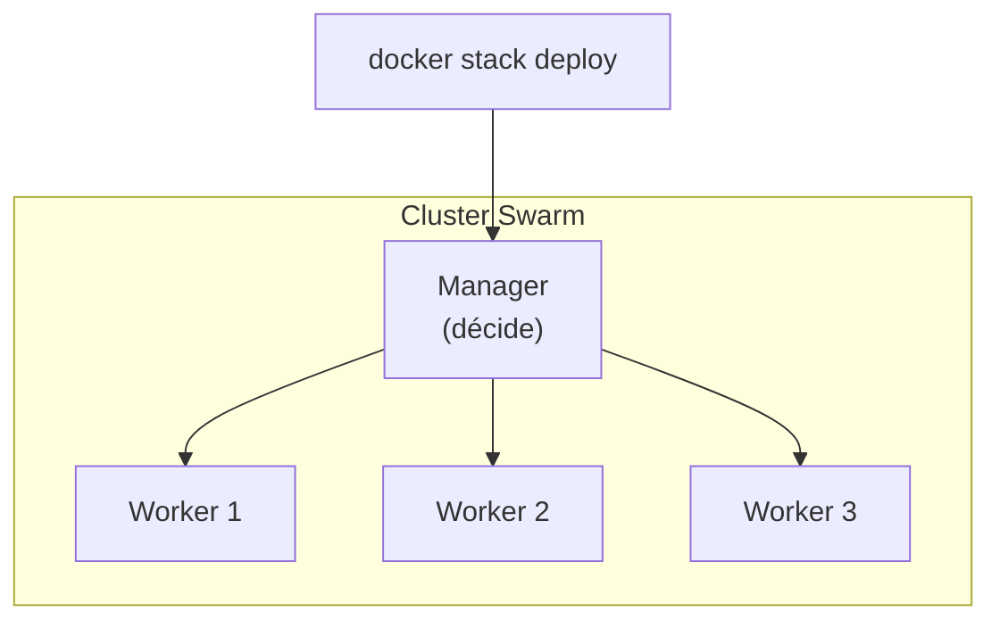
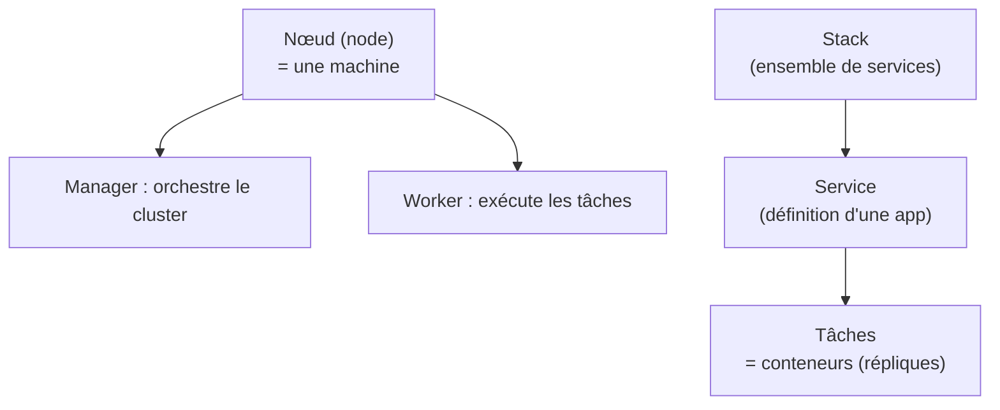
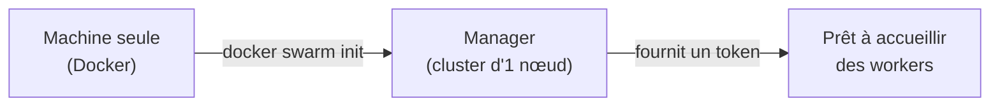
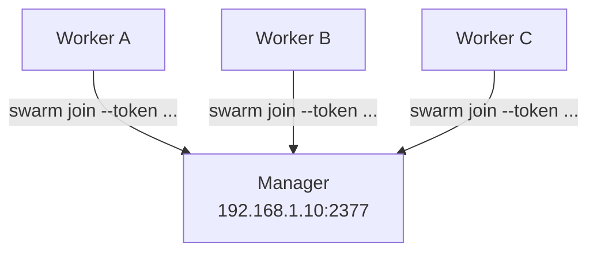
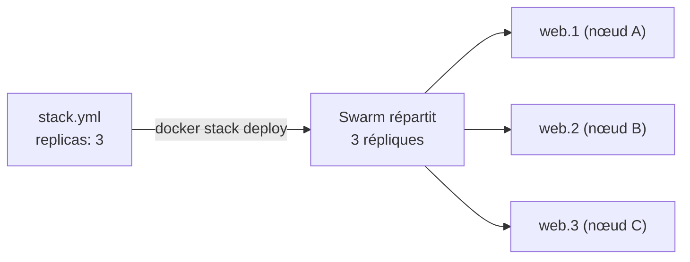
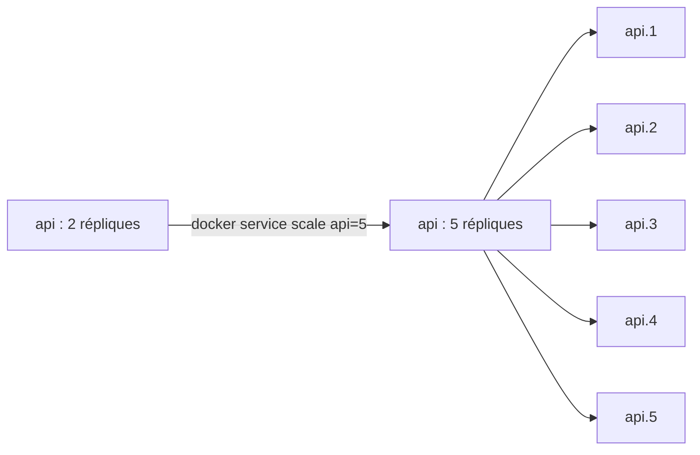
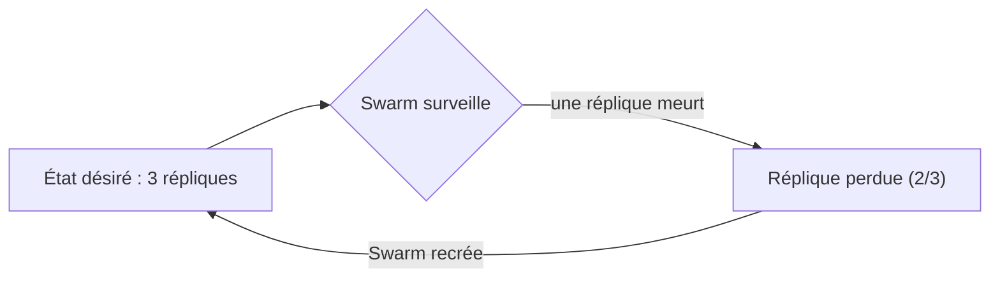
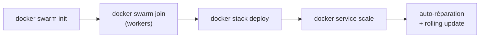

<a id="top"></a>

# 05 — Docker Swarm

## Table des matières

| # | Section |
|---|---|
| 1 | [Pourquoi orchestrer ?](#section-1) |
| 2 | [Concepts clés de Swarm](#section-2) |
| 3 | [Initialiser un cluster (swarm init)](#section-3) |
| 4 | [Ajouter des nœuds (swarm join)](#section-4) |
| 5 | [Déployer un stack (stack deploy)](#section-5) |
| 6 | [Services et mise à l'échelle](#section-6) |
| 7 | [Auto-réparation et mises à jour](#section-7) |
| 8 | [Quiz — Docker Swarm](#section-8) |
| 9 | [Pratique — Mini stack à 3 répliques](#section-9) |
| 10 | [Synthèse](#section-10) |

---

<a id="section-1"></a>

<details>
<summary>1 — Pourquoi orchestrer ?</summary>

<br/>

Docker Compose (leçon 03) lance des conteneurs sur **une seule machine**. Mais en production réelle, on veut :

- répartir la charge sur **plusieurs serveurs** ;
- **redémarrer automatiquement** un conteneur qui plante ;
- **augmenter/réduire** le nombre d'instances à la demande ;
- déployer des mises à jour **sans coupure**.

C'est le rôle d'un **orchestrateur**. **Docker Swarm** est l'orchestrateur intégré à Docker : il transforme un groupe de machines en un **cluster** unique.



| Compose (1 hôte) | Swarm (N hôtes) |
|---|---|
| Une seule machine | Cluster de machines |
| Pas d'auto-réparation native | Redémarre les conteneurs morts |
| Scaling manuel limité | Scaling déclaratif (`replicas`) |
| Développement / petit déploiement | Production distribuée |

> _Swarm est le « grand frère » de Compose : il en réutilise la syntaxe YAML, mais l'étend pour gérer plusieurs machines, des répliques et la résilience. (Kubernetes est une alternative plus puissante mais plus complexe.)_

</details>

<p align="right"><a href="#top">↑ Retour en haut</a></p>

---

<a id="section-2"></a>

<details>
<summary>2 — Concepts clés de Swarm</summary>

<br/>

Quelques termes à maîtriser avant de plonger.



| Terme | Définition |
|---|---|
| **Nœud (node)** | Une machine du cluster (manager ou worker) |
| **Manager** | Décide où placer les conteneurs, gère l'état du cluster |
| **Worker** | Exécute les conteneurs assignés par le manager |
| **Service** | Définition déclarative d'une app (image + nb de répliques) |
| **Tâche (task)** | Un conteneur en cours, instance d'un service |
| **Réplique (replica)** | Une copie identique d'un service |
| **Stack** | Ensemble de services déployés ensemble (depuis un YAML) |

> _Hiérarchie à retenir : un **stack** contient des **services**, chaque service tourne en plusieurs **répliques** (tâches/conteneurs), réparties sur les **nœuds** du cluster._

</details>

<p align="right"><a href="#top">↑ Retour en haut</a></p>

---

<a id="section-3"></a>

<details>
<summary>3 — Initialiser un cluster (swarm init)</summary>

<br/>

On transforme la machine courante en **premier manager** du cluster avec `docker swarm init`.

```bash
# Initialiser le Swarm (cette machine devient manager)
docker swarm init --advertise-addr 192.168.1.10

# Voir les nœuds du cluster
docker node ls

# Afficher l'état du Swarm
docker info | grep Swarm
```

La commande affiche un **jeton de jonction** (*join token*) à utiliser pour ajouter d'autres machines :

```bash
# Sortie typique de swarm init :
Swarm initialized: current node (abc123) is now a manager.

To add a worker to this swarm, run the following command:
    docker swarm join --token SWMTKN-1-xxxx 192.168.1.10:2377
```



| Commande | Rôle |
|---|---|
| `docker swarm init` | Crée le cluster, machine = manager |
| `docker node ls` | Liste les nœuds (managers seulement) |
| `docker swarm join-token worker` | Réaffiche le jeton worker |
| `docker swarm leave` | Quitte le cluster |

> _Le `--advertise-addr` indique l'adresse sur laquelle les autres nœuds joindront ce manager. Sur une seule machine (mode test), Swarm fonctionne très bien avec un cluster d'un seul nœud._

**🔧 Mini-exercice —** Tu as initialisé un Swarm. Écris la commande qui réaffiche le jeton de jonction à donner à un nouveau **worker**.

<details>
<summary>✅ Voir une solution</summary>

```bash
docker swarm join-token worker
```

</details>

</details>

<p align="right"><a href="#top">↑ Retour en haut</a></p>

---

<a id="section-4"></a>

<details>
<summary>4 — Ajouter des nœuds (swarm join)</summary>

<br/>

Sur chaque machine supplémentaire, on exécute la commande **`docker swarm join`** avec le jeton fourni par le manager.

```bash
# Sur une machine worker
docker swarm join --token SWMTKN-1-xxxx 192.168.1.10:2377

# Sur le manager, vérifier que le worker a rejoint
docker node ls
```



Exemple de sortie de `docker node ls` sur le manager :

```
ID            HOSTNAME   STATUS   AVAILABILITY   MANAGER STATUS
abc123 *      manager1   Ready    Active         Leader
def456        worker-a   Ready    Active
ghi789        worker-b   Ready    Active
```

| Rôle | Comment l'obtenir |
|---|---|
| Worker | `docker swarm join-token worker` (sur manager) |
| Manager (supplémentaire) | `docker swarm join-token manager` |

> _⚠️ Pour la haute disponibilité, prévoyez un **nombre impair** de managers (3, 5…) afin de garder un quorum si l'un tombe. Les workers, eux, peuvent être en nombre quelconque._

</details>

<p align="right"><a href="#top">↑ Retour en haut</a></p>

---

<a id="section-5"></a>

<details>
<summary>5 — Déployer un stack (stack deploy)</summary>

<br/>

On décrit l'application dans un fichier YAML (même format que Compose, enrichi d'une section `deploy`) puis on la déploie avec **`docker stack deploy`**.

```yaml
# stack.yml
services:
  web:
    image: nginx:1.27
    ports:
      - "80:80"
    deploy:
      replicas: 3                # 3 conteneurs identiques
      restart_policy:
        condition: on-failure    # redémarre si plantage
      update_config:
        parallelism: 1           # met à jour 1 réplique à la fois
        delay: 10s
```

```bash
# Déployer le stack nommé "monsite"
docker stack deploy -c stack.yml monsite

# Lister les stacks
docker stack ls

# Lister les services d'un stack
docker stack services monsite

# Lister les tâches (conteneurs) d'un service
docker service ps monsite_web

# Retirer le stack
docker stack rm monsite
```



> _La section **`deploy`** est ignorée par `docker compose` (1 hôte) mais utilisée par Swarm : c'est elle qui définit `replicas`, la politique de redémarrage et la stratégie de mise à jour._

**🔧 Mini-exercice —** Écris la commande qui déploie le fichier `stack.yml` en tant que stack nommé `boutique`.

<details>
<summary>✅ Voir une solution</summary>

```bash
docker stack deploy -c stack.yml boutique
```

</details>

</details>

<p align="right"><a href="#top">↑ Retour en haut</a></p>

---

<a id="section-6"></a>

<details>
<summary>6 — Services et mise à l'échelle</summary>

<br/>

Un **service** est l'unité de base de Swarm. On peut ajuster son nombre de répliques **à chaud**, sans interruption.

```bash
# Créer un service directement (sans stack)
docker service create --name api --replicas 2 -p 8000:8000 monapp:1.0

# Lister les services
docker service ls

# Mettre à l'échelle : passer à 5 répliques
docker service scale api=5

# Voir la répartition des tâches
docker service ps api

# Inspecter un service
docker service inspect api --pretty
```



| Commande | Effet |
|---|---|
| `docker service create` | Crée un service |
| `docker service scale nom=N` | Ajuste à N répliques |
| `docker service ps nom` | Liste les tâches/conteneurs |
| `docker service rm nom` | Supprime le service |

> _Swarm fournit un **load balancer interne** (le *routing mesh*) : peu importe quel nœud reçoit la requête sur le port publié, elle est routée vers une réplique disponible. La répartition est automatique._

**🔧 Mini-exercice —** Le service `api` tourne en 2 répliques. Écris la commande qui le passe à **4** répliques à chaud.

<details>
<summary>✅ Voir une solution</summary>

```bash
docker service scale api=4
```

</details>

</details>

<p align="right"><a href="#top">↑ Retour en haut</a></p>

---

<a id="section-7"></a>

<details>
<summary>7 — Auto-réparation et mises à jour</summary>

<br/>

C'est la valeur ajoutée de Swarm face à Compose : il **maintient l'état désiré** en permanence.



**Auto-réparation** : si vous déclarez `replicas: 3` et qu'un conteneur (ou un nœud) tombe, Swarm en **recrée** un automatiquement pour revenir à 3.

```bash
# Simuler une panne : tuer un conteneur d'un service
docker service ps monsite_web        # repérer une tâche
# (Swarm la recrée tout seul en quelques secondes)
docker service ps monsite_web        # une nouvelle tâche est apparue
```

**Mise à jour progressive** (*rolling update*) : on change l'image sans coupure, réplique par réplique.

```bash
# Mettre à jour l'image du service en douceur
docker service update --image monapp:2.0 monsite_web

# Revenir à la version précédente en cas de problème
docker service rollback monsite_web
```

| Capacité | Commande / réglage |
|---|---|
| Auto-réparation | `replicas` + `restart_policy` |
| Mise à jour progressive | `docker service update --image` |
| Retour arrière | `docker service rollback` |
| Cadence de mise à jour | `update_config: parallelism / delay` |

> _Le concept central de l'orchestration : on décrit l'**état désiré** (« je veux 3 répliques de la version 2.0 »), et l'orchestrateur fait **tout le travail** pour y arriver et l'y maintenir._

**🔧 Mini-exercice —** La mise à jour du service `monsite_web` vers la version 2.0 pose problème. Écris la commande qui revient à la version précédente.

<details>
<summary>✅ Voir une solution</summary>

```bash
docker service rollback monsite_web
```

</details>

</details>

<p align="right"><a href="#top">↑ Retour en haut</a></p>

---

<a id="section-8"></a>

<details>
<summary>8 — Quiz — Docker Swarm</summary>

<br/>

**Question 1 :** Quelle commande transforme une machine en premier manager d'un cluster Swarm ?

a) `docker swarm create`

b) `docker swarm init`

c) `docker swarm start`

d) `docker cluster init`

<details>
<summary>💡 Voir la solution</summary>

✅ **Réponse : b)** — `docker swarm init` initialise le cluster ; la machine courante devient manager et reçoit un jeton pour ajouter d'autres nœuds.

</details>

---

**Question 2 :** Quelle est la différence entre un nœud manager et un nœud worker ?

a) Aucune

b) Le manager orchestre le cluster, le worker exécute les conteneurs

c) Le worker décide, le manager exécute

d) Le worker ne peut pas exécuter de conteneurs

<details>
<summary>💡 Voir la solution</summary>

✅ **Réponse : b)** — Le manager planifie et maintient l'état du cluster ; le worker exécute les tâches (conteneurs) qui lui sont assignées.

</details>

---

**Question 3 :** Que fait `docker service scale api=5` ?

a) Supprime le service api

b) Ajuste le service `api` à 5 répliques

c) Crée 5 services

d) Met à jour l'image vers la version 5

<details>
<summary>💡 Voir la solution</summary>

✅ **Réponse : b)** — La commande porte le nombre de répliques du service `api` à 5 ; Swarm crée ou retire des tâches pour atteindre ce nombre.

</details>

---

**Question 4 :** Que se passe-t-il si un conteneur d'un service `replicas: 3` plante ?

a) Le service tombe à 2 définitivement

b) Swarm recrée automatiquement une réplique pour revenir à 3

c) Tout le cluster s'arrête

d) Il faut tout redéployer à la main

<details>
<summary>💡 Voir la solution</summary>

✅ **Réponse : b)** — Swarm maintient l'état désiré : il détecte la perte et recrée une réplique automatiquement (auto-réparation).

</details>

---

**Question 5 :** Avec quelle commande déploie-t-on un ensemble de services depuis un fichier YAML ?

a) `docker run stack.yml`

b) `docker compose deploy`

c) `docker stack deploy -c stack.yml monsite`

d) `docker swarm deploy`

<details>
<summary>💡 Voir la solution</summary>

✅ **Réponse : c)** — `docker stack deploy -c stack.yml monsite` déploie tous les services du fichier en tant que stack nommé « monsite ».

</details>

</details>

<p align="right"><a href="#top">↑ Retour en haut</a></p>

---

<a id="section-9"></a>

<details>
<summary>9 — Pratique — Mini stack à 3 répliques</summary>

<br/>

### Consigne

Sur une machine, initialisez un Swarm, déployez un stack contenant un service web Nginx en **3 répliques** (avec auto-réparation), vérifiez la répartition des tâches, mettez à l'échelle à **5 répliques**, puis nettoyez.

---

### Correction — Fichier et commandes attendus

```yaml
# stack.yml
services:
  web:
    image: nginx:1.27
    ports:
      - "8080:80"
    deploy:
      replicas: 3
      restart_policy:
        condition: on-failure
      update_config:
        parallelism: 1
        delay: 5s
```

```bash
# 1. Initialiser le Swarm
docker swarm init

# 2. Déployer le stack
docker stack deploy -c stack.yml monsite

# 3. Vérifier les services et les tâches
docker stack services monsite
docker service ps monsite_web        # doit montrer 3 tâches "Running"

# 4. Tester : http://localhost:8080  -> page Nginx

# 5. Mettre à l'échelle à 5 répliques
docker service scale monsite_web=5
docker service ps monsite_web        # 5 tâches maintenant

# 6. Nettoyer
docker stack rm monsite
docker swarm leave --force
```

**Résultat attendu :**

```
# docker service ps monsite_web (étape 3)
NAME           IMAGE        NODE       DESIRED STATE   CURRENT STATE
monsite_web.1  nginx:1.27   manager1   Running         Running 20s ago
monsite_web.2  nginx:1.27   manager1   Running         Running 20s ago
monsite_web.3  nginx:1.27   manager1   Running         Running 20s ago
```

> _Après l'étape 5, vous devez voir **5** tâches `Running`. C'est la preuve que Swarm a appliqué votre nouvel état désiré. Le port publié (8080) est servi par n'importe quelle réplique grâce au routing mesh._

</details>

<p align="right"><a href="#top">↑ Retour en haut</a></p>

---

<a id="section-10"></a>

<details>
<summary>10 — Synthèse</summary>

<br/>

#### Points à retenir

1. **Swarm** orchestre des conteneurs sur **plusieurs machines** (là où Compose se limite à une).
2. Hiérarchie : **stack** → **services** → **répliques (tâches)** → réparties sur les **nœuds**.
3. **`docker swarm init`** crée le cluster ; **`docker swarm join`** ajoute des nœuds via un jeton.
4. **`docker stack deploy -c stack.yml nom`** déploie une app décrite en YAML (section `deploy`).
5. **`docker service scale`** ajuste le nombre de répliques à chaud.
6. Swarm assure l'**auto-réparation** (état désiré maintenu) et les **mises à jour progressives**.



#### La suite

Vous maîtrisez maintenant la chaîne complète : **construire** (images/Dockerfile), **persister & connecter** (volumes/réseaux/Compose), **exposer** (Nginx), **orchestrer** (Swarm). Le module suivant approfondira le déploiement automatisé de bout en bout (CI/CD) sur cette base de conteneurs.

</details>

<p align="right"><a href="#top">↑ Retour en haut</a></p>

---

<p align="center">
  <em>Tous droits réservés. Toute reproduction, diffusion, utilisation ou adaptation de ce cours, en tout ou en partie, est strictement interdite sans l'autorisation écrite préalable de Dr. Haythem REHOUMA.</em>
</p>

<p align="center">
  <strong>Cours créé par Dr. Haythem REHOUMA — Développement et déploiement de solutions de données</strong>
</p>
